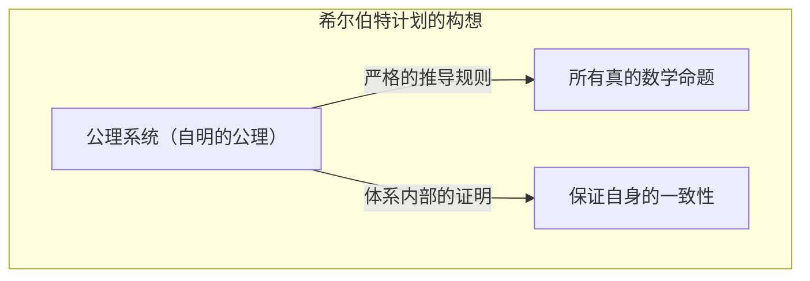
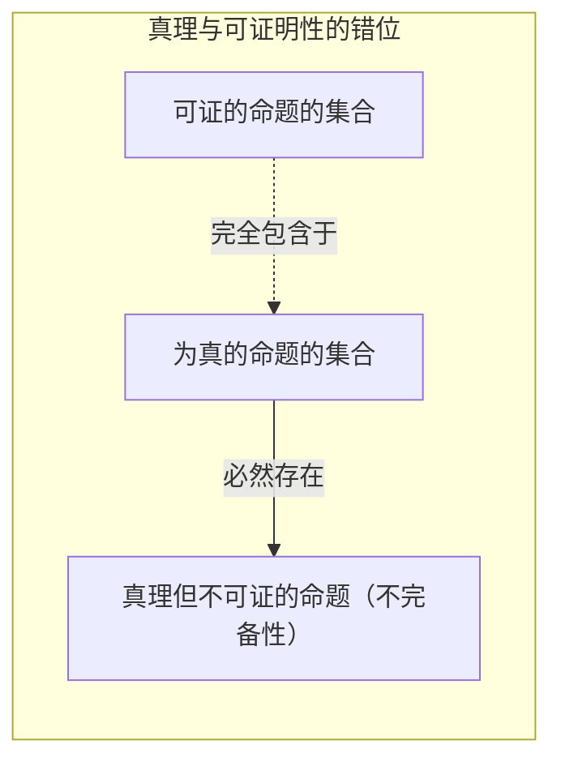
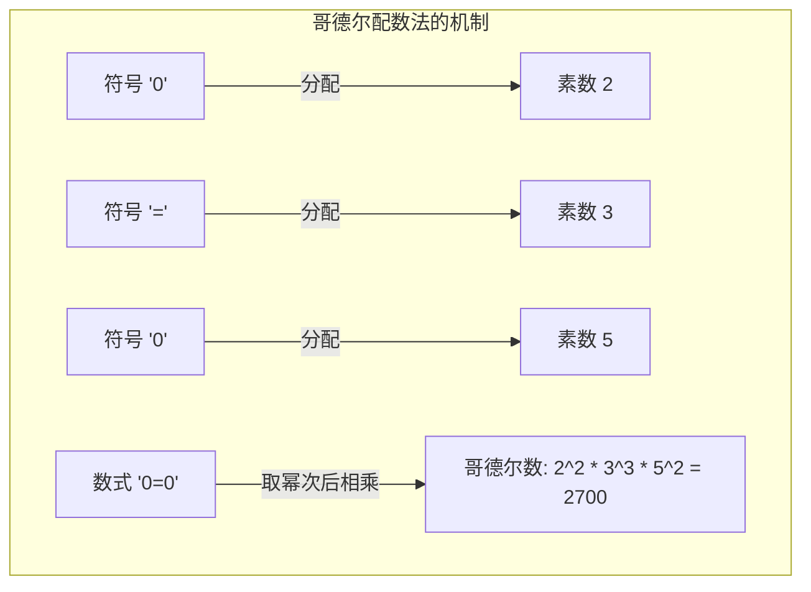
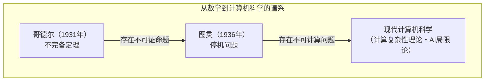

“数学绝对是正确的”——任何人可能都曾这样想过。然而，1931年年轻的数学家[库尔特·哥德尔](https://kenji.blog/zh-cn/p/godel/)发表的一篇论文，从根本上颠覆了这一常识。那正是 **[哥德尔不完备定理](https://kenji.blog/zh-cn/p/godels-incompleteness-theorems/)** 。

本文将结合具体例子和图解，深入浅出地解说关于存在“绝对无法证明的真理”这一极具冲击性的定理，探讨其含义以及证明机制。

---

## 1. 舞台背景：希尔伯特计划与数学危机

19世纪末到20世纪初，数学界正面临“集合论悖论（如罗素悖论等）”，其基础受到了动摇。为了挽救这场“数学危机”，当时的数学界最高权威[大卫·希尔伯特](https://kenji.blog/zh-cn/p/hilbert/)站了出来。

希尔伯特试图将数学的所有推导完全符号化，仅用机械的规则来重建数学。他所提倡的“希尔伯特计划”的目标，是希望在数学的形式体系（Formal System）中证明以下3个性质：

1.  **一致性** （[Consistency](https://kenji.blog/zh-cn/p/cap-theorem-distributed-systems-tradeoff/)）：体系内不存在矛盾（即不能同时证明某命题 $P$ 及其否定 $\neg P$ ）。
2.  **完备性** （Completeness）：任何数学命题都能在该体系内被必然证明为真或伪。
3.  **可判定性** （Decidability）：当给定任意命题时，存在能够判定其是否可证的机械程序。

希尔伯特留下了著名的名言：“我们必须知道，我们必将知道（Wir müssen wissen. Wir werden wissen.）”，他深信不疑，数学将会成为能够解决一切的完美逻辑堡垒。

## 2. 形式体系与皮亚诺算术

为了理解哥德尔的定理，让我们先接触一下“形式体系”和“基本算术”。

形式体系是预先设定好的字符串（符号）以及操作它们的解谜规则（推导规则）的集合。在那里不需要“意义”，仅仅将数学看作是符号变形的游戏。

哥德尔定理所针对的是，包含“自然数的加法和乘法”的体系。其代表例被称为 **皮亚诺算术** （Peano Arithmetic, PA）的公理系统。在皮亚诺算术中，从“0是自然数”“对于某个自然数 $x$ ，存在其后继数 $S(x)$ ”等基本规则（公理）开始。

例如，人尽皆知的“ $1 + 1 = 2$ ”这一事实，在皮亚诺算术这种形式体系中，也只不过是通过符号操作机械地推导出来的一个“定理”而已。

希尔伯特认为，如果把这种形式体系变得庞大，总有一天能够涵盖所有的数学真理。

## 3. 第一不完备定理的冲击：“真但无法证明”的命题

然而在1931年，当时年仅25岁的[库尔特·哥德尔](https://kenji.blog/zh-cn/p/godel/)，发表了一篇将希尔伯特的梦想彻底粉碎的论文。那就是 **第一不完备定理** 。

>  **第一不完备定理** 
> 在任何包含皮亚诺算术的、一致的形式体系中，必定存在虽然为真，但在该体系内无法证明的命题。

这个定理表明，“真理”和“可证明性”是完全不同的两回事。通过形式体系这种“机器”，是不可能捕捉到数学世界中所有的真理的。

### 谎言悖论的数学翻译

哥德尔证明的核心在于，他在数学的形式体系中制造出了“自我指涉悖论”。

回想一下自古希腊就广为人知的“说谎者悖论”。
“这句话是谎言。”
如果这句话是正确的，那它的内容就是“谎言”。如果是谎言，那它的内容就是“正确的”。

哥德尔将类似的逻辑引入到数学中，用数式构造了如下的命题 $G$ 。

 **命题 $G$** ：“这个命题 $G$ ，在这个体系内无法被证明。”

如果形式体系能够证明这个命题 $G$ 会怎样呢？那就意味着它证明了一个主张自己“无法被证明”的命题，从而体系产生了矛盾。如果坚持“系统是一致的”这一大前提，那么体系绝对无法证明命题 $G$ 。

接下来就是哥德尔的魔法了。命题 $G$ 无法在体系内被证明。然而，命题 $G$ 正是一个主张自己“无法被证明”的陈述。因为它呈现的状态和它所主张的完全一致，所以如果从外部视角来看，可以得出结论：命题 $G$ 是 **真** 的。

就这样，“虽然为真却无法被证明”的命题诞生了。

## 4. 哥德尔数：将数式转化为数字的天才想法

“这个命题无法被证明”这句自然语言的句子，到底如何在只有加法和乘法的皮亚诺算术中表达出来呢？这里哥德尔发明了一种被称为 **哥德尔配数法** （Gödel numbering）的方法。

哥德尔给数式中使用的所有符号（ $\neg$ 、 $\vee$ 、 $\exists$ 、 $0$ 、 $=$ 等）都分配了特定的数字（素数）。然后，利用质因数分解的唯一性（任何自然数都可以唯一地分解为素数的乘积），将数式的字符串转换为一个巨大的自然数。

使用这种方法，连“数式 $A$ 是数式 $B$ 的证明”这样的“证明过程”整体，都可以被转换为关于巨大数字性质（某个数能否被另一个数整除等）的单纯算术问题。

也就是说，他将数学谈论“自身的证明”（自我指涉）的语言，隐藏在了自然数的性质之中。这与现代计算机将图像和程序全部编码为“0和1的数字序列”来处理的思路如出一辙，而哥德尔在计算机诞生很久以前就达到了这一概念。

## 5. 第二不完备定理：无法证明自身正确性的绝望

第一不完备定理已经足以让数学界震动，但哥德尔的论文中还包含着更为可怕的结论。那就是 **第二不完备定理** 。

>  **第二不完备定理** 
> 任何包含皮亚诺算术的、一致的形式体系，都无法在该体系内证明其自身的一致性。

希尔伯特试图用数学自身的力量来证明数学是一致的（希尔伯特计划的最重要课题）。然而，第二不完备定理宣告：“任何系统，都无法靠自己的力量来证明自己没有发疯（没有矛盾）”。

为了直观地理解这一点，可以这样思考。
如果有人主张“我绝对不说谎！”。但是，我们不能仅仅以此人的话为根据，来证明“这个人不是说谎者”。因为如果那个人是个说谎者，那么“我绝对不说谎”这个发言本身可能就是个谎言。

数学也是如此，如果某个公理系统能够自己推导出“我是一致的（ $Con(F)$ ）”这个数式，那么假如该体系本身已经存在矛盾，它就能证明所有的命题（不管是正确的还是错误的），因此那个“我是一致的”的证明将毫无价值。

第二不完备定理表明了一个决定性的局限：数学要在数学内部自我证明“绝对的确定性”是不可能的。

## 6. 关于不完备定理常见的误解

因为其戏剧性的名称，哥德尔的不完备定理经常在哲学、思想、甚至是神秘主义的语境中被误用。在这里我们澄清一下代表性的误解。

-  **误解1：“数学已经崩溃了”** 
  -  **事实** ：不完备定理并不意味着数学的崩溃。相反，它阐明了形式逻辑的一个性质，即“仅仅依靠特定的、固定的公理系统，是无法捕捉到所有真理的”。数学家们通过根据需要追加新的公理（例如“选择公理”或“大基数公理”等）来创建更强大的体系，从而不断推动研究的发展。
-  **误解2：“人类的理性存在极限”** 
  -  **事实** ：定理指出的极限，是针对“遵循预定机械规则的系统（形式体系）”的。在第一不完备定理中，我们能够从外部视角看穿命题 $G$ 是“真”的。一些学者（如罗杰·彭罗斯等）认为，这正是人类理性拥有超越机械的形式体系、能够理解“意义（语义学）”能力的证据。
-  **误解3：“任何事情都有无法证明的时候”** 
  -  **事实** ：不完备定理适用的只有包含了“自然数的加法和乘法（皮亚诺算术）”的、足够复杂的体系。例如，“[欧几里得](https://kenji.blog/zh-cn/p/euclid/)几何学”或“实数的一阶理论”等都是完备的，所有为真的命题都是可以证明的。只有当对象具有足够复杂的结构（允许自我指涉的结构）时，才会产生不完备性。

## 7. 交棒给图灵机：计算机科学的拉开帷幕

哥德尔定理带来的影响，并没有局限于数学框架内。1936年，英国数学家阿兰·图灵将哥德尔的“形式体系”概念替换为了物理的计算过程，发明了“图灵机”这个虚拟的计算机模型。

图灵将哥德尔的不完备定理应用到计算机世界中，证明了“不存在一种万能算法，可以预先判定任何计算机程序是否会永远计算下去而不结束”。这就是著名的 **停机问题** （[Halting Problem](https://kenji.blog/zh-cn/p/turing-machine-computability/)）。

“存在无法证明的真理”这一数学上的局限性，绝妙地转化为了“存在无法计算的问题”这一计算机的局限性，并且作为现代编程和算法理论的基础一直存续着。

## 8. 结论：“求知”这条无尽的旅途

[大卫·希尔伯特](https://kenji.blog/zh-cn/p/hilbert/)梦寐以求的“能够自动证明一切的完美数学机器”，因为[哥德尔不完备定理](https://kenji.blog/zh-cn/p/godels-incompleteness-theorems/)而化为泡影。但这绝对不意味着数学的失败。

如果数学可以完全机械化，那么数学家的工作就会变成单纯的体力劳动，总有一天会迎来终结。但是，哥德尔展示的“无法证明但为真”的命题的存在，证明了数学这个宇宙比我们想象的要丰富得多，拥有取之不尽的深奥。

由最高度严谨的逻辑——数学自己，亲手 **证明** 了“绝对无法证明的真理”的存在的[库尔特·哥德尔](https://kenji.blog/zh-cn/p/godel/)。他的不完备定理向我们宣告，人类探索“知”的过程，是一场永远持续的无尽之旅。
