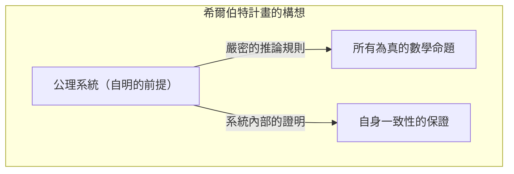
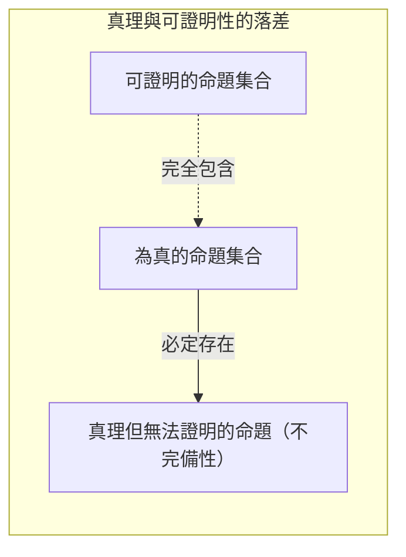
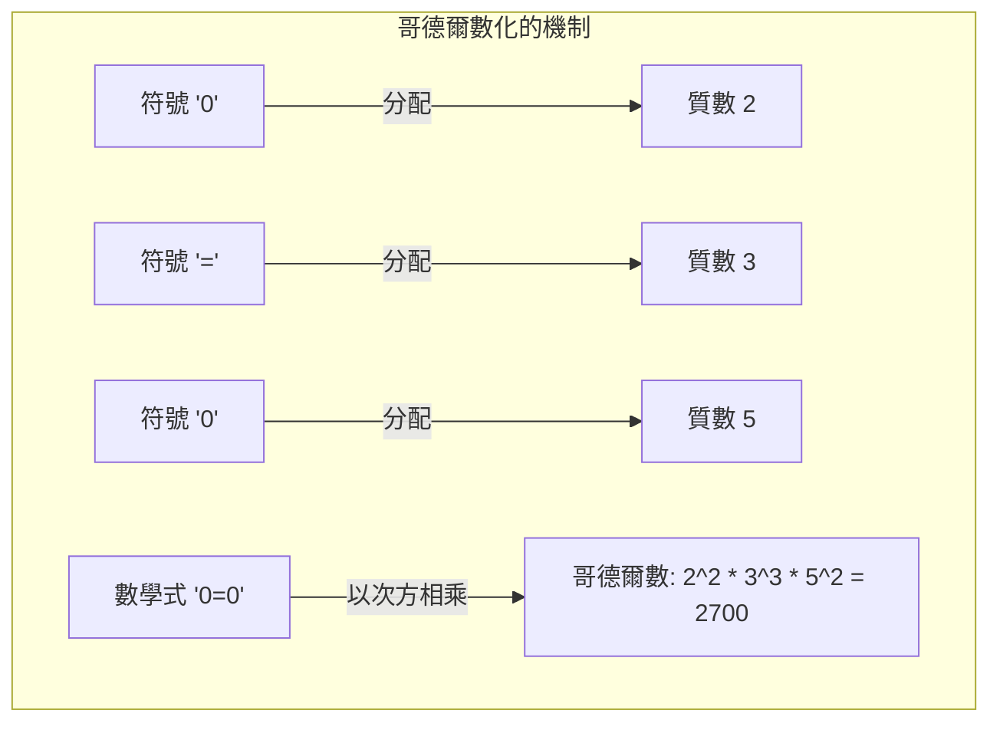
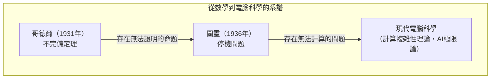

「數學是絕對正確的」──任誰都曾經這樣想過吧。然而，1931 年年輕數學家庫爾特・哥德爾（[Kurt Gödel](https://kenji.blog/zh-tw/p/godel/)）發表的一篇論文，從根本上顛覆了這個常識。那就是 **[哥德爾不完備定理](https://kenji.blog/zh-tw/p/godels-incompleteness-theorems/)** 。

本篇文章將透過具體例子與圖解，徹底解說這個主張存在「絕對無法證明的真理」的衝擊性定理，包括它的意義與證明機制。

---

## 1. 舞台背景：希爾伯特計畫與數學危機

從 19 世紀末到 20 世紀初，數學界正面臨「集合論悖論（如羅素悖論等）」，其根基產生了動搖。為了解救這場「數學危機」而挺身而出的，是當時數學界的最高權威大衛・希爾伯特（[David Hilbert](https://kenji.blog/zh-tw/p/hilbert/)）。

希爾伯特試圖將數學的所有推論完全符號化，僅憑機械性的規則來重建數學。他所提倡的「希爾伯特計畫」的目標，是在數學的「形式系統」（Formal System）中，證明以下三個性質：

1. **一致性** （[Consistency](https://kenji.blog/zh-tw/p/cap-theorem-distributed-systems-tradeoff/)）：系統內不存在矛盾（某個命題 $P$ 與其否定 $\neg P$ 同時被證明）。
2. **完備性** （Completeness）：任何數學命題，都必定能在那系統內被證明為真或偽。
3. **可判定性** （Decidability）：當給定任意命題時，存在一種機械性的程序能判定其是否可被證明。

希爾伯特留下了著名的格言：「我們必須知道，我們必將知道（Wir müssen wissen. Wir werden wissen.）」，他堅信數學能成為解決一切問題的完美邏輯城堡。

## 2. 形式系統與皮亞諾算術

為了理解哥德爾定理，我們首先來談談「形式系統」與「基本算術」。

形式系統，是預先決定好的字串（符號）以及操作它們的解謎規則（推論規則）的集合。那裡不需要「意義」，而是將數學視為單純的符號變換遊戲。

哥德爾定理的對象，是包含「自然數的加法與乘法」的系統。其代表性例子被稱為 **皮亞諾算術** （Peano Arithmetic, PA）的公理系統。在皮亞諾算術中，是從「0 是自然數」、「某個自然數 $x$ ，存在其下一個數 $S(x)$ 」等基本規則（公理）出發。

例如，「 $1 + 1 = 2$ 」這個人盡皆知的事實，在皮亞諾算術這個形式系統中，也不過是透過符號操作機械性地推導出來的一個「定理」罷了。

希爾伯特認為，如果讓這種形式系統不斷擴大，總有一天能網羅所有的數學真理。

## 3. 第一不完備定理的衝擊：「真卻無法證明」的命題

然而在 1931 年，當時年僅 25 歲的庫爾特・哥德爾發表了一篇粉碎了希爾伯特夢想的論文。那就是 **第一不完備定理** 。

>  **第一不完備定理** 
> 任何包含皮亞諾算術且一致的形式系統中，必定存在雖然為真，但在該系統內無法被證明的命題。

這個定理表明了「真理」與「可證明性」是完全不同的兩回事。在形式系統這個「機器」中，是不可能捕捉到數學世界裡的所有真理的。

### 說謊者悖論的數學翻譯

哥德爾證明的核心，在於將「自我指涉的悖論」建立在數學的形式系統之中。

請回想一下從古希臘就廣為人知的「說謊者悖論」。
「這句話是謊言」
如果這句話正確，那麼內容就變成「謊言」。如果這是謊言，那內容就變成「正確」。

哥德爾將類似的邏輯帶入數學，用數學式構造了如下的命題 $G$ 。

 **命題 $G$** ：「這個命題 $G$ ，在這個系統內無法被證明」

假設形式系統能夠證明這個命題 $G$ 。那這就等於證明了主張自己「無法被證明」的命題，導致系統產生了矛盾。如果立足於「一致」的大前提之下，系統絕不可能證明命題 $G$ 。

那麼，接下來才是哥德爾的魔法。命題 $G$ 在系統內無法被證明。然而，命題 $G$ 正是主張「無法被證明」的句子。既然它正處於如其主張的狀態，那麼從外部視角來看，就能得出命題 $G$ 為 **真** 的結論。

就這樣，誕生了「雖然為真卻無法被證明」的命題。

## 4. 哥德爾數化：將數學式轉換為數字的天才點子

「這個命題無法被證明」這樣的中文句子，在只擁有加法和乘法的皮亞諾算術中，到底要怎麼表現呢？在這裡，哥德爾發明的就是名為 **哥德爾數化** （Gödel numbering）的手法。

哥德爾將數學式中使用的所有符號（ $\neg$ 、 $\vee$ 、 $\exists$ 、 $0$ 、 $=$ 等）都分配了特定的數字（質數）。接著，利用質因數分解的唯一性（任何自然數都可以唯一地分解為質數乘積的性質），將數學式的字串轉換為一個巨大的自然數。

使用這個手法，就能將諸如「數學式 $A$ 是數學式 $B$ 的證明」這樣的整個「證明過程」，偷換成巨大數字的性質（某個數字能否被另一個數字整除等）這種單純的算術問題。

也就是說，他把數學談論「自身的證明」（自我指涉）所需的語言，隱藏在自然數的性質中了。這就和現代電腦將圖像或程式全部編碼成「0與1的數字序列」來處理的想法一樣，哥德爾在電腦誕生很久之前就觸及了這個概念。

## 5. 第二不完備定理：無法證明自身正確性的絕望

光是第一不完備定理就足以震驚數學界了，但哥德爾的論文中還包含了更可怕的結論。那就是 **第二不完備定理** 。

>  **第二不完備定理** 
> 任何包含皮亞諾算術且一致的形式系統，都無法在該系統內證明自身的一致性。

希爾伯特原本試圖運用數學本身的力量來證明數學是一致的（希爾伯特計畫的最重要課題）。然而，第二不完備定理宣告了：「任何系統，都無法靠自身的力量證明自己沒有發瘋（沒有矛盾）」。

為了直觀地理解這一點，讓我們這樣思考。
假設某個人主張：「我絕對不會說謊！」。但是，我們不能只憑那個人的話語作為根據，就證明「這個人不是騙子」。因為如果那個人是騙子，那麼「我絕對不會說謊」這個發言本身可能就是謊言。

數學也是一樣的，即使某個公理系統自己推導出「我是一致的（ $Con(F)$ ）」這個數學式，如果那個系統已經自相矛盾，那麼任何命題（無論對錯）都能被證明，因此那個「我是一致的」的證明就沒有任何價值。

第二不完備定理指出了一個決定性的極限，那就是數學不可能在內部自我證明「絕對的確定性」。

## 6. 關於不完備定理常見的誤解

哥德爾的不完備定理由於其戲劇性的名稱，經常被誤用於哲學、思想或神祕學等語境中。在這裡我們來解開幾個具代表性的誤解吧。

-  **誤解1：「數學已經破滅了」** 
  -  **事實** ：不完備定理並不意味著數學的破滅。相反地，它闡明了「僅靠特定的固定公理系統，是無法掌握所有真理的」這種形式邏輯的性質。數學家們藉由視需要加入新的公理（例如「選擇公理」或「大基數公理」等），創造出更強大的系統，繼續推動研究的發展。
-  **誤解2：「人類的理性是有極限的」** 
  -  **事實** ：該定理指出極限的，是針對「遵循預先決定的機械性規則的系統（形式系統）」。在第一不完備定理中，我們能從外部視角看穿命題 $G$ 為「真」。也有學者（如羅傑・潘洛斯等）認為，這正是人類理性具備超越機械性形式系統、理解「意義（語義）」能力的證據。
-  **誤解3：「任何事情都有無法證明的時候」** 
  -  **事實** ：不完備定理適用的，只有包含「自然數的加法與乘法（皮亞諾算術）」的夠複雜的系統。例如，「[歐幾里得](https://kenji.blog/zh-tw/p/euclid/)幾何學」或「實數的一階理論」等都是完備的，所有為真的命題皆可被證明。只有當對象具有足夠複雜的結構（能夠進行自我指涉的結構）時，才會產生不完備性。

## 7. 交棒給圖靈機：電腦科學的揭幕

哥德爾定理帶來的影響，並未局限在數學的框架內。1936 年，英國數學家艾倫・圖靈（[Alan Turing](https://kenji.blog/zh-tw/p/turing/)）將哥德爾「形式系統」的概念轉換為物理性的計算過程，構想出名為「圖靈機」的虛擬計算機模型。

圖靈將哥德爾的不完備定理應用到電腦的世界，證明了「不存在一種萬能的演算法，能預先判定任何電腦程式是否會永遠無法結束計算」。這就是著名的 **停機問題** （[Halting Problem](https://kenji.blog/zh-tw/p/turing-machine-computability/)）。

「存在無法證明的真理」這個數學極限，精妙地轉變成了「存在無法計算的問題」這個電腦極限，並作為現代程式設計與演算法理論的基礎繼續存在著。

## 8. 結論：沒有盡頭的「求知」之旅

大衛・希爾伯特夢想著「能自動證明一切的完美數學機器」，最終因為哥德爾的不完備定理而化為泡影。然而，這絕不意味著數學的失敗。

如果數學能完全機械化，那麼數學家的工作將淪為單純的作業，總有一天會迎來終結。可是，哥德爾指出「無法證明卻為真之命題」的存在，反而證明了數學這個宇宙，遠比我們想像的還要豐富，擁取之不盡的深奧。

庫爾特・哥德爾親手用數學這個最嚴密的邏輯， **證明** 了「絕對無法證明的真理」的存在。他的不完備定理告訴我們，人類對於「求知」的探索，是一場將永遠持續、沒有盡頭的旅程。
