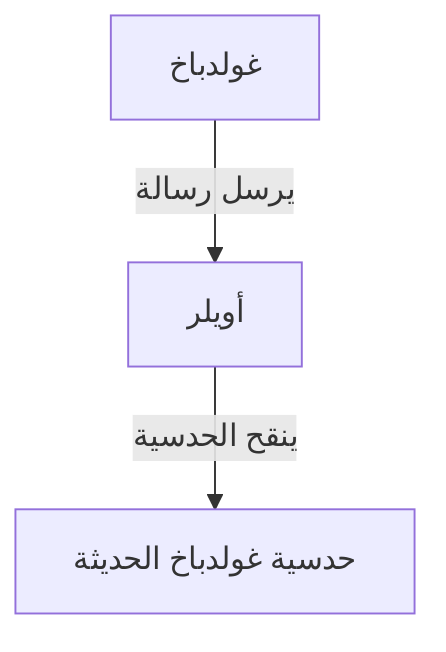

## ما هي [حدسية غولدباخ](https://kenji.blog/ar/p/goldbachs-conjecture/)؟

تعد **[حدسية غولدباخ](https://kenji.blog/ar/p/goldbachs-conjecture/)** واحدة من أقدم وأشهر المسائل غير المحلولة في نظرية الأعداد. صياغتها بسيطة لدرجة أن حتى طالب في المدرسة الابتدائية يمكنه فهمها.

> "كل عدد صحيح زوجي أكبر من 2 يمكن التعبير عنه كمجموع عددين أوليين."

دعونا نختبر هذا مع بعض الأرقام المحددة.

- $4 = 2 + 2$
- $6 = 3 + 3$
- $8 = 3 + 5$
- $10 = 3 + 7 = 5 + 5$
- $12 = 5 + 7$

كما ترون، بالنسبة للأعداد الزوجية الصغيرة، يمكن بالفعل التعبير عنها كمجموع عددين أوليين. ومع ذلك، فإن إثبات ذلك لـ **جميع** الأعداد الزوجية استعصى على الجميع حتى يومنا هذا.

## الخلفية التاريخية

تم ذكر هذه الحدسية لأول مرة في رسالة أُرسلت عام 1742 من قبل عالم الرياضيات البروسي **كريستيان غولدباخ** إلى عالم الرياضيات السويسري العظيم **ليونهارت أويلر**.

كانت [حدسية غولدباخ](https://kenji.blog/ar/p/goldbachs-conjecture/) الأصلية أكثر تعقيدًا بعض الشيء، لكن أويلر نقحها إلى الشكل الذي نعرفه اليوم. كان أويلر نفسه مقتنعًا بأن الحدسية صحيحة، لكنه لم يستطع إثباتها.

## التعبير الرياضي والتحقق بالحاسوب

رياضيًا، يُعبر عن هذه الحدسية على النحو التالي:

$$
\forall n \in \mathbb{N}, n \ge 2 \implies 2n = p_1 + p_2 \quad (\text{حيث } p_1, p_2 \text{ أعداد أولية})
$$

في العصر الحديث، ومع تحسن قوة المعالجة الحاسوبية، تم التحقق من الحدسية لأعداد كبيرة للغاية. اعتبارًا من عام 2014، تم التحقق من صحة [حدسية غولدباخ](https://kenji.blog/ar/p/goldbachs-conjecture/) لجميع الأعداد الزوجية حتى $4 \times 10^{18}$.

ومع ذلك، في عالم الرياضيات، لا يشكل تأكيد شيء ما لـ "عدد كبير جدًا من الحالات" **إثباتًا** كاملاً. من الضروري استنتاج منطقياً أنها تنطبق على جميع الأعداد الزوجية اللانهائية.

## [حدسية غولدباخ](https://kenji.blog/ar/p/goldbachs-conjecture/) الضعيفة

هناك حدسية أخرى مرتبطة ب[حدسية غولدباخ](https://kenji.blog/ar/p/goldbachs-conjecture/)، تُعرف باسم **[حدسية غولدباخ](https://kenji.blog/ar/p/goldbachs-conjecture/) الضعيفة**.

> "كل عدد فردي أكبر من 5 يمكن التعبير عنه كمجموع ثلاثة أعداد أولية."

تُسمى "ضعيفة" لأنه إذا كانت [حدسية غولدباخ](https://kenji.blog/ar/p/goldbachs-conjecture/) "القوية" (الأصلية) صحيحة، فإن الضعيفة تكون صحيحة تلقائيًا. (إذا كان العدد الزوجي هو $2n = p_1 + p_2$، فإن العدد الفردي هو $2n+3 = p_1 + p_2 + 3$، وهو مجموع ثلاثة أعداد أولية).

المثير للدهشة أن هذه الحدسية "الضعيفة" قد تم **إثباتها بالكامل** بواسطة هارالد هيلفغوت في عام 2013. ومع ذلك، لا تزال الحدسية "القوية" تقف كجدار لا يمكن تجاوزه.

## الخاتمة

[حدسية غولدباخ](https://kenji.blog/ar/p/goldbachs-conjecture/) هي مسألة ترمز إلى عمق وغموض الرياضيات. على الرغم من مظهرها البسيط، إلا أنها صدت محاولات العباقرة لقرون.

هل سيأتي اليوم الذي يتم فيه إثبات هذه الحدسية الجميلة بالكامل؟ أم سيُثبت أنه لا يمكن إثباتها؟ المسائل الرياضية غير المحلولة توفر لنا دائمًا رومانسية لا نهائية.
