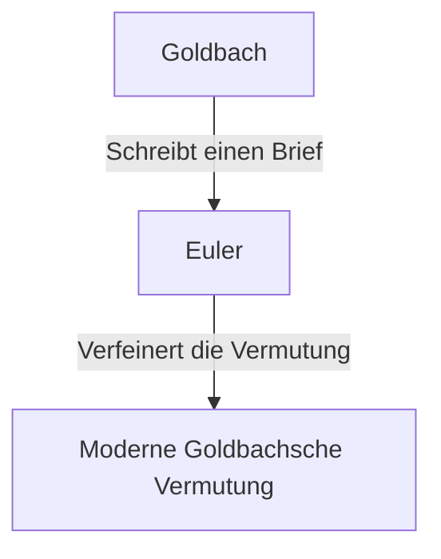

## Was ist die Goldbachsche Vermutung?

Die **Goldbachsche Vermutung** ist eines der ältesten und berühmtesten ungelösten Probleme der Zahlentheorie. Ihre Aussage ist so einfach, dass selbst ein Grundschüler sie verstehen kann.

> "Jede gerade Zahl größer als 2 kann als Summe zweier Primzahlen dargestellt werden."

Lassen Sie uns das an einigen konkreten Zahlen testen.

- $4 = 2 + 2$
- $6 = 3 + 3$
- $8 = 3 + 5$
- $10 = 3 + 7 = 5 + 5$
- $12 = 5 + 7$

Wie Sie sehen können, können kleine gerade Zahlen in der Tat als Summe zweier Primzahlen ausgedrückt werden. Aber dies für **alle** geraden Zahlen zu beweisen, ist bis heute niemandem gelungen.

## Historischer Hintergrund

Diese Vermutung wurde erstmals in einem Brief erwähnt, den der preußische Mathematiker **Christian Goldbach** 1742 an den großen Schweizer Mathematiker **[Leonhard Euler](https://kenji.blog/p/euler/)** schickte.

Goldbachs ursprüngliche Vermutung war etwas komplexer, aber Euler verfeinerte sie zu der Form, die wir heute kennen. Euler selbst war überzeugt, dass die Vermutung wahr ist, konnte sie aber nicht beweisen.

## Mathematischer Ausdruck und Computerverifizierung

Mathematisch wird diese Vermutung wie folgt ausgedrückt:

$$
\forall n \in \mathbb{N}, n \ge 2 \implies 2n = p_1 + p_2 \quad (\text{wobei } p_1, p_2 \text{ Primzahlen sind})
$$

In der heutigen Zeit, mit der Verbesserung der Computerleistung, wurde die Vermutung für extrem große Zahlen verifiziert. Bis 2014 wurde bestätigt, dass die Goldbachsche Vermutung für alle geraden Zahlen bis zu $4 \times 10^{18}$ gilt.

In der Welt der Mathematik stellt jedoch die Bestätigung einer Sache für eine "sehr große Anzahl von Fällen" keinen vollständigen **Beweis** dar. Es muss logisch hergeleitet werden, dass sie für unendlich viele gerade Zahlen gilt.

## Die schwache Goldbachsche Vermutung

Es gibt eine weitere Vermutung im Zusammenhang mit der Goldbachschen Vermutung, die als **schwache Goldbachsche Vermutung** bekannt ist.

> "Jede ungerade Zahl größer als 5 kann als Summe von drei Primzahlen dargestellt werden."

Diese wird als "schwach" bezeichnet, da, wenn die "starke" Goldbachsche Vermutung (die ursprüngliche) wahr ist, auch die schwache automatisch gilt. (Wenn eine gerade Zahl $2n = p_1 + p_2$ ist, dann ist eine ungerade Zahl $2n+3 = p_1 + p_2 + 3$, also die Summe von drei Primzahlen).

Erstaunlicherweise wurde diese "schwache" Vermutung 2013 von Harald Helfgott **vollständig bewiesen**. Die "starke" Vermutung steht jedoch immer noch als unüberwindbare Mauer da.

## Fazit

[Die Goldbachsche Vermutung](https://kenji.blog/p/goldbachs-conjecture/) ist ein Problem, das die Tiefe und das Geheimnis der Mathematik symbolisiert. Trotz ihres einfachen Erscheinungsbildes hat sie den Versuchen von Genies über Jahrhunderte hinweg widerstanden.

Wird jemals der Tag kommen, an dem diese wunderschöne Vermutung vollständig bewiesen wird? Oder wird sich herausstellen, dass sie unbeweisbar ist? Ungelöste mathematische Probleme bieten uns stets eine unendliche Faszination.
