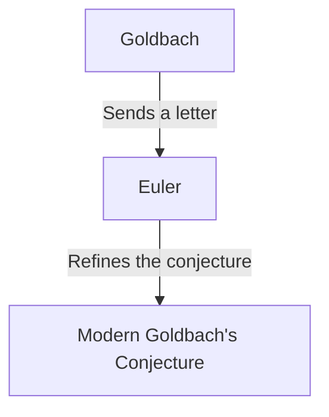

## What is [Goldbach's Conjecture](https://kenji.blog/en/p/goldbachs-conjecture/)?

**Goldbach's conjecture** is one of the oldest and most famous unsolved problems in number theory. Its statement is so simple that even an elementary school student can understand it.

> "Every even integer greater than 2 can be expressed as the sum of two primes."

Let's test this with a few specific numbers.

- $4 = 2 + 2$
- $6 = 3 + 3$
- $8 = 3 + 5$
- $10 = 3 + 7 = 5 + 5$
- $12 = 5 + 7$

As you can see, for small even numbers, they can indeed be expressed as the sum of two prime numbers. However, proving this for **all** even numbers has eluded everyone to this day.

## Historical Background

This conjecture was first mentioned in a letter sent in 1742 by the Prussian mathematician **Christian Goldbach** to the great Swiss mathematician **[Leonhard Euler](https://kenji.blog/en/p/euler/)**.

Goldbach's original conjecture was slightly more complex, but Euler refined it into the form we know today. Euler himself was convinced that the conjecture was true, but he could not prove it.

## Mathematical Expression and Computer Verification

Mathematically, this conjecture is expressed as follows:

$$
\forall n \in \mathbb{N}, n \ge 2 \implies 2n = p_1 + p_2 \quad (\text{where } p_1, p_2 \text{ are prime numbers})
$$

In modern times, with the improvement of computer processing power, the conjecture has been verified for extremely large numbers. As of 2014, Goldbach's conjecture has been verified to be true for all even numbers up to $4 \times 10^{18}$.

However, in the world of mathematics, confirming something for a "very large number of cases" does not constitute a complete **proof**. It is necessary to logically deduce that it holds for all infinitely many even numbers.

## The Weak Goldbach Conjecture

There is another conjecture related to Goldbach's conjecture, known as the **weak Goldbach conjecture**.

> "Every odd number greater than 5 can be expressed as the sum of three primes."

This is called "weak" because if the "strong" Goldbach conjecture (the original one) is true, then the weak one automatically holds true. (If an even number is $2n = p_1 + p_2$, then an odd number is $2n+3 = p_1 + p_2 + 3$, which is the sum of three primes).

Amazingly, this "weak" conjecture was **completely proved** by Harald Helfgott in 2013. However, the "strong" conjecture still stands as an insurmountable wall.

## Conclusion

Goldbach's conjecture is a problem that symbolizes the depth and mystery of mathematics. Despite its simple appearance, it has repelled the attempts of geniuses for centuries.

Will the day ever come when this beautiful conjecture is completely proved? Or will it be proven to be unprovable? Unsolved mathematical problems constantly provide us with infinite romance.
