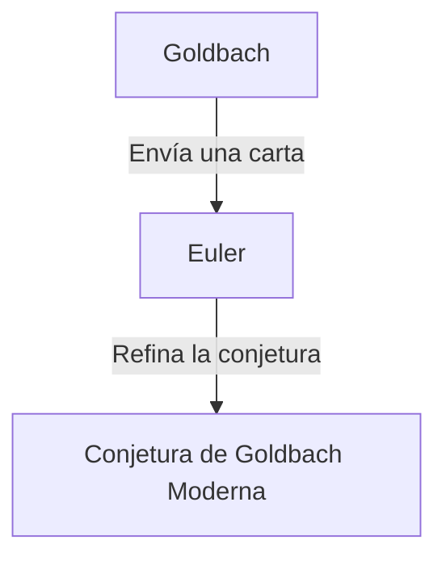

## ¿Qué es la Conjetura de Goldbach?

La **conjetura de Goldbach** es uno de los problemas no resueltos más antiguos y famosos en la teoría de números. Su afirmación es tan simple que incluso un estudiante de primaria puede entenderla.

> "Todo número par mayor que 2 puede expresarse como la suma de dos números primos."

Probemos esto con algunos números específicos.

- $4 = 2 + 2$
- $6 = 3 + 3$
- $8 = 3 + 5$
- $10 = 3 + 7 = 5 + 5$
- $12 = 5 + 7$

Como puedes ver, los números pares pequeños ciertamente pueden expresarse como la suma de dos números primos. Sin embargo, demostrar esto para **todos** los números pares ha eludido a todos hasta el día de hoy.

## Antecedentes Históricos

Esta conjetura fue mencionada por primera vez en una carta enviada en 1742 por el matemático prusiano **Christian Goldbach** al gran matemático suizo **[Leonhard Euler](https://kenji.blog/es/p/euler/)**.

La conjetura original de Goldbach era un poco más compleja, pero Euler la refinó a la forma que conocemos hoy. El propio Euler estaba convencido de que la conjetura era cierta, pero no pudo demostrarla.

## Expresión Matemática y Verificación por Computadora

Matemáticamente, esta conjetura se expresa de la siguiente manera:

$$
\forall n \in \mathbb{N}, n \ge 2 \implies 2n = p_1 + p_2 \quad (\text{donde } p_1, p_2 \text{ son números primos})
$$

En los tiempos modernos, con la mejora de la capacidad de cálculo de las computadoras, la conjetura ha sido verificada para números extremadamente grandes. Hasta 2014, se ha verificado que la conjetura de Goldbach es cierta para todos los números pares hasta $4 \times 10^{18}$.

Sin embargo, en el mundo de las matemáticas, confirmar algo para un "número muy grande de casos" no constituye una **demostración** completa. Es necesario deducir lógicamente que se cumple para todos los infinitos números pares.

## La Conjetura Débil de Goldbach

Existe otra conjetura relacionada con la conjetura de Goldbach, conocida como la **conjetura débil de Goldbach**.

> "Todo número impar mayor que 5 puede expresarse como la suma de tres números primos."

Se le llama "débil" porque si la conjetura "fuerte" de Goldbach (la original) es cierta, entonces la débil se cumple automáticamente. (Si un número par es $2n = p_1 + p_2$, entonces un número impar es $2n+3 = p_1 + p_2 + 3$, que es la suma de tres primos).

Sorprendentemente, esta conjetura "débil" fue **completamente demostrada** por Harald Helfgott en 2013. Sin embargo, la conjetura "fuerte" todavía se erige como un muro insuperable.

## Conclusión

La conjetura de Goldbach es un problema que simboliza la profundidad y el misterio de las matemáticas. A pesar de su apariencia simple, ha repelido los intentos de los genios durante siglos.

¿Llegará alguna vez el día en que esta hermosa conjetura sea completamente demostrada? ¿O se demostrará que es indemostrable? Los problemas matemáticos no resueltos nos proporcionan constantemente un romance infinito.
