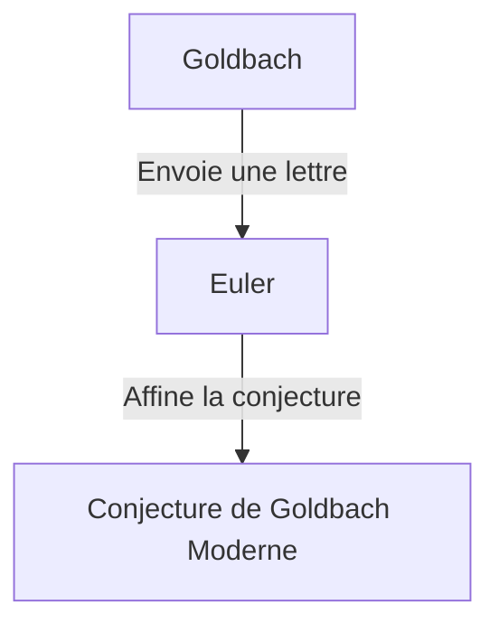

## Qu'est-ce que la Conjecture de Goldbach ?

La **conjecture de Goldbach** est l'un des problèmes non résolus les plus anciens et les plus célèbres de la théorie des nombres. Son énoncé est si simple que même un élève du primaire peut le comprendre.

> "Tout nombre entier pair strictement supérieur à 2 peut être écrit comme la somme de deux nombres premiers."

Vérifions cela avec quelques nombres spécifiques.

- $4 = 2 + 2$
- $6 = 3 + 3$
- $8 = 3 + 5$
- $10 = 3 + 7 = 5 + 5$
- $12 = 5 + 7$

Comme vous pouvez le voir, pour les petits nombres pairs, ils peuvent effectivement être exprimés comme la somme de deux nombres premiers. Cependant, prouver cela pour **tous** les nombres pairs a échappé à tout le monde jusqu'à ce jour.

## Contexte Historique

Cette conjecture a été mentionnée pour la première fois dans une lettre envoyée en 1742 par le mathématicien prussien **Christian Goldbach** au grand mathématicien suisse **Leonhard Euler**.

La conjecture originale de Goldbach était un peu plus complexe, mais Euler l'a affinée dans la forme que nous connaissons aujourd'hui. Euler lui-même était convaincu que la conjecture était vraie, mais il ne pouvait pas la prouver.

## Expression Mathématique et Vérification par Ordinateur

Mathématiquement, cette conjecture s'exprime comme suit :

$$
\forall n \in \mathbb{N}, n \ge 2 \implies 2n = p_1 + p_2 \quad (\text{où } p_1, p_2 \text{ sont des nombres premiers})
$$

À l'époque moderne, avec l'amélioration de la puissance de calcul des ordinateurs, la conjecture a été vérifiée pour des nombres extrêmement grands. En 2014, il a été vérifié que la conjecture de Goldbach est vraie pour tous les nombres pairs jusqu'à $4 \times 10^{18}$.

Cependant, dans le monde des mathématiques, confirmer quelque chose pour un "très grand nombre de cas" ne constitue pas une **preuve** complète. Il est nécessaire de déduire logiquement qu'elle est vraie pour tous les nombres pairs infinis.

## La Conjecture Faible de Goldbach

Il existe une autre conjecture liée à la conjecture de Goldbach, connue sous le nom de **conjecture faible de Goldbach**.

> "Tout nombre impair supérieur à 5 peut s'écrire comme la somme de trois nombres premiers."

Elle est qualifiée de "faible" car si la conjecture "forte" de Goldbach (l'originale) est vraie, alors la faible est automatiquement vraie. (Si un nombre pair est $2n = p_1 + p_2$, alors un nombre impair est $2n+3 = p_1 + p_2 + 3$, qui est la somme de trois nombres premiers).

Étonnamment, cette conjecture "faible" a été **complètement prouvée** par Harald Helfgott en 2013. Cependant, la conjecture "forte" se dresse toujours comme un mur insurmontable.

## Conclusion

La conjecture de Goldbach est un problème qui symbolise la profondeur et le mystère des mathématiques. Malgré son apparence simple, elle repousse les tentatives des génies depuis des siècles.

Le jour viendra-t-il où cette belle conjecture sera complètement prouvée ? Ou bien sera-t-il prouvé qu'elle est indémontrable ? Les problèmes mathématiques non résolus nous procurent constamment une romance infinie.
