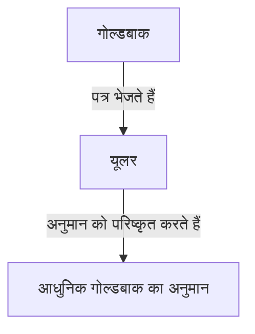

## [गोल्डबाक का अनुमान](https://kenji.blog/hi/p/goldbachs-conjecture/) क्या है?

**[गोल्डबाक का अनुमान](https://kenji.blog/hi/p/goldbachs-conjecture/)** संख्या सिद्धांत की सबसे पुरानी और सबसे प्रसिद्ध अनसुलझी समस्याओं में से एक है। इसका कथन इतना सरल है कि एक प्राथमिक विद्यालय का छात्र भी इसे समझ सकता है।

> "2 से बड़ी प्रत्येक सम संख्या को दो अभाज्य संख्याओं के योग के रूप में व्यक्त किया जा सकता है।"

आइए कुछ विशिष्ट संख्याओं के साथ इसका परीक्षण करें।

- $4 = 2 + 2$
- $6 = 3 + 3$
- $8 = 3 + 5$
- $10 = 3 + 7 = 5 + 5$
- $12 = 5 + 7$

जैसा कि आप देख सकते हैं, छोटी सम संख्याओं के लिए, उन्हें वास्तव में दो अभाज्य संख्याओं के योग के रूप में व्यक्त किया जा सकता है। हालाँकि, इसे **सभी** सम संख्याओं के लिए सिद्ध करना आज तक किसी के लिए भी संभव नहीं हो पाया है।

## ऐतिहासिक पृष्ठभूमि

इस अनुमान का उल्लेख सबसे पहले 1742 में प्रशिया के गणितज्ञ **क्रिश्चियन गोल्डबाक** द्वारा महान स्विस गणितज्ञ **[लियोनहार्ड यूलर](https://kenji.blog/hi/p/euler/)** को भेजे गए एक पत्र में किया गया था।

गोल्डबाक का मूल अनुमान थोड़ा अधिक जटिल था, लेकिन यूलर ने इसे उस रूप में परिष्कृत किया जिसे हम आज जानते हैं। यूलर को खुद यकीन था कि यह अनुमान सही है, लेकिन वह इसे साबित नहीं कर सके।

## गणितीय अभिव्यक्ति और कंप्यूटर सत्यापन

गणितीय रूप से, यह अनुमान इस प्रकार व्यक्त किया जाता है:

$$
\forall n \in \mathbb{N}, n \ge 2 \implies 2n = p_1 + p_2 \quad (\text{जहाँ } p_1, p_2 \text{ अभाज्य संख्याएँ हैं})
$$

आधुनिक समय में, कंप्यूटर की प्रसंस्करण शक्ति में सुधार के साथ, इस अनुमान को बहुत बड़ी संख्याओं के लिए सत्यापित किया गया है। 2014 तक, गोल्डबाक के अनुमान को $4 \times 10^{18}$ तक की सभी सम संख्याओं के लिए सही सत्यापित किया गया है।

हालाँकि, गणित की दुनिया में, "बहुत बड़ी संख्या में मामलों" के लिए किसी चीज़ की पुष्टि करना पूर्ण **प्रमाण** नहीं है। यह तार्किक रूप से घटाना आवश्यक है कि यह अनंत सभी सम संख्याओं के लिए लागू होता है।

## कमजोर गोल्डबाक अनुमान

गोल्डबाक के अनुमान से जुड़ा एक और अनुमान है, जिसे **कमजोर गोल्डबाक अनुमान** के रूप में जाना जाता है।

> "5 से बड़ी प्रत्येक विषम संख्या को तीन अभाज्य संख्याओं के योग के रूप में व्यक्त किया जा सकता है।"

इसे "कमजोर" इसलिए कहा जाता है क्योंकि यदि "मजबूत" गोल्डबाक अनुमान (मूल वाला) सत्य है, तो कमजोर वाला स्वतः ही सत्य हो जाता है। (यदि कोई सम संख्या $2n = p_1 + p_2$ है, तो एक विषम संख्या $2n+3 = p_1 + p_2 + 3$ होगी, जो तीन अभाज्य संख्याओं का योग है)।

हैरानी की बात है कि इस "कमजोर" अनुमान को 2013 में हेराल्ड हेल्फगॉट द्वारा **पूरी तरह से सिद्ध कर दिया गया था**। हालाँकि, "मजबूत" अनुमान अभी भी एक दुर्गम दीवार के रूप में खड़ा है।

## निष्कर्ष

[गोल्डबाक का अनुमान](https://kenji.blog/hi/p/goldbachs-conjecture/) एक ऐसी समस्या है जो गणित की गहराई और रहस्य का प्रतीक है। इसकी सरल उपस्थिति के बावजूद, इसने सदियों से प्रतिभाशाली लोगों के प्रयासों को विफल किया है।

क्या कभी ऐसा दिन आएगा जब यह सुंदर अनुमान पूरी तरह से सिद्ध हो जाएगा? या क्या यह सिद्ध कर दिया जाएगा कि इसे सिद्ध नहीं किया जा सकता है? गणितीय अनसुलझी समस्याएं हमें लगातार अनंत रोमांच प्रदान करती हैं।
