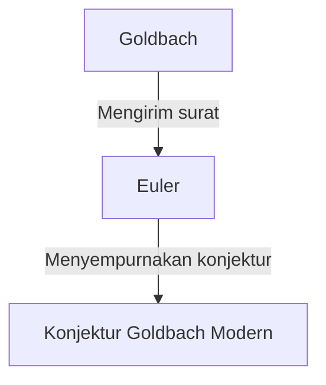

## Apa itu [Konjektur Goldbach](https://kenji.blog/p/goldbachs-conjecture/)?

**[Konjektur Goldbach](https://kenji.blog/p/goldbachs-conjecture/)** adalah salah satu masalah yang belum terpecahkan paling tua dan paling terkenal dalam teori bilangan. Pernyataannya sangat sederhana sehingga bahkan seorang siswa sekolah dasar pun dapat memahaminya.

> "Setiap bilangan bulat genap yang lebih besar dari 2 dapat dinyatakan sebagai jumlah dari dua bilangan prima."

Mari kita uji ini dengan beberapa angka spesifik.

- $4 = 2 + 2$
- $6 = 3 + 3$
- $8 = 3 + 5$
- $10 = 3 + 7 = 5 + 5$
- $12 = 5 + 7$

Seperti yang Anda lihat, untuk bilangan genap kecil, mereka memang dapat dinyatakan sebagai jumlah dua bilangan prima. Namun, membuktikan hal ini untuk **semua** bilangan genap belum dapat dilakukan oleh siapa pun hingga saat ini.

## Latar Belakang Sejarah

Konjektur ini pertama kali disebutkan dalam sebuah surat yang dikirim pada tahun 1742 oleh matematikawan Prusia **Christian Goldbach** kepada matematikawan hebat Swiss **[Leonhard Euler](https://kenji.blog/p/euler/)**.

Konjektur asli Goldbach sedikit lebih kompleks, tetapi Euler menyempurnakannya ke dalam bentuk yang kita kenal sekarang. Euler sendiri yakin bahwa konjektur itu benar, tetapi ia tidak dapat membuktikannya.

## Ekspresi Matematika dan Verifikasi Komputer

Secara matematis, konjektur ini diekspresikan sebagai berikut:

$$
\forall n \in \mathbb{N}, n \ge 2 \implies 2n = p_1 + p_2 \quad (\text{di mana } p_1, p_2 \text{ adalah bilangan prima})
$$

Di zaman modern, dengan peningkatan daya komputasi komputer, konjektur ini telah diverifikasi untuk bilangan yang sangat besar. Pada tahun 2014, konjektur Goldbach telah diverifikasi benar untuk semua bilangan genap hingga $4 \times 10^{18}$.

Namun, dalam dunia matematika, mengonfirmasi sesuatu untuk "jumlah kasus yang sangat besar" tidak merupakan **bukti** yang lengkap. Sangat perlu untuk mendeduksi secara logis bahwa hal ini berlaku untuk semua bilangan genap yang jumlahnya tak terhingga.

## [Konjektur Goldbach](https://kenji.blog/p/goldbachs-conjecture/) Lemah

Ada konjektur lain yang terkait dengan konjektur Goldbach, yang dikenal sebagai **konjektur Goldbach lemah**.

> "Setiap bilangan ganjil yang lebih besar dari 5 dapat dinyatakan sebagai jumlah tiga bilangan prima."

Ini disebut "lemah" karena jika konjektur Goldbach "kuat" (yang asli) benar, maka yang lemah secara otomatis benar. (Jika bilangan genap adalah $2n = p_1 + p_2$, maka bilangan ganjil adalah $2n+3 = p_1 + p_2 + 3$, yang merupakan jumlah dari tiga bilangan prima).

Hebatnya, konjektur "lemah" ini **sepenuhnya dibuktikan** oleh Harald Helfgott pada tahun 2013. Namun, konjektur "kuat" masih berdiri sebagai tembok yang tak tertembus.

## Kesimpulan

[Konjektur Goldbach](https://kenji.blog/p/goldbachs-conjecture/) adalah masalah yang melambangkan kedalaman dan misteri matematika. Meskipun penampilannya sederhana, masalah ini telah menolak upaya para jenius selama berabad-abad.

Apakah akan tiba harinya ketika konjektur yang indah ini sepenuhnya dibuktikan? Atau akankah terbukti tidak dapat dibuktikan? Masalah matematika yang belum terpecahkan selalu memberi kita romansa yang tak terbatas.
