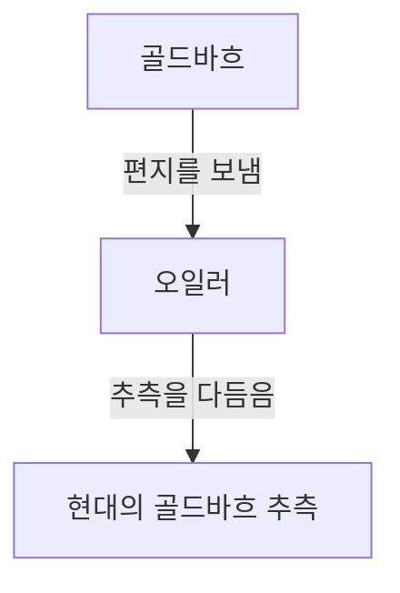

## [골드바흐의 추측](https://kenji.blog/ko/p/goldbachs-conjecture/)이란?

**[골드바흐의 추측](https://kenji.blog/ko/p/goldbachs-conjecture/)** (Goldbach's conjecture)은 정수론에서 가장 오래되고 가장 유명한 미해결 문제 중 하나입니다. 그 주장은 매우 단순하여 초등학생도 이해할 수 있을 정도입니다.

> "4 이상의 모든 짝수는 두 소수의 합으로 나타낼 수 있다."

예를 들어, 구체적인 숫자로 확인해 봅시다.

- $4 = 2 + 2$
- $6 = 3 + 3$
- $8 = 3 + 5$
- $10 = 3 + 7 = 5 + 5$
- $12 = 5 + 7$

이처럼 작은 짝수에 대해서는 두 소수의 합으로 표현될 수 있음을 확실히 알 수 있습니다. 하지만 이것을 **모든** 짝수에 대해 증명하는 것은 현재에 이르기까지 아무도 해내지 못했습니다.

## 역사적 배경

이 추측은 1742년 프로이센의 수학자 **크리스티안 골드바흐** (Christian Goldbach)가 스위스의 위대한 수학자 **[레온하르트 오일러](https://kenji.blog/ko/p/euler/)** ([Leonhard Euler](https://kenji.blog/ko/p/euler/))에게 보낸 편지에서 처음 언급되었습니다.

골드바흐의 원래 추측은 조금 더 복잡했지만, 오일러는 그것을 오늘날 우리가 알고 있는 형태로 다듬었습니다. 오일러 자신도 이 추측이 참이라고 확신했지만 증명하지는 못했습니다.

## 수학적 표현과 컴퓨터를 이용한 검증

수학적으로 이 추측은 다음과 같이 표현됩니다.

$$
\forall n \in \mathbb{N}, n \ge 2 \implies 2n = p_1 + p_2 \quad (\text{단, } p_1, p_2 \text{는 소수})
$$

현대에는 컴퓨터 계산 능력의 향상으로 인해 매우 큰 수까지 이 추측이 성립하는 것이 확인되었습니다. 2014년 현재 $4 \times 10^{18}$ 까지의 모든 짝수에 대해 [골드바흐의 추측](https://kenji.blog/ko/p/goldbachs-conjecture/)이 옳음이 검증되었습니다.

하지만 수학의 세계에서 "매우 많은 수에서 확인되었다"는 것은 완전한 **증명** 이 될 수 없습니다. 무한히 존재하는 모든 짝수에 대해 성립함을 논리적으로 이끌어내야만 합니다.

## 약한 [골드바흐의 추측](https://kenji.blog/ko/p/goldbachs-conjecture/)

[골드바흐의 추측](https://kenji.blog/ko/p/goldbachs-conjecture/)에는 이와 관련된 또 다른 추측이 있습니다. 그것은 **약한 [골드바흐의 추측](https://kenji.blog/ko/p/goldbachs-conjecture/)** 이라고 불립니다.

> "7 이상의 모든 홀수는 세 소수의 합으로 나타낼 수 있다."

이 추측은 "강한" [골드바흐의 추측](https://kenji.blog/ko/p/goldbachs-conjecture/)(원래의 추측)이 옳다면 자동으로 성립하기 때문에 "약한" 것으로 불립니다. (짝수가 $2n = p_1 + p_2$ 이라면, 홀수는 $2n+3 = p_1 + p_2 + 3$ 이 되어 세 소수의 합이 되기 때문입니다).

놀랍게도 이 "약한" 추측에 대해서는 2013년 하랄드 엘프고트(Harald Helfgott)에 의해 **완전히 증명되었습니다** . 하지만 "강한" 추측은 여전히 거대한 장벽으로 남아 있습니다.

## 결론

[골드바흐의 추측](https://kenji.blog/ko/p/goldbachs-conjecture/)은 수학의 깊이와 신비로움을 상징하는 문제입니다. 겉모습은 단순하면서도 수 세기에 걸쳐 천재들의 도전을 물리쳐 왔습니다.

언젠가 이 아름다운 추측이 완전히 증명되는 날이 올까요? 아니면 증명 불가능함이 증명될까요? 수학의 미해결 문제는 항상 우리에게 무한한 낭만을 느끼게 해 줍니다.
