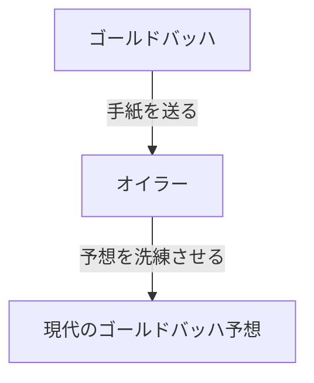

## ゴールドバッハ予想とは？

**ゴールドバッハ予想** （Goldbach's conjecture）は、数論における最も古く、かつ最も有名な未解決問題の一つです。その主張は非常にシンプルで、小学生でも理解できるほどです。

> 「4以上の全ての偶数は、2つの素数の和として表すことができる」

例えば、いくつか具体的な数字で試してみましょう。

- $4 = 2 + 2$
- $6 = 3 + 3$
- $8 = 3 + 5$
- $10 = 3 + 7 = 5 + 5$
- $12 = 5 + 7$

このように、確かに小さな偶数については、2つの素数の足し算で表せることが確認できます。しかし、これを「**全ての**」偶数について証明することは、現在に至るまで誰にもできていません。

## 歴史的背景

この予想は、1742年にプロイセンの数学者 **クリスティアン・ゴールドバッハ** （Christian Goldbach）が、スイスの偉大な数学者 **レオンハルト・[オイラー](https://kenji.blog/p/euler/)** （Leonhard Euler）宛てに送った手紙の中で初めて言及されました。

ゴールドバッハの元の予想は少し複雑でしたが、[オイラー](https://kenji.blog/p/euler/)はそれを洗練させ、現在私たちが知っている形に直しました。[オイラー](https://kenji.blog/p/euler/)自身もこの予想が真であると確信していましたが、証明することはできませんでした。

## 数学的な表現とコンピュータによる検証

数学的には、この予想は以下のように表されます。

$$
\forall n \in \mathbb{N}, n \ge 2 \implies 2n = p_1 + p_2 \quad (\text{ただし、} p_1, p_2 \text{は素数})
$$

現代では、コンピュータの計算能力の向上により、非常に大きな数までこの予想が成り立つことが確認されています。2014年の時点で、$4 \times 10^{18}$ までの全ての偶数について、ゴールドバッハ予想が正しいことが検証されています。

しかし、数学の世界において「非常に多くの数で確認できた」ことは、完全な「**証明**」にはなりません。無限に存在する偶数すべてに対して成り立つことを、論理的に導き出す必要があるのです。

## 弱いゴールドバッハ予想

ゴールドバッハ予想には、関連する別の予想があります。それは「**弱いゴールドバッハ予想**」と呼ばれています。

> 「7以上の全ての奇数は、3つの素数の和として表すことができる」

この予想は、「強い」ゴールドバッハ予想（元の予想）が正しければ自動的に成り立つため、「弱い」と呼ばれています。（偶数 $2n = p_1 + p_2$ であれば、奇数 $2n+3 = p_1 + p_2 + 3$ となり、3つの素数の和になるためです）。

驚くべきことに、この「弱い」予想については、2013年にハラルド・ヘルフゴット（Harald Helfgott）によって**完全に証明されました**。しかし、「強い」予想は未だに壁として立ちはだかっています。

## まとめ

ゴールドバッハ予想は、数学の奥深さと神秘性を象徴するような問題です。見た目はシンプルでありながら、数世紀にわたって天才たちの挑戦を退けてきました。

いつの日か、この美しい予想が完全に証明される日が来るのでしょうか。それとも、証明不可能であることが証明されるのでしょうか。数学の未解決問題は、常に私たちに無限のロマンを感じさせてくれます。
