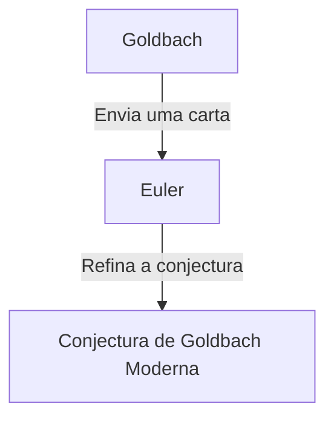

## O que é a [Conjectura de Goldbach](https://kenji.blog/p/goldbachs-conjecture/)?

A **conjectura de Goldbach** é um dos problemas não resolvidos mais antigos e famosos da teoria dos números. Sua afirmação é tão simples que até um aluno do ensino fundamental pode entendê-la.

> "Todo número inteiro par maior que 2 pode ser expresso como a soma de dois números primos."

Vamos testar isso com alguns números específicos.

- $4 = 2 + 2$
- $6 = 3 + 3$
- $8 = 3 + 5$
- $10 = 3 + 7 = 5 + 5$
- $12 = 5 + 7$

Como você pode ver, pequenos números pares podem, de fato, ser expressos como a soma de dois números primos. No entanto, provar isso para **todos** os números pares escapou a todos até hoje.

## Contexto Histórico

Esta conjectura foi mencionada pela primeira vez em uma carta enviada em 1742 pelo matemático prussiano **Christian Goldbach** ao grande matemático suíço **[Leonhard Euler](https://kenji.blog/p/euler/)**.

A conjectura original de Goldbach era ligeiramente mais complexa, mas Euler a refinou para a forma que conhecemos hoje. O próprio Euler estava convencido de que a conjectura era verdadeira, mas ele não pôde prová-la.

## Expressão Matemática e Verificação por Computador

Matematicamente, esta conjectura é expressa da seguinte forma:

$$
\forall n \in \mathbb{N}, n \ge 2 \implies 2n = p_1 + p_2 \quad (\text{onde } p_1, p_2 \text{ são números primos})
$$

Nos tempos modernos, com o aprimoramento da capacidade de processamento dos computadores, a conjectura foi verificada para números extremamente grandes. A partir de 2014, verificou-se que a conjectura de Goldbach é verdadeira para todos os números pares até $4 \times 10^{18}$.

No entanto, no mundo da matemática, confirmar algo para um "número muito grande de casos" não constitui uma **prova** completa. É necessário deduzir logicamente que ela se aplica a todos os infinitos números pares.

## A Conjectura Fraca de Goldbach

Há outra conjectura relacionada à conjectura de Goldbach, conhecida como a **conjectura fraca de Goldbach**.

> "Todo número ímpar maior que 5 pode ser expresso como a soma de três números primos."

Esta é chamada de "fraca" porque se a conjectura de Goldbach "forte" (a original) for verdadeira, então a fraca é automaticamente verdadeira. (Se um número par é $2n = p_1 + p_2$, então um número ímpar é $2n+3 = p_1 + p_2 + 3$, que é a soma de três números primos).

Surpreendentemente, esta conjectura "fraca" foi **completamente provada** por Harald Helfgott em 2013. No entanto, a conjectura "forte" ainda permanece como um muro intransponível.

## Conclusão

A conjectura de Goldbach é um problema que simboliza a profundidade e o mistério da matemática. Apesar de sua aparência simples, ela repeliu as tentativas de gênios por séculos.

Chegará o dia em que esta bela conjectura será completamente provada? Ou será provado que ela é improvável? Os problemas matemáticos não resolvidos nos proporcionam constantemente um romance infinito.
