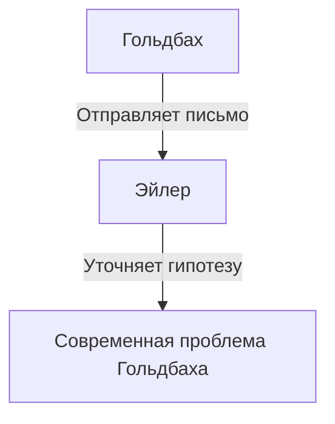

## Что такое проблема Гольдбаха?

**[Проблема Гольдбаха](https://kenji.blog/ru/p/goldbachs-conjecture/)** (или гипотеза Гольдбаха) — одна из старейших и наиболее известных нерешенных задач в теории чисел. Ее формулировка настолько проста, что понятна даже ученику начальной школы.

> "Любое четное число, большее 2, можно представить в виде суммы двух простых чисел."

Давайте проверим это на нескольких конкретных числах.

- $4 = 2 + 2$
- $6 = 3 + 3$
- $8 = 3 + 5$
- $10 = 3 + 7 = 5 + 5$
- $12 = 5 + 7$

Как видите, небольшие четные числа действительно можно выразить как сумму двух простых. Однако доказать это для **всех** четных чисел до сих пор никому не удалось.

## Историческая справка

Впервые эта гипотеза была упомянута в письме, отправленном в 1742 году прусским математиком **Христианом Гольдбахом** великому швейцарскому математику **Леонарду Эйлеру**.

Оригинальная гипотеза Гольдбаха была немного сложнее, но Эйлер уточнил ее до той формы, которую мы знаем сегодня. Сам Эйлер был убежден в истинности гипотезы, но доказать ее не смог.

## Математическое выражение и компьютерная проверка

Математически эта гипотеза выражается следующим образом:

$$
\forall n \in \mathbb{N}, n \ge 2 \implies 2n = p_1 + p_2 \quad (\text{где } p_1, p_2 \text{ — простые числа})
$$

В наше время, благодаря росту вычислительных мощностей компьютеров, гипотеза была проверена для огромных чисел. По состоянию на 2014 год гипотеза Гольдбаха была подтверждена для всех четных чисел вплоть до $4 \times 10^{18}$.

Однако в мире математики подтверждение чего-либо для "очень большого количества случаев" не является полным **доказательством**. Необходимо логически вывести, что это справедливо для бесконечного числа всех четных чисел.

## Слабая гипотеза Гольдбаха

Существует еще одна гипотеза, связанная с проблемой Гольдбаха, известная как **слабая гипотеза Гольдбаха**.

> "Любое нечетное число, большее 5, можно представить в виде суммы трех простых чисел."

Она называется "слабой", потому что если верна "сильная" гипотеза Гольдбаха (оригинальная), то слабая верна автоматически. (Если четное число — это $2n = p_1 + p_2$, то нечетное число — это $2n+3 = p_1 + p_2 + 3$, что и является суммой трех простых).

Удивительно, но эта "слабая" гипотеза была **полностью доказана** Харальдом Хельфготтом в 2013 году. Однако "сильная" гипотеза все еще стоит как непреодолимая стена.

## Заключение

[Проблема Гольдбаха](https://kenji.blog/ru/p/goldbachs-conjecture/) — это задача, символизирующая глубину и загадочность математики. Несмотря на внешнюю простоту, она веками отбивала попытки гениев решить ее.

Настанет ли когда-нибудь день, когда эта прекрасная гипотеза будет полностью доказана? Или будет доказано, что она недоказуема? Нерешенные математические задачи всегда дарят нам бесконечную романтику поиска.
