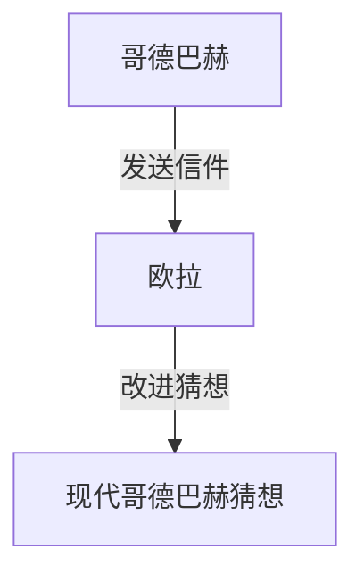

## 什么是[哥德巴赫猜想](https://kenji.blog/p/goldbachs-conjecture/)？

**[哥德巴赫猜想](https://kenji.blog/p/goldbachs-conjecture/)** 是数论中最古老、最著名的未解决问题之一。它的陈述非常简单，甚至连小学生都能理解。

> “所有大于2的偶数都可以表示为两个素数之和。”

让我们用几个具体的数字来测试一下。

- $4 = 2 + 2$
- $6 = 3 + 3$
- $8 = 3 + 5$
- $10 = 3 + 7 = 5 + 5$
- $12 = 5 + 7$

正如你所看到的，对于较小的偶数，它们确实可以表示为两个素数之和。然而，要证明这适用于 **所有** 偶数，至今无人能够做到。

## 历史背景

这个猜想最早出现在1742年普鲁士数学家 **克里斯蒂安·哥德巴赫** （Christian Goldbach）写给伟大的瑞士数学家 **[莱昂哈德·欧拉](https://kenji.blog/p/euler/)** （[Leonhard Euler](https://kenji.blog/p/euler/)）的一封信中。

哥德巴赫最初的猜想稍微复杂一些，但欧拉将其改进为了我们今天所知的形式。欧拉本人坚信这个猜想是正确的，但他却无法证明它。

## 数学表达与计算机验证

在数学上，这个猜想被表达为如下形式：

$$
\forall n \in \mathbb{N}, n \ge 2 \implies 2n = p_1 + p_2 \quad (\text{其中 } p_1, p_2 \text{ 是素数})
$$

在现代，随着计算机计算能力的提升，这个猜想已经在极大的数字范围内得到了验证。截至2014年，[哥德巴赫猜想](https://kenji.blog/p/goldbachs-conjecture/)已被验证在高达 $4 \times 10^{18}$ 的所有偶数中都是成立的。

然而，在数学的世界里，对“极大数量的情况”进行确认并不能构成完整的 **证明** 。必须通过逻辑推演，证明它对无限多的偶数都成立。

## 弱[哥德巴赫猜想](https://kenji.blog/p/goldbachs-conjecture/)

还有一个与[哥德巴赫猜想](https://kenji.blog/p/goldbachs-conjecture/)相关的猜想，被称为 **弱[哥德巴赫猜想](https://kenji.blog/p/goldbachs-conjecture/)** 。

> “所有大于5的奇数都可以表示为三个素数之和。”

之所以称之为“弱”，是因为如果“强”[哥德巴赫猜想](https://kenji.blog/p/goldbachs-conjecture/)（即原猜想）是正确的，那么弱猜想就会自动成立。（如果一个偶数 $2n = p_1 + p_2$，那么一个奇数 $2n+3 = p_1 + p_2 + 3$，即三个素数之和）。

令人惊讶的是，这个“弱”猜想已由哈洛德·贺夫各特（Harald Helfgott）在2013年 **完全证明** 。然而，“强”猜想依然像一堵不可逾越的高墙屹立不倒。

## 结论

[哥德巴赫猜想](https://kenji.blog/p/goldbachs-conjecture/)是象征数学深度与神秘性的一个问题。尽管它看起来很简单，但在几个世纪里，它已经击退了无数天才的尝试。

有朝一日，这个美丽的猜想会被完全证明吗？还是会被证明是不可证明的呢？数学中的未解决问题，总是带给我们无尽的浪漫与遐想。
