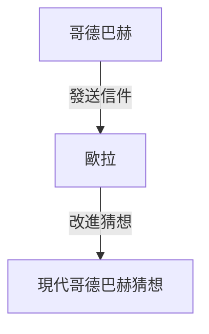

## 什麼是[哥德巴赫猜想](https://kenji.blog/zh-tw/p/goldbachs-conjecture/)？

**[哥德巴赫猜想](https://kenji.blog/zh-tw/p/goldbachs-conjecture/)** 是數論中最古老、最著名的未解決問題之一。它的陳述非常簡單，甚至連小學生都能理解。

> 「所有大於2的偶數都可以表示為兩個質數之和。」

讓我們用幾個具體的數字來測試一下。

- $4 = 2 + 2$
- $6 = 3 + 3$
- $8 = 3 + 5$
- $10 = 3 + 7 = 5 + 5$
- $12 = 5 + 7$

正如你所看到的，對於較小的偶數，它們確實可以表示為兩個質數之和。然而，要證明這適用於 **所有** 偶數，至今無人能夠做到。

## 歷史背景

這個猜想最早出現在1742年普魯士數學家 **克里斯蒂安·哥德巴赫** （Christian Goldbach）寫給偉大的瑞士數學家 **萊昂哈德·歐拉** （[Leonhard Euler](https://kenji.blog/zh-tw/p/euler/)）的一封信中。

哥德巴赫最初的猜想稍微複雜一些，但歐拉將其改進為了我們今天所知的形式。歐拉本人堅信這個猜想是正確的，但他卻無法證明它。

## 數學表達與電腦驗證

在數學上，這個猜想被表達為如下形式：

$$
\forall n \in \mathbb{N}, n \ge 2 \implies 2n = p_1 + p_2 \quad (\text{其中 } p_1, p_2 \text{ 是質數})
$$

在現代，隨著電腦運算能力的提升，這個猜想已經在極大的數字範圍內得到了驗證。截至2014年，[哥德巴赫猜想](https://kenji.blog/zh-tw/p/goldbachs-conjecture/)已被驗證在高達 $4 \times 10^{18}$ 的所有偶數中都是成立的。

然而，在數學的世界裡，對「極大數量的狀況」進行確認並不能構成完整的 **證明** 。必須透過邏輯推演，證明它對無限多的偶數都成立。

## 弱[哥德巴赫猜想](https://kenji.blog/zh-tw/p/goldbachs-conjecture/)

還有一個與[哥德巴赫猜想](https://kenji.blog/zh-tw/p/goldbachs-conjecture/)相關的猜想，被稱為 **弱[哥德巴赫猜想](https://kenji.blog/zh-tw/p/goldbachs-conjecture/)** 。

> 「所有大於5的奇數都可以表示為三個質數之和。」

之所以稱之為「弱」，是因為如果「強」[哥德巴赫猜想](https://kenji.blog/zh-tw/p/goldbachs-conjecture/)（即原猜想）是正確的，那麼弱猜想就會自動成立。（如果一個偶數 $2n = p_1 + p_2$，那麼一個奇數 $2n+3 = p_1 + p_2 + 3$，即三個質數之和）。

令人驚訝的是，這個「弱」猜想已由哈洛德·賀夫各特（Harald Helfgott）在2013年 **完全證明** 。然而，「強」猜想依然像一堵不可逾越的高牆屹立不倒。

## 結論

[哥德巴赫猜想](https://kenji.blog/zh-tw/p/goldbachs-conjecture/)是象徵數學深度與神秘性的一個問題。儘管它看起來很簡單，但在幾個世紀裡，它已經擊退了無數天才的嘗試。

有朝一日，這個美麗的猜想會被完全證明嗎？還是會被證明是不可證明的呢？數學中的未解決問題，總是帶給我們無盡的浪漫與遐想。
