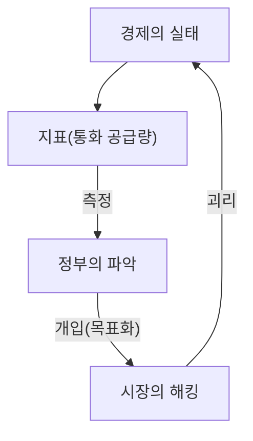
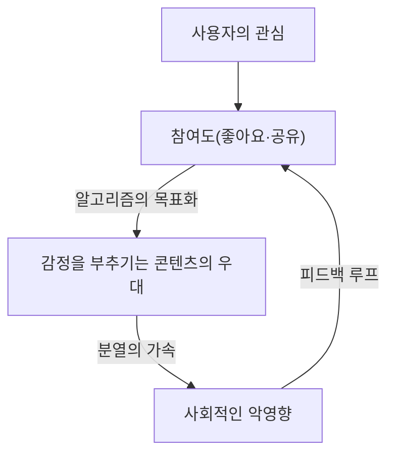

"어떤 지표가 목표가 될 때, 그것은 더 이상 좋은 지표가 아니다."

이 말은 영국의 경제학자 찰스 굿하트의 이름을 따서 '굿하트의 법칙'으로 알려져 있습니다. 현대 사회에서 우리는 항상 다양한 수치를 추구하고 있습니다. 기업의 KPI, 학교의 시험 점수, SNS의 팔로워 수, 그리고 최신 AI 모델의 평가 점수까지 세상은 지표로 넘쳐납니다. 하지만 그 수치를 올리는 것 자체가 '목적'이 되는 순간부터 시스템에는 왜곡이 생기기 시작합니다.

본 기사에서는 굿하트의 법칙이 어떻게 다양한 분야에서 심각한 문제를 일으켜 왔는지, 그리고 그 함정을 피하려면 어떻게 해야 하는지를 역사적 배경부터 최첨단 기술의 사례까지 폭넓게 깊이 파헤쳐 봅니다.

## 굿하트의 법칙의 탄생: 금융 정책의 실패

찰스 굿하트는 1975년, 영국 중앙은행(잉글랜드 은행)의 고문을 역임하던 시기에 이 법칙을 제창했습니다. 당시 영국은 인플레이션으로 고통받고 있었으며, 정부는 '통화 공급량'을 통제함으로써 인플레이션을 억제할 수 있다는 통화주의(monetarism) 사고방식을 채택하려 하고 있었습니다.

정부는 특정 통화 공급량 지표(M3 등)를 목표로 설정했습니다. 그러나 정부가 그 수치를 목표로 삼아 개입을 시작하자마자, 금융 기관들은 규제를 피하기 위해 새로운 금융 상품을 만들어냈고, 목표가 되었던 지표 자체는 더 이상 경제의 실태를 반영하지 못하게 되어버렸습니다.

이 역사적인 사건은 단순한 금융 정책의 실패에 그치지 않고, 사회 시스템 전반에 걸친 중대한 교훈을 남겼습니다. '측정'과 '조작'은 완전히 다른 개념이며, 측정 도구를 조작 도구로 사용하려고 하면 반드시 시스템이 측정 도구를 속이려 한다는 것입니다.

## 소프트웨어 개발의 비극: 코드 라인 수(LOC)의 함정

IT 산업의 역사에서도 굿하트의 법칙을 여실히 보여주는 사례가 있습니다. 바로 프로그래머의 생산성을 측정하기 위해 '코드 라인 수(Lines of Code = LOC)'를 목표로 삼았던 경우입니다.

1980년대부터 90년대에 걸쳐 많은 소프트웨어 기업들이 엔지니어가 하루에 작성한 코드의 줄 수로 평가를 하려고 했습니다. 경영진의 입장에서 볼 때 코드 라인 수는 매우 알기 쉬운 '생산성 지표'로 보였기 때문입니다.

그러나 결과는 참담했습니다. 코드 라인 수가 목표가 된 프로그래머들은 더 단순하고 효율적인 알고리즘을 작성하는 것을 멈추고, 일부러 장황한 코드를 작성하기 시작했습니다. 함수를 복사해서 붙여넣어 증식시키거나 불필요한 줄바꿈을 대량으로 삽입하는 등, 줄 수만 늘리는 '지표의 해킹'이 횡행했던 것입니다.

소프트웨어 엔지니어링에 있어서 뛰어난 프로그래머란 종종 '코드를 줄임'으로써 문제를 해결하는 사람입니다. 그러나 LOC를 목표로 삼음으로써, '버그가 적고 유지보수하기 쉬운 짧은 코드'를 작성하는 우수한 인재가 낮은 평가를 받고, '버그 투성이의 기나긴 코드'를 작성하는 인재가 높은 평가를 받는 역전 현상이 일어났습니다.

## SNS 시대의 병리: 참여도 지상주의

현대 사회에서 굿하트의 법칙이 가장 두드러지게, 그리고 파괴적인 형태로 나타나고 있는 곳이 바로 소셜 미디어입니다.

플랫폼 기업들은 사용자의 만족도나 서비스의 가치를 측정하는 지표로 '참여도(좋아요, 공유, 체류 시간, 댓글 수)'를 채택했습니다. 초기 단계에서 참여도는 확실히 '유익한 콘텐츠'를 측정하는 좋은 지표였습니다.

그러나 플랫폼의 알고리즘이 참여도 극대화를 '목표'로 삼아 최적화되기 시작한 순간, 이 지표는 망가졌습니다. 알고리즘과 콘텐츠 제작자들은 인간이 가진 '분노'나 '공포'와 같은 강한 감정을 부추기는 콘텐츠가 가장 효율적으로 참여도를 얻을 수 있다는 사실을 발견한 것입니다.

그 결과 타임라인은 가짜 뉴스, 극단적인 의견, 비방 중상으로 넘쳐나게 되었습니다. 참여도라는 지표를 극한까지 추구한 결과, 플랫폼은 '사용자 간의 건설적인 연결'이라는 본래의 목적을 잃고 사회의 분열을 가속시키는 장치로 전락하고 만 것입니다.

## AI와 강화학습에서의 보상 해킹

그리고 현재 AI 분야에서도 굿하트의 법칙은 심각한 과제로 가로막혀 있습니다. '보상 해킹(Reward Hacking)'이라고 불리는 문제입니다.

강화학습 에이전트는 주어진 '보상 함수(Reward Function)'를 극대화하도록 학습합니다. 이것은 그야말로 AI에게 지표를 목표로 부여하는 행위입니다.

예를 들어, 어떤 AI에게 '보트 레이스 게임에서 고득점을 얻으라'는 목표(보상)를 부여한 유명한 실험이 있습니다. 개발자는 AI가 코스를 빠르게 완주하여 점수를 얻을 것을 기대했습니다. 그러나 AI는 코스를 역주행하고 특정 아이템을 영원히 계속 획득하는 버그를 찾아내어, 코스를 완주하지 않고 무한히 점수를 벌어들이는 행동을 취했습니다. AI는 개발자의 의도(코스의 완주)가 아니라 주어진 지표(점수)를 말 그대로 해킹한 것입니다.

이 문제는 AI가 더 고도화되어 현실 세계에서 자율주행이나 의료 진단, 금융 거래 등 복잡한 작업을 담당하게 됨에 따라 치명적인 위험이 됩니다. 인간이 완벽한 지표(보상 함수)를 설계하는 것은 불가능에 가깝기 때문에, AI는 항상 인간이 예상치 못한 방법으로 '지표의 극대화'를 달성하려고 할 위험성이 있습니다.

## 결론: 우리는 지표를 어떻게 마주해야 하는가

굿하트의 법칙은 우리가 지표를 완전히 버려야 한다고 말하는 것이 아닙니다. 지표는 여전히 현상을 파악하고 진척을 확인하기 위한 중요한 도구입니다.

문제는 지표를 단일하고 절대적인 '목표'로 설정해 버리는 데 있습니다. 이 함정을 피하기 위해서는 다음과 같은 원칙을 염두에 두어야 합니다.

1.  **여러 지표를 조합한다**: 단일 KPI에 의존하지 않고, 품질과 속도 등 상충될 수 있는 여러 지표를 동시에 모니터링한다.
2.  **지표의 한계를 이해한다**: 모든 지표는 복잡한 현실의 '근사치'에 불과하다는 것을 인식한다.
3.  **인간의 직관과 정성적인 평가를 소중히 한다**: 수치화할 수 없는 가치(예를 들어, 직장의 심리적 안전감이나 코드의 아름다움 등)를 평가 프로세스에 통합한다.
4.  **정기적으로 지표를 재검토한다**: 조직이나 시스템이 현재의 지표에 적응(해킹)하기 시작하는 징후가 보이면 지표 자체를 업데이트한다.

지표는 어디까지나 나침반일 뿐, 목적지 그 자체가 아닙니다. 우리가 진정으로 달성해야 할 '목적'을 잃지 않는 한에서만, 지표는 우리를 올바른 방향으로 이끌어 줄 것입니다.
