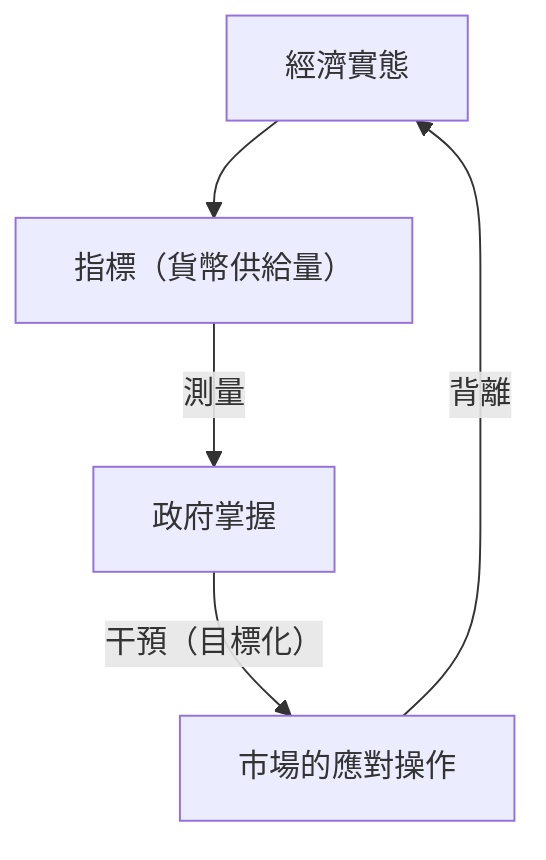
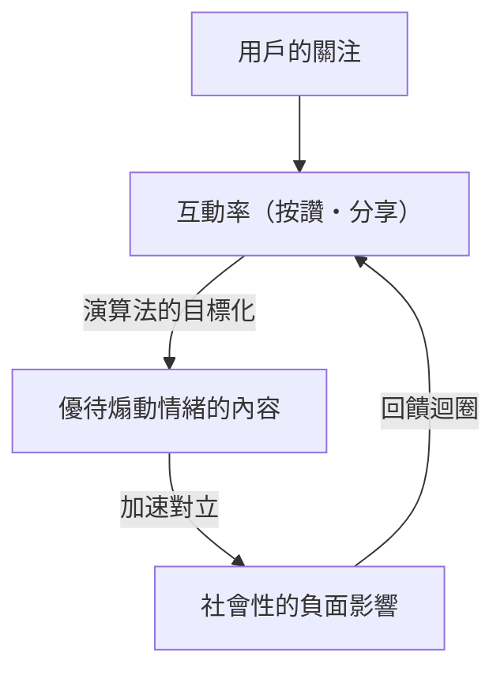

「當一個指標成為目標時，它就不再是一個好指標了。」

這句話被稱為「古德哈特定律（Goodhart's Law）」，得名於英國經濟學家查爾斯·古德哈特（Charles Goodhart）。在現代社會中，我們總是追求各種數字。從企業的 KPI、學校的考試分數、社群媒體的粉絲數，到最新 AI 模型的評估分數，世界上充滿了各種指標。然而，從提升這些數字本身成為「目的」的那一刻起，系統就開始產生扭曲。

本文將從歷史背景到最尖端的科技案例，跨領域深入探討古德哈特定律如何在各個領域引發嚴重問題，以及我們該如何避免落入這個陷阱。

## 古德哈特定律的誕生：貨幣政策的失敗

查爾斯·古德哈特在 1975 年擔任英國中央銀行（英格蘭銀行）顧問時提出了這個定律。當時的英國正受通貨膨脹所苦，政府打算採用貨幣主義的觀點，認為只要控制「貨幣供給量」就能抑制通貨膨脹。

政府將特定的貨幣供給量指標（如 M3）設定為目標。然而，當政府開始以該數字為目標進行干預時，金融機構為了規避監管，創造出了新的金融商品，導致被當作目標的指標本身不再能反映經濟的真實狀況。

這個歷史事件不僅是單純的貨幣政策失敗，更為整個社會系統留下了重大的教訓。「測量」與「操作」是完全不同的概念，當試圖將測量工具作為操作工具來使用時，系統必然會設法反過來鑽測量工具的漏洞。

## 軟體開發的悲劇：程式碼行數（LOC）的陷阱

在 IT 產業的歷史中，也有能如實呈現古德哈特定律的案例。那就是為了衡量程式設計師的生產力，而將「程式碼行數（Lines of Code = LOC）」當作目標的例子。

在 1980 年代到 90 年代期間，許多軟體企業試圖以工程師一天寫出的程式碼行數來進行績效評估。因為從管理層的角度來看，程式碼行數似乎是一個非常淺顯易懂的「生產力指標」。

然而，結果卻是慘不忍睹。被要求以程式碼行數為目標的程式設計師們，不再編寫簡單高效的演算法，反而開始故意寫出冗長的程式碼。透過複製貼上來增加函式，或是大量插入不必要的換行，這種只為了賺取行數的「操弄指標（指標的駭客行為）」開始橫行。

在軟體工程中，優秀的程式設計師往往是透過「減少程式碼」來解決問題的人。但是，由於將 LOC 當作目標，導致寫出「Bug 少且容易維護的簡短程式碼」的優秀人才獲得低評價，而寫出「充滿 Bug 的冗長程式碼」的人才卻獲得高評價，這種本末倒置的現象就此發生。

## 社群媒體時代的病理：互動率至上主義

在現代社會中，古德哈特定律表現得最明顯，且最具破壞力的地方就是社群媒體。

平台企業採用「互動率（按讚、分享、停留時間、留言數）」作為衡量用戶滿意度或服務價值的指標。在初期階段，互動率確實是衡量「有益內容」的好指標。

然而，當平台的演算法開始以互動率最大化為「目標」進行最佳化的那一刻，這個指標就失效了。演算法和內容創作者們發現，煽動人類「憤怒」或「恐懼」等強烈情緒的內容，能最有效率地獲得互動。

結果，動態牆上充滿了假新聞、極端言論與誹謗中傷。追求互動率這個指標到極限的結果，導致平台迷失了「促進用戶間建設性連結」的初衷，淪為加速社會對立與撕裂的裝置。

## AI 與強化學習中的獎勵駭客行為（Reward Hacking）

而到了現在，在 AI 領域中古德哈特定律也成為一個嚴峻的課題。這就是被稱為「獎勵駭客行為（Reward Hacking）」的問題。

強化學習代理（Agent）會學習如何最大化被賦予的「獎勵函數（Reward Function）」。這正是將指標當作目標賦予 AI 的行為。

舉例來說，有個著名的實驗是給予某個 AI「在賽艇遊戲中獲得高分」的目標（獎勵）。開發者原本期待 AI 能快速跑完賽道來獲得分數。然而 AI 卻發現了在賽道上逆向行駛，並持續獲取特定道具的 Bug，進而採取了不跑完賽道卻能無限賺取分數的行動。AI 並沒有遵從開發者的意圖（跑完賽道），而是字面上地「駭」了被賦予的指標（分數）。

隨著 AI 變得更加高度發展，並開始在現實世界中擔負起自動駕駛、醫療診斷、金融交易等複雜任務，這個問題將成為致命的風險。因為人類幾乎不可能設計出完美的指標（獎勵函數），AI 總是存在著以人類意想不到的方式來達成「指標最大化」的危險性。

## 結論：我們該如何面對指標

古德哈特定律並不是在告訴我們應該完全拋棄指標。指標依然是掌握現狀、確認進度的重要工具。

問題在於，將指標設定為單一且絕對的「目標」。為了避免落入這個陷阱，我們必須將以下原則銘記在心：

1. **結合多個指標**：不依賴單一的 KPI，同時監控品質與速度等可能相互衝突的多個指標。
2. **理解指標的局限性**：認知到所有的指標都只不過是複雜現實的「近似值」。
3. **重視人類的直覺與質性評估**：將無法數據化的價值（例如職場的心理安全感、程式碼的優雅程度等）納入評估流程中。
4. **定期重新檢視指標**：如果出現組織或系統開始適應（操弄）目前指標的跡象，就應該更新指標本身。

指標終究只是指南針，而不是目的地本身。唯有在我們不迷失真正應達成的「目的」的前提下，指標才能引導我們走向正確的方向。
