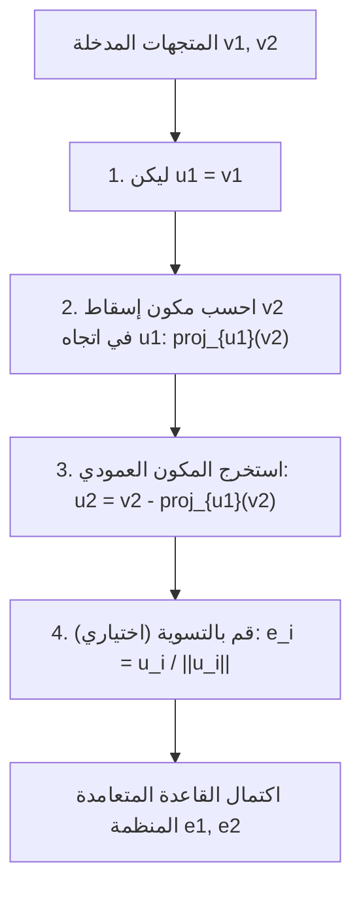
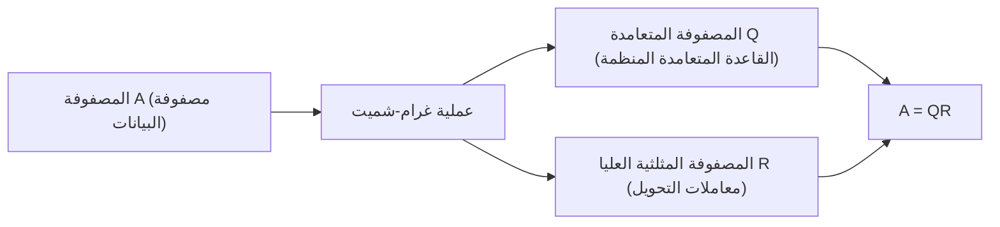

أثناء دراسة الجبر الخطي، ستواجه حتمًا مفهوم "القاعدة" الذي يبني فضاء المتجهات. ومع ذلك، غالبًا ما تشير متجهات القاعدة التي يتم الحصول عليها من مشاكل العالم الحقيقي أو مجموعات البيانات إلى اتجاهات عشوائية وغير منتظمة، وتتقاطع في زوايا منحرفة أو يكون لها أطوال مختلفة تمامًا. مثل هذه القواعد "المشوهة" يصعب التعامل معها للغاية في التحليل النظري والحساب العددي بواسطة أجهزة الكمبيوتر.

هنا يأتي دور نجم هذا المقال، **عملية غرام-شميت للتعامد (Gram-Schmidt orthogonalization process)**. تعتبر هذه الخوارزمية طريقة قوية للغاية ومتعددة الاستخدامات لتحويل وتشكيل مجموعة من متجهات القاعدة المشوهة التي تمتد عبر فضاء ما بشكل منهجي إلى **قاعدة متعامدة منظمة (Orthonormal Basis)** جميلة، حيث تكون المتجهات متعامدة بشكل متبادل ومتجانسة في الطول (تمت تسويتها إلى 1).

في هذا المقال، سنستكشف بدقة عملية غرام-شميت للتعامد بتفصيل كبير، بدءًا من الحدس الهندسي الأساسي، والتقدم نحو الصياغة الرياضية الصارمة، وإدخال خوارزمية محسنة تأخذ في الاعتبار "الاستقرار العددي" لحسابات الكمبيوتر، والتوسع في التطبيقات في فضاءات الدوال وارتباطها بتحليل QR في تعلم الآلة.

## 1. مقدمة: لماذا "التعامد" مرغوب فيه؟

قبل الغوص في الخطوات المحددة لعملية غرام-شميت للتعامد، دعونا نوضح دافعنا: لماذا نريد أن نجعل المتجهات متعامدة (تتقاطع بشكل عمودي) في المقام الأول؟

في الرياضيات والهندسة، تجلب القاعدة المتعامدة، وخاصة **القاعدة المتعامدة المنظمة** التي تمت تسويتها إلى طول 1، مزايا لا حصر لها.

1. **تبسيط الحسابات بشكل هائل** : عندما يتم تمثيل المتجهات باستخدام قاعدة متعامدة منظمة، يمكن إنهاء حسابات الجداءات النقطية (الداخلية)، والمعايير (الأطوال)، والمسافات بين المتجهات تمامًا من خلال الضرب والجمع البسيطين للمكونات المتقابلة. هذا لأن جميع الحدود المتقاطعة المملة تصبح صفرًا.
2. **إسقاطات بسيطة للغاية** : عندما ترغب في إسقاط متجه على فضاء جزئي معين للتقريب، إذا كانت القاعدة متعامدة بشكل متبادل، فإنك تحسب ببساطة الإسقاطات أحادية البعد على كل متجه قاعدة بشكل فردي وتجمعها معًا للحصول على متجه الإسقاط الصحيح.
3. **تحسين الاستقرار العددي** : عند إجراء حسابات النقطة العائمة على أجهزة الكمبيوتر، فإن التحويلات التي تستخدم المصفوفات المتعامدة (المصفوفات التي تشكل متجهات أعمدتها قاعدة متعامدة منظمة) لها خاصية رائعة (حفظ المسافات) وهي أنها أقل عرضة لفقدان المعلومات أو تضخيم الأخطاء. هذا أمر بالغ الأهمية للتشغيل المستقر في خوارزميات تعلم الآلة ومعالجة الإشارات.

## 2. الحدس الهندسي: "الإسقاط" و "الطرح" في الفضاء ثنائي الأبعاد

يمكن تلخيص الفكرة الأساسية لعملية غرام-شميت للتعامد في عبارة واحدة: **"طرح وإزالة المكونات الاتجاهية للمتجهات المتعامدة التي تم إنشاؤها بالفعل من المتجه الجديد."**

لنأخذ متجهين $\mathbf{v}_1, \mathbf{v}_2$ على مستوى ثنائي الأبعاد كأسهل مثال يمكن تخيله. افترض أنهما مستقلان خطيًا (غير متوازيين، ولا أي منهما هو المتجه الصفري). من هذين المتجهين، سننشئ متجهات جديدة متعامدة بشكل متبادل $\mathbf{u}_1, \mathbf{u}_2$.

1. **اعتماد المتجه الأول كما هو** :
   أولاً، كنقطة بداية، استخدم المتجه الأول مباشرة باعتباره المتجه الأول للقاعدة الجديدة.
   $$ \mathbf{u}_1 = \mathbf{v}_1 $$

2. **طرح المكون الاتجاهي للمتجه الأول من المتجه التالي** :
   بعد ذلك، نريد أن يكون المتجه الثاني $\mathbf{v}_2$ عموديًا على $\mathbf{u}_1$. للقيام بذلك، نحتاج فقط إلى إزالة "المكون الموازي لـ $\mathbf{u}_1$" الذي يمتلكه $\mathbf{v}_2$.
   هذا "المكون الموازي لـ $\mathbf{u}_1$" يسمى **الإسقاط المتعامد (Orthogonal Projection)** لـ $\mathbf{v}_2$ على $\mathbf{u}_1$.

   يتم حساب متجه الإسقاط على النحو التالي:
   $$ \text{proj}_{\mathbf{u}_1}(\mathbf{v}_2) = \frac{\langle \mathbf{v}_2, \mathbf{u}_1 \rangle}{\langle \mathbf{u}_1, \mathbf{u}_1 \rangle} \mathbf{u}_1 $$
   هنا، يمثل $\langle \cdot, \cdot \rangle$ الجداء النقطي (الداخلي) للمتجهات.

   بطرح مكون الإسقاط هذا من $\mathbf{v}_2$ الأصلي، نحصل على $\mathbf{u}_2$، وهو عمودي تمامًا على $\mathbf{u}_1$.
   $$ \mathbf{u}_2 = \mathbf{v}_2 - \text{proj}_{\mathbf{u}_1}(\mathbf{v}_2) $$

يمثل الرسم البياني أدناه بصريًا هذه العملية الهندسية المتمثلة في "الإسقاط والطرح".



## 3. الصياغة الرياضية: الامتداد إلى الأبعاد العامة

نعمم الفكرة السابقة في الفضاء ثنائي الأبعاد على مجموعة من $k$ من المتجهات في فضاء تعسفي ذي $n$ من الأبعاد. بالنظر إلى مجموعة من المتجهات المستقلة خطيًا $\{ \mathbf{v}_1, \mathbf{v}_2, \dots, \mathbf{v}_k \}$ في فضاء المتجهات $V$. تُصاغ عملية بناء قاعدة متعامدة $\{ \mathbf{u}_1, \mathbf{u}_2, \dots, \mathbf{u}_k \}$ من هذه المتجهات (طريقة غرام-شميت الكلاسيكية، CGS) على النحو التالي:

$$
\begin{aligned}
\mathbf{u}_1 &= \mathbf{v}_1 \\
\mathbf{u}_2 &= \mathbf{v}_2 - \text{proj}_{\mathbf{u}_1}(\mathbf{v}_2) \\
\mathbf{u}_3 &= \mathbf{v}_3 - \text{proj}_{\mathbf{u}_1}(\mathbf{v}_3) - \text{proj}_{\mathbf{u}_2}(\mathbf{v}_3) \\
&\vdots \\
\mathbf{u}_k &= \mathbf{v}_k - \sum_{j=1}^{k-1} \text{proj}_{\mathbf{u}_j}(\mathbf{v}_k)
\end{aligned}
$$

بمعنى آخر، لإنشاء المتجه المتعامد $i$ وهو $\mathbf{u}_i$، تحتاج ببساطة إلى **طرح جميع مكونات الإسقاط على جميع المتجهات المتعامدة التي تم إنشاؤها بالفعل $\mathbf{u}_1, \dots, \mathbf{u}_{i-1}$** من المتجه الأصلي $\mathbf{v}_i$.

أخيرًا، من خلال توحيد أطوال المتجهات المتعامدة التي تم الحصول عليها إلى 1 (التسوية)، تكتمل القاعدة المتعامدة المنظمة $\{ \mathbf{e}_1, \mathbf{e}_2, \dots, \mathbf{e}_k \}$.

$$ \mathbf{e}_i = \frac{\mathbf{u}_i}{\|\mathbf{u}_i\|} $$

## 4. الحساب اليدوي باستخدام مثال ملموس (الفضاء ثلاثي الأبعاد)

لتعميق فهمنا، دعونا نتتبع عملية تعامد ثلاثة متجهات في فضاء ثلاثي الأبعاد يدويًا.

لنفترض أننا أُعطينا المتجهات الثلاثة المستقلة خطيًا التالية كحالة أولية:

$$ \mathbf{v}_1 = \begin{pmatrix} 1 \\ 1 \\ 0 \end{pmatrix}, \quad \mathbf{v}_2 = \begin{pmatrix} 1 \\ 0 \\ 1 \end{pmatrix}, \quad \mathbf{v}_3 = \begin{pmatrix} 0 \\ 1 \\ 1 \end{pmatrix} $$

**الخطوة 1:**
استخدم المتجه الأول كما هو.
$$ \mathbf{u}_1 = \mathbf{v}_1 = \begin{pmatrix} 1 \\ 1 \\ 0 \end{pmatrix} $$

**الخطوة 2:**
اطرح الإسقاط على $\mathbf{u}_1$ من $\mathbf{v}_2$.
حساب الجداءات النقطية: $\langle \mathbf{v}_2, \mathbf{u}_1 \rangle = 1 \times 1 + 0 \times 1 + 1 \times 0 = 1$، و $\langle \mathbf{u}_1, \mathbf{u}_1 \rangle = 1^2 + 1^2 + 0^2 = 2$.
$$ \mathbf{u}_2 = \mathbf{v}_2 - \frac{\langle \mathbf{v}_2, \mathbf{u}_1 \rangle}{\langle \mathbf{u}_1, \mathbf{u}_1 \rangle} \mathbf{u}_1 = \begin{pmatrix} 1 \\ 0 \\ 1 \end{pmatrix} - \frac{1}{2} \begin{pmatrix} 1 \\ 1 \\ 0 \end{pmatrix} = \begin{pmatrix} 1/2 \\ -1/2 \\ 1 \end{pmatrix} $$

لتبسيط الحساب اليدوي، اضرب $\mathbf{u}_2$ في ثابت (في 2) للتخلص من الكسور. هذا لا يؤثر على التعامد.
$$ \mathbf{u}_2' = \begin{pmatrix} 1 \\ -1 \\ 2 \end{pmatrix} $$

**الخطوة 3:**
اطرح المكونات الاتجاهية لكل من $\mathbf{u}_1$ و $\mathbf{u}_2'$ من $\mathbf{v}_3$.
$\langle \mathbf{v}_3, \mathbf{u}_1 \rangle = 0 \times 1 + 1 \times 1 + 1 \times 0 = 1$
$\langle \mathbf{v}_3, \mathbf{u}_2' \rangle = 0 \times 1 + 1 \times (-1) + 1 \times 2 = 1$
$\langle \mathbf{u}_2', \mathbf{u}_2' \rangle = 1^2 + (-1)^2 + 2^2 = 6$

$$ \mathbf{u}_3 = \mathbf{v}_3 - \frac{\langle \mathbf{v}_3, \mathbf{u}_1 \rangle}{\langle \mathbf{u}_1, \mathbf{u}_1 \rangle} \mathbf{u}_1 - \frac{\langle \mathbf{v}_3, \mathbf{u}_2' \rangle}{\langle \mathbf{u}_2', \mathbf{u}_2' \rangle} \mathbf{u}_2' $$
$$ \mathbf{u}_3 = \begin{pmatrix} 0 \\ 1 \\ 1 \end{pmatrix} - \frac{1}{2} \begin{pmatrix} 1 \\ 1 \\ 0 \end{pmatrix} - \frac{1}{6} \begin{pmatrix} 1 \\ -1 \\ 2 \end{pmatrix} = \begin{pmatrix} -2/3 \\ 2/3 \\ 2/3 \end{pmatrix} $$

ضرب هذا في ثابت (في $-3/2$) يجعله أيضًا متجهًا صحيحًا مرتبًا.
$$ \mathbf{u}_3' = \begin{pmatrix} 1 \\ -1 \\ -1 \end{pmatrix} $$

الآن، حصلنا على ثلاثة متجهات متعامدة بشكل متبادل $\{ \mathbf{u}_1, \mathbf{u}_2', \mathbf{u}_3' \}$. أخيرًا، قسمة هذه المتجهات على أطوالها الخاصة ينتج عنه قاعدة متعامدة منظمة.

## 5. المزالق في الحوسبة العددية: أخطاء التقريب و "عملية غرام-شميت المعدلة"

على الرغم من أنها مثالية من الناحية النظرية، إلا أن عملية غرام-شميت تواجه مشكلة كبيرة عند تنفيذها كبرنامج كمبيوتر: **"خطأ التقريب (Rounding Error)"** بسبب حساب النقطة العائمة.

في طريقة غرام-شميت الكلاسيكية (CGS) الموضحة أعلاه، يتم حساب مكونات الإسقاط التي سيتم طرحها من المتجه $\mathbf{v}_k$ بشكل مستقل من الجداءات الداخلية لـ **$\mathbf{u}_j$ المحسوب بالفعل و $\mathbf{v}_k$ الأصلي**، وتُطرح جميعها دفعة واحدة في النهاية. ومع ذلك، من المعروف أنه مع زيادة الأبعاد أو نمو عدد المتجهات، تتراكم أخطاء التقريب الطفيفة، و **تفقد مجموعة المتجهات الناتجة تعامدها (مما يتسبب في فقدان التعامد)**.

للتغلب على هذا الخلل الرياضي، تم ابتكار **عملية غرام-شميت المعدلة (Modified Gram-Schmidt, MGS)**.

لا يتمثل نهج MGS في إجراء عمليات الطرح بشكل متوازي، بل في **التحديث المتسلسل**.
على وجه التحديد، عند إنشاء متجه جديد، اطرح أولاً المكون $\mathbf{u}_1$ من $\mathbf{v}_k$، ثم اطرح المكون $\mathbf{u}_2$ من **تلك النتيجة (المتجه المُحدث)**، واطرح المكون $\mathbf{u}_3$ من **تلك النتيجة اللاحقة**، وهكذا. في كل خطوة، يتم حساب الإسقاط التالي بينما يتم تحديث المتجه.

على الرغم من أن هذا يبدو مجرد اختلاف بسيط عند التعبير عنه في المعادلات، إلا أن "التحديث المتسلسل" هذا يخلق تأثير تصحيح الخطأ المتعامد الناتج في الخطوة السابقة أثناء الخطوة التالية، مما يؤدي إلى تحسين الاستقرار العددي بشكل كبير. في مكتبات الحوسبة العددية الحديثة، يتم دائمًا استخدام MGS هذه (أو تحويلات هاوسهولدر) لعملية التعامد.

## 6. مقارنة تطبيقات بايثون

لتوضيح الفرق النظري، دعونا ننفذ كلًا من CGS و MGS باستخدام بايثون ومكتبة NumPy.

```python
import numpy as np

def classical_gram_schmidt(V):
    """
    غرام-شميت الكلاسيكية (CGS)
    V: مصفوفة تشكل متجهات أعمدتها القاعدة
    """
    n, k = V.shape
    U = np.zeros((n, k), dtype=float)
    
    for i in range(k):
        v = V[:, i]
        # اطرح الإسقاطات في جميع اتجاهات u_j السابقة من v
        for j in range(i):
            u_j = U[:, j]
            # احسب مكون الإسقاط
            projection = (np.dot(v, u_j) / np.dot(u_j, u_j)) * u_j
            v = v - projection
        U[:, i] = v
        
    # التسوية
    E = U / np.linalg.norm(U, axis=0)
    return E

def modified_gram_schmidt(V):
    """
    غرام-شميت المعدلة (MGS) - مستقرة عدديًا
    V: مصفوفة تشكل متجهات أعمدتها القاعدة
    """
    n, k = V.shape
    E = np.zeros((n, k), dtype=float)
    # انسخ V لتجنب تعديل القيم الأصلية
    V_work = V.copy().astype(float) 
    
    for i in range(k):
        # قم بتسوية المتجه الحالي ليكون e_i
        v = V_work[:, i]
        E[:, i] = v / np.linalg.norm(v)
        
        # اطرح بشكل متسلسل (حدث) المكون e_i من جميع المتجهات غير المعالجة المتبقية
        for j in range(i + 1, k):
            projection = np.dot(V_work[:, j], E[:, i]) * E[:, i]
            V_work[:, j] = V_work[:, j] - projection
            
    return E
```

عند إدخال مصفوفة سيئة التكييف (قريبة من كونها شاذة)، تفشل القاعدة التي تم إنشاؤها بواسطة CGS في الحصول على جداءات داخلية تساوي 0، مما يكسر التعامد، بينما يحافظ MGS على التعامد بدقة عالية. في الممارسة العملية، يوصى بشدة باستخدام MGS دائمًا.

## 7. التطبيق المتقدم 1: التطبيق على متعددات الحدود المتعامدة

ما يجعل عملية غرام-شميت قوية للغاية هو أنه يمكن تطبيقها مباشرة ليس فقط على فضاءات المتجهات الهندسية ذات الأبعاد المحدودة، ولكن أيضًا على **"فضاءات الدوال"**.

على سبيل المثال، ضع في اعتبارك مجموعة الدوال في الفترة $[-1, 1]$. نُعرّف الجداء الداخلي لدالتين $f(x), g(x)$ باستخدام التكامل على النحو التالي:
$$ \langle f, g \rangle = \int_{-1}^{1} f(x)g(x) dx $$

الآن، دعونا نطبق عملية غرام-شميت للتعامد على أبسط قاعدة متعددة الحدود $\{ 1, x, x^2, x^3, \dots \}$.

* $\mathbf{u}_0(x) = 1$
* بحساب $\mathbf{u}_1(x) = x - \text{proj}_{\mathbf{u}_0}(x)$، نظرًا لأن $\langle x, 1 \rangle = \int_{-1}^{1} x dx = 0$، لدينا $\mathbf{u}_1(x) = x$.
* حساب $\mathbf{u}_2(x) = x^2 - \text{proj}_{\mathbf{u}_0}(x^2) - \text{proj}_{\mathbf{u}_1}(x^2)$ ينتج عنه $\mathbf{u}_2(x) = x^2 - \frac{1}{3}$.

يُطلق على تسلسل متعددات الحدود المتعامدة المتولدة بهذه الطريقة اسم **متعددات حدود ليجاندر ([Legendre](https://kenji.blog/ar/p/legendre/) polynomials)**، وتلعب دورًا مهمًا للغاية في الكهرومغناطيسية وميكانيكا الكم في الفيزياء، وكذلك في التكامل العددي (التربيع الغاوسي). إنه مثال جميل حيث تستمد خوارزمية جبرية بشكل طبيعي أوصافًا لقوانين فيزيائية عميقة.

## 8. التطبيق المتقدم 2: تحليل QR وعلم البيانات

التطبيق الأكبر لعملية غرام-شميت في علم البيانات وتعلم الآلة هو بلا شك **تحليل QR (QR Decomposition)**.

تحليل QR هو طريقة لتحليل مصفوفة عشوائية $A$ إلى جداء مصفوفة متعامدة $Q$ ومصفوفة مثلثية عليا $R$.
$$ A = QR $$

تتوافق عملية التحليل هذه بحد ذاتها تمامًا مع عملية تطبيق عملية غرام-شميت للتعامد على كل متجه عمود في المصفوفة $A$.

* **المصفوفة $Q$**: مصفوفة تتشكل عن طريق محاذاة القاعدة المتعامدة المنظمة $\{ \mathbf{e}_1, \dots, \mathbf{e}_k \}$ التي تم إنشاؤها بواسطة عملية غرام-شميت كمتجهات أعمدة. (وهي تحقق $Q^T Q = I$)
* **المصفوفة $R$**: مصفوفة مثلثية عليا تكون مكوناتها هي "المعاملات (الجداءات الداخلية)" عند التعبير عن المتجه الأصلي $\mathbf{v}$ كمجموعة خطية من القاعدة الجديدة $\mathbf{e}$ في كل خطوة تعامد.



في سياق تعلم الآلة، يتم استخدام تحليل QR لإجراء حسابات "[طريقة المربعات الصغرى](https://kenji.blog/ar/p/method-of-least-squares/)" بشكل مستقر وسريع للعثور على المعلمات المثلى في تحليل الانحدار المتعدد. يتم تجنب نهج حل المعادلة العادية ($A^T A \mathbf{x} = A^T \mathbf{b}$) مباشرة كمعيار في الممارسة العملية لأن رقم التكييف للمصفوفة $A^T A$ يتدهور بسهولة، مما يجعلها عرضة للغاية للأخطاء العددية. بدلاً من ذلك، فإن الممارسة القياسية هي تحليلها كـ $A=QR$ وحل $R \mathbf{x} = Q^T \mathbf{b}$ عن طريق التعويض الخلفي.

## 9. الخاتمة: جمال الفضاء المُعاد محاذاته

في هذا المقال، شرحنا على نطاق واسع عملية غرام-شميت للتعامد، من معناها البديهي إلى الحساب الرياضي، واعتبارات الاستقرار العددي، والتطبيقات على فضاءات الدوال وتعلم الآلة.

آمل أن تكون قد أدركت مدى قوة وانتشار تأثير الفكرة البسيطة والواضحة المتمثلة في "إعادة محاذاة محاور الإحداثيات المشوهة في محاور منتظمة ومتعامدة بشكل متبادل". إنها جميلة كنظرية رياضية، ولا غنى عنها كخوارزمية تحليل بيانات عملية حديثة تنفذها أجهزة الكمبيوتر. يمكن القول إنها إحدى القمم لتقدير عمق الجبر الخطي.

بكل الوسائل، حاول تنفيذ أكواد البرامج الفعلية أو حاول إجراء التعامد لمتعددات حدود أخرى يدويًا لتجربة المتعة الرياضية المتمثلة في تحسين الفضاء جسديًا.

