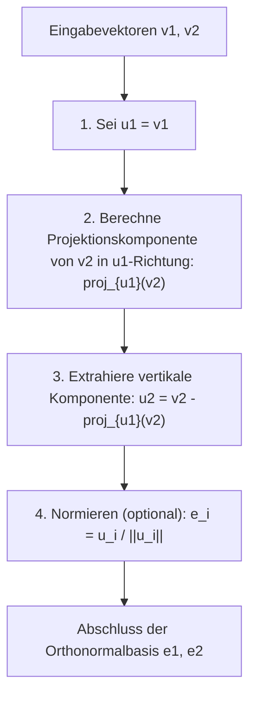
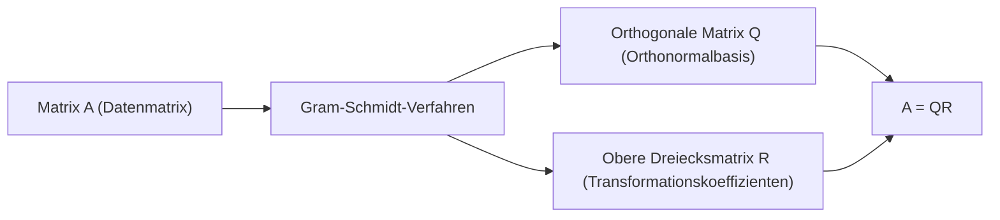

Beim Studium der linearen Algebra stoßen Sie unweigerlich auf das Konzept einer „Basis“, die einen Vektorraum aufspannt. Die Basisvektoren, die man aus realen Problemen oder Datensätzen erhält, zeigen jedoch oft in zufällige, unregelmäßige Richtungen, schneiden sich in schiefen Winkeln oder weisen drastisch unterschiedliche Längen auf. Solche „verzerrten“ Basen sind in der theoretischen Analyse und der numerischen Berechnung durch Computer extrem schwer zu handhaben.

Hier kommt der Star dieses Artikels, das **Gram-Schmidt-Orthogonalisierungsverfahren**, ins Spiel. Dieser Algorithmus ist eine äußerst leistungsstarke und vielseitige Methode, um eine Menge verzerrter Basisvektoren, die einen Raum aufspannen, systematisch in eine wunderschöne **Orthonormalbasis** umzuwandeln und zu formen, in der die Vektoren zueinander orthogonal (senkrecht) und von einheitlicher Länge (auf 1 normiert) sind.

In diesem Artikel werden wir das Gram-Schmidt-Orthogonalisierungsverfahren bis ins kleinste Detail erforschen, angefangen bei der grundlegenden geometrischen Intuition über eine strenge mathematische Formulierung bis hin zur Einführung eines verbesserten Algorithmus, der die „numerische Stabilität“ für Computerberechnungen berücksichtigt, und der Erweiterung auf Anwendungen in Funktionenräumen und der Verbindung zur QR-Zerlegung im maschinellen Lernen.

## 1. Einleitung: Warum ist „Orthogonalität“ wünschenswert?

Bevor wir in die spezifischen Schritte des Gram-Schmidt-Orthogonalisierungsverfahrens eintauchen, lassen Sie uns unsere Motivation klären: Warum wollen wir überhaupt, dass Vektoren orthogonal sind (sich senkrecht schneiden)?

In der Mathematik und den Ingenieurwissenschaften bringt eine orthogonalisierte Basis, insbesondere eine auf die Länge 1 normierte **Orthonormalbasis**, unzählige Vorteile mit sich.

1. **Massive Vereinfachung von Berechnungen** : Wenn Vektoren mithilfe einer Orthonormalbasis dargestellt werden, können Berechnungen für Skalarprodukte, Normen (Längen) und Abstände zwischen Vektoren vollständig mit einfacher Multiplikation und Addition der entsprechenden Komponenten abgeschlossen werden. Dies liegt daran, dass alle mühsamen Kreuzterme zu null werden.
2. **Extrem einfache Projektionen** : Wenn Sie einen Vektor zur Näherung auf einen bestimmten Unterraum projizieren möchten, berechnen Sie bei einer zueinander orthogonalen Basis einfach einzeln die eindimensionalen Projektionen auf jeden Basisvektor und addieren sie, um den korrekten Projektionsvektor zu erhalten.
3. **Verbesserte numerische Stabilität** : Bei der Durchführung von Gleitkommaarithmetik auf Computern haben Transformationen, die orthogonale Matrizen (Matrizen, deren Spaltenvektoren eine Orthonormalbasis bilden) verwenden, die wunderbare Eigenschaft (Isometrie), weniger anfällig für Informationsverlust oder Fehlerverstärkung zu sein. Dies ist entscheidend für den stabilen Betrieb von Algorithmen für maschinelles Lernen und Signalverarbeitung.

## 2. Geometrische Intuition: „Projektion“ und „Subtraktion“ im 2D-Raum

Die Kernidee des Gram-Schmidt-Orthogonalisierungsverfahrens lässt sich in einem Satz zusammenfassen: **„Subtrahieren und Entfernen der Richtungskomponenten bereits erstellter orthogonaler Vektoren vom neuen Vektor.“**

Nehmen wir zwei Vektoren $\mathbf{v}_1, \mathbf{v}_2$ in einer 2D-Ebene als das am einfachsten vorzustellende Beispiel. Angenommen, diese sind linear unabhängig (nicht parallel und auch keine Nullvektoren). Aus diesen beiden Vektoren erstellen wir neue, zueinander orthogonale Vektoren $\mathbf{u}_1, \mathbf{u}_2$.

1. **Den ersten Vektor übernehmen wie er ist** :
   Verwenden Sie zunächst als Startpunkt den ersten Vektor direkt als den ersten Vektor der neuen Basis.
   $$ \mathbf{u}_1 = \mathbf{v}_1 $$

2. **Die Richtungskomponente des ersten Vektors vom nächsten Vektor subtrahieren** :
   Als Nächstes möchten wir, dass der zweite Vektor $\mathbf{v}_2$ senkrecht zu $\mathbf{u}_1$ ist. Dazu müssen wir nur die „zu $\mathbf{u}_1$ parallele Komponente“ entfernen, die $\mathbf{v}_2$ besitzt.
   Diese „zu $\mathbf{u}_1$ parallele Komponente“ wird als die **Orthogonale Projektion** von $\mathbf{v}_2$ auf $\mathbf{u}_1$ bezeichnet.

   Der Projektionsvektor wird wie folgt berechnet:
   $$ \text{proj}_{\mathbf{u}_1}(\mathbf{v}_2) = \frac{\langle \mathbf{v}_2, \mathbf{u}_1 \rangle}{\langle \mathbf{u}_1, \mathbf{u}_1 \rangle} \mathbf{u}_1 $$
   Hierbei stellt $\langle \cdot, \cdot \rangle$ das Skalarprodukt der Vektoren dar.

   Durch Subtraktion dieser Projektionskomponente vom ursprünglichen $\mathbf{v}_2$ erhalten wir $\mathbf{u}_2$, der vollständig senkrecht zu $\mathbf{u}_1$ ist.
   $$ \mathbf{u}_2 = \mathbf{v}_2 - \text{proj}_{\mathbf{u}_1}(\mathbf{v}_2) $$

Das folgende Diagramm stellt diesen geometrischen Prozess des „Projizierens und Subtrahierens“ visuell dar.



## 3. Mathematische Formulierung: Erweiterung auf allgemeine Dimensionen

Wir verallgemeinern die vorherige Idee in 2D auf eine Menge von $k$ Vektoren in einem beliebigen $n$-dimensionalen Raum. Gegeben sei eine Menge linear unabhängiger Vektoren $\{ \mathbf{v}_1, \mathbf{v}_2, \dots, \mathbf{v}_k \}$ im Vektorraum $V$. Das Verfahren, um daraus eine Orthogonalbasis $\{ \mathbf{u}_1, \mathbf{u}_2, \dots, \mathbf{u}_k \}$ zu konstruieren (Klassisches Gram-Schmidt-Verfahren, CGS), ist wie folgt formuliert:

$$
\begin{aligned}
\mathbf{u}_1 &= \mathbf{v}_1 \\
\mathbf{u}_2 &= \mathbf{v}_2 - \text{proj}_{\mathbf{u}_1}(\mathbf{v}_2) \\
\mathbf{u}_3 &= \mathbf{v}_3 - \text{proj}_{\mathbf{u}_1}(\mathbf{v}_3) - \text{proj}_{\mathbf{u}_2}(\mathbf{v}_3) \\
&\vdots \\
\mathbf{u}_k &= \mathbf{v}_k - \sum_{j=1}^{k-1} \text{proj}_{\mathbf{u}_j}(\mathbf{v}_k)
\end{aligned}
$$

Mit anderen Worten, um den $i$-ten orthogonalen Vektor $\mathbf{u}_i$ zu erstellen, müssen Sie einfach **alle Projektionskomponenten auf alle bereits erzeugten orthogonalen Vektoren $\mathbf{u}_1, \dots, \mathbf{u}_{i-1}$** vom ursprünglichen Vektor $\mathbf{v}_i$ **subtrahieren**.

Indem man schließlich die Längen der erhaltenen orthogonalen Vektoren auf 1 vereinheitlicht (normiert), ist die Orthonormalbasis $\{ \mathbf{e}_1, \mathbf{e}_2, \dots, \mathbf{e}_k \}$ fertiggestellt.

$$ \mathbf{e}_i = \frac{\mathbf{u}_i}{\|\mathbf{u}_i\|} $$

## 4. Handberechnung an einem konkreten Beispiel (3D-Raum)

Um unser Verständnis zu vertiefen, verfolgen wir den Prozess der Orthogonalisierung von drei Vektoren im 3D-Raum per Hand.

Angenommen, uns sind die folgenden drei linear unabhängigen Vektoren als Ausgangszustand gegeben:

$$ \mathbf{v}_1 = \begin{pmatrix} 1 \\ 1 \\ 0 \end{pmatrix}, \quad \mathbf{v}_2 = \begin{pmatrix} 1 \\ 0 \\ 1 \end{pmatrix}, \quad \mathbf{v}_3 = \begin{pmatrix} 0 \\ 1 \\ 1 \end{pmatrix} $$

**Schritt 1:**
Verwenden Sie den ersten Vektor so wie er ist.
$$ \mathbf{u}_1 = \mathbf{v}_1 = \begin{pmatrix} 1 \\ 1 \\ 0 \end{pmatrix} $$

**Schritt 2:**
Subtrahieren Sie die Projektion auf $\mathbf{u}_1$ von $\mathbf{v}_2$.
Berechnung der Skalarprodukte: $\langle \mathbf{v}_2, \mathbf{u}_1 \rangle = 1 \times 1 + 0 \times 1 + 1 \times 0 = 1$ und $\langle \mathbf{u}_1, \mathbf{u}_1 \rangle = 1^2 + 1^2 + 0^2 = 2$.
$$ \mathbf{u}_2 = \mathbf{v}_2 - \frac{\langle \mathbf{v}_2, \mathbf{u}_1 \rangle}{\langle \mathbf{u}_1, \mathbf{u}_1 \rangle} \mathbf{u}_1 = \begin{pmatrix} 1 \\ 0 \\ 1 \end{pmatrix} - \frac{1}{2} \begin{pmatrix} 1 \\ 1 \\ 0 \end{pmatrix} = \begin{pmatrix} 1/2 \\ -1/2 \\ 1 \end{pmatrix} $$

Um die Handberechnung zu vereinfachen, multiplizieren Sie $\mathbf{u}_2$ mit einer Konstante (mal 2), um Brüche zu eliminieren. Dies hat keinen Einfluss auf die Orthogonalität.
$$ \mathbf{u}_2' = \begin{pmatrix} 1 \\ -1 \\ 2 \end{pmatrix} $$

**Schritt 3:**
Subtrahieren Sie die Richtungskomponenten von sowohl $\mathbf{u}_1$ als auch $\mathbf{u}_2'$ von $\mathbf{v}_3$.
$\langle \mathbf{v}_3, \mathbf{u}_1 \rangle = 0 \times 1 + 1 \times 1 + 1 \times 0 = 1$
$\langle \mathbf{v}_3, \mathbf{u}_2' \rangle = 0 \times 1 + 1 \times (-1) + 1 \times 2 = 1$
$\langle \mathbf{u}_2', \mathbf{u}_2' \rangle = 1^2 + (-1)^2 + 2^2 = 6$

$$ \mathbf{u}_3 = \mathbf{v}_3 - \frac{\langle \mathbf{v}_3, \mathbf{u}_1 \rangle}{\langle \mathbf{u}_1, \mathbf{u}_1 \rangle} \mathbf{u}_1 - \frac{\langle \mathbf{v}_3, \mathbf{u}_2' \rangle}{\langle \mathbf{u}_2', \mathbf{u}_2' \rangle} \mathbf{u}_2' $$
$$ \mathbf{u}_3 = \begin{pmatrix} 0 \\ 1 \\ 1 \end{pmatrix} - \frac{1}{2} \begin{pmatrix} 1 \\ 1 \\ 0 \end{pmatrix} - \frac{1}{6} \begin{pmatrix} 1 \\ -1 \\ 2 \end{pmatrix} = \begin{pmatrix} -2/3 \\ 2/3 \\ 2/3 \end{pmatrix} $$

Durch Multiplizieren mit einer Konstanten (mal $-3/2$) wird daraus auch ein schöner ganzzahliger Vektor.
$$ \mathbf{u}_3' = \begin{pmatrix} 1 \\ -1 \\ -1 \end{pmatrix} $$

Nun haben wir drei zueinander orthogonale Vektoren $\{ \mathbf{u}_1, \mathbf{u}_2', \mathbf{u}_3' \}$ erhalten. Das Dividieren dieser durch ihre jeweiligen Längen ergibt schließlich eine Orthonormalbasis.

## 5. Fallstricke bei numerischen Berechnungen: Rundungsfehler und das „Modifizierte Gram-Schmidt-Verfahren“

Obwohl theoretisch perfekt, stößt das Gram-Schmidt-Verfahren auf ein erhebliches Problem, wenn es als Computerprogramm implementiert wird: **„Rundungsfehler“** aufgrund der Gleitkommaarithmetik.

Bei der oben beschriebenen klassischen Gram-Schmidt-Methode (CGS) werden die Projektionskomponenten, die vom Vektor $\mathbf{v}_k$ subtrahiert werden sollen, alle unabhängig voneinander aus den inneren Produkten (Skalarprodukten) des **bereits berechneten $\mathbf{u}_j$ und des ursprünglichen $\mathbf{v}_k$** berechnet und am Ende alle auf einmal subtrahiert. Es ist jedoch bekannt, dass sich mit zunehmender Dimensionalität oder steigender Anzahl der Vektoren leichte Rundungsfehler ansammeln und die resultierende Vektormenge **ihre Orthogonalität verliert (was zu einem Orthogonalitätsverlust führt)**.

Um diesen mathematischen Fehler zu beheben, wurde das **Modifizierte Gram-Schmidt-Verfahren (MGS)** entwickelt.

Der Ansatz von MGS besteht nicht darin, Subtraktionen parallel durchzuführen, sondern **sequenziell zu aktualisieren**.
Wenn Sie einen neuen Vektor erstellen, subtrahieren Sie zunächst die $\mathbf{u}_1$-Komponente von $\mathbf{v}_k$, subtrahieren dann die $\mathbf{u}_2$-Komponente von **diesem Ergebnis (dem aktualisierten Vektor)** und subtrahieren die $\mathbf{u}_3$-Komponente von **diesem nachfolgenden Ergebnis** und so weiter. In jedem Schritt wird die nächste Projektion berechnet, während der Vektor aktualisiert wird.

Obwohl dies in Formeln ausgedrückt wie ein kleiner Unterschied aussieht, erzeugt diese „sequenzielle Aktualisierung“ den Effekt, dass der im vorherigen Schritt erzeugte orthogonale Fehler im nächsten Schritt korrigiert wird, was die numerische Stabilität drastisch verbessert. In modernen Bibliotheken für numerische Berechnungen wird immer dieses MGS (oder Householder-Transformationen) für den Orthogonalisierungsprozess verwendet.

## 6. Vergleich der Python-Implementierungen

Um den theoretischen Unterschied zu verdeutlichen, implementieren wir sowohl CGS als auch MGS unter Verwendung von Python und NumPy.

```python
import numpy as np

def classical_gram_schmidt(V):
    """
    Klassisches Gram-Schmidt (CGS)
    V: Matrix, deren Spaltenvektoren die Basis sind
    """
    n, k = V.shape
    U = np.zeros((n, k), dtype=float)
    
    for i in range(k):
        v = V[:, i]
        # Subtrahiere Projektionen in alle vorherigen u_j-Richtungen von v
        for j in range(i):
            u_j = U[:, j]
            # Berechne die Projektionskomponente
            projection = (np.dot(v, u_j) / np.dot(u_j, u_j)) * u_j
            v = v - projection
        U[:, i] = v
        
    # Normieren
    E = U / np.linalg.norm(U, axis=0)
    return E

def modified_gram_schmidt(V):
    """
    Modifiziertes Gram-Schmidt (MGS) - Numerisch stabil
    V: Matrix, deren Spaltenvektoren die Basis sind
    """
    n, k = V.shape
    E = np.zeros((n, k), dtype=float)
    # V kopieren, um das Ändern der Originalwerte zu vermeiden
    V_work = V.copy().astype(float) 
    
    for i in range(k):
        # Aktuellen Vektor normieren, damit er e_i wird
        v = V_work[:, i]
        E[:, i] = v / np.linalg.norm(v)
        
        # Die e_i-Komponente sequenziell von allen verbleibenden unbearbeiteten Vektoren subtrahieren (aktualisieren)
        for j in range(i + 1, k):
            projection = np.dot(V_work[:, j], E[:, i]) * E[:, i]
            V_work[:, j] = V_work[:, j] - projection
            
    return E
```

Wenn eine schlecht konditionierte (fast singuläre) Matrix eingegeben wird, weist die von CGS generierte Basis keine inneren Produkte von 0 auf, wodurch die Orthogonalität gebrochen wird, während MGS die Orthogonalität mit hoher Präzision beibehält. In der Praxis wird dringend empfohlen, immer MGS zu verwenden.

## 7. Erweiterte Anwendung 1: Anwendung auf orthogonale Polynome

Was das Gram-Schmidt-Verfahren so leistungsstark macht, ist, dass es nicht nur direkt auf endlichdimensionale geometrische Vektorräume, sondern auch auf **„Funktionenräume“** angewendet werden kann.

Betrachten wir zum Beispiel die Menge der Funktionen auf dem Intervall $[-1, 1]$. Wir definieren das Skalarprodukt zweier Funktionen $f(x), g(x)$ unter Verwendung eines Integrals wie folgt:
$$ \langle f, g \rangle = \int_{-1}^{1} f(x)g(x) dx $$

Wenden wir nun das Gram-Schmidt-Orthogonalisierungsverfahren auf die einfachste Polynombasis $\{ 1, x, x^2, x^3, \dots \}$ an.

* $\mathbf{u}_0(x) = 1$
* Berechnung von $\mathbf{u}_1(x) = x - \text{proj}_{\mathbf{u}_0}(x)$: Da $\langle x, 1 \rangle = \int_{-1}^{1} x dx = 0$, haben wir $\mathbf{u}_1(x) = x$.
* Die Berechnung von $\mathbf{u}_2(x) = x^2 - \text{proj}_{\mathbf{u}_0}(x^2) - \text{proj}_{\mathbf{u}_1}(x^2)$ ergibt $\mathbf{u}_2(x) = x^2 - \frac{1}{3}$.

Die Folge von orthogonalen Polynomen, die auf diese Weise erzeugt wird, nennt man **[Legendre](https://kenji.blog/de/p/legendre/)-Polynome**, und sie spielen eine äußerst wichtige Rolle im Elektromagnetismus und in der Quantenmechanik in der Physik sowie in der numerischen Integration (Gauß-Quadratur). Es ist ein wunderbares Beispiel dafür, wie ein algebraischer Algorithmus auf natürliche Weise Beschreibungen tiefer physikalischer Gesetze ableitet.

## 8. Erweiterte Anwendung 2: QR-Zerlegung und Data Science

Die größte Anwendung des Gram-Schmidt-Verfahrens in den Datenwissenschaften und im maschinellen Lernen ist zweifellos die **QR-Zerlegung**.

Die QR-Zerlegung ist eine Methode, um eine beliebige Matrix $A$ in das Produkt einer orthogonalen Matrix $Q$ und einer oberen Dreiecksmatrix $R$ zu zerlegen.
$$ A = QR $$

Diese Zerlegungsoperation selbst entspricht perfekt dem Prozess der Anwendung des Gram-Schmidt-Orthogonalisierungsverfahrens auf jeden Spaltenvektor der Matrix $A$.

* **$Q$-Matrix**: Eine Matrix, die durch Ausrichtung der Orthonormalbasis $\{ \mathbf{e}_1, \dots, \mathbf{e}_k \}$ gebildet wird, die durch das Gram-Schmidt-Verfahren als Spaltenvektoren erzeugt wurde. (Sie erfüllt $Q^T Q = I$)
* **$R$-Matrix**: Eine obere Dreiecksmatrix, deren Komponenten die „Koeffizienten (Skalarprodukte)“ sind, wenn der ursprüngliche Vektor $\mathbf{v}$ als Linearkombination der neuen Basis $\mathbf{e}$ in jedem Orthogonalisierungsschritt ausgedrückt wird.



Im Kontext des maschinellen Lernens wird die QR-Zerlegung genutzt, um die Berechnungen der „[Methode der kleinsten Quadrate](https://kenji.blog/de/p/method-of-least-squares/)“ stabil und schnell durchzuführen, um optimale Parameter in der multiplen Regressionsanalyse zu finden. Der Ansatz, die Normalgleichung ($A^T A \mathbf{x} = A^T \mathbf{b}$) direkt zu lösen, wird in der Praxis üblicherweise vermieden, da sich die Konditionszahl der Matrix $A^T A$ leicht verschlechtert, was sie extrem anfällig für numerische Fehler macht. Stattdessen ist es gängige Praxis, sie in $A=QR$ zu zerlegen und $R \mathbf{x} = Q^T \mathbf{b}$ durch Rückwärtseinsetzen zu lösen.

## 9. Fazit: Die Schönheit eines neu ausgerichteten Raumes

In diesem Artikel haben wir das Gram-Schmidt-Orthogonalisierungsverfahren ausführlich erklärt, von seiner intuitiven Bedeutung über die mathematische Berechnung, Überlegungen zur numerischen Stabilität bis hin zu Anwendungen auf Funktionenräume und maschinelles Lernen.

Ich hoffe, Sie haben erkannt, wie mächtig und weitreichend die Auswirkungen der einfachen und klaren Idee sind, „verzerrte Koordinatenachsen in ordentliche, zueinander senkrechte Achsen neu auszurichten“. Es ist schön als mathematische Theorie und unverzichtbar als moderner praktischer Datenanalyse-Algorithmus, der von Computern ausgeführt wird. Man kann sagen, dass es einer der Höhepunkte ist, um die Tiefe der linearen Algebra zu schätzen.

Versuchen Sie unbedingt, tatsächliche Programmcodes auszuführen oder die Orthogonalisierung anderer Polynome von Hand durchzuführen, um die mathematische Freude an der Verfeinerung des Raumes physisch zu erleben.

