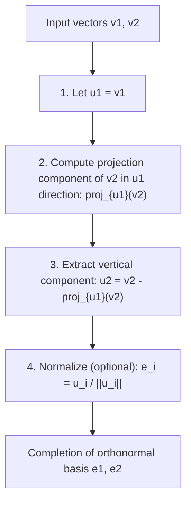
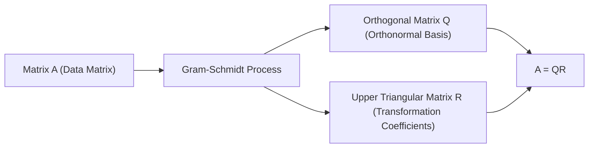

While studying linear algebra, you will inevitably encounter the concept of a "Basis" that constructs a vector space. However, basis vectors obtained from real-world problems or datasets often point in random, irregular directions, intersecting at skewed angles or having vastly different lengths. Such "distorted" bases are extremely difficult to handle in theoretical analysis and numerical computation by computers.

This is where the star of this article, the **Gram-Schmidt orthogonalization process**, comes into play. This algorithm is an extremely powerful and versatile method for systematically transforming and shaping a set of distorted basis vectors spanning a space into a beautiful **Orthonormal Basis**, where vectors are mutually orthogonal (perpendicular) and uniform in length (normalized to 1).

In this article, we will thoroughly explore the Gram-Schmidt orthogonalization process in massive detail, starting from basic geometric intuition, progressing to rigorous mathematical formulation, introducing an improved algorithm considering "numerical stability" for computer calculations, and extending to applications in function spaces and its connection to QR decomposition in machine learning.

## 1. Introduction: Why is "Orthogonality" Desirable?

Before diving into the specific steps of the Gram-Schmidt orthogonalization process, let's clarify our motivation: why do we want to make vectors orthogonal (intersect perpendicularly) in the first place?

In mathematics and engineering, an orthogonalized basis, especially an **orthonormal basis** normalized to a length of 1, brings countless advantages.

1. **Massive Simplification of Calculations**: When vectors are represented using an orthonormal basis, calculations for dot products, norms (lengths), and distances between vectors can be completely finished with simple multiplication and addition of corresponding components. This is because all tedious cross terms become zero.
2. **Extremely Simple Projections**: When you want to project a vector onto a specific subspace for approximation, if the basis is mutually orthogonal, you simply calculate the one-dimensional projections onto each basis vector individually and add them together to obtain the correct projection vector.
3. **Improved Numerical Stability**: When performing floating-point arithmetic on computers, transformations using orthogonal matrices (matrices whose column vectors form an orthonormal basis) have the wonderful property (isometry) of being less prone to information loss or error amplification. This is critically important for stable operation in machine learning and signal processing algorithms.

## 2. Geometric Intuition: "Projection" and "Subtraction" in 2D Space

The core idea of the Gram-Schmidt orthogonalization process can be summed up in one phrase: **"subtracting and stripping away the directional components of already-created orthogonal vectors from the new vector."**

Let's take two vectors $\mathbf{v}_1, \mathbf{v}_2$ on a 2D plane as the easiest example to imagine. Assume these are linearly independent (not parallel, and neither is a zero vector). From these two vectors, we will create new mutually orthogonal vectors $\mathbf{u}_1, \mathbf{u}_2$.

1. **Adopt the first vector as is**:
   First, as a starting point, use the first vector directly as the first vector of the new basis.
   $$ \mathbf{u}_1 = \mathbf{v}_1 $$

2. **Subtract the directional component of the first vector from the next vector**:
   Next, we want to make the second vector $\mathbf{v}_2$ perpendicular to $\mathbf{u}_1$. To do this, we just need to remove the "component parallel to $\mathbf{u}_1$" that $\mathbf{v}_2$ possesses.
   This "component parallel to $\mathbf{u}_1$" is called the **Orthogonal Projection** of $\mathbf{v}_2$ onto $\mathbf{u}_1$.

   The projection vector is calculated as follows:
   $$ \text{proj}_{\mathbf{u}_1}(\mathbf{v}_2) = \frac{\langle \mathbf{v}_2, \mathbf{u}_1 \rangle}{\langle \mathbf{u}_1, \mathbf{u}_1 \rangle} \mathbf{u}_1 $$
   Here, $\langle \cdot, \cdot \rangle$ represents the dot product of the vectors.

   By subtracting this projection component from the original $\mathbf{v}_2$, we obtain $\mathbf{u}_2$, which is completely perpendicular to $\mathbf{u}_1$.
   $$ \mathbf{u}_2 = \mathbf{v}_2 - \text{proj}_{\mathbf{u}_1}(\mathbf{v}_2) $$

The diagram below visually represents this geometric process of "projecting and subtracting."



## 3. Mathematical Formulation: Extension to General Dimensions

We generalize the previous idea in 2D to a set of $k$ vectors in an arbitrary $n$-dimensional space. Given a set of linearly independent vectors $\{ \mathbf{v}_1, \mathbf{v}_2, \dots, \mathbf{v}_k \}$ in vector space $V$. The procedure to construct an orthogonal basis $\{ \mathbf{u}_1, \mathbf{u}_2, \dots, \mathbf{u}_k \}$ from these (Classical Gram-Schmidt, CGS) is formulated as follows:

$$
\begin{aligned}
\mathbf{u}_1 &= \mathbf{v}_1 \\
\mathbf{u}_2 &= \mathbf{v}_2 - \text{proj}_{\mathbf{u}_1}(\mathbf{v}_2) \\
\mathbf{u}_3 &= \mathbf{v}_3 - \text{proj}_{\mathbf{u}_1}(\mathbf{v}_3) - \text{proj}_{\mathbf{u}_2}(\mathbf{v}_3) \\
&\vdots \\
\mathbf{u}_k &= \mathbf{v}_k - \sum_{j=1}^{k-1} \text{proj}_{\mathbf{u}_j}(\mathbf{v}_k)
\end{aligned}
$$

In other words, to create the $i$-th orthogonal vector $\mathbf{u}_i$, you simply need to **subtract all the projection components onto all already-generated orthogonal vectors $\mathbf{u}_1, \dots, \mathbf{u}_{i-1}$** from the original vector $\mathbf{v}_i$.

Finally, by unifying the lengths of the obtained orthogonal vectors to 1 (normalizing), the orthonormal basis $\{ \mathbf{e}_1, \mathbf{e}_2, \dots, \mathbf{e}_k \}$ is completed.

$$ \mathbf{e}_i = \frac{\mathbf{u}_i}{\|\mathbf{u}_i\|} $$

## 4. Hand Calculation with a Concrete Example (3D Space)

To deepen our understanding, let's trace the process of orthogonalizing three vectors in 3D space by hand.

Suppose we are given the following three linearly independent vectors as an initial state:

$$ \mathbf{v}_1 = \begin{pmatrix} 1 \\ 1 \\ 0 \end{pmatrix}, \quad \mathbf{v}_2 = \begin{pmatrix} 1 \\ 0 \\ 1 \end{pmatrix}, \quad \mathbf{v}_3 = \begin{pmatrix} 0 \\ 1 \\ 1 \end{pmatrix} $$

**Step 1:**
Use the first vector as is.
$$ \mathbf{u}_1 = \mathbf{v}_1 = \begin{pmatrix} 1 \\ 1 \\ 0 \end{pmatrix} $$

**Step 2:**
Subtract the projection onto $\mathbf{u}_1$ from $\mathbf{v}_2$.
Calculating the dot products: $\langle \mathbf{v}_2, \mathbf{u}_1 \rangle = 1 \times 1 + 0 \times 1 + 1 \times 0 = 1$, and $\langle \mathbf{u}_1, \mathbf{u}_1 \rangle = 1^2 + 1^2 + 0^2 = 2$.
$$ \mathbf{u}_2 = \mathbf{v}_2 - \frac{\langle \mathbf{v}_2, \mathbf{u}_1 \rangle}{\langle \mathbf{u}_1, \mathbf{u}_1 \rangle} \mathbf{u}_1 = \begin{pmatrix} 1 \\ 0 \\ 1 \end{pmatrix} - \frac{1}{2} \begin{pmatrix} 1 \\ 1 \\ 0 \end{pmatrix} = \begin{pmatrix} 1/2 \\ -1/2 \\ 1 \end{pmatrix} $$

To simplify hand calculation, multiply $\mathbf{u}_2$ by a constant (times 2) to eliminate fractions. This does not affect orthogonality.
$$ \mathbf{u}_2' = \begin{pmatrix} 1 \\ -1 \\ 2 \end{pmatrix} $$

**Step 3:**
Subtract the directional components of both $\mathbf{u}_1$ and $\mathbf{u}_2'$ from $\mathbf{v}_3$.
$\langle \mathbf{v}_3, \mathbf{u}_1 \rangle = 0 \times 1 + 1 \times 1 + 1 \times 0 = 1$
$\langle \mathbf{v}_3, \mathbf{u}_2' \rangle = 0 \times 1 + 1 \times (-1) + 1 \times 2 = 1$
$\langle \mathbf{u}_2', \mathbf{u}_2' \rangle = 1^2 + (-1)^2 + 2^2 = 6$

$$ \mathbf{u}_3 = \mathbf{v}_3 - \frac{\langle \mathbf{v}_3, \mathbf{u}_1 \rangle}{\langle \mathbf{u}_1, \mathbf{u}_1 \rangle} \mathbf{u}_1 - \frac{\langle \mathbf{v}_3, \mathbf{u}_2' \rangle}{\langle \mathbf{u}_2', \mathbf{u}_2' \rangle} \mathbf{u}_2' $$
$$ \mathbf{u}_3 = \begin{pmatrix} 0 \\ 1 \\ 1 \end{pmatrix} - \frac{1}{2} \begin{pmatrix} 1 \\ 1 \\ 0 \end{pmatrix} - \frac{1}{6} \begin{pmatrix} 1 \\ -1 \\ 2 \end{pmatrix} = \begin{pmatrix} -2/3 \\ 2/3 \\ 2/3 \end{pmatrix} $$

Multiplying this by a constant (times $-3/2$) also makes it a neat integer vector.
$$ \mathbf{u}_3' = \begin{pmatrix} 1 \\ -1 \\ -1 \end{pmatrix} $$

Now, we have obtained three mutually orthogonal vectors $\{ \mathbf{u}_1, \mathbf{u}_2', \mathbf{u}_3' \}$. Finally, dividing these by their respective lengths yields an orthonormal basis.

## 5. Pitfalls in Numerical Computation: Rounding Errors and the "Modified Gram-Schmidt Process"

While theoretically perfect, the Gram-Schmidt process encounters a significant problem when implemented as a computer program: **"Rounding Error"** due to floating-point arithmetic.

In the Classical Gram-Schmidt (CGS) method described above, the projection components to be subtracted from vector $\mathbf{v}_k$ are all calculated independently from the inner products of the **already calculated $\mathbf{u}_j$ and the original $\mathbf{v}_k$**, and subtracted all at once at the end. However, it is known that as the dimensionality increases or the number of vectors grows, slight rounding errors accumulate, and the resulting vector set **loses its orthogonality (causing orthogonality loss)**.

To overcome this mathematical flaw, the **Modified Gram-Schmidt (MGS)** process was devised.

The approach of MGS is not to perform subtractions in parallel, but to **update sequentially**.
Specifically, when creating a new vector, first subtract the $\mathbf{u}_1$ component from $\mathbf{v}_k$, then subtract the $\mathbf{u}_2$ component from **that result (the updated vector)**, and further subtract the $\mathbf{u}_3$ component from **that subsequent result**, and so on. In each step, the next projection is calculated while updating the vector.

Although it looks like only a slight difference when expressed in formulas, this "sequential updating" creates an effect of correcting the orthogonal error generated in the previous step during the next step, dramatically improving numerical stability. In modern numerical computation libraries, this MGS (or Householder transformations) is always used for the orthogonalization process.

## 6. Comparison of Python Implementations

To clarify the theoretical difference, let's implement both CGS and MGS using Python and NumPy.

```python
import numpy as np

def classical_gram_schmidt(V):
    """
    Classical Gram-Schmidt (CGS)
    V: Matrix where column vectors are the basis
    """
    n, k = V.shape
    U = np.zeros((n, k), dtype=float)
    
    for i in range(k):
        v = V[:, i]
        # Subtract projections in all previous u_j directions from v
        for j in range(i):
            u_j = U[:, j]
            # Calculate projection component
            projection = (np.dot(v, u_j) / np.dot(u_j, u_j)) * u_j
            v = v - projection
        U[:, i] = v
        
    # Normalize
    E = U / np.linalg.norm(U, axis=0)
    return E

def modified_gram_schmidt(V):
    """
    Modified Gram-Schmidt (MGS) - Numerically stable
    V: Matrix where column vectors are the basis
    """
    n, k = V.shape
    E = np.zeros((n, k), dtype=float)
    # Copy V to avoid modifying original values
    V_work = V.copy().astype(float) 
    
    for i in range(k):
        # Normalize the current vector to be e_i
        v = V_work[:, i]
        E[:, i] = v / np.linalg.norm(v)
        
        # Sequentially subtract (update) the e_i component from all remaining unprocessed vectors
        for j in range(i + 1, k):
            projection = np.dot(V_work[:, j], E[:, i]) * E[:, i]
            V_work[:, j] = V_work[:, j] - projection
            
    return E
```

When an ill-conditioned matrix (close to being singular) is input, the basis generated by CGS fails to have inner products of 0, breaking orthogonality, whereas MGS maintains orthogonality with high precision. In practice, it is highly recommended to always use MGS.

## 7. Advanced Application 1: Application to Orthogonal Polynomials

What makes the Gram-Schmidt process so powerful is that it can be applied directly not only to finite-dimensional geometric vector spaces but also to **"function spaces"**.

For example, consider the set of functions on the interval $[-1, 1]$. We define the inner product of two functions $f(x), g(x)$ using an integral as follows:
$$ \langle f, g \rangle = \int_{-1}^{1} f(x)g(x) dx $$

Now, let's apply the Gram-Schmidt orthogonalization process to the simplest polynomial basis $\{ 1, x, x^2, x^3, \dots \}$.

* $\mathbf{u}_0(x) = 1$
* Calculating $\mathbf{u}_1(x) = x - \text{proj}_{\mathbf{u}_0}(x)$, since $\langle x, 1 \rangle = \int_{-1}^{1} x dx = 0$, we have $\mathbf{u}_1(x) = x$.
* Calculating $\mathbf{u}_2(x) = x^2 - \text{proj}_{\mathbf{u}_0}(x^2) - \text{proj}_{\mathbf{u}_1}(x^2)$ gives $\mathbf{u}_2(x) = x^2 - \frac{1}{3}$.

The sequence of orthogonal polynomials generated in this way is called **[Legendre](https://kenji.blog/en/p/legendre/) polynomials**, and they play extremely important roles in electromagnetism and quantum mechanics in physics, as well as in numerical integration (Gaussian quadrature). It is a beautiful example where an algebraic algorithm naturally derives descriptions of deep physical laws.

## 8. Advanced Application 2: QR Decomposition and Data Science

The greatest application of the Gram-Schmidt process in data science and machine learning is undoubtedly **QR Decomposition**.

QR decomposition is a method of decomposing an arbitrary matrix $A$ into the product of an orthogonal matrix $Q$ and an upper triangular matrix $R$.
$$ A = QR $$

This decomposition operation itself perfectly matches the process of applying the Gram-Schmidt orthogonalization process to each column vector of the matrix $A$.

* **Matrix $Q$**: A matrix formed by aligning the orthonormal basis $\{ \mathbf{e}_1, \dots, \mathbf{e}_k \}$ generated by the Gram-Schmidt process as column vectors. (It satisfies $Q^T Q = I$)
* **Matrix $R$**: An upper triangular matrix whose components are the "coefficients (inner products)" when expressing the original vector $\mathbf{v}$ as a linear combination of the new basis $\mathbf{e}$ at each orthogonalization step.



In the context of machine learning, QR decomposition is utilized to perform the computations of the "least squares method" stably and rapidly to find optimal parameters in multiple regression analysis. The approach of solving the normal equation ($A^T A \mathbf{x} = A^T \mathbf{b}$) directly is standardly avoided in practice because the condition number of the matrix $A^T A$ easily worsens, making it extremely vulnerable to numerical errors. Instead, the standard practice is to decompose it as $A=QR$ and solve $R \mathbf{x} = Q^T \mathbf{b}$ via back substitution.

## 9. Conclusion: The Beauty of a Realigned Space

In this article, we broadly explained the Gram-Schmidt orthogonalization process, from its intuitive meaning to mathematical calculation, considerations for numerical stability, and applications to function spaces and machine learning.

I hope you have realized how powerful and widespread the impact of the simple and clear idea of "realigning distorted coordinate axes into neat, mutually perpendicular axes" is. It is beautiful as a mathematical theory, and indispensable as a modern practical data analysis algorithm performed by computers. It can be said to be one of the pinnacles for appreciating the depth of linear algebra.

By all means, try executing actual program codes or attempting orthogonalization of other polynomials by hand to physically experience the mathematical joy of space being refined.

