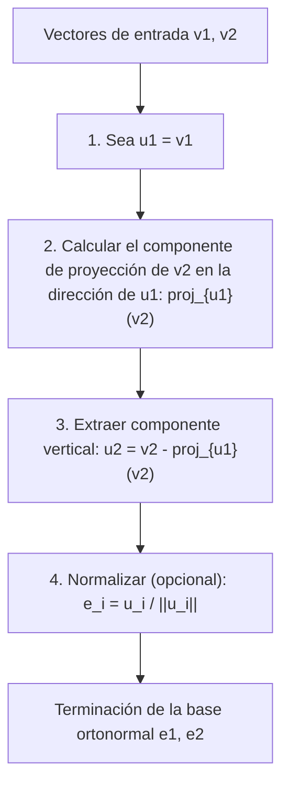
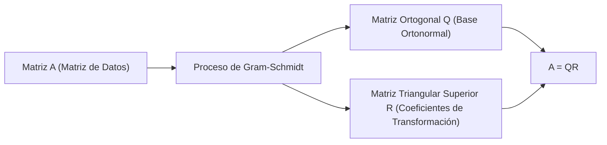

Al estudiar álgebra lineal, inevitablemente encontrarás el concepto de "Base" que construye un espacio vectorial. Sin embargo, los vectores base obtenidos de problemas o conjuntos de datos del mundo real a menudo apuntan en direcciones aleatorias e irregulares, intersectándose en ángulos sesgados o teniendo longitudes drásticamente diferentes. Tales bases "distorsionadas" son extremadamente difíciles de manejar en el análisis teórico y el cálculo numérico por computadoras.

Aquí es donde entra en juego la estrella de este artículo, el **proceso de ortogonalización de Gram-Schmidt**. Este algoritmo es un método extremadamente poderoso y versátil para transformar y dar forma sistemáticamente a un conjunto de vectores base distorsionados que abarcan un espacio en una hermosa **Base Ortonormal**, donde los vectores son mutuamente ortogonales (perpendiculares) y de longitud uniforme (normalizados a 1).

En este artículo, exploraremos a fondo el proceso de ortogonalización de Gram-Schmidt con gran detalle, comenzando desde la intuición geométrica básica, progresando hacia una formulación matemática rigurosa, introduciendo un algoritmo mejorado que considera la "estabilidad numérica" para cálculos en computadora y extendiéndonos a aplicaciones en espacios de funciones y su conexión con la descomposición QR en el aprendizaje automático.

## 1. Introducción: ¿Por qué es deseable la "Ortogonalidad"?

Antes de sumergirnos en los pasos específicos del proceso de ortogonalización de Gram-Schmidt, aclaremos nuestra motivación: ¿por qué queremos que los vectores sean ortogonales (que se crucen perpendicularmente) en primer lugar?

En matemáticas e ingeniería, una base ortogonalizada, especialmente una **base ortonormal** normalizada a una longitud de 1, trae innumerables ventajas.

1. **Simplificación masiva de cálculos** : Cuando los vectores se representan usando una base ortonormal, los cálculos para productos punto, normas (longitudes) y distancias entre vectores se pueden terminar completamente con una simple multiplicación y suma de los componentes correspondientes. Esto se debe a que todos los tediosos términos cruzados se vuelven cero.
2. **Proyecciones extremadamente simples** : Cuando se desea proyectar un vector en un subespacio específico para una aproximación, si la base es mutuamente ortogonal, simplemente se calculan las proyecciones unidimensionales en cada vector base individualmente y se suman para obtener el vector de proyección correcto.
3. **Estabilidad numérica mejorada** : Al realizar aritmética de punto flotante en computadoras, las transformaciones que usan matrices ortogonales (matrices cuyos vectores columna forman una base ortonormal) tienen la maravillosa propiedad (isometría) de ser menos propensas a la pérdida de información o amplificación de errores. Esto es críticamente importante para un funcionamiento estable en algoritmos de aprendizaje automático y procesamiento de señales.

## 2. Intuición Geométrica: "Proyección" y "Resta" en el espacio 2D

La idea central del proceso de ortogonalización de Gram-Schmidt se puede resumir en una frase: **"restar y quitar los componentes direccionales de los vectores ortogonales ya creados del nuevo vector"**.

Tomemos dos vectores $\mathbf{v}_1, \mathbf{v}_2$ en un plano 2D como el ejemplo más fácil de imaginar. Suponga que son linealmente independientes (no paralelos y ninguno es un vector cero). A partir de estos dos vectores, crearemos nuevos vectores mutuamente ortogonales $\mathbf{u}_1, \mathbf{u}_2$.

1. **Adoptar el primer vector tal cual** :
   Primero, como punto de partida, use el primer vector directamente como el primer vector de la nueva base.
   $$ \mathbf{u}_1 = \mathbf{v}_1 $$

2. **Restar el componente direccional del primer vector del siguiente vector** :
   A continuación, queremos que el segundo vector $\mathbf{v}_2$ sea perpendicular a $\mathbf{u}_1$. Para ello, solo necesitamos eliminar el "componente paralelo a $\mathbf{u}_1$" que posee $\mathbf{v}_2$.
   Este "componente paralelo a $\mathbf{u}_1$" se llama la **Proyección Ortogonal** de $\mathbf{v}_2$ sobre $\mathbf{u}_1$.

   El vector de proyección se calcula de la siguiente manera:
   $$ \text{proj}_{\mathbf{u}_1}(\mathbf{v}_2) = \frac{\langle \mathbf{v}_2, \mathbf{u}_1 \rangle}{\langle \mathbf{u}_1, \mathbf{u}_1 \rangle} \mathbf{u}_1 $$
   Aquí, $\langle \cdot, \cdot \rangle$ representa el producto punto de los vectores.

   Restando este componente de proyección de la $\mathbf{v}_2$ original, obtenemos $\mathbf{u}_2$, que es completamente perpendicular a $\mathbf{u}_1$.
   $$ \mathbf{u}_2 = \mathbf{v}_2 - \text{proj}_{\mathbf{u}_1}(\mathbf{v}_2) $$

El siguiente diagrama representa visualmente este proceso geométrico de "proyectar y restar".



## 3. Formulación Matemática: Extensión a dimensiones generales

Generalizamos la idea anterior en 2D a un conjunto de $k$ vectores en un espacio arbitrario de $n$ dimensiones. Dado un conjunto de vectores linealmente independientes $\{ \mathbf{v}_1, \mathbf{v}_2, \dots, \mathbf{v}_k \}$ en el espacio vectorial $V$. El procedimiento para construir una base ortogonal $\{ \mathbf{u}_1, \mathbf{u}_2, \dots, \mathbf{u}_k \}$ a partir de estos (Gram-Schmidt Clásico, CGS) se formula de la siguiente manera:

$$
\begin{aligned}
\mathbf{u}_1 &= \mathbf{v}_1 \\
\mathbf{u}_2 &= \mathbf{v}_2 - \text{proj}_{\mathbf{u}_1}(\mathbf{v}_2) \\
\mathbf{u}_3 &= \mathbf{v}_3 - \text{proj}_{\mathbf{u}_1}(\mathbf{v}_3) - \text{proj}_{\mathbf{u}_2}(\mathbf{v}_3) \\
&\vdots \\
\mathbf{u}_k &= \mathbf{v}_k - \sum_{j=1}^{k-1} \text{proj}_{\mathbf{u}_j}(\mathbf{v}_k)
\end{aligned}
$$

En otras palabras, para crear el $i$-ésimo vector ortogonal $\mathbf{u}_i$, simplemente necesita **restar todos los componentes de proyección en todos los vectores ortogonales ya generados $\mathbf{u}_1, \dots, \mathbf{u}_{i-1}$** del vector original $\mathbf{v}_i$.

Finalmente, unificando las longitudes de los vectores ortogonales obtenidos a 1 (normalizando), se completa la base ortonormal $\{ \mathbf{e}_1, \mathbf{e}_2, \dots, \mathbf{e}_k \}$.

$$ \mathbf{e}_i = \frac{\mathbf{u}_i}{\|\mathbf{u}_i\|} $$

## 4. Cálculo a mano con un ejemplo concreto (Espacio 3D)

Para profundizar nuestra comprensión, rastreemos el proceso de ortogonalización de tres vectores en un espacio 3D a mano.

Supongamos que nos dan los siguientes tres vectores linealmente independientes como estado inicial:

$$ \mathbf{v}_1 = \begin{pmatrix} 1 \\ 1 \\ 0 \end{pmatrix}, \quad \mathbf{v}_2 = \begin{pmatrix} 1 \\ 0 \\ 1 \end{pmatrix}, \quad \mathbf{v}_3 = \begin{pmatrix} 0 \\ 1 \\ 1 \end{pmatrix} $$

**Paso 1:**
Use el primer vector tal cual.
$$ \mathbf{u}_1 = \mathbf{v}_1 = \begin{pmatrix} 1 \\ 1 \\ 0 \end{pmatrix} $$

**Paso 2:**
Reste la proyección sobre $\mathbf{u}_1$ de $\mathbf{v}_2$.
Calculando los productos punto: $\langle \mathbf{v}_2, \mathbf{u}_1 \rangle = 1 \times 1 + 0 \times 1 + 1 \times 0 = 1$, y $\langle \mathbf{u}_1, \mathbf{u}_1 \rangle = 1^2 + 1^2 + 0^2 = 2$.
$$ \mathbf{u}_2 = \mathbf{v}_2 - \frac{\langle \mathbf{v}_2, \mathbf{u}_1 \rangle}{\langle \mathbf{u}_1, \mathbf{u}_1 \rangle} \mathbf{u}_1 = \begin{pmatrix} 1 \\ 0 \\ 1 \end{pmatrix} - \frac{1}{2} \begin{pmatrix} 1 \\ 1 \\ 0 \end{pmatrix} = \begin{pmatrix} 1/2 \\ -1/2 \\ 1 \end{pmatrix} $$

Para simplificar el cálculo manual, multiplique $\mathbf{u}_2$ por una constante (por 2) para eliminar las fracciones. Esto no afecta la ortogonalidad.
$$ \mathbf{u}_2' = \begin{pmatrix} 1 \\ -1 \\ 2 \end{pmatrix} $$

**Paso 3:**
Reste los componentes direccionales tanto de $\mathbf{u}_1$ como de $\mathbf{u}_2'$ de $\mathbf{v}_3$.
$\langle \mathbf{v}_3, \mathbf{u}_1 \rangle = 0 \times 1 + 1 \times 1 + 1 \times 0 = 1$
$\langle \mathbf{v}_3, \mathbf{u}_2' \rangle = 0 \times 1 + 1 \times (-1) + 1 \times 2 = 1$
$\langle \mathbf{u}_2', \mathbf{u}_2' \rangle = 1^2 + (-1)^2 + 2^2 = 6$

$$ \mathbf{u}_3 = \mathbf{v}_3 - \frac{\langle \mathbf{v}_3, \mathbf{u}_1 \rangle}{\langle \mathbf{u}_1, \mathbf{u}_1 \rangle} \mathbf{u}_1 - \frac{\langle \mathbf{v}_3, \mathbf{u}_2' \rangle}{\langle \mathbf{u}_2', \mathbf{u}_2' \rangle} \mathbf{u}_2' $$
$$ \mathbf{u}_3 = \begin{pmatrix} 0 \\ 1 \\ 1 \end{pmatrix} - \frac{1}{2} \begin{pmatrix} 1 \\ 1 \\ 0 \end{pmatrix} - \frac{1}{6} \begin{pmatrix} 1 \\ -1 \\ 2 \end{pmatrix} = \begin{pmatrix} -2/3 \\ 2/3 \\ 2/3 \end{pmatrix} $$

Multiplicando esto por una constante (por $-3/2$) también lo convierte en un vector entero ordenado.
$$ \mathbf{u}_3' = \begin{pmatrix} 1 \\ -1 \\ -1 \end{pmatrix} $$

Ahora, hemos obtenido tres vectores mutuamente ortogonales $\{ \mathbf{u}_1, \mathbf{u}_2', \mathbf{u}_3' \}$. Finalmente, dividir estos por sus respectivas longitudes da una base ortonormal.

## 5. Trampas en el Cálculo Numérico: Errores de redondeo y el "Proceso de Gram-Schmidt Modificado"

Si bien es teóricamente perfecto, el proceso de Gram-Schmidt encuentra un problema significativo cuando se implementa como un programa de computadora: **"Error de Redondeo"** debido a la aritmética de punto flotante.

En el método Clásico de Gram-Schmidt (CGS) descrito anteriormente, los componentes de proyección a restar del vector $\mathbf{v}_k$ se calculan todos independientemente a partir de los productos internos de la **$\mathbf{u}_j$ ya calculada y la original $\mathbf{v}_k$**, y se restan todos a la vez al final. Sin embargo, se sabe que a medida que aumenta la dimensionalidad o crece el número de vectores, los ligeros errores de redondeo se acumulan y el conjunto de vectores resultante **pierde su ortogonalidad (causando pérdida de ortogonalidad)**.

Para superar esta falla matemática, se ideó el **Proceso de Gram-Schmidt Modificado (MGS)**.

El enfoque de MGS no es realizar restas en paralelo, sino **actualizar secuencialmente**.
Específicamente, al crear un vector nuevo, primero reste el componente $\mathbf{u}_1$ de $\mathbf{v}_k$, luego reste el componente $\mathbf{u}_2$ de **ese resultado (el vector actualizado)**, y reste aún más el componente $\mathbf{u}_3$ de **ese resultado posterior**, y así sucesivamente. En cada paso, se calcula la siguiente proyección mientras se actualiza el vector.

Aunque parece una pequeña diferencia cuando se expresa en fórmulas, esta "actualización secuencial" crea el efecto de corregir el error ortogonal generado en el paso anterior durante el paso siguiente, mejorando drásticamente la estabilidad numérica. En las bibliotecas de cálculo numérico modernas, esta MGS (o las transformaciones de Householder) siempre se usa para el proceso de ortogonalización.

## 6. Comparación de Implementaciones en Python

Para aclarar la diferencia teórica, implementemos tanto CGS como MGS usando Python y NumPy.

```python
import numpy as np

def classical_gram_schmidt(V):
    """
    Gram-Schmidt Clásico (CGS)
    V: Matriz donde los vectores columna son la base
    """
    n, k = V.shape
    U = np.zeros((n, k), dtype=float)
    
    for i in range(k):
        v = V[:, i]
        # Restar proyecciones en todas las direcciones u_j anteriores de v
        for j in range(i):
            u_j = U[:, j]
            # Calcular el componente de proyección
            projection = (np.dot(v, u_j) / np.dot(u_j, u_j)) * u_j
            v = v - projection
        U[:, i] = v
        
    # Normalizar
    E = U / np.linalg.norm(U, axis=0)
    return E

def modified_gram_schmidt(V):
    """
    Gram-Schmidt Modificado (MGS) - Numéricamente estable
    V: Matriz donde los vectores columna son la base
    """
    n, k = V.shape
    E = np.zeros((n, k), dtype=float)
    # Copiar V para evitar modificar los valores originales
    V_work = V.copy().astype(float) 
    
    for i in range(k):
        # Normalizar el vector actual para que sea e_i
        v = V_work[:, i]
        E[:, i] = v / np.linalg.norm(v)
        
        # Restar (actualizar) secuencialmente el componente e_i de todos los vectores no procesados restantes
        for j in range(i + 1, k):
            projection = np.dot(V_work[:, j], E[:, i]) * E[:, i]
            V_work[:, j] = V_work[:, j] - projection
            
    return E
```

Cuando se ingresa una matriz mal condicionada (cerca de ser singular), la base generada por CGS no logra tener productos internos de 0, rompiendo la ortogonalidad, mientras que MGS mantiene la ortogonalidad con alta precisión. En la práctica, se recomienda encarecidamente usar siempre MGS.

## 7. Aplicación Avanzada 1: Aplicación a Polinomios Ortogonales

Lo que hace que el proceso de Gram-Schmidt sea tan poderoso es que se puede aplicar directamente no solo a espacios vectoriales geométricos de dimensión finita, sino también a **"espacios de funciones"**.

Por ejemplo, considere el conjunto de funciones en el intervalo $[-1, 1]$. Definimos el producto interno de dos funciones $f(x), g(x)$ usando una integral de la siguiente manera:
$$ \langle f, g \rangle = \int_{-1}^{1} f(x)g(x) dx $$

Ahora, apliquemos el proceso de ortogonalización de Gram-Schmidt a la base polinómica más simple $\{ 1, x, x^2, x^3, \dots \}$.

* $\mathbf{u}_0(x) = 1$
* Calculando $\mathbf{u}_1(x) = x - \text{proj}_{\mathbf{u}_0}(x)$, dado que $\langle x, 1 \rangle = \int_{-1}^{1} x dx = 0$, tenemos $\mathbf{u}_1(x) = x$.
* Calculando $\mathbf{u}_2(x) = x^2 - \text{proj}_{\mathbf{u}_0}(x^2) - \text{proj}_{\mathbf{u}_1}(x^2)$ da como resultado $\mathbf{u}_2(x) = x^2 - \frac{1}{3}$.

La secuencia de polinomios ortogonales generada de esta manera se llama **polinomios de Legendre**, y desempeñan un papel sumamente importante en el electromagnetismo y la mecánica cuántica en física, así como en la integración numérica (cuadratura gaussiana). Es un hermoso ejemplo donde un algoritmo algebraico deriva de forma natural descripciones de leyes físicas profundas.

## 8. Aplicación Avanzada 2: Descomposición QR y Ciencia de Datos

La mayor aplicación del proceso de Gram-Schmidt en la ciencia de datos y el aprendizaje automático es indudablemente la **Descomposición QR**.

La descomposición QR es un método para descomponer una matriz arbitraria $A$ en el producto de una matriz ortogonal $Q$ y una matriz triangular superior $R$.
$$ A = QR $$

Esta operación de descomposición coincide perfectamente con el proceso de aplicar el proceso de ortogonalización de Gram-Schmidt a cada vector columna de la matriz $A$.

* **Matriz $Q$**: Una matriz formada al alinear la base ortonormal $\{ \mathbf{e}_1, \dots, \mathbf{e}_k \}$ generada por el proceso de Gram-Schmidt como vectores columna. (Satisface $Q^T Q = I$)
* **Matriz $R$**: Una matriz triangular superior cuyos componentes son los "coeficientes (productos internos)" cuando se expresa el vector original $\mathbf{v}$ como una combinación lineal de la nueva base $\mathbf{e}$ en cada paso de ortogonalización.



En el contexto del aprendizaje automático, la descomposición QR se utiliza para realizar los cálculos del "método de mínimos cuadrados" de forma estable y rápida para encontrar parámetros óptimos en el análisis de regresión múltiple. El enfoque de resolver la ecuación normal ($A^T A \mathbf{x} = A^T \mathbf{b}$) directamente se evita de forma habitual en la práctica porque el número de condición de la matriz $A^T A$ empeora con facilidad, haciéndola extremadamente vulnerable a errores numéricos. En cambio, la práctica habitual es descomponerla como $A=QR$ y resolver $R \mathbf{x} = Q^T \mathbf{b}$ mediante sustitución hacia atrás.

## 9. Conclusión: La belleza de un espacio realineado

En este artículo, explicamos detalladamente el proceso de ortogonalización de Gram-Schmidt, desde su significado intuitivo hasta el cálculo matemático, las consideraciones para la estabilidad numérica y las aplicaciones a espacios de funciones y aprendizaje automático.

Espero que haya comprendido cuán poderoso y generalizado es el impacto de la idea simple y clara de "realinear los ejes de coordenadas distorsionados en ejes nítidos y mutuamente perpendiculares". Es hermoso como teoría matemática e indispensable como algoritmo moderno de análisis de datos práctico realizado por computadoras. Se puede decir que es uno de los pináculos para apreciar la profundidad del álgebra lineal.

Por supuesto, intente ejecutar códigos de programas reales o intentar ortogonalizar otros polinomios a mano para experimentar físicamente la alegría matemática de refinar el espacio.
