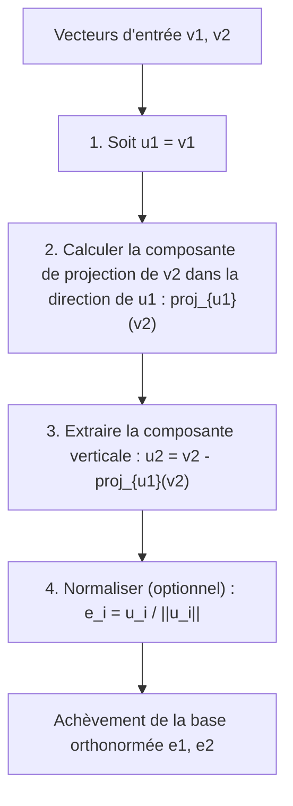
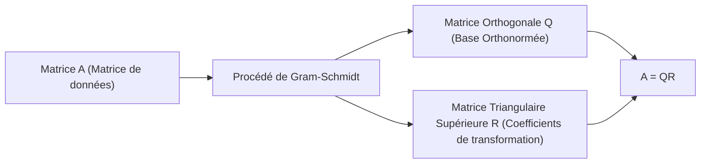

En étudiant l'algèbre linéaire, vous rencontrerez inévitablement le concept de « Base » qui construit un espace vectoriel. Cependant, les vecteurs de base obtenus à partir de problèmes ou d'ensembles de données du monde réel pointent souvent dans des directions aléatoires et irrégulières, s'entrecroisant à des angles obliques ou ayant des longueurs considérablement différentes. De telles bases « déformées » sont extrêmement difficiles à manipuler dans l'analyse théorique et le calcul numérique par les ordinateurs.

C'est là qu'intervient la vedette de cet article, le **procédé d'orthogonalisation de Gram-Schmidt**. Cet algorithme est une méthode extrêmement puissante et polyvalente pour transformer et façonner systématiquement un ensemble de vecteurs de base déformés sous-tendant un espace en une magnifique **Base Ortonormée**, où les vecteurs sont mutuellement orthogonaux (perpendiculaires) et de longueur uniforme (normalisés à 1).

Dans cet article, nous explorerons en profondeur le procédé d'orthogonalisation de Gram-Schmidt de manière très détaillée, en partant de l'intuition géométrique de base, en progressant vers la formulation mathématique rigoureuse, en introduisant un algorithme amélioré tenant compte de la « stabilité numérique » pour les calculs informatiques, et en l'étendant aux applications dans les espaces de fonctions et à son lien avec la décomposition QR dans l'apprentissage automatique.

## 1. Introduction : Pourquoi l'« Orthogonalité » est-elle souhaitable ?

Avant de plonger dans les étapes spécifiques du procédé d'orthogonalisation de Gram-Schmidt, clarifions notre motivation : pourquoi voulons-nous rendre des vecteurs orthogonaux (se croisant perpendiculairement) en premier lieu ?

En mathématiques et en ingénierie, une base orthogonalisée, en particulier une **base orthonormée** normalisée à une longueur de 1, apporte d'innombrables avantages.

1. **Simplification massive des calculs** : Lorsque les vecteurs sont représentés à l'aide d'une base orthonormée, les calculs pour les produits scalaires, les normes (longueurs) et les distances entre les vecteurs peuvent être entièrement réalisés avec de simples multiplications et additions des composantes correspondantes. Cela s'explique par le fait que tous les termes croisés fastidieux deviennent nuls.
2. **Projections extrêmement simples** : Lorsque vous souhaitez projeter un vecteur sur un sous-espace spécifique pour une approximation, si la base est mutuellement orthogonale, il vous suffit de calculer individuellement les projections unidimensionnelles sur chaque vecteur de base et de les additionner pour obtenir le vecteur de projection correct.
3. **Amélioration de la stabilité numérique** : Lors de l'exécution de l'arithmétique à virgule flottante sur des ordinateurs, les transformations utilisant des matrices orthogonales (matrices dont les vecteurs colonnes forment une base orthonormée) ont la merveilleuse propriété (isométrie) d'être moins sujettes à la perte d'informations ou à l'amplification des erreurs. Cela est d'une importance capitale pour un fonctionnement stable dans les algorithmes d'apprentissage automatique et de traitement du signal.

## 2. Intuition Géométrique : « Projection » et « Soustraction » dans un espace 2D

L'idée centrale du procédé d'orthogonalisation de Gram-Schmidt peut être résumée en une phrase : **« soustraire et éliminer les composantes directionnelles des vecteurs orthogonaux déjà créés du nouveau vecteur. »**

Prenons deux vecteurs $\mathbf{v}_1, \mathbf{v}_2$ sur un plan 2D comme l'exemple le plus facile à imaginer. Supposons qu'ils sont linéairement indépendants (non parallèles et qu'aucun des deux n'est un vecteur nul). À partir de ces deux vecteurs, nous allons créer de nouveaux vecteurs mutuellement orthogonaux $\mathbf{u}_1, \mathbf{u}_2$.

1. **Adopter le premier vecteur tel quel** :
   Tout d'abord, comme point de départ, utilisez le premier vecteur directement comme premier vecteur de la nouvelle base.
   $$ \mathbf{u}_1 = \mathbf{v}_1 $$

2. **Soustraire la composante directionnelle du premier vecteur du vecteur suivant** :
   Ensuite, nous voulons que le deuxième vecteur $\mathbf{v}_2$ soit perpendiculaire à $\mathbf{u}_1$. Pour ce faire, il nous suffit de supprimer la « composante parallèle à $\mathbf{u}_1$ » que possède $\mathbf{v}_2$.
   Cette « composante parallèle à $\mathbf{u}_1$ » est appelée la **Projection Orthogonale** de $\mathbf{v}_2$ sur $\mathbf{u}_1$.

   Le vecteur de projection est calculé comme suit :
   $$ \text{proj}_{\mathbf{u}_1}(\mathbf{v}_2) = \frac{\langle \mathbf{v}_2, \mathbf{u}_1 \rangle}{\langle \mathbf{u}_1, \mathbf{u}_1 \rangle} \mathbf{u}_1 $$
   Ici, $\langle \cdot, \cdot \rangle$ représente le produit scalaire des vecteurs.

   En soustrayant cette composante de projection de la $\mathbf{v}_2$ originale, nous obtenons $\mathbf{u}_2$, qui est complètement perpendiculaire à $\mathbf{u}_1$.
   $$ \mathbf{u}_2 = \mathbf{v}_2 - \text{proj}_{\mathbf{u}_1}(\mathbf{v}_2) $$

Le diagramme ci-dessous représente visuellement ce processus géométrique de « projection et soustraction ».



## 3. Formulation Mathématique : Extension aux dimensions générales

Nous généralisons l'idée précédente en 2D à un ensemble de $k$ vecteurs dans un espace arbitraire à $n$ dimensions. Étant donné un ensemble de vecteurs linéairement indépendants $\{ \mathbf{v}_1, \mathbf{v}_2, \dots, \mathbf{v}_k \}$ dans un espace vectoriel $V$. La procédure pour construire une base orthogonale $\{ \mathbf{u}_1, \mathbf{u}_2, \dots, \mathbf{u}_k \}$ à partir de ceux-ci (Gram-Schmidt Classique, CGS) est formulée comme suit :

$$
\begin{aligned}
\mathbf{u}_1 &= \mathbf{v}_1 \\
\mathbf{u}_2 &= \mathbf{v}_2 - \text{proj}_{\mathbf{u}_1}(\mathbf{v}_2) \\
\mathbf{u}_3 &= \mathbf{v}_3 - \text{proj}_{\mathbf{u}_1}(\mathbf{v}_3) - \text{proj}_{\mathbf{u}_2}(\mathbf{v}_3) \\
&\vdots \\
\mathbf{u}_k &= \mathbf{v}_k - \sum_{j=1}^{k-1} \text{proj}_{\mathbf{u}_j}(\mathbf{v}_k)
\end{aligned}
$$

En d'autres termes, pour créer le $i$-ème vecteur orthogonal $\mathbf{u}_i$, il vous suffit de **soustraire toutes les composantes de projection sur tous les vecteurs orthogonaux déjà générés $\mathbf{u}_1, \dots, \mathbf{u}_{i-1}$** du vecteur d'origine $\mathbf{v}_i$.

Enfin, en unifiant les longueurs des vecteurs orthogonaux obtenus à 1 (normalisation), la base orthonormée $\{ \mathbf{e}_1, \mathbf{e}_2, \dots, \mathbf{e}_k \}$ est achevée.

$$ \mathbf{e}_i = \frac{\mathbf{u}_i}{\|\mathbf{u}_i\|} $$

## 4. Calcul manuel avec un exemple concret (Espace 3D)

Pour approfondir notre compréhension, traçons le processus d'orthogonalisation de trois vecteurs dans un espace 3D à la main.

Supposons que l'on nous donne les trois vecteurs linéairement indépendants suivants comme état initial :

$$ \mathbf{v}_1 = \begin{pmatrix} 1 \\ 1 \\ 0 \end{pmatrix}, \quad \mathbf{v}_2 = \begin{pmatrix} 1 \\ 0 \\ 1 \end{pmatrix}, \quad \mathbf{v}_3 = \begin{pmatrix} 0 \\ 1 \\ 1 \end{pmatrix} $$

**Étape 1 :**
Utiliser le premier vecteur tel quel.
$$ \mathbf{u}_1 = \mathbf{v}_1 = \begin{pmatrix} 1 \\ 1 \\ 0 \end{pmatrix} $$

**Étape 2 :**
Soustraire la projection sur $\mathbf{u}_1$ de $\mathbf{v}_2$.
Calcul des produits scalaires : $\langle \mathbf{v}_2, \mathbf{u}_1 \rangle = 1 \times 1 + 0 \times 1 + 1 \times 0 = 1$, et $\langle \mathbf{u}_1, \mathbf{u}_1 \rangle = 1^2 + 1^2 + 0^2 = 2$.
$$ \mathbf{u}_2 = \mathbf{v}_2 - \frac{\langle \mathbf{v}_2, \mathbf{u}_1 \rangle}{\langle \mathbf{u}_1, \mathbf{u}_1 \rangle} \mathbf{u}_1 = \begin{pmatrix} 1 \\ 0 \\ 1 \end{pmatrix} - \frac{1}{2} \begin{pmatrix} 1 \\ 1 \\ 0 \end{pmatrix} = \begin{pmatrix} 1/2 \\ -1/2 \\ 1 \end{pmatrix} $$

Pour simplifier le calcul manuel, multipliez $\mathbf{u}_2$ par une constante (fois 2) pour éliminer les fractions. Cela n'affecte pas l'orthogonalité.
$$ \mathbf{u}_2' = \begin{pmatrix} 1 \\ -1 \\ 2 \end{pmatrix} $$

**Étape 3 :**
Soustraire les composantes directionnelles de $\mathbf{u}_1$ et de $\mathbf{u}_2'$ de $\mathbf{v}_3$.
$\langle \mathbf{v}_3, \mathbf{u}_1 \rangle = 0 \times 1 + 1 \times 1 + 1 \times 0 = 1$
$\langle \mathbf{v}_3, \mathbf{u}_2' \rangle = 0 \times 1 + 1 \times (-1) + 1 \times 2 = 1$
$\langle \mathbf{u}_2', \mathbf{u}_2' \rangle = 1^2 + (-1)^2 + 2^2 = 6$

$$ \mathbf{u}_3 = \mathbf{v}_3 - \frac{\langle \mathbf{v}_3, \mathbf{u}_1 \rangle}{\langle \mathbf{u}_1, \mathbf{u}_1 \rangle} \mathbf{u}_1 - \frac{\langle \mathbf{v}_3, \mathbf{u}_2' \rangle}{\langle \mathbf{u}_2', \mathbf{u}_2' \rangle} \mathbf{u}_2' $$
$$ \mathbf{u}_3 = \begin{pmatrix} 0 \\ 1 \\ 1 \end{pmatrix} - \frac{1}{2} \begin{pmatrix} 1 \\ 1 \\ 0 \end{pmatrix} - \frac{1}{6} \begin{pmatrix} 1 \\ -1 \\ 2 \end{pmatrix} = \begin{pmatrix} -2/3 \\ 2/3 \\ 2/3 \end{pmatrix} $$

En multipliant cela par une constante (fois $-3/2$), on obtient également un vecteur d'entiers net.
$$ \mathbf{u}_3' = \begin{pmatrix} 1 \\ -1 \\ -1 \end{pmatrix} $$

Maintenant, nous avons obtenu trois vecteurs mutuellement orthogonaux $\{ \mathbf{u}_1, \mathbf{u}_2', \mathbf{u}_3' \}$. Enfin, en divisant ceux-ci par leurs longueurs respectives, on obtient une base orthonormée.

## 5. Pièges du calcul numérique : Erreurs d'arrondi et le « Procédé de Gram-Schmidt Modifié »

Bien que théoriquement parfait, le procédé de Gram-Schmidt rencontre un problème majeur lorsqu'il est implémenté sous forme de programme informatique : l'**« Erreur d'Arrondi »** due à l'arithmétique à virgule flottante.

Dans la méthode classique de Gram-Schmidt (CGS) décrite ci-dessus, les composantes de projection à soustraire du vecteur $\mathbf{v}_k$ sont toutes calculées indépendamment à partir des produits scalaires du **$\mathbf{u}_j$ déjà calculé et du $\mathbf{v}_k$ original**, et sont soustraites toutes en même temps à la fin. Cependant, il est connu qu'au fur et à mesure que la dimensionnalité augmente ou que le nombre de vecteurs croît, de légères erreurs d'arrondi s'accumulent et l'ensemble de vecteurs résultant **perd son orthogonalité (provoquant une perte d'orthogonalité)**.

Pour surmonter cette faille mathématique, le **Procédé de Gram-Schmidt Modifié (MGS)** a été conçu.

L'approche du MGS ne consiste pas à effectuer des soustractions en parallèle, mais à **mettre à jour de manière séquentielle**.
Plus précisément, lors de la création d'un nouveau vecteur, soustrayez d'abord la composante $\mathbf{u}_1$ de $\mathbf{v}_k$, puis soustrayez la composante $\mathbf{u}_2$ de **ce résultat (le vecteur mis à jour)**, et soustrayez encore la composante $\mathbf{u}_3$ de **ce résultat ultérieur**, et ainsi de suite. À chaque étape, la projection suivante est calculée pendant la mise à jour du vecteur.

Bien que cela ne semble être qu'une légère différence lorsqu'exprimé en formules, cette « mise à jour séquentielle » crée l'effet de corriger l'erreur orthogonale générée à l'étape précédente lors de l'étape suivante, améliorant considérablement la stabilité numérique. Dans les bibliothèques de calcul numérique modernes, ce MGS (ou les transformations de Householder) est toujours utilisé pour le processus d'orthogonalisation.

## 6. Comparaison des implémentations Python

Pour clarifier la différence théorique, implémentons à la fois le CGS et le MGS en utilisant Python et NumPy.

```python
import numpy as np

def classical_gram_schmidt(V):
    """
    Gram-Schmidt Classique (CGS)
    V: Matrice dont les vecteurs colonnes forment la base
    """
    n, k = V.shape
    U = np.zeros((n, k), dtype=float)
    
    for i in range(k):
        v = V[:, i]
        # Soustraire les projections dans toutes les directions u_j précédentes de v
        for j in range(i):
            u_j = U[:, j]
            # Calculer la composante de projection
            projection = (np.dot(v, u_j) / np.dot(u_j, u_j)) * u_j
            v = v - projection
        U[:, i] = v
        
    # Normaliser
    E = U / np.linalg.norm(U, axis=0)
    return E

def modified_gram_schmidt(V):
    """
    Gram-Schmidt Modifié (MGS) - Numériquement stable
    V: Matrice dont les vecteurs colonnes forment la base
    """
    n, k = V.shape
    E = np.zeros((n, k), dtype=float)
    # Copier V pour éviter de modifier les valeurs originales
    V_work = V.copy().astype(float) 
    
    for i in range(k):
        # Normaliser le vecteur actuel pour qu'il soit e_i
        v = V_work[:, i]
        E[:, i] = v / np.linalg.norm(v)
        
        # Soustraire (mettre à jour) séquentiellement la composante e_i de tous les vecteurs restants non traités
        for j in range(i + 1, k):
            projection = np.dot(V_work[:, j], E[:, i]) * E[:, i]
            V_work[:, j] = V_work[:, j] - projection
            
    return E
```

Lorsqu'une matrice mal conditionnée (proche de la singularité) est fournie en entrée, la base générée par le CGS ne parvient pas à avoir des produits scalaires de 0, ce qui rompt l'orthogonalité, tandis que le MGS maintient l'orthogonalité avec une grande précision. Dans la pratique, il est fortement recommandé de toujours utiliser le MGS.

## 7. Application avancée 1 : Application aux polynômes orthogonaux

Ce qui rend le procédé de Gram-Schmidt si puissant, c'est qu'il peut être appliqué directement non seulement aux espaces vectoriels géométriques de dimension finie, mais aussi aux **« espaces de fonctions »**.

Par exemple, considérez l'ensemble des fonctions sur l'intervalle $[-1, 1]$. Nous définissons le produit scalaire de deux fonctions $f(x), g(x)$ en utilisant une intégrale comme suit :
$$ \langle f, g \rangle = \int_{-1}^{1} f(x)g(x) dx $$

Maintenant, appliquons le procédé d'orthogonalisation de Gram-Schmidt à la base polynomiale la plus simple $\{ 1, x, x^2, x^3, \dots \}$.

* $\mathbf{u}_0(x) = 1$
* Calcul de $\mathbf{u}_1(x) = x - \text{proj}_{\mathbf{u}_0}(x)$, étant donné que $\langle x, 1 \rangle = \int_{-1}^{1} x dx = 0$, nous avons $\mathbf{u}_1(x) = x$.
* Le calcul de $\mathbf{u}_2(x) = x^2 - \text{proj}_{\mathbf{u}_0}(x^2) - \text{proj}_{\mathbf{u}_1}(x^2)$ donne $\mathbf{u}_2(x) = x^2 - \frac{1}{3}$.

La suite de polynômes orthogonaux générée de cette manière est appelée **polynômes de [Legendre](https://kenji.blog/fr/p/legendre/)**, et ils jouent un rôle extrêmement important dans l'électromagnétisme et la mécanique quantique en physique, ainsi que dans l'intégration numérique (quadrature de Gauss). C'est un bel exemple où un algorithme algébrique dérive naturellement des descriptions de lois physiques profondes.

## 8. Application avancée 2 : Décomposition QR et Science des données

La plus grande application du procédé de Gram-Schmidt en science des données et en apprentissage automatique est sans aucun doute la **Décomposition QR**.

La décomposition QR est une méthode pour décomposer une matrice arbitraire $A$ en produit d'une matrice orthogonale $Q$ et d'une matrice triangulaire supérieure $R$.
$$ A = QR $$

Cette opération de décomposition correspond parfaitement au processus d'application du procédé d'orthogonalisation de Gram-Schmidt à chaque vecteur colonne de la matrice $A$.

* **Matrice $Q$** : Une matrice formée en alignant la base orthonormée $\{ \mathbf{e}_1, \dots, \mathbf{e}_k \}$ générée par le procédé de Gram-Schmidt en tant que vecteurs colonnes. (Elle satisfait $Q^T Q = I$)
* **Matrice $R$** : Une matrice triangulaire supérieure dont les composantes sont les « coefficients (produits scalaires) » lors de l'expression du vecteur original $\mathbf{v}$ comme combinaison linéaire de la nouvelle base $\mathbf{e}$ à chaque étape d'orthogonalisation.



Dans le contexte de l'apprentissage automatique, la décomposition QR est utilisée pour effectuer les calculs de la « méthode des moindres carrés » de manière stable et rapide afin de trouver des paramètres optimaux dans l'analyse de régression multiple. L'approche consistant à résoudre directement l'équation normale ($A^T A \mathbf{x} = A^T \mathbf{b}$) est couramment évitée dans la pratique car le conditionnement de la matrice $A^T A$ se détériore facilement, ce qui la rend extrêmement vulnérable aux erreurs numériques. Au lieu de cela, la pratique standard consiste à la décomposer sous la forme $A=QR$ et à résoudre $R \mathbf{x} = Q^T \mathbf{b}$ par substitution arrière.

## 9. Conclusion : La beauté d'un espace réaligné

Dans cet article, nous avons expliqué en détail le procédé d'orthogonalisation de Gram-Schmidt, de sa signification intuitive au calcul mathématique, en passant par les considérations de stabilité numérique et les applications aux espaces de fonctions et à l'apprentissage automatique.

J'espère que vous avez réalisé à quel point l'impact de l'idée simple et claire de « réaligner des axes de coordonnées déformés en axes nets et mutuellement perpendiculaires » est puissant et répandu. C'est magnifique en tant que théorie mathématique et indispensable en tant qu'algorithme moderne d'analyse de données pratique exécuté par des ordinateurs. On peut dire que c'est l'un des sommets pour apprécier la profondeur de l'algèbre linéaire.

Surtout, essayez d'exécuter des codes de programme réels ou d'essayer d'orthogonaliser d'autres polynômes à la main pour expérimenter physiquement la joie mathématique de voir un espace se raffiner.
