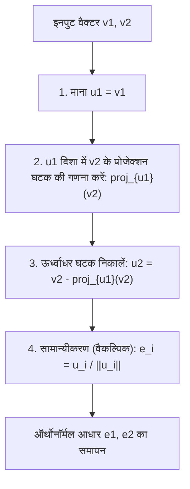
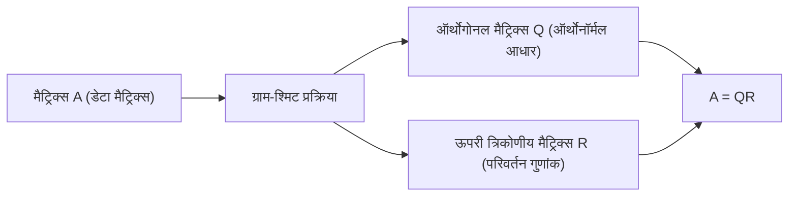

रेखीय बीजगणित (linear algebra) का अध्ययन करते समय, आप अनिवार्य रूप से एक "आधार (Basis)" की अवधारणा का सामना करेंगे जो एक वेक्टर स्पेस (vector space) का निर्माण करता है। हालांकि, वास्तविक दुनिया की समस्याओं या डेटासेट से प्राप्त आधार वैक्टर अक्सर यादृच्छिक, अनियमित दिशाओं की ओर इशारा करते हैं, तिरछे कोणों पर प्रतिच्छेद करते हैं या उनकी लंबाई काफी भिन्न होती है। ऐसे "विकृत (distorted)" आधारों को कंप्यूटर द्वारा सैद्धांतिक विश्लेषण और संख्यात्मक गणना में संभालना बेहद मुश्किल होता है।

यहीं पर इस लेख का मुख्य विषय, **ग्राम-श्मिट ऑर्थोगोनलाइजेशन प्रक्रिया (Gram-Schmidt orthogonalization process)** काम में आता है। यह एल्गोरिथ्म एक स्पेस को कवर करने वाले विकृत आधार वैक्टरों के एक सेट को एक सुंदर **ऑर्थोनॉर्मल आधार (Orthonormal Basis)** में व्यवस्थित रूप से बदलने और आकार देने के लिए एक अत्यंत शक्तिशाली और बहुमुखी तरीका है, जहां वैक्टर परस्पर ऑर्थोगोनल (लंबवत) होते हैं और लंबाई में समान (1 पर सामान्यीकृत) होते हैं।

इस लेख में, हम ग्राम-श्मिट ऑर्थोगोनलाइजेशन प्रक्रिया का विस्तार से अन्वेषण करेंगे, जो बुनियादी ज्यामितीय अंतर्ज्ञान से शुरू होकर, कठोर गणितीय सूत्रीकरण की ओर बढ़ता है, कंप्यूटर गणनाओं के लिए "संख्यात्मक स्थिरता" पर विचार करते हुए एक बेहतर एल्गोरिथ्म पेश करता है, और फ़ंक्शन स्पेस में अनुप्रयोगों और मशीन लर्निंग में QR अपघटन (QR decomposition) के साथ इसके संबंध का विस्तार करता है।

## 1. परिचय: "ऑर्थोगोनैलिटी (Orthogonality)" क्यों वांछनीय है?

ग्राम-श्मिट ऑर्थोगोनलाइजेशन प्रक्रिया के विशिष्ट चरणों में गोता लगाने से पहले, आइए अपनी प्रेरणा को स्पष्ट करें: हम वैक्टरों को ऑर्थोगोनल (लंबवत रूप से प्रतिच्छेद करने वाला) क्यों बनाना चाहते हैं?

गणित और इंजीनियरिंग में, एक ऑर्थोगोनलाइज्ड आधार, विशेष रूप से 1 की लंबाई में सामान्यीकृत एक **ऑर्थोनॉर्मल आधार**, अनगिनत लाभ लाता है।

1. **गणनाओं का भारी सरलीकरण** : जब वैक्टरों को ऑर्थोनॉर्मल आधार का उपयोग करके दर्शाया जाता है, तो डॉट उत्पाद (dot products), मानदंड (लंबाई), और वैक्टरों के बीच की दूरी की गणना संबंधित घटकों के सरल गुणन और जोड़ के साथ पूरी तरह से समाप्त की जा सकती है। ऐसा इसलिए है क्योंकि सभी उबाऊ क्रॉस-टर्म शून्य हो जाते हैं।
2. **अत्यंत सरल अनुमान (Projections)** : जब आप सन्निकटन (approximation) के लिए किसी विशिष्ट उप-स्थान (subspace) पर एक वेक्टर को प्रोजेक्ट करना चाहते हैं, यदि आधार परस्पर ऑर्थोगोनल है, तो आप केवल प्रत्येक आधार वेक्टर पर एक-आयामी अनुमानों (one-dimensional projections) को व्यक्तिगत रूप से गणना करते हैं और सही अनुमान वेक्टर प्राप्त करने के लिए उन्हें एक साथ जोड़ते हैं।
3. **बेहतर संख्यात्मक स्थिरता** : कंप्यूटर पर फ्लोटिंग-पॉइंट अंकगणित करते समय, ऑर्थोगोनल मैट्रिसेस (matrices जिनके कॉलम वैक्टर ऑर्थोनॉर्मल आधार बनाते हैं) का उपयोग करने वाले परिवर्तनों में सूचना हानि या त्रुटि प्रवर्धन के प्रति कम संवेदनशील होने का अद्भुत गुण (आइसोमेट्री) होता है। मशीन लर्निंग और सिग्नल प्रोसेसिंग एल्गोरिदम में स्थिर संचालन के लिए यह गंभीर रूप से महत्वपूर्ण है।

## 2. ज्यामितीय अंतर्ज्ञान: 2D स्पेस में "प्रोजेक्शन" और "घटाव (Subtraction)"

ग्राम-श्मिट ऑर्थोगोनलाइजेशन प्रक्रिया के मुख्य विचार को एक वाक्य में संक्षेप में प्रस्तुत किया जा सकता है: **"नए वेक्टर से पहले से बनाए गए ऑर्थोगोनल वैक्टरों के दिशात्मक घटकों को घटाना और हटाना।"**

आइए कल्पना करने के लिए सबसे आसान उदाहरण के रूप में एक 2D विमान (plane) पर दो वैक्टर $\mathbf{v}_1, \mathbf{v}_2$ लें। मान लें कि ये रैखिक रूप से स्वतंत्र (linearly independent) हैं (समानांतर नहीं हैं, और न ही शून्य वेक्टर हैं)। इन दो वैक्टरों से, हम नए परस्पर ऑर्थोगोनल वैक्टर $\mathbf{u}_1, \mathbf{u}_2$ बनाएंगे।

1. **पहले वेक्टर को उसी रूप में अपनाएं** :
   सबसे पहले, एक प्रारंभिक बिंदु के रूप में, पहले वेक्टर को सीधे नए आधार के पहले वेक्टर के रूप में उपयोग करें।
   $$ \mathbf{u}_1 = \mathbf{v}_1 $$

2. **अगले वेक्टर से पहले वेक्टर के दिशात्मक घटक को घटाएं** :
   इसके बाद, हम चाहते हैं कि दूसरा वेक्टर $\mathbf{v}_2$, $\mathbf{u}_1$ के लंबवत हो। ऐसा करने के लिए, हमें केवल $\mathbf{v}_2$ के पास मौजूद "$\mathbf{u}_1$ के समानांतर घटक" को हटाना होगा।
   इस "$\mathbf{u}_1$ के समानांतर घटक" को $\mathbf{u}_1$ पर $\mathbf{v}_2$ का **ऑर्थोगोनल प्रोजेक्शन (Orthogonal Projection)** कहा जाता है।

   प्रोजेक्शन वेक्टर की गणना इस प्रकार की जाती है:
   $$ \text{proj}_{\mathbf{u}_1}(\mathbf{v}_2) = \frac{\langle \mathbf{v}_2, \mathbf{u}_1 \rangle}{\langle \mathbf{u}_1, \mathbf{u}_1 \rangle} \mathbf{u}_1 $$
   यहाँ, $\langle \cdot, \cdot \rangle$ वैक्टरों के डॉट उत्पाद का प्रतिनिधित्व करता है।

   मूल $\mathbf{v}_2$ से इस प्रोजेक्शन घटक को घटाकर, हम $\mathbf{u}_2$ प्राप्त करते हैं, जो पूरी तरह से $\mathbf{u}_1$ के लंबवत है।
   $$ \mathbf{u}_2 = \mathbf{v}_2 - \text{proj}_{\mathbf{u}_1}(\mathbf{v}_2) $$

नीचे दिया गया आरेख "प्रोजेक्टिंग और घटाव" की इस ज्यामितीय प्रक्रिया को दृश्य रूप से प्रस्तुत करता है।



## 3. गणितीय सूत्रीकरण: सामान्य आयामों का विस्तार

हम पिछले विचार को 2D में एक मनमाने $n$-आयामी स्पेस में $k$ वैक्टरों के एक सेट में सामान्यीकृत करते हैं। मान लीजिए कि वेक्टर स्पेस $V$ में रैखिक रूप से स्वतंत्र वैक्टरों का एक सेट $\{ \mathbf{v}_1, \mathbf{v}_2, \dots, \mathbf{v}_k \}$ दिया गया है। इनसे ऑर्थोगोनल आधार $\{ \mathbf{u}_1, \mathbf{u}_2, \dots, \mathbf{u}_k \}$ बनाने की प्रक्रिया (क्लासिकल ग्राम-श्मिट, CGS) को इस प्रकार तैयार किया गया है:

$$
\begin{aligned}
\mathbf{u}_1 &= \mathbf{v}_1 \\
\mathbf{u}_2 &= \mathbf{v}_2 - \text{proj}_{\mathbf{u}_1}(\mathbf{v}_2) \\
\mathbf{u}_3 &= \mathbf{v}_3 - \text{proj}_{\mathbf{u}_1}(\mathbf{v}_3) - \text{proj}_{\mathbf{u}_2}(\mathbf{v}_3) \\
&\vdots \\
\mathbf{u}_k &= \mathbf{v}_k - \sum_{j=1}^{k-1} \text{proj}_{\mathbf{u}_j}(\mathbf{v}_k)
\end{aligned}
$$

दूसरे शब्दों में, $i$-वें ऑर्थोगोनल वेक्टर $\mathbf{u}_i$ को बनाने के लिए, आपको बस मूल वेक्टर $\mathbf{v}_i$ से **पहले से उत्पन्न सभी ऑर्थोगोनल वैक्टर $\mathbf{u}_1, \dots, \mathbf{u}_{i-1}$ पर सभी प्रोजेक्शन घटकों को घटाना होगा**।

अंत में, प्राप्त ऑर्थोगोनल वैक्टरों की लंबाई को 1 (सामान्यीकरण) में एकीकृत करके, ऑर्थोनॉर्मल आधार $\{ \mathbf{e}_1, \mathbf{e}_2, \dots, \mathbf{e}_k \}$ पूरा हो गया है।

$$ \mathbf{e}_i = \frac{\mathbf{u}_i}{\|\mathbf{u}_i\|} $$

## 4. एक ठोस उदाहरण (3D स्पेस) के साथ हाथ की गणना

हमारी समझ को गहरा करने के लिए, आइए 3D स्पेस में तीन वैक्टरों को हाथ से ऑर्थोगोनलाइज़ करने की प्रक्रिया का पता लगाएं।

मान लीजिए कि हमें प्रारंभिक अवस्था के रूप में निम्नलिखित तीन रैखिक रूप से स्वतंत्र वैक्टर दिए गए हैं:

$$ \mathbf{v}_1 = \begin{pmatrix} 1 \\ 1 \\ 0 \end{pmatrix}, \quad \mathbf{v}_2 = \begin{pmatrix} 1 \\ 0 \\ 1 \end{pmatrix}, \quad \mathbf{v}_3 = \begin{pmatrix} 0 \\ 1 \\ 1 \end{pmatrix} $$

**चरण 1:**
पहले वेक्टर का उसी रूप में उपयोग करें।
$$ \mathbf{u}_1 = \mathbf{v}_1 = \begin{pmatrix} 1 \\ 1 \\ 0 \end{pmatrix} $$

**चरण 2:**
$\mathbf{v}_2$ से $\mathbf{u}_1$ पर प्रोजेक्शन घटाएं।
डॉट उत्पादों की गणना: $\langle \mathbf{v}_2, \mathbf{u}_1 \rangle = 1 \times 1 + 0 \times 1 + 1 \times 0 = 1$, और $\langle \mathbf{u}_1, \mathbf{u}_1 \rangle = 1^2 + 1^2 + 0^2 = 2$।
$$ \mathbf{u}_2 = \mathbf{v}_2 - \frac{\langle \mathbf{v}_2, \mathbf{u}_1 \rangle}{\langle \mathbf{u}_1, \mathbf{u}_1 \rangle} \mathbf{u}_1 = \begin{pmatrix} 1 \\ 0 \\ 1 \end{pmatrix} - \frac{1}{2} \begin{pmatrix} 1 \\ 1 \\ 0 \end{pmatrix} = \begin{pmatrix} 1/2 \\ -1/2 \\ 1 \end{pmatrix} $$

हाथ की गणना को सरल बनाने के लिए, अंशों को समाप्त करने के लिए $\mathbf{u}_2$ को एक स्थिरांक (2 से गुणा) से गुणा करें। यह ऑर्थोगोनैलिटी को प्रभावित नहीं करता है।
$$ \mathbf{u}_2' = \begin{pmatrix} 1 \\ -1 \\ 2 \end{pmatrix} $$

**चरण 3:**
$\mathbf{v}_3$ से $\mathbf{u}_1$ और $\mathbf{u}_2'$ दोनों के दिशात्मक घटकों को घटाएं।
$\langle \mathbf{v}_3, \mathbf{u}_1 \rangle = 0 \times 1 + 1 \times 1 + 1 \times 0 = 1$
$\langle \mathbf{v}_3, \mathbf{u}_2' \rangle = 0 \times 1 + 1 \times (-1) + 1 \times 2 = 1$
$\langle \mathbf{u}_2', \mathbf{u}_2' \rangle = 1^2 + (-1)^2 + 2^2 = 6$

$$ \mathbf{u}_3 = \mathbf{v}_3 - \frac{\langle \mathbf{v}_3, \mathbf{u}_1 \rangle}{\langle \mathbf{u}_1, \mathbf{u}_1 \rangle} \mathbf{u}_1 - \frac{\langle \mathbf{v}_3, \mathbf{u}_2' \rangle}{\langle \mathbf{u}_2', \mathbf{u}_2' \rangle} \mathbf{u}_2' $$
$$ \mathbf{u}_3 = \begin{pmatrix} 0 \\ 1 \\ 1 \end{pmatrix} - \frac{1}{2} \begin{pmatrix} 1 \\ 1 \\ 0 \end{pmatrix} - \frac{1}{6} \begin{pmatrix} 1 \\ -1 \\ 2 \end{pmatrix} = \begin{pmatrix} -2/3 \\ 2/3 \\ 2/3 \end{pmatrix} $$

इसे एक स्थिरांक ($-3/2$ से गुणा) से गुणा करने पर यह भी एक साफ पूर्णांक वेक्टर बन जाता है।
$$ \mathbf{u}_3' = \begin{pmatrix} 1 \\ -1 \\ -1 \end{pmatrix} $$

अब, हमने तीन परस्पर ऑर्थोगोनल वैक्टर $\{ \mathbf{u}_1, \mathbf{u}_2', \mathbf{u}_3' \}$ प्राप्त कर लिए हैं। अंत में, इन्हें इनकी संबंधित लंबाई से विभाजित करने पर एक ऑर्थोनॉर्मल आधार प्राप्त होता है।

## 5. संख्यात्मक कंप्यूटिंग में नुकसान: राउंडिंग त्रुटियां और "संशोधित ग्राम-श्मिट प्रक्रिया"

यद्यपि सैद्धांतिक रूप से परिपूर्ण, ग्राम-श्मिट प्रक्रिया को कंप्यूटर प्रोग्राम के रूप में लागू किए जाने पर एक महत्वपूर्ण समस्या का सामना करना पड़ता है: फ्लोटिंग-पॉइंट अंकगणित के कारण **"राउंडिंग त्रुटि (Rounding Error)"**।

ऊपर वर्णित क्लासिकल ग्राम-श्मिट (CGS) पद्धति में, वेक्टर $\mathbf{v}_k$ से घटाए जाने वाले प्रोजेक्शन घटकों की गणना **पहले से गणना की गई $\mathbf{u}_j$ और मूल $\mathbf{v}_k$** के आंतरिक उत्पादों से स्वतंत्र रूप से की जाती है, और अंत में सभी को एक साथ घटाया जाता है। हालांकि, यह ज्ञात है कि जैसे-जैसे आयाम बढ़ता है या वैक्टरों की संख्या बढ़ती है, थोड़ी सी गोलाई वाली त्रुटियां (rounding errors) जमा हो जाती हैं, और परिणामी वेक्टर सेट **अपनी ऑर्थोगोनैलिटी खो देता है (जिससे ऑर्थोगोनैलिटी का टूटना होता है)**।

इस गणितीय दोष को दूर करने के लिए, **संशोधित ग्राम-श्मिट प्रक्रिया (Modified Gram-Schmidt, MGS)** तैयार की गई थी।

MGS का दृष्टिकोण समानांतर में घटाव करना नहीं है, बल्कि **क्रमिक रूप से अपडेट करना** है।
विशेष रूप से, एक नया वेक्टर बनाते समय, पहले $\mathbf{v}_k$ से $\mathbf{u}_1$ घटक घटाएं, फिर **उस परिणाम (अपडेटेड वेक्टर)** से $\mathbf{u}_2$ घटक घटाएं, और **उस बाद के परिणाम** से $\mathbf{u}_3$ घटक को और घटाएं, इत्यादि। प्रत्येक चरण में, वेक्टर को अपडेट करते समय अगले प्रोजेक्शन की गणना की जाती है।

यद्यपि सूत्रों में व्यक्त किए जाने पर यह केवल एक मामूली अंतर की तरह दिखता है, यह "क्रमिक अद्यतन" अगले चरण के दौरान पिछले चरण में उत्पन्न ऑर्थोगोनल त्रुटि को ठीक करने का प्रभाव पैदा करता है, जिससे नाटकीय रूप से संख्यात्मक स्थिरता में सुधार होता है। आधुनिक संख्यात्मक गणना पुस्तकालयों में, ऑर्थोगोनलाइजेशन प्रक्रिया के लिए हमेशा इस MGS (या हाउसहोल्डर परिवर्तनों) का उपयोग किया जाता है।

## 6. पायथन कार्यान्वयन की तुलना

सैद्धांतिक अंतर को स्पष्ट करने के लिए, आइए पायथन और NumPy का उपयोग करके CGS और MGS दोनों को लागू करें।

```python
import numpy as np

def classical_gram_schmidt(V):
    """
    क्लासिकल ग्राम-श्मिट (CGS)
    V: मैट्रिक्स जहां कॉलम वैक्टर आधार हैं
    """
    n, k = V.shape
    U = np.zeros((n, k), dtype=float)
    
    for i in range(k):
        v = V[:, i]
        # v से सभी पिछली u_j दिशाओं में प्रोजेक्शन घटाएं
        for j in range(i):
            u_j = U[:, j]
            # प्रोजेक्शन घटक की गणना करें
            projection = (np.dot(v, u_j) / np.dot(u_j, u_j)) * u_j
            v = v - projection
        U[:, i] = v
        
    # सामान्यीकरण
    E = U / np.linalg.norm(U, axis=0)
    return E

def modified_gram_schmidt(V):
    """
    संशोधित ग्राम-श्मिट (MGS) - संख्यात्मक रूप से स्थिर
    V: मैट्रिक्स जहां कॉलम वैक्टर आधार हैं
    """
    n, k = V.shape
    E = np.zeros((n, k), dtype=float)
    # मूल मानों को संशोधित करने से बचने के लिए V की प्रतिलिपि बनाएँ
    V_work = V.copy().astype(float) 
    
    for i in range(k):
        # वर्तमान वेक्टर को e_i होने के लिए सामान्यीकृत करें
        v = V_work[:, i]
        E[:, i] = v / np.linalg.norm(v)
        
        # सभी शेष असंसाधित वैक्टरों से e_i घटक को क्रमिक रूप से घटाएं (अपडेट करें)
        for j in range(i + 1, k):
            projection = np.dot(V_work[:, j], E[:, i]) * E[:, i]
            V_work[:, j] = V_work[:, j] - projection
            
    return E
```

जब खराब-कंडीशन्ड (singular होने के करीब) मैट्रिक्स को इनपुट किया जाता है, तो CGS द्वारा उत्पन्न आधार में आंतरिक उत्पाद 0 होने में विफल रहता है, जिससे ऑर्थोगोनैलिटी टूट जाती है, जबकि MGS उच्च परिशुद्धता के साथ ऑर्थोगोनैलिटी बनाए रखता है। व्यवहार में, हमेशा MGS का उपयोग करने की दृढ़ता से अनुशंसा की जाती है।

## 7. उन्नत अनुप्रयोग 1: ऑर्थोगोनल बहुपदों का अनुप्रयोग

ग्राम-श्मिट प्रक्रिया को जो चीज इतना शक्तिशाली बनाती है, वह यह है कि इसे न केवल परिमित-आयामी ज्यामितीय वेक्टर रिक्त स्थान पर, बल्कि **"फ़ंक्शन स्पेस (function spaces)"** पर भी सीधे लागू किया जा सकता है।

उदाहरण के लिए, अंतराल $[-1, 1]$ पर कार्यों के समूह (set of functions) पर विचार करें। हम निम्नानुसार एक इंटीग्रल का उपयोग करके दो कार्यों $f(x), g(x)$ के आंतरिक उत्पाद को परिभाषित करते हैं:
$$ \langle f, g \rangle = \int_{-1}^{1} f(x)g(x) dx $$

अब, आइए ग्राम-श्मिट ऑर्थोगोनलाइजेशन प्रक्रिया को सबसे सरल बहुपद आधार $\{ 1, x, x^2, x^3, \dots \}$ पर लागू करें।

* $\mathbf{u}_0(x) = 1$
* $\mathbf{u}_1(x) = x - \text{proj}_{\mathbf{u}_0}(x)$ की गणना करते हुए, क्योंकि $\langle x, 1 \rangle = \int_{-1}^{1} x dx = 0$, हमारे पास $\mathbf{u}_1(x) = x$ है।
* $\mathbf{u}_2(x) = x^2 - \text{proj}_{\mathbf{u}_0}(x^2) - \text{proj}_{\mathbf{u}_1}(x^2)$ की गणना करने पर $\mathbf{u}_2(x) = x^2 - \frac{1}{3}$ प्राप्त होता है।

इस तरह से उत्पन्न ऑर्थोगोनल बहुपदों के अनुक्रम को **लेजेंड्रे बहुपद (Legendre polynomials)** कहा जाता है, और वे भौतिकी में विद्युत चुंबकत्व और क्वांटम यांत्रिकी के साथ-साथ संख्यात्मक एकीकरण (गॉसियन क्वाडरेचर) में अत्यंत महत्वपूर्ण भूमिका निभाते हैं। यह एक सुंदर उदाहरण है जहां एक बीजगणितीय एल्गोरिथ्म स्वाभाविक रूप से गहरे भौतिक नियमों का विवरण प्राप्त करता है।

## 8. उन्नत अनुप्रयोग 2: QR अपघटन और डेटा साइंस

डेटा साइंस और मशीन लर्निंग में ग्राम-श्मिट प्रक्रिया का सबसे बड़ा अनुप्रयोग निस्संदेह **QR अपघटन (QR Decomposition)** है।

QR अपघटन एक मनमानी मैट्रिक्स $A$ को एक ऑर्थोगोनल मैट्रिक्स $Q$ और एक ऊपरी त्रिकोणीय मैट्रिक्स $R$ के उत्पाद में विघटित करने की एक विधि है।
$$ A = QR $$

यह अपघटन ऑपरेशन अपने आप में मैट्रिक्स $A$ के प्रत्येक कॉलम वेक्टर में ग्राम-श्मिट ऑर्थोगोनलाइजेशन प्रक्रिया को लागू करने की प्रक्रिया से पूरी तरह मेल खाता है।

* **$Q$ मैट्रिक्स**: ग्राम-श्मिट प्रक्रिया द्वारा उत्पन्न ऑर्थोनॉर्मल आधार $\{ \mathbf{e}_1, \dots, \mathbf{e}_k \}$ को कॉलम वैक्टर के रूप में संरेखित करके बनाई गई एक मैट्रिक्स। (यह $Q^T Q = I$ को संतुष्ट करता है)
* **$R$ मैट्रिक्स**: एक ऊपरी त्रिकोणीय मैट्रिक्स जिसके घटक "गुणांक (आंतरिक उत्पाद)" होते हैं, जब प्रत्येक ऑर्थोगोनलाइजेशन चरण में मूल वेक्टर $\mathbf{v}$ को नए आधार $\mathbf{e}$ के रैखिक संयोजन के रूप में व्यक्त किया जाता है।



मशीन लर्निंग के संदर्भ में, कई प्रतिगमन विश्लेषण (multiple regression analysis) में इष्टतम पैरामीटर खोजने के लिए स्थिर और तेजी से "[न्यूनतम वर्ग विधि](https://kenji.blog/hi/p/method-of-least-squares/) (least squares method)" की गणना करने के लिए QR अपघटन का उपयोग किया जाता है। सामान्य समीकरण ($A^T A \mathbf{x} = A^T \mathbf{b}$) को सीधे हल करने के दृष्टिकोण से व्यवहार में आम तौर पर बचा जाता है क्योंकि मैट्रिक्स $A^T A$ की स्थिति संख्या आसानी से बिगड़ जाती है, जिससे यह संख्यात्मक त्रुटियों के प्रति अत्यधिक संवेदनशील हो जाता है। इसके बजाय, इसे $A=QR$ के रूप में विघटित करने और बैक सब्स्टिट्यूशन के माध्यम से $R \mathbf{x} = Q^T \mathbf{b}$ को हल करने का मानक अभ्यास है।

## 9. निष्कर्ष: एक पुनः व्यवस्थित स्पेस की सुंदरता

इस लेख में, हमने ग्राम-श्मिट ऑर्थोगोनलाइजेशन प्रक्रिया को इसके सहज अर्थ से लेकर गणितीय गणना, संख्यात्मक स्थिरता के विचारों और फ़ंक्शन स्पेस और मशीन लर्निंग के अनुप्रयोगों तक व्यापक रूप से समझाया।

मुझे उम्मीद है कि आपको एहसास हो गया होगा कि "विकृत समन्वय अक्षों को साफ, परस्पर लंबवत अक्षों में फिर से व्यवस्थित करने" के सरल और स्पष्ट विचार का कितना शक्तिशाली और व्यापक प्रभाव है। यह एक गणितीय सिद्धांत के रूप में सुंदर है, और कंप्यूटर द्वारा निष्पादित एक आधुनिक व्यावहारिक डेटा विश्लेषण एल्गोरिथ्म के रूप में अपरिहार्य है। यह कहा जा सकता है कि यह रेखीय बीजगणित की गहराई की सराहना करने के लिए शिखरों में से एक है।

हर तरह से, वास्तविक प्रोग्राम कोड को निष्पादित करने का प्रयास करें या परिष्कृत किए जा रहे स्पेस की गणितीय खुशी का शारीरिक रूप से अनुभव करने के लिए हाथ से अन्य बहुपदों को ऑर्थोगोनलाइज़ करने का प्रयास करें।
