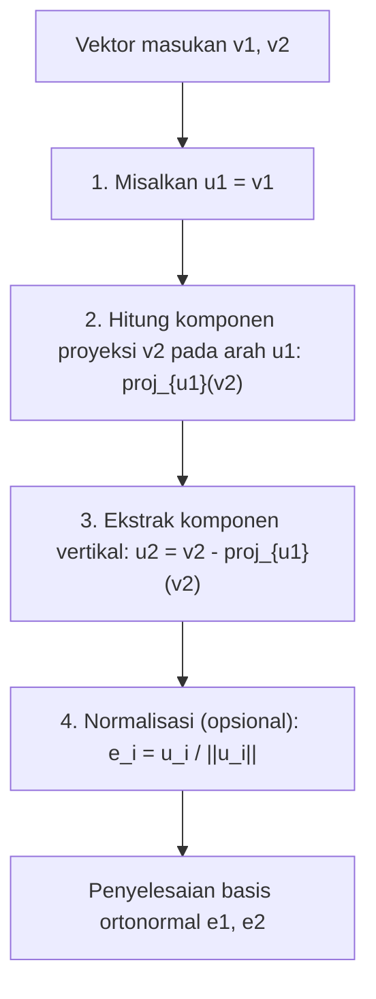
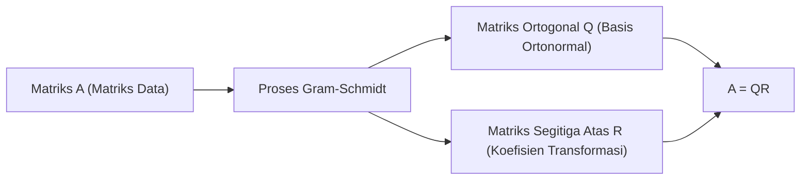

Saat mempelajari aljabar linear, Anda pasti akan menemukan konsep "Basis" yang membangun suatu ruang vektor. Namun, vektor basis yang diperoleh dari masalah dunia nyata atau kumpulan data sering kali menunjuk ke arah yang acak dan tidak beraturan, berpotongan pada sudut yang miring atau memiliki panjang yang sangat berbeda. Basis yang "terdistorsi" semacam ini sangat sulit untuk ditangani dalam analisis teoretis dan komputasi numerik oleh komputer.

Di sinilah bintang dari artikel ini, **proses ortogonalisasi Gram-Schmidt**, berperan. Algoritma ini adalah metode yang sangat kuat dan serbaguna untuk secara sistematis mengubah dan membentuk sekumpulan vektor basis yang terdistorsi yang membentang di suatu ruang menjadi **Basis Ortonormal** yang indah, di mana vektor-vektor tersebut saling ortogonal (tegak lurus) dan memiliki panjang yang seragam (dinormalisasi menjadi 1).

Dalam artikel ini, kita akan mengeksplorasi proses ortogonalisasi Gram-Schmidt secara menyeluruh dengan sangat detail, mulai dari intuisi geometris dasar, berkembang ke formulasi matematis yang ketat, memperkenalkan algoritma yang ditingkatkan dengan mempertimbangkan "stabilitas numerik" untuk perhitungan komputer, dan meluas ke aplikasi dalam ruang fungsi serta hubungannya dengan dekomposisi QR dalam pembelajaran mesin.

## 1. Pendahuluan: Mengapa "Ortogonalitas" Diinginkan?

Sebelum menyelami langkah-langkah spesifik dari proses ortogonalisasi Gram-Schmidt, mari perjelas motivasi kita: mengapa kita ingin membuat vektor menjadi ortogonal (berpotongan tegak lurus) pada awalnya?

Dalam matematika dan teknik, basis yang diortogonalisasi, terutama **basis ortonormal** yang dinormalisasi ke panjang 1, membawa keuntungan yang tak terhitung jumlahnya.

1. **Penyederhanaan Perhitungan Secara Masif** : Ketika vektor direpresentasikan menggunakan basis ortonormal, perhitungan untuk perkalian titik, norma (panjang), dan jarak antar vektor dapat diselesaikan sepenuhnya dengan perkalian dan penjumlahan sederhana dari komponen-komponen yang bersesuaian. Ini karena semua suku silang yang membosankan menjadi nol.
2. **Proyeksi yang Sangat Sederhana** : Saat Anda ingin memproyeksikan sebuah vektor ke subruang tertentu untuk perkiraan, jika basisnya saling ortogonal, Anda cukup menghitung proyeksi satu dimensi pada setiap vektor basis secara individual dan menambahkannya bersama-sama untuk mendapatkan vektor proyeksi yang benar.
3. **Peningkatan Stabilitas Numerik** : Saat melakukan aritmatika titik mengambang pada komputer, transformasi menggunakan matriks ortogonal (matriks yang vektor kolomnya membentuk basis ortonormal) memiliki sifat yang luar biasa (isometri) yaitu kurang rentan terhadap kehilangan informasi atau amplifikasi kesalahan. Hal ini sangat penting untuk operasi yang stabil dalam algoritma pembelajaran mesin dan pemrosesan sinyal.

## 2. Intuisi Geometris: "Proyeksi" dan "Pengurangan" di Ruang 2D

Ide inti dari proses ortogonalisasi Gram-Schmidt dapat dirangkum dalam satu kalimat: **"mengurangi dan membuang komponen arah dari vektor ortogonal yang sudah dibuat dari vektor baru."**

Mari kita ambil dua vektor $\mathbf{v}_1, \mathbf{v}_2$ pada bidang 2D sebagai contoh termudah untuk dibayangkan. Asumsikan keduanya bebas linear (tidak sejajar, dan tidak ada yang berupa vektor nol). Dari dua vektor ini, kita akan membuat vektor baru yang saling ortogonal $\mathbf{u}_1, \mathbf{u}_2$.

1. **Adopsi vektor pertama apa adanya** :
   Pertama, sebagai titik awal, gunakan vektor pertama secara langsung sebagai vektor pertama dari basis baru.
   $$ \mathbf{u}_1 = \mathbf{v}_1 $$

2. **Kurangi komponen arah vektor pertama dari vektor berikutnya** :
   Selanjutnya, kita ingin agar vektor kedua $\mathbf{v}_2$ tegak lurus terhadap $\mathbf{u}_1$. Untuk melakukan ini, kita hanya perlu menghapus "komponen yang sejajar dengan $\mathbf{u}_1$" yang dimiliki $\mathbf{v}_2$.
   "Komponen yang sejajar dengan $\mathbf{u}_1$" ini disebut **Proyeksi Ortogonal** dari $\mathbf{v}_2$ pada $\mathbf{u}_1$.

   Vektor proyeksi dihitung sebagai berikut:
   $$ \text{proj}_{\mathbf{u}_1}(\mathbf{v}_2) = \frac{\langle \mathbf{v}_2, \mathbf{u}_1 \rangle}{\langle \mathbf{u}_1, \mathbf{u}_1 \rangle} \mathbf{u}_1 $$
   Di sini, $\langle \cdot, \cdot \rangle$ merepresentasikan perkalian titik (dot product) dari vektor-vektor tersebut.

   Dengan mengurangi komponen proyeksi ini dari $\mathbf{v}_2$ yang asli, kita memperoleh $\mathbf{u}_2$, yang sepenuhnya tegak lurus terhadap $\mathbf{u}_1$.
   $$ \mathbf{u}_2 = \mathbf{v}_2 - \text{proj}_{\mathbf{u}_1}(\mathbf{v}_2) $$

Diagram di bawah ini secara visual merepresentasikan proses geometris "memproyeksi dan mengurangi" ini.



## 3. Formulasi Matematis: Perluasan ke Dimensi Umum

Kita menggeneralisasi ide sebelumnya dalam 2D ke sekumpulan $k$ vektor dalam ruang $n$-dimensi sembarang. Diberikan sekumpulan vektor yang bebas linear $\{ \mathbf{v}_1, \mathbf{v}_2, \dots, \mathbf{v}_k \}$ di ruang vektor $V$. Prosedur untuk membangun basis ortogonal $\{ \mathbf{u}_1, \mathbf{u}_2, \dots, \mathbf{u}_k \}$ dari vektor-vektor ini (Gram-Schmidt Klasik, CGS) diformulasikan sebagai berikut:

$$
\begin{aligned}
\mathbf{u}_1 &= \mathbf{v}_1 \\
\mathbf{u}_2 &= \mathbf{v}_2 - \text{proj}_{\mathbf{u}_1}(\mathbf{v}_2) \\
\mathbf{u}_3 &= \mathbf{v}_3 - \text{proj}_{\mathbf{u}_1}(\mathbf{v}_3) - \text{proj}_{\mathbf{u}_2}(\mathbf{v}_3) \\
&\vdots \\
\mathbf{u}_k &= \mathbf{v}_k - \sum_{j=1}^{k-1} \text{proj}_{\mathbf{u}_j}(\mathbf{v}_k)
\end{aligned}
$$

Dengan kata lain, untuk membuat vektor ortogonal ke-$i$ yaitu $\mathbf{u}_i$, Anda cukup **mengurangi semua komponen proyeksi pada semua vektor ortogonal yang telah dihasilkan sebelumnya $\mathbf{u}_1, \dots, \mathbf{u}_{i-1}$** dari vektor asli $\mathbf{v}_i$.

Terakhir, dengan menyatukan panjang vektor ortogonal yang diperoleh menjadi 1 (normalisasi), basis ortonormal $\{ \mathbf{e}_1, \mathbf{e}_2, \dots, \mathbf{e}_k \}$ selesai.

$$ \mathbf{e}_i = \frac{\mathbf{u}_i}{\|\mathbf{u}_i\|} $$

## 4. Perhitungan Manual dengan Contoh Konkret (Ruang 3D)

Untuk memperdalam pemahaman kita, mari melacak proses mengortogonalisasi tiga vektor di ruang 3D dengan perhitungan manual.

Misalkan kita diberikan tiga vektor bebas linear berikut sebagai keadaan awal:

$$ \mathbf{v}_1 = \begin{pmatrix} 1 \\ 1 \\ 0 \end{pmatrix}, \quad \mathbf{v}_2 = \begin{pmatrix} 1 \\ 0 \\ 1 \end{pmatrix}, \quad \mathbf{v}_3 = \begin{pmatrix} 0 \\ 1 \\ 1 \end{pmatrix} $$

**Langkah 1:**
Gunakan vektor pertama apa adanya.
$$ \mathbf{u}_1 = \mathbf{v}_1 = \begin{pmatrix} 1 \\ 1 \\ 0 \end{pmatrix} $$

**Langkah 2:**
Kurangi proyeksi pada $\mathbf{u}_1$ dari $\mathbf{v}_2$.
Menghitung perkalian titik: $\langle \mathbf{v}_2, \mathbf{u}_1 \rangle = 1 \times 1 + 0 \times 1 + 1 \times 0 = 1$, dan $\langle \mathbf{u}_1, \mathbf{u}_1 \rangle = 1^2 + 1^2 + 0^2 = 2$.
$$ \mathbf{u}_2 = \mathbf{v}_2 - \frac{\langle \mathbf{v}_2, \mathbf{u}_1 \rangle}{\langle \mathbf{u}_1, \mathbf{u}_1 \rangle} \mathbf{u}_1 = \begin{pmatrix} 1 \\ 0 \\ 1 \end{pmatrix} - \frac{1}{2} \begin{pmatrix} 1 \\ 1 \\ 0 \end{pmatrix} = \begin{pmatrix} 1/2 \\ -1/2 \\ 1 \end{pmatrix} $$

Untuk menyederhanakan perhitungan manual, kalikan $\mathbf{u}_2$ dengan konstanta (kali 2) untuk menghilangkan pecahan. Hal ini tidak memengaruhi ortogonalitas.
$$ \mathbf{u}_2' = \begin{pmatrix} 1 \\ -1 \\ 2 \end{pmatrix} $$

**Langkah 3:**
Kurangi komponen arah dari kedua $\mathbf{u}_1$ dan $\mathbf{u}_2'$ dari $\mathbf{v}_3$.
$\langle \mathbf{v}_3, \mathbf{u}_1 \rangle = 0 \times 1 + 1 \times 1 + 1 \times 0 = 1$
$\langle \mathbf{v}_3, \mathbf{u}_2' \rangle = 0 \times 1 + 1 \times (-1) + 1 \times 2 = 1$
$\langle \mathbf{u}_2', \mathbf{u}_2' \rangle = 1^2 + (-1)^2 + 2^2 = 6$

$$ \mathbf{u}_3 = \mathbf{v}_3 - \frac{\langle \mathbf{v}_3, \mathbf{u}_1 \rangle}{\langle \mathbf{u}_1, \mathbf{u}_1 \rangle} \mathbf{u}_1 - \frac{\langle \mathbf{v}_3, \mathbf{u}_2' \rangle}{\langle \mathbf{u}_2', \mathbf{u}_2' \rangle} \mathbf{u}_2' $$
$$ \mathbf{u}_3 = \begin{pmatrix} 0 \\ 1 \\ 1 \end{pmatrix} - \frac{1}{2} \begin{pmatrix} 1 \\ 1 \\ 0 \end{pmatrix} - \frac{1}{6} \begin{pmatrix} 1 \\ -1 \\ 2 \end{pmatrix} = \begin{pmatrix} -2/3 \\ 2/3 \\ 2/3 \end{pmatrix} $$

Mengalikan ini dengan konstanta (kali $-3/2$) juga menjadikannya vektor bilangan bulat yang rapi.
$$ \mathbf{u}_3' = \begin{pmatrix} 1 \\ -1 \\ -1 \end{pmatrix} $$

Kini, kita telah memperoleh tiga vektor yang saling ortogonal $\{ \mathbf{u}_1, \mathbf{u}_2', \mathbf{u}_3' \}$. Terakhir, membagi vektor-vektor ini dengan panjang masing-masing akan menghasilkan basis ortonormal.

## 5. Jebakan dalam Komputasi Numerik: Kesalahan Pembulatan dan "Proses Gram-Schmidt Dimodifikasi"

Meskipun secara teoretis sempurna, proses Gram-Schmidt menemui masalah signifikan saat diimplementasikan sebagai program komputer: **"Kesalahan Pembulatan (Rounding Error)"** karena aritmatika titik mengambang.

Dalam metode Gram-Schmidt Klasik (CGS) yang dijelaskan di atas, komponen proyeksi yang akan dikurangi dari vektor $\mathbf{v}_k$ semuanya dihitung secara independen dari perkalian dalam (inner product) antara **$\mathbf{u}_j$ yang sudah dihitung dan $\mathbf{v}_k$ yang asli**, dan dikurangi sekaligus di akhir. Namun, diketahui bahwa seiring bertambahnya dimensi atau bertambahnya jumlah vektor, kesalahan pembulatan kecil terakumulasi, dan sekumpulan vektor yang dihasilkan **kehilangan ortogonalitasnya (menyebabkan kerusakan ortogonalitas)**.

Untuk mengatasi kelemahan matematis ini, **Proses Gram-Schmidt Dimodifikasi (Modified Gram-Schmidt, MGS)** dirancang.

Pendekatan MGS bukanlah melakukan pengurangan secara paralel, tetapi untuk **memperbarui secara berurutan**.
Secara spesifik, saat membuat vektor baru, pertama kurangi komponen $\mathbf{u}_1$ dari $\mathbf{v}_k$, lalu kurangi komponen $\mathbf{u}_2$ dari **hasil tersebut (vektor yang diperbarui)**, dan lebih lanjut kurangi komponen $\mathbf{u}_3$ dari **hasil selanjutnya**, dan seterusnya. Pada setiap langkah, proyeksi berikutnya dihitung saat vektor sedang diperbarui.

Meskipun terlihat hanya sebagai perbedaan kecil saat dinyatakan dalam rumus, "pembaruan berurutan" ini menciptakan efek mengoreksi kesalahan ortogonal yang dihasilkan pada langkah sebelumnya selama langkah berikutnya, sehingga secara dramatis meningkatkan stabilitas numerik. Di perpustakaan komputasi numerik modern, MGS ini (atau transformasi Householder) selalu digunakan untuk proses ortogonalisasi.

## 6. Perbandingan Implementasi Python

Untuk memperjelas perbedaan teoretis, mari kita implementasikan CGS dan MGS menggunakan Python dan NumPy.

```python
import numpy as np

def classical_gram_schmidt(V):
    """
    Gram-Schmidt Klasik (CGS)
    V: Matriks dengan vektor kolom sebagai basisnya
    """
    n, k = V.shape
    U = np.zeros((n, k), dtype=float)
    
    for i in range(k):
        v = V[:, i]
        # Kurangi proyeksi pada semua arah u_j sebelumnya dari v
        for j in range(i):
            u_j = U[:, j]
            # Hitung komponen proyeksi
            projection = (np.dot(v, u_j) / np.dot(u_j, u_j)) * u_j
            v = v - projection
        U[:, i] = v
        
    # Normalisasi
    E = U / np.linalg.norm(U, axis=0)
    return E

def modified_gram_schmidt(V):
    """
    Gram-Schmidt Dimodifikasi (MGS) - Stabil secara numerik
    V: Matriks dengan vektor kolom sebagai basisnya
    """
    n, k = V.shape
    E = np.zeros((n, k), dtype=float)
    # Salin V untuk menghindari modifikasi nilai asli
    V_work = V.copy().astype(float) 
    
    for i in range(k):
        # Normalisasi vektor saat ini menjadi e_i
        v = V_work[:, i]
        E[:, i] = v / np.linalg.norm(v)
        
        # Secara berurutan kurangi (perbarui) komponen e_i dari semua vektor yang tersisa yang belum diproses
        for j in range(i + 1, k):
            projection = np.dot(V_work[:, j], E[:, i]) * E[:, i]
            V_work[:, j] = V_work[:, j] - projection
            
    return E
```

Saat matriks yang berkondisi buruk (hampir singular) dimasukkan, basis yang dihasilkan oleh CGS gagal memiliki perkalian dalam bernilai 0, sehingga merusak ortogonalitas, sedangkan MGS mempertahankan ortogonalitas dengan presisi tinggi. Dalam praktiknya, sangat disarankan untuk selalu menggunakan MGS.

## 7. Aplikasi Tingkat Lanjut 1: Aplikasi pada Polinomial Ortogonal

Hal yang membuat proses Gram-Schmidt sangat kuat adalah bahwa proses ini dapat diterapkan secara langsung tidak hanya pada ruang vektor geometris berdimensi hingga tetapi juga pada **"ruang fungsi"**.

Sebagai contoh, pertimbangkan himpunan fungsi pada interval $[-1, 1]$. Kita mendefinisikan perkalian dalam dari dua fungsi $f(x), g(x)$ menggunakan integral sebagai berikut:
$$ \langle f, g \rangle = \int_{-1}^{1} f(x)g(x) dx $$

Sekarang, mari terapkan proses ortogonalisasi Gram-Schmidt pada basis polinomial paling sederhana $\{ 1, x, x^2, x^3, \dots \}$.

* $\mathbf{u}_0(x) = 1$
* Menghitung $\mathbf{u}_1(x) = x - \text{proj}_{\mathbf{u}_0}(x)$, mengingat $\langle x, 1 \rangle = \int_{-1}^{1} x dx = 0$, kita memiliki $\mathbf{u}_1(x) = x$.
* Perhitungan $\mathbf{u}_2(x) = x^2 - \text{proj}_{\mathbf{u}_0}(x^2) - \text{proj}_{\mathbf{u}_1}(x^2)$ menghasilkan $\mathbf{u}_2(x) = x^2 - \frac{1}{3}$.

Barisan polinomial ortogonal yang dihasilkan dengan cara ini disebut **polinomial [Legendre](https://kenji.blog/id/p/legendre/)**, dan mereka memainkan peran yang sangat penting dalam elektromagnetisme dan mekanika kuantum dalam fisika, serta dalam integrasi numerik (kuadratur Gaussian). Ini adalah contoh yang indah di mana algoritma aljabar secara alami memperoleh deskripsi dari hukum fisika yang mendalam.

## 8. Aplikasi Tingkat Lanjut 2: Dekomposisi QR dan Ilmu Data

Aplikasi terbesar dari proses Gram-Schmidt dalam ilmu data dan pembelajaran mesin tidak diragukan lagi adalah **Dekomposisi QR**.

Dekomposisi QR adalah metode untuk mendekomposisi matriks $A$ sembarang menjadi perkalian matriks ortogonal $Q$ dan matriks segitiga atas $R$.
$$ A = QR $$

Operasi dekomposisi ini sendiri secara sempurna cocok dengan proses penerapan proses ortogonalisasi Gram-Schmidt ke setiap vektor kolom dari matriks $A$.

* **Matriks $Q$**: Matriks yang dibentuk dengan menyelaraskan basis ortonormal $\{ \mathbf{e}_1, \dots, \mathbf{e}_k \}$ yang dihasilkan oleh proses Gram-Schmidt sebagai vektor kolom. (Memenuhi $Q^T Q = I$)
* **Matriks $R$**: Matriks segitiga atas yang komponennya adalah "koefisien (perkalian dalam)" saat mengekspresikan vektor asli $\mathbf{v}$ sebagai kombinasi linear dari basis baru $\mathbf{e}$ pada setiap langkah ortogonalisasi.



Dalam konteks pembelajaran mesin, dekomposisi QR dimanfaatkan untuk melakukan perhitungan "metode kuadrat terkecil (least squares)" secara stabil dan cepat guna menemukan parameter optimal dalam analisis regresi berganda. Pendekatan memecahkan persamaan normal ($A^T A \mathbf{x} = A^T \mathbf{b}$) secara langsung pada umumnya dihindari dalam praktiknya karena bilangan kondisi matriks $A^T A$ mudah memburuk, membuatnya sangat rentan terhadap kesalahan numerik. Sebaliknya, praktik standarnya adalah mendekomposisinya menjadi $A=QR$ dan memecahkan $R \mathbf{x} = Q^T \mathbf{b}$ melalui substitusi balik (back substitution).

## 9. Kesimpulan: Keindahan Ruang yang Diselaraskan Kembali

Dalam artikel ini, kami secara luas menjelaskan proses ortogonalisasi Gram-Schmidt, mulai dari makna intuitifnya hingga perhitungan matematis, pertimbangan untuk stabilitas numerik, dan aplikasi ke ruang fungsi dan pembelajaran mesin.

Saya harap Anda telah menyadari betapa kuat dan meluasnya dampak dari ide sederhana dan jelas mengenai "menyelaraskan kembali sumbu koordinat yang terdistorsi menjadi sumbu yang rapi dan saling tegak lurus". Hal ini indah sebagai teori matematika, dan sangat diperlukan sebagai algoritma analisis data praktis modern yang dijalankan oleh komputer. Bisa dikatakan ini adalah salah satu puncak untuk mengapresiasi kedalaman aljabar linear.

Oleh karena itu, cobalah untuk menjalankan kode program yang sebenarnya atau mencoba mengortogonalisasi polinomial lain secara manual untuk merasakan secara fisik kegembiraan matematis dari ruang yang sedang disempurnakan.

