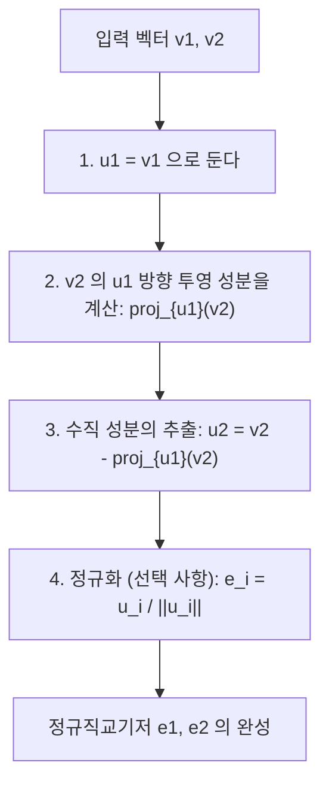
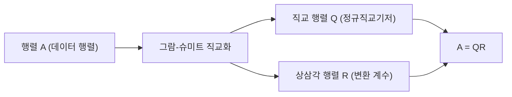

선형대수학을 배우면서 벡터 공간을 구성하는 "기저(Basis)"라는 개념을 반드시 접하게 됩니다. 하지만 현실의 문제나 데이터셋에서 얻어지는 기저 벡터들은 무작위하고 불규칙한 방향을 향하고 있으며, 서로 비스듬하게 교차하거나 길이가 극단적으로 다른 경우가 많습니다. 이러한 "왜곡된" 기저는 이론적인 해석이나 컴퓨터를 통한 수치 계산에 있어 매우 다루기 어렵습니다.

이때 등장하는 것이 본 글의 핵심 주제인 **그람-슈미트 직교화 (Gram-Schmidt orthogonalization process)** 입니다. 이 알고리즘은 공간을 생성하는 왜곡된 기저 벡터들을 서로 직교(수직)하면서 길이가 1로 통일된 아름다운 **정규직교기저 (Orthonormal Basis)** 로 체계적으로 변환하고 정돈하는, 매우 강력하고 범용적인 기법입니다.

본 글에서는 그람-슈미트 직교화에 대해 기초적인 기하학적 직관에서 시작하여 수학적이고 엄밀한 공식화, 컴퓨터에서 계산할 때의 "수치적 안정성"을 고려한 개선 알고리즘, 나아가 함수 공간으로의 응용과 기계학습에서의 QR 분해와의 연관성까지 압도적인 분량으로 철저하게 파헤쳐 설명합니다.

## 1. 들어가며: 왜 "직교"가 좋은가?

그람-슈미트 직교화의 구체적인 절차에 들어가기에 앞서, 애초에 왜 우리는 벡터를 직교하게(수직으로 교차하게) 만들고 싶은지 그 동기를 명확히 해둡시다.

수학과 공학에서 직교화된 기저, 특히 길이가 1로 정규화된 **정규직교기저** 는 셀 수 없이 많은 이점을 가져다줍니다.

1. **계산의 대폭적인 단순화** : 정규직교기저를 사용하여 벡터를 표현하면, 벡터의 내적, 노름(길이), 그리고 벡터 간 거리 계산이 각 성분끼리의 단순한 곱셈과 덧셈만으로 완전히 끝납니다. 번거로운 교차항들이 모두 0이 되기 때문입니다.
2. **투영(Projection)이 극도로 간단함** : 어떤 벡터를 특정 부분 공간에 투영하여 근사하고 싶을 때, 기저가 서로 직교한다면 각각의 기저 벡터에 대한 1차원 투영을 개별적으로 계산하고 이들을 단순히 더하기만 하면 올바른 투영 벡터를 얻을 수 있습니다.
3. **수치적 안정성의 향상** : 컴퓨터 상에서 부동소수점 연산을 수행할 때, 직교 행렬(열벡터가 정규직교기저인 행렬)을 이용한 변환은 정보의 손실이나 오차의 증폭을 일으키기 어렵다는 훌륭한 성질(등거리 변환)을 가집니다. 이는 기계학습이나 신호 처리 알고리즘을 안정적으로 동작시키는 데 결정적으로 중요합니다.

## 2. 기하학적 직관: 2차원 공간에서의 "투영"과 "뺄셈"

그람-슈미트 직교화의 핵심적인 아이디어는, 한마디로 **"이미 만든 직교 벡터들의 방향 성분을, 새로운 벡터에서 빼서 깎아내는 것"** 입니다.

가장 상상하기 쉬운 2차원 평면상의 두 벡터 $\mathbf{v}_1, \mathbf{v}_2$ 를 예로 들어보겠습니다. 이들은 일차독립(평행하지 않으며 영벡터도 아님)이라고 가정합니다. 이 두 벡터로부터 서로 직교하는 새로운 벡터 $\mathbf{u}_1, \mathbf{u}_2$ 를 만들어냅니다.

1. **첫 번째 벡터는 그대로 채택한다** :
   먼저 출발점으로서 첫 번째 벡터를 그대로 새로운 기저의 첫 번째로 삼습니다.
   $$ \mathbf{u}_1 = \mathbf{v}_1 $$

2. **다음 벡터에서 첫 번째 벡터의 방향 성분을 뺀다** :
   다음으로, 두 번째 벡터 $\mathbf{v}_2$ 를 $\mathbf{u}_1$ 에 대해 수직으로 만들고자 합니다. 그러기 위해서는 $\mathbf{v}_2$ 가 가진 "$\mathbf{u}_1$ 과 평행한 성분"을 제거하면 됩니다.
   이 "$\mathbf{u}_1$ 과 평행한 성분"을 $\mathbf{v}_2$ 의 $\mathbf{u}_1$ 에 대한 **정사영 (Orthogonal Projection)** 이라고 부릅니다.

   투영 벡터는 다음과 같이 계산됩니다.
   $$ \text{proj}_{\mathbf{u}_1}(\mathbf{v}_2) = \frac{\langle \mathbf{v}_2, \mathbf{u}_1 \rangle}{\langle \mathbf{u}_1, \mathbf{u}_1 \rangle} \mathbf{u}_1 $$
   여기서 $\langle \cdot, \cdot \rangle$ 은 벡터의 내적을 나타냅니다.

   이 투영 성분을 원래의 $\mathbf{v}_2$ 에서 뺌으로써, $\mathbf{u}_1$ 에 완전히 수직인 벡터 $\mathbf{u}_2$ 를 얻을 수 있습니다.
   $$ \mathbf{u}_2 = \mathbf{v}_2 - \text{proj}_{\mathbf{u}_1}(\mathbf{v}_2) $$

아래 그림은 이 "투영하고 빼는" 기하학적 과정을 시각화한 것입니다.



## 3. 수학적인 공식화: 일반 차원으로의 확장

앞서 살펴본 2차원에서의 아이디어를 임의의 $n$ 차원 공간에 있는 $k$ 개의 벡터로 일반화합니다. 벡터 공간 $V$ 에서 일차독립인 벡터 집합 $\{ \mathbf{v}_1, \mathbf{v}_2, \dots, \mathbf{v}_k \}$ 가 주어졌다고 합시다. 이들로부터 직교 기저 $\{ \mathbf{u}_1, \mathbf{u}_2, \dots, \mathbf{u}_k \}$ 를 구축하는 절차(고전적 그람-슈미트 직교화, CGS)는 다음과 같이 공식화됩니다.

$$
\begin{aligned}
\mathbf{u}_1 &= \mathbf{v}_1 \\
\mathbf{u}_2 &= \mathbf{v}_2 - \text{proj}_{\mathbf{u}_1}(\mathbf{v}_2) \\
\mathbf{u}_3 &= \mathbf{v}_3 - \text{proj}_{\mathbf{u}_1}(\mathbf{v}_3) - \text{proj}_{\mathbf{u}_2}(\mathbf{v}_3) \\
&\vdots \\
\mathbf{u}_k &= \mathbf{v}_k - \sum_{j=1}^{k-1} \text{proj}_{\mathbf{u}_j}(\mathbf{v}_k)
\end{aligned}
$$

즉, $i$ 번째 직교 벡터 $\mathbf{u}_i$ 를 만들기 위해서는 원래 벡터 $\mathbf{v}_i$ 에서 **이미 생성된 모든 직교 벡터 $\mathbf{u}_1, \dots, \mathbf{u}_{i-1}$ 로의 투영 성분을 모두 빼면** 되는 것입니다.

마지막으로 얻어진 직교 벡터군의 길이를 1로 맞춤(정규화)으로써, 정규직교기저 $\{ \mathbf{e}_1, \mathbf{e}_2, \dots, \mathbf{e}_k \}$ 가 완성됩니다.

$$ \mathbf{e}_i = \frac{\mathbf{u}_i}{\|\mathbf{u}_i\|} $$

## 4. 구체적인 예시를 통한 손계산 (3차원 공간)

이해를 돕기 위해 3차원 공간의 3개 벡터를 직교화하는 과정을 손계산으로 따라가 보겠습니다.

초기 상태로서 다음의 일차독립인 3개의 벡터가 주어졌다고 가정합니다.

$$ \mathbf{v}_1 = \begin{pmatrix} 1 \\ 1 \\ 0 \end{pmatrix}, \quad \mathbf{v}_2 = \begin{pmatrix} 1 \\ 0 \\ 1 \end{pmatrix}, \quad \mathbf{v}_3 = \begin{pmatrix} 0 \\ 1 \\ 1 \end{pmatrix} $$

**단계 1:**
첫 번째 벡터는 그대로 사용합니다.
$$ \mathbf{u}_1 = \mathbf{v}_1 = \begin{pmatrix} 1 \\ 1 \\ 0 \end{pmatrix} $$

**단계 2:**
$\mathbf{v}_2$ 에서 $\mathbf{u}_1$ 로의 투영을 뺍니다.
내적을 계산하면, $\langle \mathbf{v}_2, \mathbf{u}_1 \rangle = 1 \times 1 + 0 \times 1 + 1 \times 0 = 1$ 이고, 또한 $\langle \mathbf{u}_1, \mathbf{u}_1 \rangle = 1^2 + 1^2 + 0^2 = 2$ 입니다.
$$ \mathbf{u}_2 = \mathbf{v}_2 - \frac{\langle \mathbf{v}_2, \mathbf{u}_1 \rangle}{\langle \mathbf{u}_1, \mathbf{u}_1 \rangle} \mathbf{u}_1 = \begin{pmatrix} 1 \\ 0 \\ 1 \end{pmatrix} - \frac{1}{2} \begin{pmatrix} 1 \\ 1 \\ 0 \end{pmatrix} = \begin{pmatrix} 1/2 \\ -1/2 \\ 1 \end{pmatrix} $$

손계산을 간단하게 하기 위해 $\mathbf{u}_2$ 에 상수배(2배)를 하여 분수를 없앱니다. 직교성에는 영향을 미치지 않습니다.
$$ \mathbf{u}_2' = \begin{pmatrix} 1 \\ -1 \\ 2 \end{pmatrix} $$

**단계 3:**
$\mathbf{v}_3$ 에서 $\mathbf{u}_1$ 와 $\mathbf{u}_2'$ 각각의 방향 성분을 뺍니다.
$\langle \mathbf{v}_3, \mathbf{u}_1 \rangle = 0 \times 1 + 1 \times 1 + 1 \times 0 = 1$
$\langle \mathbf{v}_3, \mathbf{u}_2' \rangle = 0 \times 1 + 1 \times (-1) + 1 \times 2 = 1$
$\langle \mathbf{u}_2', \mathbf{u}_2' \rangle = 1^2 + (-1)^2 + 2^2 = 6$

$$ \mathbf{u}_3 = \mathbf{v}_3 - \frac{\langle \mathbf{v}_3, \mathbf{u}_1 \rangle}{\langle \mathbf{u}_1, \mathbf{u}_1 \rangle} \mathbf{u}_1 - \frac{\langle \mathbf{v}_3, \mathbf{u}_2' \rangle}{\langle \mathbf{u}_2', \mathbf{u}_2' \rangle} \mathbf{u}_2' $$
$$ \mathbf{u}_3 = \begin{pmatrix} 0 \\ 1 \\ 1 \end{pmatrix} - \frac{1}{2} \begin{pmatrix} 1 \\ 1 \\ 0 \end{pmatrix} - \frac{1}{6} \begin{pmatrix} 1 \\ -1 \\ 2 \end{pmatrix} = \begin{pmatrix} -2/3 \\ 2/3 \\ 2/3 \end{pmatrix} $$

이것도 다루기 쉽게 상수배($-3/2$ 배)를 하면 깔끔한 정수 벡터가 됩니다.
$$ \mathbf{u}_3' = \begin{pmatrix} 1 \\ -1 \\ -1 \end{pmatrix} $$

이로써 서로 직교하는 3개의 벡터 $\{ \mathbf{u}_1, \mathbf{u}_2', \mathbf{u}_3' \}$ 를 구했습니다. 마지막으로 이들을 각각의 길이로 나누면 정규직교기저를 얻을 수 있습니다.

## 5. 수치 계산에서의 함정: 반올림 오차와 "수정 그람-슈미트 직교화"

이론적으로는 완벽한 그람-슈미트 직교화이지만, 컴퓨터 프로그램으로 구현할 때는 중대한 문제가 발생합니다. 부동소수점 연산에 의한 **"반올림 오차 (Rounding Error)"** 입니다.

앞서 언급한 고전적 그람-슈미트 직교화(CGS)에서는 벡터 $\mathbf{v}_k$ 에서 빼야 할 투영 성분을 모두 **계산이 끝난 $\mathbf{u}_j$ 와 원래의 $\mathbf{v}_k$ 의 내적** 으로부터 독립적으로 계산하여, 마지막에 한꺼번에 뺍니다. 하지만 고차원이 되거나 벡터의 수가 많아지면 미세한 반올림 오차가 누적되어, 결과적으로 얻어진 벡터군이 **직교성을 잃어버리는(직교 붕괴를 일으키는)** 현상이 알려져 있습니다.

이러한 수학적 결함을 극복하기 위해 고안된 것이 **수정 그람-슈미트 직교화 (Modified Gram-Schmidt, MGS)** 입니다.

MGS의 접근법은 뺄셈을 병렬로 수행하는 것이 아니라 **순차적으로 업데이트해 나가는** 것입니다.
구체적으로 새로운 벡터를 만들 때, 먼저 $\mathbf{v}_k$ 에서 $\mathbf{u}_1$ 의 성분을 빼고, **그 결과(업데이트된 벡터)** 에 대해 $\mathbf{u}_2$ 의 성분을 빼고, 다시 **그 결과** 에 대해 $\mathbf{u}_3$ 의 성분을 빼는... 방식으로, 각 단계에서 벡터를 업데이트하면서 다음 투영을 계산합니다.

수식으로 표현하면 아주 작은 차이로밖에 보이지 않지만, 이 "순차적 업데이트"를 통해 이전 단계에서 발생한 직교 오차를 다음 단계에서 보정하는 효과가 생겨 수치적인 안정성이 비약적으로 향상됩니다. 현대의 수치 계산 라이브러리에서는 직교화 과정에 반드시 이 MGS(또는 하우스홀더 변환)가 사용됩니다.

## 6. Python을 이용한 구현 비교

이론적인 차이를 명확히 하기 위해 Python과 NumPy를 이용하여 CGS와 MGS를 모두 구현해 보겠습니다.

```python
import numpy as np

def classical_gram_schmidt(V):
    """
    고전적 그람-슈미트 직교화 (CGS)
    V: 열벡터가 기저가 되는 행렬
    """
    n, k = V.shape
    U = np.zeros((n, k), dtype=float)
    
    for i in range(k):
        v = V[:, i]
        # v 에서 과거의 모든 u_j 방향으로의 투영을 뺌
        for j in range(i):
            u_j = U[:, j]
            # 투영 성분을 계산
            projection = (np.dot(v, u_j) / np.dot(u_j, u_j)) * u_j
            v = v - projection
        U[:, i] = v
        
    # 정규화
    E = U / np.linalg.norm(U, axis=0)
    return E

def modified_gram_schmidt(V):
    """
    수정 그람-슈미트 직교화 (MGS) - 수치적으로 안정
    V: 열벡터가 기저가 되는 행렬
    """
    n, k = V.shape
    E = np.zeros((n, k), dtype=float)
    # V의 값을 덮어쓰지 않도록 복사
    V_work = V.copy().astype(float) 
    
    for i in range(k):
        # 현재 벡터를 정규화하여 e_i 로 만듦
        v = V_work[:, i]
        E[:, i] = v / np.linalg.norm(v)
        
        # 이후의 모든 처리되지 않은 벡터에서 e_i 의 성분을 순차적으로 뺌(업데이트)
        for j in range(i + 1, k):
            projection = np.dot(V_work[:, j], E[:, i]) * E[:, i]
            V_work[:, j] = V_work[:, j] - projection
            
    return E
```

조건이 나쁜(특이행렬에 가까운) 행렬을 입력했을 때, CGS가 생성하는 기저는 내적이 0이 되지 않아 직교성이 무너지는 반면, MGS는 높은 정밀도로 직교성을 유지합니다. 실무에서는 반드시 MGS를 사용할 것을 권장합니다.

## 7. 고도의 응용 1: 직교 다항식으로의 적용

그람-슈미트 직교화가 강력한 이유는 유한 차원의 기하학적 벡터 공간뿐만 아니라 **"함수 공간"** 에도 그대로 적용할 수 있다는 점입니다.

예를 들어, 구간 $[-1, 1]$ 에서의 함수 집합을 생각해 봅시다. 두 함수 $f(x), g(x)$ 의 내적을 적분을 이용하여 다음과 같이 정의합니다.
$$ \langle f, g \rangle = \int_{-1}^{1} f(x)g(x) dx $$

여기서 가장 단순한 다항식 기저 $\{ 1, x, x^2, x^3, \dots \}$ 에 대해 그람-슈미트 직교화를 적용해 봅시다.

* $\mathbf{u}_0(x) = 1$
* $\mathbf{u}_1(x) = x - \text{proj}_{\mathbf{u}_0}(x)$ 를 계산하면, $\langle x, 1 \rangle = \int_{-1}^{1} x dx = 0$ 이므로 $\mathbf{u}_1(x) = x$ 입니다.
* $\mathbf{u}_2(x) = x^2 - \text{proj}_{\mathbf{u}_0}(x^2) - \text{proj}_{\mathbf{u}_1}(x^2)$ 를 계산하면, $\mathbf{u}_2(x) = x^2 - \frac{1}{3}$ 이 됩니다.

이런 식으로 생성되는 직교하는 다항식의 열은 **르장드르 다항식 (Legendre polynomials)** 이라고 불리며, 물리학에서의 전자기학이나 양자역학, 수치 적분(가우스 구적법)에서 매우 중요한 역할을 하고 있습니다. 대수적인 알고리즘이 깊은 물리 법칙의 기술을 자연스럽게 도출해 내는 아름다운 예입니다.

## 8. 고도의 응용 2: QR 분해와 데이터 과학

데이터 과학이나 기계학습에서 그람-슈미트 직교화의 가장 큰 응용은 단연코 **QR 분해 (QR Decomposition)** 입니다.

QR 분해란 임의의 행렬 $A$ 를 직교 행렬 $Q$ 와 상삼각 행렬 $R$ 의 곱으로 분해하는 기법입니다.
$$ A = QR $$

이 분해 조작 자체가 행렬 $A$ 의 각 열벡터에 대해 그람-슈미트 직교화를 적용하는 과정과 완전히 일치합니다.

* **$Q$ 행렬**: 그람-슈미트 직교화에 의해 생성된 정규직교기저 $\{ \mathbf{e}_1, \dots, \mathbf{e}_k \}$ 를 열벡터로 나열한 행렬입니다. ($Q^T Q = I$ 를 만족합니다)
* **$R$ 행렬**: 직교화의 각 단계에서 원래의 벡터 $\mathbf{v}$ 를 새로운 기저 $\mathbf{e}$ 의 선형 결합으로 표현했을 때의 "계수(내적)"를 성분으로 갖는 상삼각 행렬입니다.



기계학습의 맥락에서는 다중 회귀 분석에서 최적의 파라미터를 구하는 "최소제곱법"의 계산을 안정적이고 빠르게 수행하기 위해 QR 분해가 이용됩니다. 정규 방정식($A^T A \mathbf{x} = A^T \mathbf{b}$)을 직접 푸는 접근법은 행렬 $A^T A$ 의 조건수가 악화되기 쉽고 수치 오차에 극히 취약하기 때문에, 실무에서는 $A=QR$ 로 분해하여 $R \mathbf{x} = Q^T \mathbf{b}$ 를 후방 대입법(back substitution)으로 푸는 것이 정석입니다.

## 9. 맺음말: 정돈된 공간의 아름다움

본 글에서는 그람-슈미트 직교화에 대해 직관적인 의미부터 수학적인 계산, 수치 안정성에 대한 고려, 그리고 함수 공간과 기계학습으로의 응용까지 폭넓게 설명했습니다.

"왜곡된 좌표축을 서로 수직이고 깔끔한 축으로 재정렬한다"는 단순 명쾌한 아이디어가 얼마나 강력하고 광범위한 영향력을 가지고 있는지 알게 되셨으리라 생각합니다. 수학 이론으로서도 아름답고, 또한 컴퓨터에 의한 현대의 실천적인 데이터 분석 알고리즘으로서도 불가결한 그람-슈미트 직교화. 선형대수의 깊이를 음미하기 위한 하나의 도달점이라고 할 수 있을 것입니다.

꼭 실제 프로그램 코드를 실행해 보거나 다른 다항식에 대해 손계산으로 직교화를 시도해 보면서, 공간이 세련되어 가는 수학적인 기쁨을 체감해 보시기 바랍니다.
