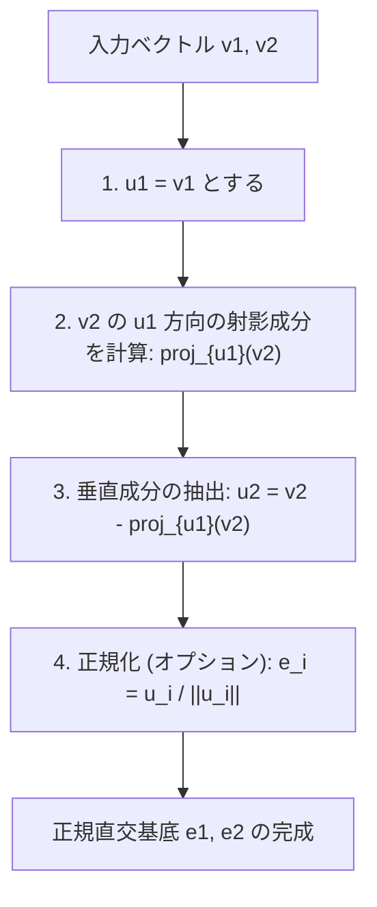
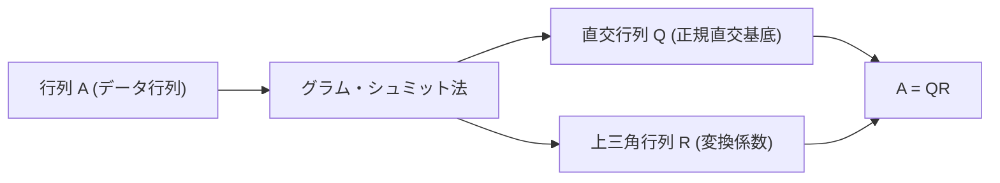

線形代数を学ぶ中で、ベクトル空間を構成する「基底（Basis）」という概念に必ず触れることになります。しかし、現実の問題やデータセットから得られる基底ベクトルは、無作為で不規則な方向を向いており、互いに斜めに交わっていたり、長さが極端に異なっていたりすることが多々あります。このような「歪んだ」基底は、理論的な解析やコンピュータによる数値計算において、非常に扱いにくい存在です。

そこで登場するのが、本記事の主役である **グラム・シュミットの直交化法 (Gram-Schmidt orthogonalization process)** です。このアルゴリズムは、空間を張る歪んだ基底ベクトルたちを、互いに直交（垂直）し、かつ長さが 1 に揃った美しい「正規直交基底（Orthonormal Basis）」へと系統的に変換・整形するための、極めて強力かつ汎用的な手法です。

本記事では、グラム・シュミットの直交化法について、基礎的な幾何学的直観から入り、数学的な厳密な定式化、コンピュータ上で計算する際の「数値的安定性」を考慮した改良版アルゴリズム、さらには関数空間への応用や機械学習におけるQR分解への結びつきに至るまで、圧倒的なボリュームで徹底的に深掘りして解説します。

## 1. はじめに：なぜ「直交」が嬉しいのか？

グラム・シュミットの直交化法の具体的な手順に入る前に、そもそもなぜ私たちはベクトルを直交させたい（垂直に交わらせたい）のか、そのモチベーションを明確にしておきましょう。

数学や工学において、直交化された基底、特に長さが 1 に正規化された **正規直交基底** は、数え切れないほどの利点をもたらします。

1. **計算の大幅な単純化** : 正規直交基底を用いてベクトルを表現すると、ベクトルの内積、ノルム（長さ）、そしてベクトル間の距離の計算が、各成分同士の単純な掛け算と足し算だけで完全に完結します。面倒な交差項がすべてゼロになるためです。
2. **射影（Projection）が極めて簡単** : あるベクトルを特定の部分空間に射影して近似したい場合、基底が互いに直交していれば、それぞれの基底ベクトルに対する 1 次元の射影を個別に計算し、それらを単純に足し合わせるだけで正しい射影ベクトルが得られます。
3. **数値的安定性の向上** : コンピュータ上で浮動小数点演算を行う際、直交行列（列ベクトルが正規直交基底である行列）を用いた変換は、情報の損失や誤差の増幅を引き起こしにくいという素晴らしい性質（等長変換）を持ちます。これは機械学習や信号処理のアルゴリズムを安定して動作させる上で決定的に重要です。

## 2. 幾何学的な直観：2次元空間での「射影」と「引き算」

グラム・シュミットの直交化法の核心的なアイデアは、一言で言えば **「すでに作った直交ベクトルたちの方向成分を、新しいベクトルから引き算して削ぎ落とす」** というものです。

最も想像しやすい2次元平面上の2つのベクトル $\mathbf{v}_1, \mathbf{v}_2$ を例に考えてみましょう。これらは一次独立（平行ではなく、ゼロベクトルでもない）であるとします。この2つのベクトルから、互いに直交する新しいベクトル $\mathbf{u}_1, \mathbf{u}_2$ を作り出します。

1. **最初のベクトルはそのまま採用する** :
   まず、出発点として1つ目のベクトルをそのまま新しい基底の1つ目とします。
   $$ \mathbf{u}_1 = \mathbf{v}_1 $$

2. **次のベクトルから、最初のベクトルの方向成分を引き算する** :
   次に、2つ目のベクトル $\mathbf{v}_2$ を $\mathbf{u}_1$ に対して垂直にしたいと考えます。そのためには、$\mathbf{v}_2$ が持っている「$\mathbf{u}_1$ と平行な成分」を取り除けばよいのです。
   この「$\mathbf{u}_1$ と平行な成分」のことを、$\mathbf{v}_2$ の $\mathbf{u}_1$ への **正射影 (Orthogonal Projection)** と呼びます。

   射影ベクトルは次のように計算されます。
   $$ \text{proj}_{\mathbf{u}_1}(\mathbf{v}_2) = \frac{\langle \mathbf{v}_2, \mathbf{u}_1 \rangle}{\langle \mathbf{u}_1, \mathbf{u}_1 \rangle} \mathbf{u}_1 $$
   ここで、$\langle \cdot, \cdot \rangle$ はベクトルの内積を表します。

   この射影成分を元の $\mathbf{v}_2$ から引き算することで、$\mathbf{u}_1$ に完全に垂直なベクトル $\mathbf{u}_2$ が得られます。
   $$ \mathbf{u}_2 = \mathbf{v}_2 - \text{proj}_{\mathbf{u}_1}(\mathbf{v}_2) $$

以下の図は、この「射影して引き算する」という幾何学的なプロセスを視覚化したものです。



## 3. 数学的な定式化：一般次元への拡張

先ほどの2次元でのアイデアを、任意の $n$ 次元空間における $k$ 個のベクトルへと一般化します。ベクトル空間 $V$ において、一次独立なベクトルの集合 $\{ \mathbf{v}_1, \mathbf{v}_2, \dots, \mathbf{v}_k \}$ が与えられたとします。これらから直交基底 $\{ \mathbf{u}_1, \mathbf{u}_2, \dots, \mathbf{u}_k \}$ を構築する手順（古典的グラム・シュミット法：Classical Gram-Schmidt, CGS）は次のように定式化されます。

$$
\begin{aligned}
\mathbf{u}_1 &= \mathbf{v}_1 \\
\mathbf{u}_2 &= \mathbf{v}_2 - \text{proj}_{\mathbf{u}_1}(\mathbf{v}_2) \\
\mathbf{u}_3 &= \mathbf{v}_3 - \text{proj}_{\mathbf{u}_1}(\mathbf{v}_3) - \text{proj}_{\mathbf{u}_2}(\mathbf{v}_3) \\
&\vdots \\
\mathbf{u}_k &= \mathbf{v}_k - \sum_{j=1}^{k-1} \text{proj}_{\mathbf{u}_j}(\mathbf{v}_k)
\end{aligned}
$$

つまり、$i$ 番目の直交ベクトル $\mathbf{u}_i$ を作るためには、元のベクトル $\mathbf{v}_i$ から、**すでに生成されたすべての直交ベクトル $\mathbf{u}_1, \dots, \mathbf{u}_{i-1}$ への射影成分をすべて引き算** すればよいのです。

最後に、得られた直交ベクトル群の長さを 1 に揃える（正規化する）ことで、正規直交基底 $\{ \mathbf{e}_1, \mathbf{e}_2, \dots, \mathbf{e}_k \}$ が完成します。

$$ \mathbf{e}_i = \frac{\mathbf{u}_i}{\|\mathbf{u}_i\|} $$

## 4. 具体例による手計算 (3次元空間)

理解を深めるため、3次元空間の3つのベクトルを直交化する過程を手計算で追ってみましょう。

初期状態として、以下の一次独立な3つのベクトルが与えられているとします。

$$ \mathbf{v}_1 = \begin{pmatrix} 1 \\ 1 \\ 0 \end{pmatrix}, \quad \mathbf{v}_2 = \begin{pmatrix} 1 \\ 0 \\ 1 \end{pmatrix}, \quad \mathbf{v}_3 = \begin{pmatrix} 0 \\ 1 \\ 1 \end{pmatrix} $$

**ステップ 1：**
最初のベクトルはそのまま使います。
$$ \mathbf{u}_1 = \mathbf{v}_1 = \begin{pmatrix} 1 \\ 1 \\ 0 \end{pmatrix} $$

**ステップ 2：**
$\mathbf{v}_2$ から $\mathbf{u}_1$ への射影を引き算します。
内積を計算すると、$\langle \mathbf{v}_2, \mathbf{u}_1 \rangle = 1 \times 1 + 0 \times 1 + 1 \times 0 = 1$、また $\langle \mathbf{u}_1, \mathbf{u}_1 \rangle = 1^2 + 1^2 + 0^2 = 2$ です。
$$ \mathbf{u}_2 = \mathbf{v}_2 - \frac{\langle \mathbf{v}_2, \mathbf{u}_1 \rangle}{\langle \mathbf{u}_1, \mathbf{u}_1 \rangle} \mathbf{u}_1 = \begin{pmatrix} 1 \\ 0 \\ 1 \end{pmatrix} - \frac{1}{2} \begin{pmatrix} 1 \\ 1 \\ 0 \end{pmatrix} = \begin{pmatrix} 1/2 \\ -1/2 \\ 1 \end{pmatrix} $$

手計算を簡単にするため、$\mathbf{u}_2$ を定数倍（2倍）して分数を消去します。直交性には影響しません。
$$ \mathbf{u}_2' = \begin{pmatrix} 1 \\ -1 \\ 2 \end{pmatrix} $$

**ステップ 3：**
$\mathbf{v}_3$ から、$\mathbf{u}_1$ と $\mathbf{u}_2'$ それぞれの方向成分を引き算します。
$\langle \mathbf{v}_3, \mathbf{u}_1 \rangle = 0 \times 1 + 1 \times 1 + 1 \times 0 = 1$
$\langle \mathbf{v}_3, \mathbf{u}_2' \rangle = 0 \times 1 + 1 \times (-1) + 1 \times 2 = 1$
$\langle \mathbf{u}_2', \mathbf{u}_2' \rangle = 1^2 + (-1)^2 + 2^2 = 6$

$$ \mathbf{u}_3 = \mathbf{v}_3 - \frac{\langle \mathbf{v}_3, \mathbf{u}_1 \rangle}{\langle \mathbf{u}_1, \mathbf{u}_1 \rangle} \mathbf{u}_1 - \frac{\langle \mathbf{v}_3, \mathbf{u}_2' \rangle}{\langle \mathbf{u}_2', \mathbf{u}_2' \rangle} \mathbf{u}_2' $$
$$ \mathbf{u}_3 = \begin{pmatrix} 0 \\ 1 \\ 1 \end{pmatrix} - \frac{1}{2} \begin{pmatrix} 1 \\ 1 \\ 0 \end{pmatrix} - \frac{1}{6} \begin{pmatrix} 1 \\ -1 \\ 2 \end{pmatrix} = \begin{pmatrix} -2/3 \\ 2/3 \\ 2/3 \end{pmatrix} $$

これも扱いやすく定数倍（$-3/2$ 倍）すると、綺麗な整数ベクトルになります。
$$ \mathbf{u}_3' = \begin{pmatrix} 1 \\ -1 \\ -1 \end{pmatrix} $$

これで、互いに直交する3つのベクトル $\{ \mathbf{u}_1, \mathbf{u}_2', \mathbf{u}_3' \}$ を求めることができました。最後にこれらをそれぞれの長さで割れば、正規直交基底が得られます。

## 5. 数値計算における落とし穴：丸め誤差と「修正グラム・シュミット法」

理論的には完璧なグラム・シュミット法ですが、コンピュータプログラムとして実装する際には重大な問題が発生します。浮動小数点演算による **「丸め誤差（Rounding Error）」** です。

前述の古典的グラム・シュミット法 (CGS) では、ベクトル $\mathbf{v}_k$ から引くべき射影成分を、すべて **計算済みの $\mathbf{u}_j$ と元の $\mathbf{v}_k$ との内積** から独立して計算し、最後に一気に引き算します。しかし、高次元になったりベクトルの数が多くなったりすると、わずかな丸め誤差が蓄積し、結果として得られるベクトル群が **直交性を失ってしまう（直交崩壊を起こす）** ことが知られています。

この数理的欠陥を克服するために考案されたのが **修正グラム・シュミット法 (Modified Gram-Schmidt, MGS)** です。

MGS のアプローチは、引き算を並列に行うのではなく、**逐次的に更新していく** というものです。
具体的には、新しいベクトルを作る際、まず $\mathbf{v}_k$ から $\mathbf{u}_1$ の成分を引き、**その結果（更新されたベクトル）** に対して $\mathbf{u}_2$ の成分を引き、さらに **その結果** に対して $\mathbf{u}_3$ の成分を引く… というように、各ステップでベクトルを更新しながら次の射影を計算します。

数式で表すとわずかな違いにしか見えませんが、この「逐次更新」により、前のステップで発生した直交誤差を次のステップで補正する効果が生まれ、数値的な安定性が飛躍的に向上します。現代の数値計算ライブラリにおいては、直交化のプロセスには必ずこの MGS（またはハウスホルダー変換）が用いられます。

## 6. Pythonによる実装の比較

理論的な違いを明確にするため、Python と NumPy を用いて CGS と MGS の両方を実装してみましょう。

```python
import numpy as np

def classical_gram_schmidt(V):
    """
    古典的グラム・シュミット法 (CGS)
    V: 列ベクトルが基底となる行列
    """
    n, k = V.shape
    U = np.zeros((n, k), dtype=float)
    
    for i in range(k):
        v = V[:, i]
        # v から過去のすべての u_j 方向の射影を引き算
        for j in range(i):
            u_j = U[:, j]
            # 射影成分を計算
            projection = (np.dot(v, u_j) / np.dot(u_j, u_j)) * u_j
            v = v - projection
        U[:, i] = v
        
    # 正規化
    E = U / np.linalg.norm(U, axis=0)
    return E

def modified_gram_schmidt(V):
    """
    修正グラム・シュミット法 (MGS) - 数値的に安定
    V: 列ベクトルが基底となる行列
    """
    n, k = V.shape
    E = np.zeros((n, k), dtype=float)
    # Vの値を書き換えないようにコピー
    V_work = V.copy().astype(float) 
    
    for i in range(k):
        # 現在のベクトルを正規化して e_i とする
        v = V_work[:, i]
        E[:, i] = v / np.linalg.norm(v)
        
        # 以降のすべての未処理ベクトルから、e_i の成分を逐次的に引き算（更新）する
        for j in range(i + 1, k):
            projection = np.dot(V_work[:, j], E[:, i]) * E[:, i]
            V_work[:, j] = V_work[:, j] - projection
            
    return E
```

条件の悪い（行列表式に近い）行列を入力した際、CGS が生成する基底は内積が0にならず直交性が崩れるのに対し、MGS は高い精度で直交性を維持します。実務では必ず MGS を使用することが推奨されます。

## 7. 高度な応用１：直交多項式への適用

グラム・シュミット法が強力なのは、有限次元の幾何学的なベクトル空間だけでなく、**「関数空間」** にもそのまま適用できる点です。

例えば、区間 $[-1, 1]$ における関数の集合を考えます。2つの関数 $f(x), g(x)$ の内積を積分を用いて次のように定義します。
$$ \langle f, g \rangle = \int_{-1}^{1} f(x)g(x) dx $$

ここで、最も単純な多項式の基底 $\{ 1, x, x^2, x^3, \dots \}$ に対してグラム・シュミットの直交化法を適用してみましょう。

* $\mathbf{u}_0(x) = 1$
* $\mathbf{u}_1(x) = x - \text{proj}_{\mathbf{u}_0}(x)$ を計算すると、$\langle x, 1 \rangle = \int_{-1}^{1} x dx = 0$ なので、$\mathbf{u}_1(x) = x$ です。
* $\mathbf{u}_2(x) = x^2 - \text{proj}_{\mathbf{u}_0}(x^2) - \text{proj}_{\mathbf{u}_1}(x^2)$ を計算すると、$\mathbf{u}_2(x) = x^2 - \frac{1}{3}$ となります。

このようにして生成される直交する多項式の列は **[ルジャンドル](https://kenji.blog/p/legendre/)多項式 (Legendre polynomials)** と呼ばれ、物理学における電磁気学や量子力学、数値積分（[ガウス](https://kenji.blog/p/gauss/)求積法）において非常に重要な役割を果たしています。代数的なアルゴリズムが、深い物理法則の記述を自然と導き出す美しい例です。

## 8. 高度な応用２：QR分解とデータ科学

データ科学や機械学習におけるグラム・シュミット法の最大の応用は、間違いなく **QR分解 (QR Decomposition)** です。

QR分解とは、任意の行列 $A$ を、直交行列 $Q$ と上三角行列 $R$ の積に分解する手法です。
$$ A = QR $$

この分解操作そのものが、行列 $A$ の各列ベクトルに対してグラム・シュミットの直交化法を適用する過程と完全に一致します。

* **$Q$ 行列**: グラム・シュミット法によって生成された正規直交基底 $\{ \mathbf{e}_1, \dots, \mathbf{e}_k \}$ を列ベクトルとして並べた行列です。（$Q^T Q = I$ を満たします）
* **$R$ 行列**: 直交化の各ステップにおいて、元のベクトル $\mathbf{v}$ を新しい基底 $\mathbf{e}$ の線形結合で表した際の「係数（内積）」を成分に持つ上三角行列です。



機械学習の文脈では、重回帰分析において最適なパラメータを求める「[最小二乗法](https://kenji.blog/p/method-of-least-squares/)」の計算を安定して高速に行うためにQR分解が利用されます。正規方程式（$A^T A \mathbf{x} = A^T \mathbf{b}$）を直接解くアプローチは、行列 $A^T A$ の条件数が悪化しやすく数値誤差に極めて弱いため、実用上は $A=QR$ と分解して $R \mathbf{x} = Q^T \mathbf{b}$ を後退代入によって解くのが定石となっています。

## 9. おわりに：整理された空間の美しさ

本記事では、グラム・シュミットの直交化法について、直観的な意味から数学的な計算、数値安定性への配慮、そして関数空間や機械学習への応用まで幅広く解説しました。

「歪んだ座標軸を、互いに垂直で綺麗な軸に整え直す」という単純明快なアイデアが、いかに強力で広範な影響力を持っているかがお分かりいただけたかと思います。数学の理論としても美しく、またコンピュータによる現代の実践的なデータ解析アルゴリズムとしても不可欠なグラム・シュミット法。線形代数の奥深さを味わうための一つの到達点と言えるでしょう。

ぜひ、実際のプログラムコードを実行したり、他の多項式について手計算で直交化を試みたりして、空間が洗練されていく数学的な喜びを体感してみてください。

