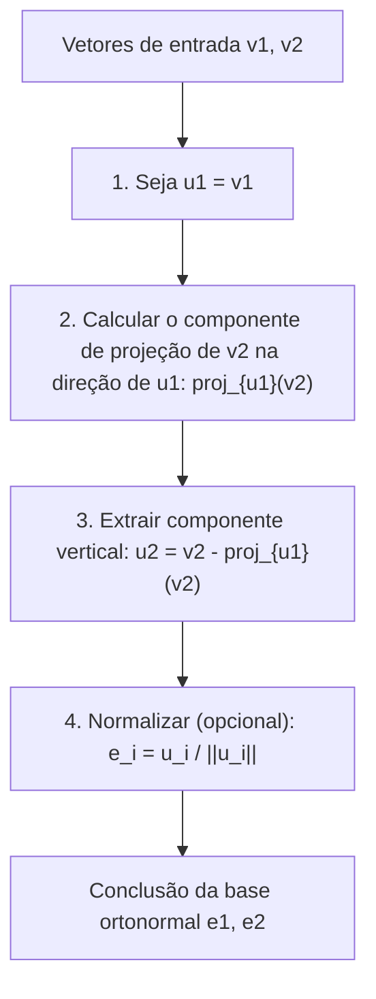
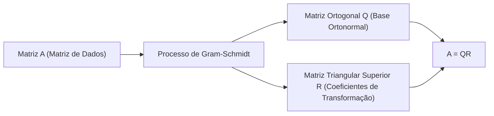

Ao estudar álgebra linear, você inevitavelmente encontrará o conceito de "Base" que constrói um espaço vetorial. No entanto, os vetores de base obtidos a partir de problemas do mundo real ou conjuntos de dados frequentemente apontam em direções aleatórias e irregulares, cruzando-se em ângulos distorcidos ou tendo comprimentos drasticamente diferentes. Tais bases "distorcidas" são extremamente difíceis de manipular na análise teórica e no cálculo numérico por computadores.

É aqui que a estrela deste artigo, o **processo de ortogonalização de Gram-Schmidt**, entra em cena. Este algoritmo é um método extremamente poderoso e versátil para transformar sistematicamente e moldar um conjunto de vetores de base distorcidos que abrangem um espaço em uma bela **Base Ortonormal**, onde os vetores são mutuamente ortogonais (perpendiculares) e de comprimento uniforme (normalizados para 1).

Neste artigo, exploraremos exaustivamente o processo de ortogonalização de Gram-Schmidt com grandes detalhes, partindo da intuição geométrica básica, progredindo para uma formulação matemática rigorosa, introduzindo um algoritmo aprimorado considerando a "estabilidade numérica" para cálculos de computador e estendendo-se a aplicações em espaços de funções e sua conexão com a decomposição QR no aprendizado de máquina.

## 1. Introdução: Por que a "Ortogonalidade" é desejável?

Antes de mergulhar nas etapas específicas do processo de ortogonalização de Gram-Schmidt, vamos esclarecer nossa motivação: por que queremos tornar os vetores ortogonais (cruzando-se perpendicularmente) em primeiro lugar?

Em matemática e engenharia, uma base ortogonalizada, especialmente uma **base ortonormal** normalizada para um comprimento de 1, traz inúmeras vantagens.

1. **Simplificação massiva de cálculos** : Quando os vetores são representados usando uma base ortonormal, os cálculos para produtos escalares, normas (comprimentos) e distâncias entre vetores podem ser concluídos completamente com simples multiplicação e adição de componentes correspondentes. Isso ocorre porque todos os termos cruzados tediosos se tornam zero.
2. **Projeções extremamente simples** : Quando você deseja projetar um vetor em um subespaço específico para aproximação, se a base for mutuamente ortogonal, você simplesmente calcula as projeções unidimensionais em cada vetor base individualmente e as soma para obter o vetor de projeção correto.
3. **Estabilidade numérica aprimorada** : Ao realizar aritmética de ponto flutuante em computadores, as transformações usando matrizes ortogonais (matrizes cujos vetores coluna formam uma base ortonormal) têm a maravilhosa propriedade (isometria) de serem menos propensas à perda de informações ou amplificação de erros. Isso é criticamente importante para a operação estável em algoritmos de aprendizado de máquina e processamento de sinais.

## 2. Intuição Geométrica: "Projeção" e "Subtração" no Espaço 2D

A ideia central do processo de ortogonalização de Gram-Schmidt pode ser resumida em uma frase: **"subtrair e remover os componentes direcionais de vetores ortogonais já criados do novo vetor."**

Vamos pegar dois vetores $\mathbf{v}_1, \mathbf{v}_2$ em um plano 2D como o exemplo mais fácil de imaginar. Suponha que eles sejam linearmente independentes (não paralelos e nenhum deles é um vetor nulo). A partir desses dois vetores, criaremos novos vetores mutuamente ortogonais $\mathbf{u}_1, \mathbf{u}_2$.

1. **Adotar o primeiro vetor como está** :
   Primeiro, como ponto de partida, use o primeiro vetor diretamente como o primeiro vetor da nova base.
   $$ \mathbf{u}_1 = \mathbf{v}_1 $$

2. **Subtrair o componente direcional do primeiro vetor do próximo vetor** :
   A seguir, queremos que o segundo vetor $\mathbf{v}_2$ seja perpendicular a $\mathbf{u}_1$. Para isso, só precisamos remover o "componente paralelo a $\mathbf{u}_1$" que $\mathbf{v}_2$ possui.
   Este "componente paralelo a $\mathbf{u}_1$" é chamado de **Projeção Ortogonal** de $\mathbf{v}_2$ em $\mathbf{u}_1$.

   O vetor de projeção é calculado da seguinte forma:
   $$ \text{proj}_{\mathbf{u}_1}(\mathbf{v}_2) = \frac{\langle \mathbf{v}_2, \mathbf{u}_1 \rangle}{\langle \mathbf{u}_1, \mathbf{u}_1 \rangle} \mathbf{u}_1 $$
   Aqui, $\langle \cdot, \cdot \rangle$ representa o produto escalar dos vetores.

   Subtraindo este componente de projeção do $\mathbf{v}_2$ original, obtemos $\mathbf{u}_2$, que é completamente perpendicular a $\mathbf{u}_1$.
   $$ \mathbf{u}_2 = \mathbf{v}_2 - \text{proj}_{\mathbf{u}_1}(\mathbf{v}_2) $$

O diagrama abaixo representa visualmente esse processo geométrico de "projetar e subtrair".



## 3. Formulação Matemática: Extensão para dimensões gerais

Generalizamos a ideia anterior em 2D para um conjunto de $k$ vetores em um espaço arbitrário de $n$ dimensões. Dado um conjunto de vetores linearmente independentes $\{ \mathbf{v}_1, \mathbf{v}_2, \dots, \mathbf{v}_k \}$ no espaço vetorial $V$. O procedimento para construir uma base ortogonal $\{ \mathbf{u}_1, \mathbf{u}_2, \dots, \mathbf{u}_k \}$ a partir deles (Gram-Schmidt Clássico, CGS) é formulado da seguinte maneira:

$$
\begin{aligned}
\mathbf{u}_1 &= \mathbf{v}_1 \\
\mathbf{u}_2 &= \mathbf{v}_2 - \text{proj}_{\mathbf{u}_1}(\mathbf{v}_2) \\
\mathbf{u}_3 &= \mathbf{v}_3 - \text{proj}_{\mathbf{u}_1}(\mathbf{v}_3) - \text{proj}_{\mathbf{u}_2}(\mathbf{v}_3) \\
&\vdots \\
\mathbf{u}_k &= \mathbf{v}_k - \sum_{j=1}^{k-1} \text{proj}_{\mathbf{u}_j}(\mathbf{v}_k)
\end{aligned}
$$

Em outras palavras, para criar o $i$-ésimo vetor ortogonal $\mathbf{u}_i$, você simplesmente precisa **subtrair todos os componentes de projeção em todos os vetores ortogonais já gerados $\mathbf{u}_1, \dots, \mathbf{u}_{i-1}$** do vetor original $\mathbf{v}_i$.

Finalmente, unificando os comprimentos dos vetores ortogonais obtidos para 1 (normalizando), a base ortonormal $\{ \mathbf{e}_1, \mathbf{e}_2, \dots, \mathbf{e}_k \}$ é concluída.

$$ \mathbf{e}_i = \frac{\mathbf{u}_i}{\|\mathbf{u}_i\|} $$

## 4. Cálculo manual com um exemplo concreto (Espaço 3D)

Para aprofundar nossa compreensão, vamos traçar o processo de ortogonalização de três vetores no espaço 3D manualmente.

Suponha que recebemos os seguintes três vetores linearmente independentes como um estado inicial:

$$ \mathbf{v}_1 = \begin{pmatrix} 1 \\ 1 \\ 0 \end{pmatrix}, \quad \mathbf{v}_2 = \begin{pmatrix} 1 \\ 0 \\ 1 \end{pmatrix}, \quad \mathbf{v}_3 = \begin{pmatrix} 0 \\ 1 \\ 1 \end{pmatrix} $$

**Passo 1:**
Use o primeiro vetor como está.
$$ \mathbf{u}_1 = \mathbf{v}_1 = \begin{pmatrix} 1 \\ 1 \\ 0 \end{pmatrix} $$

**Passo 2:**
Subtraia a projeção em $\mathbf{u}_1$ de $\mathbf{v}_2$.
Calculando os produtos escalares: $\langle \mathbf{v}_2, \mathbf{u}_1 \rangle = 1 \times 1 + 0 \times 1 + 1 \times 0 = 1$, e $\langle \mathbf{u}_1, \mathbf{u}_1 \rangle = 1^2 + 1^2 + 0^2 = 2$.
$$ \mathbf{u}_2 = \mathbf{v}_2 - \frac{\langle \mathbf{v}_2, \mathbf{u}_1 \rangle}{\langle \mathbf{u}_1, \mathbf{u}_1 \rangle} \mathbf{u}_1 = \begin{pmatrix} 1 \\ 0 \\ 1 \end{pmatrix} - \frac{1}{2} \begin{pmatrix} 1 \\ 1 \\ 0 \end{pmatrix} = \begin{pmatrix} 1/2 \\ -1/2 \\ 1 \end{pmatrix} $$

Para simplificar o cálculo manual, multiplique $\mathbf{u}_2$ por uma constante (vezes 2) para eliminar as frações. Isso não afeta a ortogonalidade.
$$ \mathbf{u}_2' = \begin{pmatrix} 1 \\ -1 \\ 2 \end{pmatrix} $$

**Passo 3:**
Subtraia os componentes direcionais de $\mathbf{u}_1$ e $\mathbf{u}_2'$ de $\mathbf{v}_3$.
$\langle \mathbf{v}_3, \mathbf{u}_1 \rangle = 0 \times 1 + 1 \times 1 + 1 \times 0 = 1$
$\langle \mathbf{v}_3, \mathbf{u}_2' \rangle = 0 \times 1 + 1 \times (-1) + 1 \times 2 = 1$
$\langle \mathbf{u}_2', \mathbf{u}_2' \rangle = 1^2 + (-1)^2 + 2^2 = 6$

$$ \mathbf{u}_3 = \mathbf{v}_3 - \frac{\langle \mathbf{v}_3, \mathbf{u}_1 \rangle}{\langle \mathbf{u}_1, \mathbf{u}_1 \rangle} \mathbf{u}_1 - \frac{\langle \mathbf{v}_3, \mathbf{u}_2' \rangle}{\langle \mathbf{u}_2', \mathbf{u}_2' \rangle} \mathbf{u}_2' $$
$$ \mathbf{u}_3 = \begin{pmatrix} 0 \\ 1 \\ 1 \end{pmatrix} - \frac{1}{2} \begin{pmatrix} 1 \\ 1 \\ 0 \end{pmatrix} - \frac{1}{6} \begin{pmatrix} 1 \\ -1 \\ 2 \end{pmatrix} = \begin{pmatrix} -2/3 \\ 2/3 \\ 2/3 \end{pmatrix} $$

Multiplicar isso por uma constante (vezes $-3/2$) também o torna um vetor inteiro elegante.
$$ \mathbf{u}_3' = \begin{pmatrix} 1 \\ -1 \\ -1 \end{pmatrix} $$

Agora, obtivemos três vetores mutuamente ortogonais $\{ \mathbf{u}_1, \mathbf{u}_2', \mathbf{u}_3' \}$. Finalmente, dividi-los por seus respectivos comprimentos produz uma base ortonormal.

## 5. Armadilhas na Computação Numérica: Erros de arredondamento e o "Processo de Gram-Schmidt Modificado"

Embora teoricamente perfeito, o processo de Gram-Schmidt encontra um problema significativo quando implementado como um programa de computador: **"Erro de Arredondamento"** devido à aritmética de ponto flutuante.

No método Clássico de Gram-Schmidt (CGS) descrito acima, os componentes de projeção a serem subtraídos do vetor $\mathbf{v}_k$ são todos calculados de forma independente a partir dos produtos internos do **$\mathbf{u}_j$ já calculado e do $\mathbf{v}_k$ original**, e subtraídos todos de uma vez no final. No entanto, sabe-se que, à medida que a dimensionalidade aumenta ou o número de vetores cresce, pequenos erros de arredondamento se acumulam e o conjunto de vetores resultante **perde sua ortogonalidade (causando falha de ortogonalidade)**.

Para superar essa falha matemática, o **Processo de Gram-Schmidt Modificado (MGS)** foi concebido.

A abordagem do MGS não é realizar subtrações em paralelo, mas sim **atualizar sequencialmente**.
Especificamente, ao criar um novo vetor, primeiro subtraia o componente $\mathbf{u}_1$ de $\mathbf{v}_k$, então subtraia o componente $\mathbf{u}_2$ **desse resultado (o vetor atualizado)**, e subtraia ainda mais o componente $\mathbf{u}_3$ **desse resultado subsequente**, e assim por diante. Em cada passo, a próxima projeção é calculada enquanto o vetor é atualizado.

Embora pareça apenas uma pequena diferença quando expressa em fórmulas, essa "atualização sequencial" cria o efeito de corrigir o erro ortogonal gerado no passo anterior durante o próximo passo, melhorando drasticamente a estabilidade numérica. Em bibliotecas modernas de computação numérica, este MGS (ou transformações de Householder) é sempre usado para o processo de ortogonalização.

## 6. Comparação de Implementações em Python

Para esclarecer a diferença teórica, vamos implementar tanto CGS quanto MGS usando Python e NumPy.

```python
import numpy as np

def classical_gram_schmidt(V):
    """
    Gram-Schmidt Clássico (CGS)
    V: Matriz onde os vetores coluna são a base
    """
    n, k = V.shape
    U = np.zeros((n, k), dtype=float)
    
    for i in range(k):
        v = V[:, i]
        # Subtrair projeções em todas as direções u_j anteriores de v
        for j in range(i):
            u_j = U[:, j]
            # Calcular o componente de projeção
            projection = (np.dot(v, u_j) / np.dot(u_j, u_j)) * u_j
            v = v - projection
        U[:, i] = v
        
    # Normalizar
    E = U / np.linalg.norm(U, axis=0)
    return E

def modified_gram_schmidt(V):
    """
    Gram-Schmidt Modificado (MGS) - Numericamente estável
    V: Matriz onde os vetores coluna são a base
    """
    n, k = V.shape
    E = np.zeros((n, k), dtype=float)
    # Copiar V para evitar modificar os valores originais
    V_work = V.copy().astype(float) 
    
    for i in range(k):
        # Normalizar o vetor atual para ser e_i
        v = V_work[:, i]
        E[:, i] = v / np.linalg.norm(v)
        
        # Subtrair (atualizar) sequencialmente o componente e_i de todos os vetores não processados restantes
        for j in range(i + 1, k):
            projection = np.dot(V_work[:, j], E[:, i]) * E[:, i]
            V_work[:, j] = V_work[:, j] - projection
            
    return E
```

Quando uma matriz mal condicionada (perto de ser singular) é inserida, a base gerada pelo CGS falha em ter produtos internos de 0, quebrando a ortogonalidade, enquanto o MGS mantém a ortogonalidade com alta precisão. Na prática, é altamente recomendável usar sempre o MGS.

## 7. Aplicação Avançada 1: Aplicação em Polinômios Ortogonais

O que torna o processo de Gram-Schmidt tão poderoso é que ele pode ser aplicado diretamente não apenas em espaços vetoriais geométricos de dimensão finita, mas também em **"espaços de funções"**.

Por exemplo, considere o conjunto de funções no intervalo $[-1, 1]$. Definimos o produto interno de duas funções $f(x), g(x)$ usando uma integral da seguinte forma:
$$ \langle f, g \rangle = \int_{-1}^{1} f(x)g(x) dx $$

Agora, vamos aplicar o processo de ortogonalização de Gram-Schmidt à base polinomial mais simples $\{ 1, x, x^2, x^3, \dots \}$.

* $\mathbf{u}_0(x) = 1$
* Calculando $\mathbf{u}_1(x) = x - \text{proj}_{\mathbf{u}_0}(x)$, visto que $\langle x, 1 \rangle = \int_{-1}^{1} x dx = 0$, temos $\mathbf{u}_1(x) = x$.
* Calcular $\mathbf{u}_2(x) = x^2 - \text{proj}_{\mathbf{u}_0}(x^2) - \text{proj}_{\mathbf{u}_1}(x^2)$ resulta em $\mathbf{u}_2(x) = x^2 - \frac{1}{3}$.

A sequência de polinômios ortogonais gerada desta forma é chamada de **polinômios de [Legendre](https://kenji.blog/pt/p/legendre/)**, e eles desempenham papéis extremamente importantes no eletromagnetismo e na mecânica quântica em física, bem como na integração numérica (quadratura Gaussiana). É um belo exemplo onde um algoritmo algébrico deriva naturalmente descrições de profundas leis físicas.

## 8. Aplicação Avançada 2: Decomposição QR e Ciência de Dados

A maior aplicação do processo de Gram-Schmidt em ciência de dados e aprendizado de máquina é, sem dúvida, a **Decomposição QR**.

A decomposição QR é um método de decompor uma matriz arbitrária $A$ no produto de uma matriz ortogonal $Q$ e uma matriz triangular superior $R$.
$$ A = QR $$

Esta operação de decomposição em si corresponde perfeitamente ao processo de aplicação do processo de ortogonalização de Gram-Schmidt a cada vetor coluna da matriz $A$.

* **Matriz $Q$**: Uma matriz formada pelo alinhamento da base ortonormal $\{ \mathbf{e}_1, \dots, \mathbf{e}_k \}$ gerada pelo processo de Gram-Schmidt como vetores coluna. (Ela satisfaz $Q^T Q = I$)
* **Matriz $R$**: Uma matriz triangular superior cujos componentes são os "coeficientes (produtos internos)" ao expressar o vetor original $\mathbf{v}$ como uma combinação linear da nova base $\mathbf{e}$ em cada passo de ortogonalização.



No contexto do aprendizado de máquina, a decomposição QR é utilizada para realizar os cálculos do "método dos mínimos quadrados" de forma estável e rápida para encontrar parâmetros ideais na análise de regressão múltipla. A abordagem de resolver a equação normal ($A^T A \mathbf{x} = A^T \mathbf{b}$) diretamente é evitada como padrão na prática porque o número de condição da matriz $A^T A$ piora facilmente, tornando-a extremamente vulnerável a erros numéricos. Em vez disso, a prática padrão é decompô-la como $A=QR$ e resolver $R \mathbf{x} = Q^T \mathbf{b}$ via substituição reversa.

## 9. Conclusão: A Beleza de um Espaço Realinhado

Neste artigo, explicamos amplamente o processo de ortogonalização de Gram-Schmidt, desde o seu significado intuitivo até o cálculo matemático, as considerações para a estabilidade numérica e as aplicações em espaços de funções e aprendizado de máquina.

Espero que você tenha percebido o quão poderoso e amplo é o impacto da ideia simples e clara de "realinhar os eixos de coordenadas distorcidos em eixos nítidos e mutuamente perpendiculares". É belo como uma teoria matemática e indispensável como um algoritmo de análise de dados prático e moderno, executado por computadores. Pode-se dizer que é um dos pináculos para apreciar a profundidade da álgebra linear.

Por todos os meios, tente executar códigos de programa reais ou tente ortogonalizar outros polinômios manualmente para experimentar fisicamente a alegria matemática do espaço sendo refinado.
