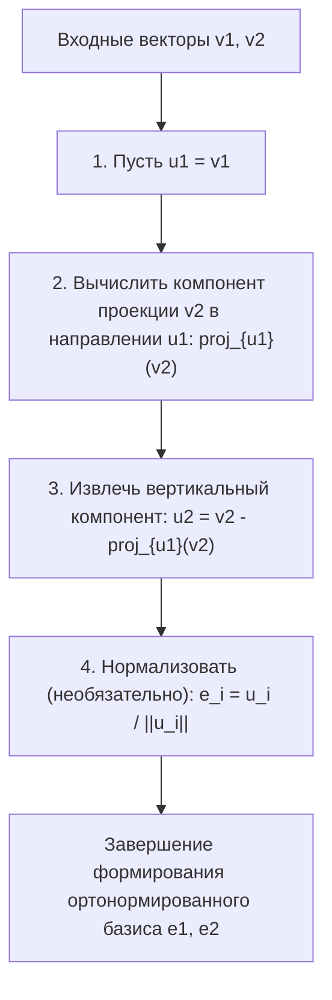
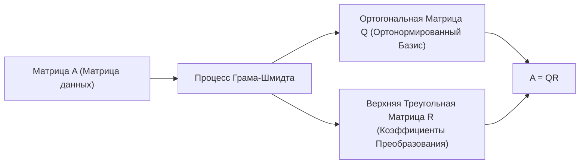

Изучая линейную алгебру, вы неизбежно столкнетесь с концепцией «Базиса», который образует векторное пространство. Однако базисные векторы, полученные из реальных задач или наборов данных, часто указывают в случайных, неправильных направлениях, пересекаются под искаженными углами или имеют кардинально разные длины. Такие «искаженные» базисы крайне сложно использовать в теоретическом анализе и численных вычислениях на компьютерах.

Здесь на сцену выходит главный герой этой статьи — **процесс ортогонализации Грама-Шмидта**. Этот алгоритм представляет собой чрезвычайно мощный и универсальный метод для систематического преобразования и формирования набора искаженных базисных векторов, охватывающих пространство, в прекрасный **ортонормированный базис**, где векторы взаимно ортогональны (перпендикулярны) и имеют одинаковую длину (нормализованы до 1).

В этой статье мы подробно рассмотрим процесс ортогонализации Грама-Шмидта, начиная с базовой геометрической интуиции, переходя к строгой математической формулировке, знакомясь с улучшенным алгоритмом, учитывающим «численную устойчивость» для компьютерных вычислений, и заканчивая применением в функциональных пространствах и его связью с QR-разложением в машинном обучении.

## 1. Введение: почему желательна «ортогональность»?

Прежде чем погрузиться в конкретные шаги процесса ортогонализации Грама-Шмидта, давайте проясним нашу мотивацию: почему мы вообще хотим, чтобы векторы были ортогональными (пересекались перпендикулярно)?

В математике и инженерии ортогонализированный базис, особенно **ортонормированный базис**, нормализованный до длины 1, дает бесчисленные преимущества.

1. **Массовое упрощение вычислений** : когда векторы представлены с использованием ортонормированного базиса, вычисления скалярных произведений, норм (длин) и расстояний между векторами могут быть полностью выполнены с помощью простого умножения и сложения соответствующих компонентов. Это связано с тем, что все утомительные перекрестные члены становятся равными нулю.
2. **Чрезвычайно простые проекции** : когда вы хотите спроецировать вектор на определенное подпространство для аппроксимации, если базис взаимно ортогонален, вы просто вычисляете одномерные проекции на каждый базисный вектор по отдельности и складываете их, чтобы получить правильный вектор проекции.
3. **Улучшенная численная устойчивость** : при выполнении арифметики с плавающей запятой на компьютерах преобразования с использованием ортогональных матриц (матриц, чьи векторы-столбцы образуют ортонормированный базис) обладают замечательным свойством (изометрией) быть менее подверженными потере информации или усилению ошибок. Это критически важно для стабильной работы алгоритмов машинного обучения и обработки сигналов.

## 2. Геометрическая интуиция: «Проекция» и «Вычитание» в 2D-пространстве

Основную идею процесса ортогонализации Грама-Шмидта можно резюмировать одной фразой: **«вычитание и удаление направленных компонентов уже созданных ортогональных векторов из нового вектора».**

Возьмем два вектора $\mathbf{v}_1, \mathbf{v}_2$ на 2D-плоскости как самый простой для понимания пример. Предположим, что они линейно независимы (не параллельны, и ни один из них не является нулевым вектором). Из этих двух векторов мы создадим новые взаимно ортогональные векторы $\mathbf{u}_1, \mathbf{u}_2$.

1. **Принять первый вектор как есть** :
   Сначала, в качестве отправной точки, используйте первый вектор непосредственно как первый вектор нового базиса.
   $$ \mathbf{u}_1 = \mathbf{v}_1 $$

2. **Вычесть направленный компонент первого вектора из следующего вектора** :
   Далее мы хотим, чтобы второй вектор $\mathbf{v}_2$ был перпендикулярен $\mathbf{u}_1$. Для этого нам просто нужно удалить «компонент, параллельный $\mathbf{u}_1$», которым обладает $\mathbf{v}_2$.
   Этот «компонент, параллельный $\mathbf{u}_1$», называется **ортогональной проекцией** $\mathbf{v}_2$ на $\mathbf{u}_1$.

   Вектор проекции вычисляется следующим образом:
   $$ \text{proj}_{\mathbf{u}_1}(\mathbf{v}_2) = \frac{\langle \mathbf{v}_2, \mathbf{u}_1 \rangle}{\langle \mathbf{u}_1, \mathbf{u}_1 \rangle} \mathbf{u}_1 $$
   Здесь $\langle \cdot, \cdot \rangle$ представляет собой скалярное произведение векторов.

   Вычитая этот компонент проекции из исходного $\mathbf{v}_2$, мы получаем $\mathbf{u}_2$, который полностью перпендикулярен $\mathbf{u}_1$.
   $$ \mathbf{u}_2 = \mathbf{v}_2 - \text{proj}_{\mathbf{u}_1}(\mathbf{v}_2) $$

На приведенной ниже диаграмме этот геометрический процесс «проектирования и вычитания» представлен визуально.



## 3. Математическая формулировка: Расширение на общие размерности

Мы обобщаем предыдущую идею в 2D на набор из $k$ векторов в произвольном $n$-мерном пространстве. Задан набор линейно независимых векторов $\{ \mathbf{v}_1, \mathbf{v}_2, \dots, \mathbf{v}_k \}$ в векторном пространстве $V$. Процедура построения ортогонального базиса $\{ \mathbf{u}_1, \mathbf{u}_2, \dots, \mathbf{u}_k \}$ из них (Классический метод Грама-Шмидта, CGS) формулируется следующим образом:

$$
\begin{aligned}
\mathbf{u}_1 &= \mathbf{v}_1 \\
\mathbf{u}_2 &= \mathbf{v}_2 - \text{proj}_{\mathbf{u}_1}(\mathbf{v}_2) \\
\mathbf{u}_3 &= \mathbf{v}_3 - \text{proj}_{\mathbf{u}_1}(\mathbf{v}_3) - \text{proj}_{\mathbf{u}_2}(\mathbf{v}_3) \\
&\vdots \\
\mathbf{u}_k &= \mathbf{v}_k - \sum_{j=1}^{k-1} \text{proj}_{\mathbf{u}_j}(\mathbf{v}_k)
\end{aligned}
$$

Другими словами, чтобы создать $i$-й ортогональный вектор $\mathbf{u}_i$, вам просто нужно **вычесть все компоненты проекции на все уже сгенерированные ортогональные векторы $\mathbf{u}_1, \dots, \mathbf{u}_{i-1}$** из исходного вектора $\mathbf{v}_i$.

Наконец, путем унификации длин полученных ортогональных векторов к 1 (нормализации), ортонормированный базис $\{ \mathbf{e}_1, \mathbf{e}_2, \dots, \mathbf{e}_k \}$ завершается.

$$ \mathbf{e}_i = \frac{\mathbf{u}_i}{\|\mathbf{u}_i\|} $$

## 4. Расчет вручную на конкретном примере (3D-пространство)

Чтобы углубить наше понимание, давайте проследим процесс ортогонализации трех векторов в трехмерном пространстве вручную.

Предположим, в качестве начального состояния нам даны следующие три линейно независимых вектора:

$$ \mathbf{v}_1 = \begin{pmatrix} 1 \\ 1 \\ 0 \end{pmatrix}, \quad \mathbf{v}_2 = \begin{pmatrix} 1 \\ 0 \\ 1 \end{pmatrix}, \quad \mathbf{v}_3 = \begin{pmatrix} 0 \\ 1 \\ 1 \end{pmatrix} $$

**Шаг 1:**
Используйте первый вектор как есть.
$$ \mathbf{u}_1 = \mathbf{v}_1 = \begin{pmatrix} 1 \\ 1 \\ 0 \end{pmatrix} $$

**Шаг 2:**
Вычтите проекцию на $\mathbf{u}_1$ из $\mathbf{v}_2$.
Вычисление скалярных произведений: $\langle \mathbf{v}_2, \mathbf{u}_1 \rangle = 1 \times 1 + 0 \times 1 + 1 \times 0 = 1$, и $\langle \mathbf{u}_1, \mathbf{u}_1 \rangle = 1^2 + 1^2 + 0^2 = 2$.
$$ \mathbf{u}_2 = \mathbf{v}_2 - \frac{\langle \mathbf{v}_2, \mathbf{u}_1 \rangle}{\langle \mathbf{u}_1, \mathbf{u}_1 \rangle} \mathbf{u}_1 = \begin{pmatrix} 1 \\ 0 \\ 1 \end{pmatrix} - \frac{1}{2} \begin{pmatrix} 1 \\ 1 \\ 0 \end{pmatrix} = \begin{pmatrix} 1/2 \\ -1/2 \\ 1 \end{pmatrix} $$

Чтобы упростить ручной расчет, умножьте $\mathbf{u}_2$ на константу (на 2), чтобы избавиться от дробей. Это не влияет на ортогональность.
$$ \mathbf{u}_2' = \begin{pmatrix} 1 \\ -1 \\ 2 \end{pmatrix} $$

**Шаг 3:**
Вычтите направленные компоненты как $\mathbf{u}_1$, так и $\mathbf{u}_2'$ из $\mathbf{v}_3$.
$\langle \mathbf{v}_3, \mathbf{u}_1 \rangle = 0 \times 1 + 1 \times 1 + 1 \times 0 = 1$
$\langle \mathbf{v}_3, \mathbf{u}_2' \rangle = 0 \times 1 + 1 \times (-1) + 1 \times 2 = 1$
$\langle \mathbf{u}_2', \mathbf{u}_2' \rangle = 1^2 + (-1)^2 + 2^2 = 6$

$$ \mathbf{u}_3 = \mathbf{v}_3 - \frac{\langle \mathbf{v}_3, \mathbf{u}_1 \rangle}{\langle \mathbf{u}_1, \mathbf{u}_1 \rangle} \mathbf{u}_1 - \frac{\langle \mathbf{v}_3, \mathbf{u}_2' \rangle}{\langle \mathbf{u}_2', \mathbf{u}_2' \rangle} \mathbf{u}_2' $$
$$ \mathbf{u}_3 = \begin{pmatrix} 0 \\ 1 \\ 1 \end{pmatrix} - \frac{1}{2} \begin{pmatrix} 1 \\ 1 \\ 0 \end{pmatrix} - \frac{1}{6} \begin{pmatrix} 1 \\ -1 \\ 2 \end{pmatrix} = \begin{pmatrix} -2/3 \\ 2/3 \\ 2/3 \end{pmatrix} $$

Умножение этого на константу (на $-3/2$) также делает его аккуратным целочисленным вектором.
$$ \mathbf{u}_3' = \begin{pmatrix} 1 \\ -1 \\ -1 \end{pmatrix} $$

Теперь мы получили три взаимно ортогональных вектора $\{ \mathbf{u}_1, \mathbf{u}_2', \mathbf{u}_3' \}$. Наконец, разделив их на их соответствующие длины, мы получим ортонормированный базис.

## 5. Подводные камни в численных вычислениях: Ошибки округления и «Модифицированный процесс Грама-Шмидта»

Хотя теоретически процесс Грама-Шмидта идеален, он сталкивается с серьезной проблемой при реализации в виде компьютерной программы: **«Ошибкой округления»** из-за арифметики с плавающей запятой.

В классическом методе Грама-Шмидта (CGS), описанном выше, компоненты проекции, которые нужно вычесть из вектора $\mathbf{v}_k$, все рассчитываются независимо из внутренних произведений **уже вычисленного $\mathbf{u}_j$ и исходного $\mathbf{v}_k$**, и вычитаются все сразу в конце. Однако известно, что по мере увеличения размерности или роста количества векторов накапливаются небольшие ошибки округления, и полученный набор векторов **теряет свою ортогональность (вызывая нарушение ортогональности)**.

Для преодоления этого математического недостатка был разработан **Модифицированный процесс Грама-Шмидта (MGS)**.

Подход MGS заключается не в параллельном выполнении вычитаний, а в **последовательном обновлении**.
В частности, при создании нового вектора сначала вычтите компонент $\mathbf{u}_1$ из $\mathbf{v}_k$, затем вычтите компонент $\mathbf{u}_2$ из **этого результата (обновленного вектора)**, и далее вычтите компонент $\mathbf{u}_3$ из **этого последующего результата**, и так далее. На каждом шаге вычисляется следующая проекция, пока вектор обновляется.

Хотя в формулах это выглядит лишь как небольшая разница, такое «последовательное обновление» создает эффект исправления ортогональной ошибки, возникшей на предыдущем шаге, во время следующего шага, резко повышая численную устойчивость. В современных библиотеках численных вычислений для процесса ортогонализации всегда используется этот MGS (или преобразования Хаусхолдера).

## 6. Сравнение реализаций на Python

Чтобы прояснить теоретическую разницу, давайте реализуем как CGS, так и MGS, используя Python и NumPy.

```python
import numpy as np

def classical_gram_schmidt(V):
    """
    Классический процесс Грама-Шмидта (CGS)
    V: Матрица, столбцы которой являются базисом
    """
    n, k = V.shape
    U = np.zeros((n, k), dtype=float)
    
    for i in range(k):
        v = V[:, i]
        # Вычесть проекции на все предыдущие направления u_j из v
        for j in range(i):
            u_j = U[:, j]
            # Вычислить компонент проекции
            projection = (np.dot(v, u_j) / np.dot(u_j, u_j)) * u_j
            v = v - projection
        U[:, i] = v
        
    # Нормализация
    E = U / np.linalg.norm(U, axis=0)
    return E

def modified_gram_schmidt(V):
    """
    Модифицированный процесс Грама-Шмидта (MGS) - Численно устойчивый
    V: Матрица, столбцы которой являются базисом
    """
    n, k = V.shape
    E = np.zeros((n, k), dtype=float)
    # Копировать V, чтобы избежать изменения исходных значений
    V_work = V.copy().astype(float) 
    
    for i in range(k):
        # Нормализовать текущий вектор, чтобы он стал e_i
        v = V_work[:, i]
        E[:, i] = v / np.linalg.norm(v)
        
        # Последовательно вычесть (обновить) компонент e_i из всех оставшихся необработанных векторов
        for j in range(i + 1, k):
            projection = np.dot(V_work[:, j], E[:, i]) * E[:, i]
            V_work[:, j] = V_work[:, j] - projection
            
    return E
```

При подаче на вход плохо обусловленной (близкой к вырожденной) матрицы базис, сгенерированный с помощью CGS, не имеет скалярных произведений, равных 0, что нарушает ортогональность, в то время как MGS сохраняет ортогональность с высокой точностью. На практике настоятельно рекомендуется всегда использовать MGS.

## 7. Продвинутое применение 1: Применение к ортогональным полиномам

Процесс Грама-Шмидта настолько мощный, что его можно напрямую применять не только к конечномерным геометрическим векторным пространствам, но и к **«функциональным пространствам»**.

Например, рассмотрим множество функций на интервале $[-1, 1]$. Мы определяем скалярное произведение двух функций $f(x), g(x)$ с помощью интеграла следующим образом:
$$ \langle f, g \rangle = \int_{-1}^{1} f(x)g(x) dx $$

Теперь применим процесс ортогонализации Грама-Шмидта к простейшему полиномиальному базису $\{ 1, x, x^2, x^3, \dots \}$.

* $\mathbf{u}_0(x) = 1$
* Вычисляя $\mathbf{u}_1(x) = x - \text{proj}_{\mathbf{u}_0}(x)$, поскольку $\langle x, 1 \rangle = \int_{-1}^{1} x dx = 0$, мы получаем $\mathbf{u}_1(x) = x$.
* Вычисление $\mathbf{u}_2(x) = x^2 - \text{proj}_{\mathbf{u}_0}(x^2) - \text{proj}_{\mathbf{u}_1}(x^2)$ дает $\mathbf{u}_2(x) = x^2 - \frac{1}{3}$.

Последовательность ортогональных полиномов, сгенерированная таким образом, называется **полиномами Лежандра**, и они играют чрезвычайно важную роль в электромагнетизме и квантовой механике в физике, а также в численном интегрировании (квадратура Гаусса). Это прекрасный пример того, как алгебраический алгоритм естественным образом выводит описания глубоких физических законов.

## 8. Продвинутое применение 2: QR-разложение и наука о данных

Самым большим применением процесса Грама-Шмидта в науке о данных и машинном обучении, несомненно, является **QR-разложение**.

QR-разложение — это метод разложения произвольной матрицы $A$ в произведение ортогональной матрицы $Q$ и верхней треугольной матрицы $R$.
$$ A = QR $$

Сама эта операция разложения полностью совпадает с процессом применения процесса ортогонализации Грама-Шмидта к каждому вектору-столбцу матрицы $A$.

* **Матрица $Q$**: Матрица, образованная путем выравнивания ортонормированного базиса $\{ \mathbf{e}_1, \dots, \mathbf{e}_k \}$, сгенерированного процессом Грама-Шмидта в виде векторов-столбцов. (Удовлетворяет $Q^T Q = I$)
* **Матрица $R$**: Верхняя треугольная матрица, компонентами которой являются «коэффициенты (скалярные произведения)» при выражении исходного вектора $\mathbf{v}$ как линейной комбинации нового базиса $\mathbf{e}$ на каждом шаге ортогонализации.



В контексте машинного обучения QR-разложение используется для стабильного и быстрого выполнения вычислений «метода наименьших квадратов» с целью поиска оптимальных параметров в множественном регрессионном анализе. Подход к непосредственному решению нормального уравнения ($A^T A \mathbf{x} = A^T \mathbf{b}$) на практике обычно избегают, поскольку число обусловленности матрицы $A^T A$ легко ухудшается, что делает ее крайне уязвимой для численных ошибок. Вместо этого стандартной практикой является ее разложение как $A=QR$ и решение $R \mathbf{x} = Q^T \mathbf{b}$ путем обратной подстановки.

## 9. Заключение: Красота перестроенного пространства

В этой статье мы подробно объяснили процесс ортогонализации Грама-Шмидта, от его интуитивного смысла до математических расчетов, соображений численной устойчивости и применений к функциональным пространствам и машинному обучению.

Надеюсь, вы осознали, насколько мощным и широким является влияние простой и понятной идеи «перестроить искаженные оси координат в аккуратные, взаимно перпендикулярные оси». Это прекрасно как математическая теория и незаменимо как современный практический алгоритм анализа данных, выполняемый компьютерами. Можно сказать, что это одна из вершин понимания глубины линейной алгебры.

Непременно попробуйте выполнить реальные программные коды или попытайтесь ортогонализировать другие полиномы вручную, чтобы физически испытать математическую радость от очищения пространства.

