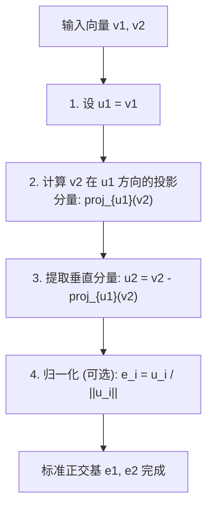
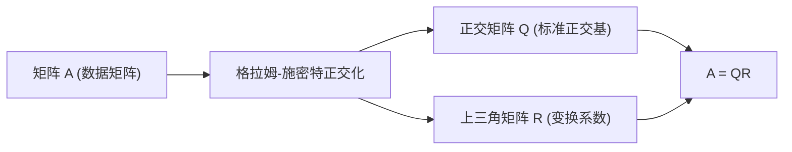

在学习线性代数的过程中，你必然会接触到构成向量空间的“基（Basis）”这一概念。然而，从现实问题或数据集中获得的基向量通常指向随机、不规则的方向，它们往往倾斜相交，或者长度差异巨大。这种“扭曲”的基在理论分析和计算机数值计算中都极难处理。

这时，本文的主角—— **格拉姆-施密特正交化 (Gram-Schmidt orthogonalization process)** 就登场了。该算法是一种极其强大且通用的方法，它能够系统地将张成空间的扭曲基向量，转换为相互正交（垂直）且长度统一定为 1 的优美 **正交基（Orthonormal Basis）** 。

在本文中，我们将极其深入地探讨格拉姆-施密特正交化，从基础的几何直觉开始，逐步深入到严谨的数学公式、考虑计算机计算“数值稳定性”的改进算法，再到其在函数空间中的应用以及与机器学习中QR分解的联系，为你呈现一篇超长篇幅的详尽解析。

## 1. 引言：为什么我们喜欢“正交”？

在进入格拉姆-施密特正交化的具体步骤之前，让我们先明确动机：到底为什么我们想要让向量正交（垂直相交）呢？

在数学和工程学中，正交化的基，特别是长度归一化为 1 的 **标准正交基** ，能带来数不胜数的优势。

1. **极大简化计算** ：当使用标准正交基来表示向量时，向量的内积、范数（长度）以及向量间距离的计算，都可以完全通过对应分量之间简单的乘法和加法来完成。这是因为所有繁琐的交叉项都变成了零。
2. **极其简单的投影** ：当你希望将一个向量投影到特定子空间进行近似时，如果基是相互正交的，你只需分别计算在每个基向量上的一维投影，然后将它们简单相加，就能得到正确的投影向量。
3. **提高数值稳定性** ：在计算机上进行浮点运算时，使用正交矩阵（列向量为标准正交基的矩阵）进行的变换具有不易引起信息丢失或误差放大的优良性质（等距变换）。这对于确保机器学习和信号处理算法的稳定运行至关重要。

## 2. 几何直觉：二维空间中的“投影”与“减法”

格拉姆-施密特正交化的核心思想，用一句话概括就是： **“从新向量中，减去并剔除已生成的正交向量的方向分量。”**

让我们以最容易想象的二维平面上的两个向量 $\mathbf{v}_1, \mathbf{v}_2$ 为例。假设它们是线性无关的（不平行，且都不是零向量）。我们将从这两个向量中，构造出相互正交的新向量 $\mathbf{u}_1, \mathbf{u}_2$。

1. **直接采用第一个向量** ：
   首先，作为起点，直接将第一个向量作为新基的第一个向量。
   $$ \mathbf{u}_1 = \mathbf{v}_1 $$

2. **从下一个向量中，减去第一个向量的方向分量** ：
   接下来，我们希望让第二个向量 $\mathbf{v}_2$ 垂直于 $\mathbf{u}_1$。为此，我们只需去除 $\mathbf{v}_2$ 中包含的“与 $\mathbf{u}_1$ 平行的分量”。
   这个“与 $\mathbf{u}_1$ 平行的分量”被称为 $\mathbf{v}_2$ 在 $\mathbf{u}_1$ 上的 **正交投影 (Orthogonal Projection)** 。

   投影向量的计算如下：
   $$ \text{proj}_{\mathbf{u}_1}(\mathbf{v}_2) = \frac{\langle \mathbf{v}_2, \mathbf{u}_1 \rangle}{\langle \mathbf{u}_1, \mathbf{u}_1 \rangle} \mathbf{u}_1 $$
   这里，$\langle \cdot, \cdot \rangle$ 表示向量的内积。

   通过从原始的 $\mathbf{v}_2$ 中减去这个投影分量，我们就能得到完全垂直于 $\mathbf{u}_1$ 的向量 $\mathbf{u}_2$。
   $$ \mathbf{u}_2 = \mathbf{v}_2 - \text{proj}_{\mathbf{u}_1}(\mathbf{v}_2) $$

下图将这种“投影并相减”的几何过程进行了可视化。



## 3. 数学公式：推广至一般维度

我们将前面二维空间中的思想推广到任意 $n$ 维空间中的 $k$ 个向量。假设在向量空间 $V$ 中，给定了一组线性无关的向量集合 $\{ \mathbf{v}_1, \mathbf{v}_2, \dots, \mathbf{v}_k \}$。由这些向量构造正交基 $\{ \mathbf{u}_1, \mathbf{u}_2, \dots, \mathbf{u}_k \}$ 的步骤（经典格拉姆-施密特正交化，CGS）公式化如下：

$$
\begin{aligned}
\mathbf{u}_1 &= \mathbf{v}_1 \\
\mathbf{u}_2 &= \mathbf{v}_2 - \text{proj}_{\mathbf{u}_1}(\mathbf{v}_2) \\
\mathbf{u}_3 &= \mathbf{v}_3 - \text{proj}_{\mathbf{u}_1}(\mathbf{v}_3) - \text{proj}_{\mathbf{u}_2}(\mathbf{v}_3) \\
&\vdots \\
\mathbf{u}_k &= \mathbf{v}_k - \sum_{j=1}^{k-1} \text{proj}_{\mathbf{u}_j}(\mathbf{v}_k)
\end{aligned}
$$

换句话说，为了创建第 $i$ 个正交向量 $\mathbf{u}_i$，你只需要从原向量 $\mathbf{v}_i$ 中， **减去它在所有已生成的正交向量 $\mathbf{u}_1, \dots, \mathbf{u}_{i-1}$ 上的所有投影分量** 。

最后，通过将得到的正交向量组的长度统一化为 1（归一化），即可完成标准正交基 $\{ \mathbf{e}_1, \mathbf{e}_2, \dots, \mathbf{e}_k \}$ 的构建。

$$ \mathbf{e}_i = \frac{\mathbf{u}_i}{\|\mathbf{u}_i\|} $$

## 4. 具体示例的手工计算 (三维空间)

为了加深理解，让我们通过手工计算，追踪一下三维空间中三个向量正交化的过程。

假设初始状态给定了以下三个线性无关的向量：

$$ \mathbf{v}_1 = \begin{pmatrix} 1 \\ 1 \\ 0 \end{pmatrix}, \quad \mathbf{v}_2 = \begin{pmatrix} 1 \\ 0 \\ 1 \end{pmatrix}, \quad \mathbf{v}_3 = \begin{pmatrix} 0 \\ 1 \\ 1 \end{pmatrix} $$

**步骤 1：**
第一个向量原样使用。
$$ \mathbf{u}_1 = \mathbf{v}_1 = \begin{pmatrix} 1 \\ 1 \\ 0 \end{pmatrix} $$

**步骤 2：**
从 $\mathbf{v}_2$ 中减去其在 $\mathbf{u}_1$ 上的投影。
计算内积：$\langle \mathbf{v}_2, \mathbf{u}_1 \rangle = 1 \times 1 + 0 \times 1 + 1 \times 0 = 1$，以及 $\langle \mathbf{u}_1, \mathbf{u}_1 \rangle = 1^2 + 1^2 + 0^2 = 2$。
$$ \mathbf{u}_2 = \mathbf{v}_2 - \frac{\langle \mathbf{v}_2, \mathbf{u}_1 \rangle}{\langle \mathbf{u}_1, \mathbf{u}_1 \rangle} \mathbf{u}_1 = \begin{pmatrix} 1 \\ 0 \\ 1 \end{pmatrix} - \frac{1}{2} \begin{pmatrix} 1 \\ 1 \\ 0 \end{pmatrix} = \begin{pmatrix} 1/2 \\ -1/2 \\ 1 \end{pmatrix} $$

为了简化计算，将 $\mathbf{u}_2$ 乘以一个常数（2倍）以消除分数。这不会影响正交性。
$$ \mathbf{u}_2' = \begin{pmatrix} 1 \\ -1 \\ 2 \end{pmatrix} $$

**步骤 3：**
从 $\mathbf{v}_3$ 中，分别减去其在 $\mathbf{u}_1$ 和 $\mathbf{u}_2'$ 方向上的分量。
$\langle \mathbf{v}_3, \mathbf{u}_1 \rangle = 0 \times 1 + 1 \times 1 + 1 \times 0 = 1$
$\langle \mathbf{v}_3, \mathbf{u}_2' \rangle = 0 \times 1 + 1 \times (-1) + 1 \times 2 = 1$
$\langle \mathbf{u}_2', \mathbf{u}_2' \rangle = 1^2 + (-1)^2 + 2^2 = 6$

$$ \mathbf{u}_3 = \mathbf{v}_3 - \frac{\langle \mathbf{v}_3, \mathbf{u}_1 \rangle}{\langle \mathbf{u}_1, \mathbf{u}_1 \rangle} \mathbf{u}_1 - \frac{\langle \mathbf{v}_3, \mathbf{u}_2' \rangle}{\langle \mathbf{u}_2', \mathbf{u}_2' \rangle} \mathbf{u}_2' $$
$$ \mathbf{u}_3 = \begin{pmatrix} 0 \\ 1 \\ 1 \end{pmatrix} - \frac{1}{2} \begin{pmatrix} 1 \\ 1 \\ 0 \end{pmatrix} - \frac{1}{6} \begin{pmatrix} 1 \\ -1 \\ 2 \end{pmatrix} = \begin{pmatrix} -2/3 \\ 2/3 \\ 2/3 \end{pmatrix} $$

同样为了便于处理，将其乘以一个常数（$-3/2$ 倍），就能得到一个整洁的整数向量。
$$ \mathbf{u}_3' = \begin{pmatrix} 1 \\ -1 \\ -1 \end{pmatrix} $$

至此，我们求得了三个相互正交的向量 $\{ \mathbf{u}_1, \mathbf{u}_2', \mathbf{u}_3' \}$。最后，将它们分别除以各自的长度，即可得到标准正交基。

## 5. 数值计算中的陷阱：舍入误差与“改进的格拉姆-施密特正交化”

虽然格拉姆-施密特正交化在理论上是完美的，但在作为计算机程序实现时会遇到一个严重问题：浮点运算导致的 **“舍入误差（Rounding Error）”** 。

在前述的经典格拉姆-施密特正交化 (CGS) 中，要从向量 $\mathbf{v}_k$ 中减去的投影分量，都是通过 **已计算出的 $\mathbf{u}_j$ 与原始 $\mathbf{v}_k$ 之间的内积** 独立计算出来的，最后再一口气全部减去。然而，当维度变高或向量数量增多时，微小的舍入误差会不断积累，导致最终生成的向量组 **失去正交性（发生正交性崩溃）** 。

为了克服这一数学缺陷，人们发明了 **改进的格拉姆-施密特正交化 (Modified Gram-Schmidt, MGS)** 。

MGS 的方法不是并行地进行减法运算，而是采用 **逐次更新** 的方式。
具体来说，在创建新向量时，首先从 $\mathbf{v}_k$ 中减去 $\mathbf{u}_1$ 的分量，然后针对 **该结果（更新后的向量）** 减去 $\mathbf{u}_2$ 的分量，接着再针对 **其后续结果** 减去 $\mathbf{u}_3$ 的分量……以此类推，在每一步中一边更新向量，一边计算下一个投影。

虽然在数学公式上看起来只是微小的差异，但这“逐次更新”的过程能在下一步中起到校正上一步所产生的正交误差的作用，从而使数值稳定性得到飞跃性的提升。在现代数值计算库中，正交化过程毫无例外地都会使用这种 MGS（或豪斯霍尔德变换）。

## 6. Python 实现的比较

为了明确理论上的差异，让我们使用 Python 和 NumPy 来实现 CGS 和 MGS。

```python
import numpy as np

def classical_gram_schmidt(V):
    """
    经典格拉姆-施密特正交化 (CGS)
    V: 列向量作为基的矩阵
    """
    n, k = V.shape
    U = np.zeros((n, k), dtype=float)
    
    for i in range(k):
        v = V[:, i]
        # 从 v 中减去在过去所有 u_j 方向上的投影
        for j in range(i):
            u_j = U[:, j]
            # 计算投影分量
            projection = (np.dot(v, u_j) / np.dot(u_j, u_j)) * u_j
            v = v - projection
        U[:, i] = v
        
    # 归一化
    E = U / np.linalg.norm(U, axis=0)
    return E

def modified_gram_schmidt(V):
    """
    改进的格拉姆-施密特正交化 (MGS) - 数值稳定
    V: 列向量作为基的矩阵
    """
    n, k = V.shape
    E = np.zeros((n, k), dtype=float)
    # 复制 V 以免修改原始值
    V_work = V.copy().astype(float) 
    
    for i in range(k):
        # 归一化当前向量，使其成为 e_i
        v = V_work[:, i]
        E[:, i] = v / np.linalg.norm(v)
        
        # 从后续所有未处理的向量中，逐次减去（更新） e_i 的分量
        for j in range(i + 1, k):
            projection = np.dot(V_work[:, j], E[:, i]) * E[:, i]
            V_work[:, j] = V_work[:, j] - projection
            
    return E
```

当输入条件恶劣（接近奇异矩阵）的矩阵时，CGS 生成的基其内积不为 0，正交性被破坏；而 MGS 却能保持极高精度的正交性。在实际业务中，强烈建议始终使用 MGS。

## 7. 高级应用一：应用于正交多项式

格拉姆-施密特正交化强大的地方在于，它不仅可以直接应用于有限维的几何向量空间，还能原封不动地应用于 **“函数空间”** 。

例如，考虑区间 $[-1, 1]$ 上的函数集合。我们利用积分来定义两个函数 $f(x), g(x)$ 的内积：
$$ \langle f, g \rangle = \int_{-1}^{1} f(x)g(x) dx $$

现在，让我们将格拉姆-施密特正交化应用于最简单的多项式基 $\{ 1, x, x^2, x^3, \dots \}$。

* $\mathbf{u}_0(x) = 1$
* 计算 $\mathbf{u}_1(x) = x - \text{proj}_{\mathbf{u}_0}(x)$，因为 $\langle x, 1 \rangle = \int_{-1}^{1} x dx = 0$，所以 $\mathbf{u}_1(x) = x$。
* 计算 $\mathbf{u}_2(x) = x^2 - \text{proj}_{\mathbf{u}_0}(x^2) - \text{proj}_{\mathbf{u}_1}(x^2)$，结果为 $\mathbf{u}_2(x) = x^2 - \frac{1}{3}$。

这样生成的正交多项式序列被称为 **勒让德多项式 (Legendre polynomials)** ，它们在物理学的电磁学、量子力学以及数值积分（高斯求积法）中扮演着极其重要的角色。代数算法能够自然而然地推导出深刻的物理定律描述，这是一个无比优美的范例。

## 8. 高级应用二：QR分解与数据科学

在数据科学和机器学习中，格拉姆-施密特正交化最大的应用，无疑是 **QR分解 (QR Decomposition)** 。

QR分解是指将任意矩阵 $A$ 分解为一个正交矩阵 $Q$ 和一个上三角矩阵 $R$ 的乘积的方法。
$$ A = QR $$

这种分解操作本身，就完全等同于对矩阵 $A$ 的各个列向量应用格拉姆-施密特正交化的过程。

* **$Q$ 矩阵** ：将通过格拉姆-施密特正交化生成的标准正交基 $\{ \mathbf{e}_1, \dots, \mathbf{e}_k \}$ 作为列向量排列而成的矩阵。（它满足 $Q^T Q = I$）
* **$R$ 矩阵** ：这是一个上三角矩阵，其成分是在正交化的每一步中，用新基 $\mathbf{e}$ 的线性组合来表示原向量 $\mathbf{v}$ 时所产生的“系数（内积）”。



在机器学习的语境下，为了在多元回归分析中稳定且高速地计算求出最优参数的“最小二乘法”，常常会用到QR分解。直接求解正规方程（$A^T A \mathbf{x} = A^T \mathbf{b}$）的方法，在实际应用中因为矩阵 $A^T A$ 的条件数容易恶化，对数值误差极为敏感，因此常规的做法是将其分解为 $A=QR$，然后通过回代求解 $R \mathbf{x} = Q^T \mathbf{b}$。

## 9. 结语：被重整空间的数学之美

在本文中，我们从直观含义到数学计算、对数值稳定性的考量，再到在函数空间及机器学习中的应用，广泛而深入地解析了格拉姆-施密特正交化。

“将扭曲的坐标轴重新排列为整齐的相互垂直的轴”，这个简单明了的想法，其影响力是多么强大和广泛，相信大家已经有所体会。格拉姆-施密特正交化，既是优美的数学理论，也是现代计算机执行实用数据分析不可或缺的核心算法。可以说，这是品味线性代数深奥之美的一个制高点。

强烈建议大家实际运行一下程序代码，或者尝试手工对其他多项式进行正交化计算，去亲身体验一下空间被洗练升华的数学乐趣。
