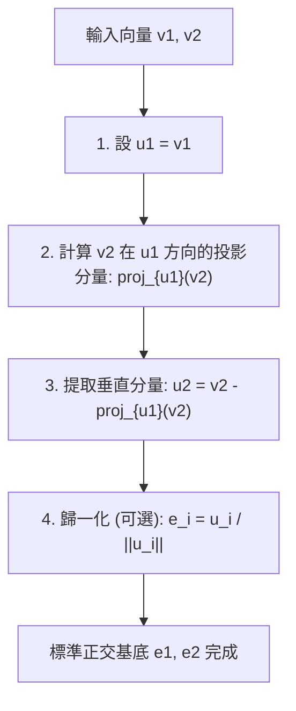
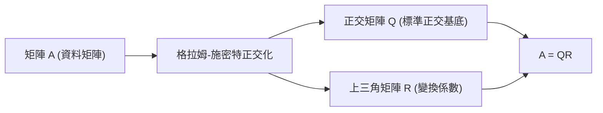

在學習線性代數的過程中，你必然會接觸到構成向量空間的「基底（Basis）」這一概念。然而，從現實問題或資料集中獲得的基底向量通常指向隨機、不規則的方向，它們往往傾斜相交，或者長度差異巨大。這種「扭曲」的基底在理論分析和電腦數值計算中都極難處理。

這時，本文的主角—— **格拉姆-施密特正交化 (Gram-Schmidt orthogonalization process)** 就登場了。該演算法是一種極其強大且通用的方法，它能夠系統地將張成空間的扭曲基底向量，轉換為相互正交（垂直）且長度統一定為 1 的優美 **正交基底（Orthonormal Basis）** 。

在本文中，我們將極其深入地探討格拉姆-施密特正交化，從基礎的幾何直覺開始，逐步深入到嚴謹的數學公式、考慮電腦計算「數值穩定性」的改進演算法，再到其在函數空間中的應用以及與機器學習中QR分解的聯繫，為你呈現一篇超長篇幅的詳盡解析。

## 1. 引言：為什麼我們喜歡「正交」？

在進入格拉姆-施密特正交化的具體步驟之前，讓我們先明確動機：到底為什麼我們想要讓向量正交（垂直相交）呢？

在數學和工程學中，正交化的基底，特別是長度歸一化為 1 的 **標準正交基底** ，能帶來數不勝數的優勢。

1. **極大簡化計算** ：當使用標準正交基底來表示向量時，向量的內積、範數（長度）以及向量間距離的計算，都可以完全透過對應分量之間簡單的乘法和加法來完成。這是因為所有繁瑣的交叉項都變成了零。
2. **極其簡單的投影** ：當你希望將一個向量投影到特定子空間進行近似時，如果基底是相互正交的，你只需分別計算在每個基底向量上的一維投影，然後將它們簡單相加，就能得到正確的投影向量。
3. **提高數值穩定性** ：在電腦上進行浮點運算時，使用正交矩陣（行向量為標準正交基底的矩陣）進行的變換具有不易引起資訊遺失或誤差放大的優良性質（等距變換）。這對於確保機器學習和訊號處理演算法的穩定運行至關重要。

## 2. 幾何直覺：二維空間中的「投影」與「減法」

格拉姆-施密特正交化的核心思想，用一句話概括就是： **「從新向量中，減去並剔除已生成的正交向量的方向分量。」**

讓我們以最容易想像的二維平面上的兩個向量 $\mathbf{v}_1, \mathbf{v}_2$ 為例。假設它們是線性獨立的（不平行，且都不是零向量）。我們將從這兩個向量中，構造出相互正交的新向量 $\mathbf{u}_1, \mathbf{u}_2$。

1. **直接採用第一個向量** ：
   首先，作為起點，直接將第一個向量作為新基底的第一個向量。
   $$ \mathbf{u}_1 = \mathbf{v}_1 $$

2. **從下一個向量中，減去第一個向量的方向分量** ：
   接下來，我們希望讓第二個向量 $\mathbf{v}_2$ 垂直於 $\mathbf{u}_1$。為此，我們只需去除 $\mathbf{v}_2$ 中包含的「與 $\mathbf{u}_1$ 平行的分量」。
   這個「與 $\mathbf{u}_1$ 平行的分量」被稱為 $\mathbf{v}_2$ 在 $\mathbf{u}_1$ 上的 **正交投影 (Orthogonal Projection)** 。

   投影向量的計算如下：
   $$ \text{proj}_{\mathbf{u}_1}(\mathbf{v}_2) = \frac{\langle \mathbf{v}_2, \mathbf{u}_1 \rangle}{\langle \mathbf{u}_1, \mathbf{u}_1 \rangle} \mathbf{u}_1 $$
   這裡，$\langle \cdot, \cdot \rangle$ 表示向量的內積。

   透過從原始的 $\mathbf{v}_2$ 中減去這個投影分量，我們就能得到完全垂直於 $\mathbf{u}_1$ 的向量 $\mathbf{u}_2$。
   $$ \mathbf{u}_2 = \mathbf{v}_2 - \text{proj}_{\mathbf{u}_1}(\mathbf{v}_2) $$

下圖將這種「投影並相減」的幾何過程進行了視覺化。



## 3. 數學公式：推廣至一般維度

我們將前面二維空間中的思想推廣到任意 $n$ 維空間中的 $k$ 個向量。假設在向量空間 $V$ 中，給定了一組線性獨立的向量集合 $\{ \mathbf{v}_1, \mathbf{v}_2, \dots, \mathbf{v}_k \}$。由這些向量構造正交基底 $\{ \mathbf{u}_1, \mathbf{u}_2, \dots, \mathbf{u}_k \}$ 的步驟（經典格拉姆-施密特正交化，CGS）公式化如下：

$$
\begin{aligned}
\mathbf{u}_1 &= \mathbf{v}_1 \\
\mathbf{u}_2 &= \mathbf{v}_2 - \text{proj}_{\mathbf{u}_1}(\mathbf{v}_2) \\
\mathbf{u}_3 &= \mathbf{v}_3 - \text{proj}_{\mathbf{u}_1}(\mathbf{v}_3) - \text{proj}_{\mathbf{u}_2}(\mathbf{v}_3) \\
&\vdots \\
\mathbf{u}_k &= \mathbf{v}_k - \sum_{j=1}^{k-1} \text{proj}_{\mathbf{u}_j}(\mathbf{v}_k)
\end{aligned}
$$

換句話說，為了建立第 $i$ 個正交向量 $\mathbf{u}_i$，你只需要從原向量 $\mathbf{v}_i$ 中， **減去它在所有已生成的正交向量 $\mathbf{u}_1, \dots, \mathbf{u}_{i-1}$ 上的所有投影分量** 。

最後，透過將得到的正交向量組的長度統一化為 1（歸一化），即可完成標準正交基底 $\{ \mathbf{e}_1, \mathbf{e}_2, \dots, \mathbf{e}_k \}$ 的建構。

$$ \mathbf{e}_i = \frac{\mathbf{u}_i}{\|\mathbf{u}_i\|} $$

## 4. 具體範例的手工計算 (三維空間)

為了加深理解，讓我們透過手工計算，追蹤一下三維空間中三個向量正交化的過程。

假設初始狀態給定了以下三個線性獨立的向量：

$$ \mathbf{v}_1 = \begin{pmatrix} 1 \\ 1 \\ 0 \end{pmatrix}, \quad \mathbf{v}_2 = \begin{pmatrix} 1 \\ 0 \\ 1 \end{pmatrix}, \quad \mathbf{v}_3 = \begin{pmatrix} 0 \\ 1 \\ 1 \end{pmatrix} $$

**步驟 1：**
第一個向量原樣使用。
$$ \mathbf{u}_1 = \mathbf{v}_1 = \begin{pmatrix} 1 \\ 1 \\ 0 \end{pmatrix} $$

**步驟 2：**
從 $\mathbf{v}_2$ 中減去其在 $\mathbf{u}_1$ 上的投影。
計算內積：$\langle \mathbf{v}_2, \mathbf{u}_1 \rangle = 1 \times 1 + 0 \times 1 + 1 \times 0 = 1$，以及 $\langle \mathbf{u}_1, \mathbf{u}_1 \rangle = 1^2 + 1^2 + 0^2 = 2$。
$$ \mathbf{u}_2 = \mathbf{v}_2 - \frac{\langle \mathbf{v}_2, \mathbf{u}_1 \rangle}{\langle \mathbf{u}_1, \mathbf{u}_1 \rangle} \mathbf{u}_1 = \begin{pmatrix} 1 \\ 0 \\ 1 \end{pmatrix} - \frac{1}{2} \begin{pmatrix} 1 \\ 1 \\ 0 \end{pmatrix} = \begin{pmatrix} 1/2 \\ -1/2 \\ 1 \end{pmatrix} $$

為了簡化計算，將 $\mathbf{u}_2$ 乘以一個常數（2倍）以消除分數。這不會影響正交性。
$$ \mathbf{u}_2' = \begin{pmatrix} 1 \\ -1 \\ 2 \end{pmatrix} $$

**步驟 3：**
從 $\mathbf{v}_3$ 中，分別減去其在 $\mathbf{u}_1$ 和 $\mathbf{u}_2'$ 方向上的分量。
$\langle \mathbf{v}_3, \mathbf{u}_1 \rangle = 0 \times 1 + 1 \times 1 + 1 \times 0 = 1$
$\langle \mathbf{v}_3, \mathbf{u}_2' \rangle = 0 \times 1 + 1 \times (-1) + 1 \times 2 = 1$
$\langle \mathbf{u}_2', \mathbf{u}_2' \rangle = 1^2 + (-1)^2 + 2^2 = 6$

$$ \mathbf{u}_3 = \mathbf{v}_3 - \frac{\langle \mathbf{v}_3, \mathbf{u}_1 \rangle}{\langle \mathbf{u}_1, \mathbf{u}_1 \rangle} \mathbf{u}_1 - \frac{\langle \mathbf{v}_3, \mathbf{u}_2' \rangle}{\langle \mathbf{u}_2', \mathbf{u}_2' \rangle} \mathbf{u}_2' $$
$$ \mathbf{u}_3 = \begin{pmatrix} 0 \\ 1 \\ 1 \end{pmatrix} - \frac{1}{2} \begin{pmatrix} 1 \\ 1 \\ 0 \end{pmatrix} - \frac{1}{6} \begin{pmatrix} 1 \\ -1 \\ 2 \end{pmatrix} = \begin{pmatrix} -2/3 \\ 2/3 \\ 2/3 \end{pmatrix} $$

同樣為了便於處理，將其乘以一個常數（$-3/2$ 倍），就能得到一個整潔的整數向量。
$$ \mathbf{u}_3' = \begin{pmatrix} 1 \\ -1 \\ -1 \end{pmatrix} $$

至此，我們求得了三個相互正交的向量 $\{ \mathbf{u}_1, \mathbf{u}_2', \mathbf{u}_3' \}$。最後，將它們分別除以各自的長度，即可得到標準正交基底。

## 5. 數值計算中的陷阱：捨入誤差與「改進的格拉姆-施密特正交化」

雖然格拉姆-施密特正交化在理論上是完美的，但在作為電腦程式實作時會遇到一個嚴重問題：浮點運算導致的 **「捨入誤差（Rounding Error）」** 。

在前述的經典格拉姆-施密特正交化 (CGS) 中，要從向量 $\mathbf{v}_k$ 中減去的投影分量，都是透過 **已計算出的 $\mathbf{u}_j$ 與原始 $\mathbf{v}_k$ 之間的內積** 獨立計算出來的，最後再一口氣全部減去。然而，當維度變高或向量數量增多時，微小的捨入誤差會不斷累積，導致最終生成的向量組 **失去正交性（發生正交性崩潰）** 。

為了克服這一數學缺陷，人們發明了 **改進的格拉姆-施密特正交化 (Modified Gram-Schmidt, MGS)** 。

MGS 的方法不是平行地進行減法運算，而是採用 **逐次更新** 的方式。
具體來說，在建立新向量時，首先從 $\mathbf{v}_k$ 中減去 $\mathbf{u}_1$ 的分量，然後針對 **該結果（更新後的向量）** 減去 $\mathbf{u}_2$ 的分量，接著再針對 **其後續結果** 減去 $\mathbf{u}_3$ 的分量……以此類推，在每一步中一邊更新向量，一邊計算下一個投影。

雖然在數學公式上看起來只是微小的差異，但這「逐次更新」的過程能在下一步中起到校正上一步所產生的正交誤差的作用，從而使數值穩定性得到飛躍性的提升。在現代數值計算庫中，正交化過程毫無例外地都會使用這種 MGS（或豪斯霍爾德變換）。

## 6. Python 實作的比較

為了明確理論上的差異，讓我們使用 Python 和 NumPy 來實作 CGS 和 MGS。

```python
import numpy as np

def classical_gram_schmidt(V):
    """
    經典格拉姆-施密特正交化 (CGS)
    V: 行向量作為基底的矩陣
    """
    n, k = V.shape
    U = np.zeros((n, k), dtype=float)
    
    for i in range(k):
        v = V[:, i]
        # 從 v 中減去在過去所有 u_j 方向上的投影
        for j in range(i):
            u_j = U[:, j]
            # 計算投影分量
            projection = (np.dot(v, u_j) / np.dot(u_j, u_j)) * u_j
            v = v - projection
        U[:, i] = v
        
    # 歸一化
    E = U / np.linalg.norm(U, axis=0)
    return E

def modified_gram_schmidt(V):
    """
    改進的格拉姆-施密特正交化 (MGS) - 數值穩定
    V: 行向量作為基底的矩陣
    """
    n, k = V.shape
    E = np.zeros((n, k), dtype=float)
    # 複製 V 以免修改原始值
    V_work = V.copy().astype(float) 
    
    for i in range(k):
        # 歸一化目前向量，使其成為 e_i
        v = V_work[:, i]
        E[:, i] = v / np.linalg.norm(v)
        
        # 從後續所有未處理的向量中，逐次減去（更新） e_i 的分量
        for j in range(i + 1, k):
            projection = np.dot(V_work[:, j], E[:, i]) * E[:, i]
            V_work[:, j] = V_work[:, j] - projection
            
    return E
```

當輸入條件惡劣（接近奇異矩陣）的矩陣時，CGS 生成的基底其內積不為 0，正交性被破壞；而 MGS 卻能保持極高精度的正交性。在實際業務中，強烈建議始終使用 MGS。

## 7. 高級應用一：應用於正交多項式

格拉姆-施密特正交化強大的地方在於，它不僅可以直接應用於有限維的幾何向量空間，還能原封不動地應用於 **「函數空間」** 。

例如，考慮區間 $[-1, 1]$ 上的函數集合。我們利用積分來定義兩個函數 $f(x), g(x)$ 的內積：
$$ \langle f, g \rangle = \int_{-1}^{1} f(x)g(x) dx $$

現在，讓我們將格拉姆-施密特正交化應用於最簡單的多項式基底 $\{ 1, x, x^2, x^3, \dots \}$。

* $\mathbf{u}_0(x) = 1$
* 計算 $\mathbf{u}_1(x) = x - \text{proj}_{\mathbf{u}_0}(x)$，因為 $\langle x, 1 \rangle = \int_{-1}^{1} x dx = 0$，所以 $\mathbf{u}_1(x) = x$。
* 計算 $\mathbf{u}_2(x) = x^2 - \text{proj}_{\mathbf{u}_0}(x^2) - \text{proj}_{\mathbf{u}_1}(x^2)$，結果為 $\mathbf{u}_2(x) = x^2 - \frac{1}{3}$。

這樣生成的正交多項式序列被稱為 **勒讓德多項式 (Legendre polynomials)** ，它們在物理學的電磁學、量子力學以及數值積分（高斯求積法）中扮演著極其重要的角色。代數演算法能夠自然而然地推導出深刻的物理定律描述，這是一個無比優美的範例。

## 8. 高級應用二：QR分解與資料科學

在資料科學和機器學習中，格拉姆-施密特正交化最大的應用，無疑是 **QR分解 (QR Decomposition)** 。

QR分解是指將任意矩陣 $A$ 分解為一個正交矩陣 $Q$ 和一個上三角矩陣 $R$ 的乘積的方法。
$$ A = QR $$

這種分解操作本身，就完全等同於對矩陣 $A$ 的各個行向量應用格拉姆-施密特正交化的過程。

* **$Q$ 矩陣** ：將透過格拉姆-施密特正交化生成的標準正交基底 $\{ \mathbf{e}_1, \dots, \mathbf{e}_k \}$ 作為行向量排列而成的矩陣。（它滿足 $Q^T Q = I$）
* **$R$ 矩陣** ：這是一個上三角矩陣，其成分是在正交化的每一步中，用新基底 $\mathbf{e}$ 的線性組合來表示原向量 $\mathbf{v}$ 時所產生的「係數（內積）」。



在機器學習的語境下，為了在多元迴歸分析中穩定且高速地計算求出最佳參數的「最小平方法」，常常會用到QR分解。直接求解正規方程式（$A^T A \mathbf{x} = A^T \mathbf{b}$）的方法，在實際應用中因為矩陣 $A^T A$ 的條件數容易惡化，對數值誤差極為敏感，因此常規的做法是將其分解為 $A=QR$，然後透過回代求解 $R \mathbf{x} = Q^T \mathbf{b}$。

## 9. 結語：被重整空間的數學之美

在本文中，我們從直觀含義到數學計算、對數值穩定性的考量，再到在函數空間及機器學習中的應用，廣泛而深入地解析了格拉姆-施密特正交化。

「將扭曲的座標軸重新排列為整齊的相互垂直的軸」，這個簡單明瞭的想法，其影響力是多麼強大和廣泛，相信大家已經有所體會。格拉姆-施密特正交化，既是優美的數學理論，也是現代電腦執行實用資料分析不可或缺的核心演算法。可以說，這是品味線性代數深奧之美的一個制高點。

強烈建議大家實際執行一下程式碼，或者嘗試手工對其他多項式進行正交化計算，去親身體驗一下空間被洗練昇華的數學樂趣。
