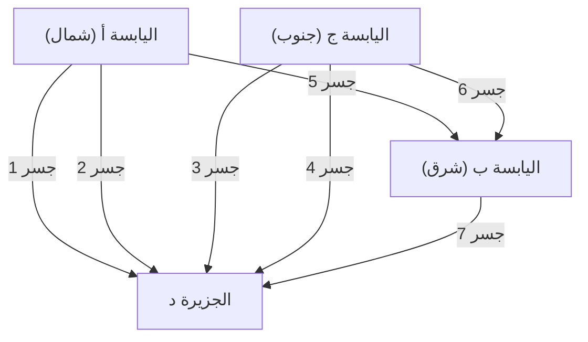

## 1. مقدمة: اللغز الذي لا يُحل ومدينة بروسيا القديمة

في القرن الثامن عشر، كان هناك نهر كبير يسمى نهر بريغوليا يمر عبر مدينة كونيغسبرغ الواقعة في مملكة بروسيا (كالينينغراد، روسيا حالياً). في وسط هذا النهر تقع جزيرة كنايبوف، وبسبب النهر قُسمت المدينة إلى أربع كتل أرضية، ورُبطت هذه الكتل بسبعة جسور.

في ذلك الوقت، انتشرت لعبة فكرية بين سكان كونيغسبرغ:
**"هل يمكن الانطلاق من مكان ما في المدينة، وعبور الجسور السبعة جميعها مرة واحدة فقط، والعودة إلى نفس نقطة البداية؟"**

حاول الجميع حل اللغز أثناء نزهاتهم، لكن لم ينجح أحد. في الوقت نفسه، لم يتمكن أحد من تفسير سبب استحالة ذلك منطقياً. عُرف هذا اللغز باسم "مسألة جسور كونيغسبرغ"، وظل لغزاً غير محلول لفترة طويلة.

هذا اللغز الذي بدا مجرد تسلية لسكان المدينة، ألقى عليه عالم الرياضيات العبقري الفذ **ليونهارت أويلر** (Leonhard Euler) ضوءاً رياضياً جديداً تماماً. لم تقتصر تأملاته على إيجاد حل للغز فحسب، بل أسست لمجالات رياضية ضخمة عُرفت لاحقاً بـ "نظرية البيان" (Graph Theory) و"الطوبولوجيا" (Topology).

في هذا المقال، سنتتبع هذا المسار الملحمي، بدءاً من الصياغة الرياضية لهذا الاكتشاف التاريخي لأويلر، وصولاً إلى نظرية الشبكات الحديثة وخوارزميات استكشاف المسارات في أنظمة الملاحة التي نستخدمها يومياً (خوارزمية ديكسترا، وخوارزمية البحث A*).

---

## 2. تجريد أويلر: استخلاص الجوهر فقط

عندما تناول أويلر هذه المسألة، كان نهجه الأول هو "إزالة المعلومات غير الضرورية". ففي مسألة عبور الجسور، لا علاقة لطول الجسر، أو مساحة اليابسة، أو شكلها، أو اتجاهها. ما يهم حقاً هو فقط المعلومات المتعلقة بالارتباط (الخصائص الطوبولوجية): **"أي أرض ترتبط بأي أرض، وبكم جسر؟"**

لذا، أعاد رسم الكتل الأرضية الأربع كنقاط (العقد / الرؤوس: Node / Vertex)، والجسور السبعة كخطوط (الحواف: Edge).



هذا النموذج الرياضي المكون من نقاط وخطوط فقط يُسمى **بياناً (Graph)**. من خلال تحويل مدينة كونيغسبرغ إلى بيان واحد، رفع أويلر المسألة إلى مستوى الطرح الرياضي البحت.

---

## 3. الشروط الرياضية للرسم بمسار واحد: الدارة الأويلرية والمسار الأويلري

باستخدام مصطلحات نظرية البيان، يمكن إعادة صياغة سؤال السكان على النحو التالي:
**"في البيان المعطى، هل يوجد [مسار](/ar/p/windows-%E3%81%A7%D9%85%D8%B3%D8%A7%D8%B1%E3%81%AE%E9%80%9A%E3%81%A3%E3%81%9F%D9%85%D9%84%D9%81-%D8%AA%D9%86%D9%81%D9%8A%D8%B0%D9%8A%E3%81%AE%E5%A0%B4%E6%89%80%E3%82%92%E8%A6%8B%E3%81%A4%E3%81%91%E3%82%8B%E6%96%B9%E6%B3%95/) يمر بجميع الحواف مرة واحدة بالضبط ويعود إلى الرأس الأصلي (دارة أويلرية: Eulerian Circuit)؟"**

استحدث أويلر مفهوماً بسيطاً وقوياً جداً لهذه المسألة وهو **"درجة الرأس (Degree)"**. درجة الرأس تعني "عدد الحواف المتصلة بذلك الرأس".

### 3.1 إثبات وجود الدارة الأويلرية

لنفترض أننا نرسم مساراً واحداً على البيان للعودة إلى نقطة البداية (دارة أويلرية).
لنفترض أننا نمر بالرأس $v$ في منتصف المسار. لـ "الدخول" إلى الرأس $v$ نستخدم حافة واحدة، ولـ "الخروج" منه نستخدم حافة أخرى. بمعنى آخر، في كل مرة تمر فيها عبر رأس، فإنك تستهلك دائماً "زوجاً" من الحواف المتصلة به.

الأمر نفسه ينطبق على نقطة البداية والنهاية. تستخدم حافة واحدة عند الانطلاق الأول، وتستخدم حافة أخرى عند العودة في النهاية. حتى لو مررت عبر هذا الرأس عدة مرات، فإن الدخول والخروج يكونان دائماً في أزواج.

لذلك، من أجل استهلاك جميع الحواف والعودة إلى الرأس الأصلي دون الوصول إلى طريق مسدود، **يجب أن تكون درجات جميع الرؤوس في البيان أعداداً زوجية**.

* **النظرية 1 (الدارة الأويلرية)**: الشرط الضروري والكافي لكي يمتلك البيان المتصل دارة أويلرية هو أن تكون درجات جميع رؤوسه أعداداً زوجية.

### 3.2 تقييم كونيغسبرغ

الآن، دعونا نتحقق من درجات بيان كونيغسبرغ:
- اليابسة أ (شمال): 3 (فردي)
- اليابسة ب (شرق): 3 (فردي)
- اليابسة ج (جنوب): 3 (فردي)
- الجزيرة د: 5 (فردي)

بشكل مفاجئ، درجات الرؤوس الأربعة جميعها أعداد فردية (رؤوس فردية). نظراً لعدم استيفاء شرط أن تكون جميع الرؤوس زوجية، أثبت أويلر رياضياً أنه **"من المستحيل عبور الجسور السبعة جميعها مرة واحدة والعودة"**.

※ بالمناسبة، إذا كان مساراً واحداً يُسمح فيه باختلاف نقطة البداية عن نقطة النهاية ([مسار](/ar/p/windows-%E3%81%A7%D9%85%D8%B3%D8%A7%D8%B1%E3%81%AE%E9%80%9A%E3%81%A3%E3%81%9F%D9%85%D9%84%D9%81-%D8%AA%D9%86%D9%81%D9%8A%D8%B0%D9%8A%E3%81%AE%E5%A0%B4%E6%89%80%E3%82%92%E8%A6%8B%E3%81%A4%E3%81%91%E3%82%8B%E6%96%B9%E6%B3%95/) أويلري: Eulerian Path)، فإنه ممكن إذا كان هناك "رأسان فرديان فقط" (أحدهما يكون نقطة البداية والآخر نقطة النهاية). ولكن في حالة كونيغسبرغ يوجد 4 رؤوس فردية، لذا فإن الرسم بمسار واحد دون العودة إلى المكان الأصلي مستحيل أيضاً.

---

## 4. تطور نظرية البيان: من الطوبولوجيا إلى علوم الحاسوب

منذ اكتشاف أويلر، تطورت نظرية البيان كفرع مهم من فروع الرياضيات. نوقشت العديد من المشكلات الصعبة على مسرح نظرية البيان، مثل مسألة تلوين الخرائط ([مبرهنة الألوان الأربعة](/ar/p/four-color-theorem/))، ومسألة دارة هاملتون ([مسار](/ar/p/windows-%E3%81%A7%D9%85%D8%B3%D8%A7%D8%B1%E3%81%AE%E9%80%9A%E3%81%A3%E3%81%9F%D9%85%D9%84%D9%81-%D8%AA%D9%86%D9%81%D9%8A%D8%B0%D9%8A%E3%81%AE%E5%A0%B4%E6%89%80%E3%82%92%E8%A6%8B%E3%81%A4%E3%81%91%E3%82%8B%E6%96%B9%E6%B3%95/) يمر عبر جميع الرؤوس مرة واحدة بالضبط).

ومع ذلك، مع ظهور أجهزة الكمبيوتر في النصف الثاني من القرن العشرين، تجاوزت نظرية البيان الإطار الرياضي البحت وتطورت إلى سلاح قوي (خوارزميات) لحل مشكلات العالم الحقيقي. توجيه شبكات الاتصالات، تحليل العلاقات الاجتماعية، وتحسين شبكات الطاقة الكهربائية - تعتمد العديد من البنى التحتية في المجتمع الحديث على نظرية البيان كعنصر أساسي.

تعتبر **مسألة أقصر [مسار](/ar/p/windows-%E3%81%A7%D9%85%D8%B3%D8%A7%D8%B1%E3%81%AE%E9%80%9A%E3%81%A3%E3%81%9F%D9%85%D9%84%D9%81-%D8%AA%D9%86%D9%81%D9%8A%D8%B0%D9%8A%E3%81%AE%E5%A0%B4%E6%89%80%E3%82%92%E8%A6%8B%E3%81%A4%E3%81%91%E3%82%8B%E6%96%B9%E6%B3%95/) (Shortest Path Problem)** من المسائل المرتبطة ارتباطاً وثيقاً بحياتنا اليومية.
بينما فكر أويلر في "هل يمكن المرور بجميع الطرق مرة واحدة؟"، فإن المشكلة التي تحلها أنظمة الملاحة الحديثة وخرائط جوجل هي "ما هو المسار الأقل تكلفة (مسافة أو وقتاً) للوصول إلى الوجهة؟".

---

## 5. سلالة خوارزميات استكشاف المسارات

تطورت خوارزميات حل مسألة أقصر [مسار](/ar/p/windows-%E3%81%A7%D9%85%D8%B3%D8%A7%D8%B1%E3%81%AE%E9%80%9A%E3%81%A3%E3%81%9F%D9%85%D9%84%D9%81-%D8%AA%D9%86%D9%81%D9%8A%D8%B0%D9%8A%E3%81%AE%E5%A0%B4%E6%89%80%E3%82%92%E8%A6%8B%E3%81%A4%E3%81%91%E3%82%8B%E6%96%B9%E6%B3%95/) عبر تاريخ علوم الحاسوب. سنشرح هنا اثنتين من أشهر هذه الخوارزميات.

### 5.1 خوارزمية ديكسترا (Dijkstra's Algorithm)

هذه الخوارزمية التي ابتكرها إدغر ديكسترا عام 1956، هي خوارزمية لإيجاد أقصر مسافة من نقطة بداية إلى جميع الرؤوس في بيان يحتوي على حواف ذات أوزان (تكلفة مسافة أو وقت).

**【الآلية الأساسية】**
1. تعيين مسافة نقطة البداية إلى 0، والمسافة المؤقتة لجميع الرؤوس الأخرى إلى اللانهاية ($\infty$).
2. من بين الرؤوس غير المؤكدة، اختيار الرأس $u$ صاحب أقصر مسافة مؤقتة، وتعيين تلك المسافة كمسافة "مؤكدة".
3. بالنسبة للرأس غير المؤكد $v$ المجاور للرأس $u$، حساب المسافة في حالة المرور عبر $u$، وتحديثها إذا كانت أقصر من المسافة المؤقتة الحالية (تُسمى هذه العملية بالاسترخاء / Relaxation).
4. تكرار الخطوتين 2 و3 حتى يتم تأكيد جميع الرؤوس.

تقوم خوارزمية ديكسترا بتوسيع نطاق البحث بشكل دوائر متحدة المركز من نقطة البداية، تماماً مثل التموجات التي تنتشر عند إلقاء حجر في الماء. ولهذا السبب، فإنها تضمن إيجاد أقصر [مسار](/ar/p/windows-%E3%81%A7%D9%85%D8%B3%D8%A7%D8%B1%E3%81%AE%E9%80%9A%E3%81%A3%E3%81%9F%D9%85%D9%84%D9%81-%D8%AA%D9%86%D9%81%D9%8A%D8%B0%D9%8A%E3%81%AE%E5%A0%B4%E6%89%80%E3%82%92%E8%A6%8B%E3%81%A4%E3%81%91%E3%82%8B%E6%96%B9%E6%B3%95/) ما لم تكن هناك أوزان سالبة، لكن من عيوبها أنها تستغرق وقتاً طويلاً في الحساب في بيانات الخرائط الكبيرة، لأنها توسع البحث في الاتجاه المعاكس للوجهة أيضاً.

### 5.2 خوارزمية البحث A* (A-Star Search Algorithm)

تم ابتكار خوارزمية البحث A* (إيه ستار) لتقليل عمليات البحث غير الضرورية في خوارزمية ديكسترا، والتوجه نحو الوجهة بكفاءة أكبر. طُورت في مجال الذكاء الاصطناعي، وتُستخدم على نطاق واسع في حركة شخصيات الألعاب وأنظمة الملاحة للسيارات.

أهم ميزة في خوارزمية A* هي إدخال **"الدالة الإرشادية (Heuristic Function)"**.

في حين تعتمد خوارزمية ديكسترا في بحثها فقط على "المسافة الفعلية من نقطة البداية $g(n)$"، فإن خوارزمية A* تستخدم قيمة التقييم $f(n)$ وهي مجموع "المسافة الفعلية من نقطة البداية $g(n)$" + "المسافة المقدرة للوجهة (القيمة الإرشادية) $h(n)$".

$$ f(n) = g(n) + h(n) $$

في حالة نظام الملاحة، يُستخدم بشكل شائع "مسافة الخط المستقيم إلى الوجهة" كمسافة مقدرة $h(n)$. وبفضل هذا، يتم إعطاء الأولوية لاستكشاف المسارات في الاتجاه المقترب من الوجهة، مما يقلل بشكل كبير من البحث في الاتجاهات غير ذات الصلة ويحسن سرعة الحساب بشكل هائل.

---

## 6. معالجة البيانات واستكشاف المسارات باستخدام Python

تُعد مكتبة **NetworkX** في لغة Python هي المكتبة القياسية للتعامل مع نظرية البيان في مجال علوم البيانات الحديثة وتطبيق الخوارزميات.
سنعرض هنا مثالاً برمجياً باستخدام NetworkX لبناء بيان بسيط، والبحث عن المسار باستخدام خوارزمية ديكسترا وخوارزمية A*.

```python
import networkx as nx
import matplotlib.pyplot as plt

# إنشاء البيان
G = nx.Graph()

# إضافة العقد (المدن) مع تحديد الإحداثيات (تُستخدم في الدالة الإرشادية لـ A*)
nodes = {
    'Start': (0, 0),
    'A': (1, 2),
    'B': (2, -1),
    'C': (4, 2),
    'D': (3, 0),
    'Goal': (5, 0)
}
for node, pos in nodes.items():
    G.add_node(node, pos=pos)

# إضافة الحواف (الطرق) والأوزان (المسافات)
edges = [
    ('Start', 'A', 2.5), ('Start', 'B', 2.0),
    ('A', 'C', 2.0), ('A', 'D', 1.5),
    ('B', 'D', 2.5),
    ('C', 'Goal', 1.5), ('D', 'Goal', 2.0)
]
G.add_weighted_edges_from(edges)

# الدالة الإرشادية لحساب مسافة الخط المستقيم (لاستخدامها في A*)
def heuristic(u, v):
    pos_u = G.nodes[u]['pos']
    pos_v = G.nodes[v]['pos']
    return ((pos_u[0] - pos_v[0])**2 + (pos_u[1] - pos_v[1])**2)**0.5

# أقصر مسار باستخدام خوارزمية ديكسترا
path_dijkstra = nx.shortest_path(G, source='Start', target='Goal', weight='weight')
length_dijkstra = nx.shortest_path_length(G, source='Start', target='Goal', weight='weight')

# أقصر مسار باستخدام خوارزمية A*
path_astar = nx.astar_path(G, source='Start', target='Goal', heuristic=heuristic, weight='weight')

print(f"Dijkstra Path: {path_dijkstra} (Cost: {length_dijkstra})")
print(f"A* Path:       {path_astar}")
```

عند تنفيذ هذه الشيفرة، يمكنك التأكد من أن كلتا الخوارزميتين (ديكسترا و A*) تجدان نفس أقصر [مسار](/ar/p/windows-%E3%81%A7%D9%85%D8%B3%D8%A7%D8%B1%E3%81%AE%E9%80%9A%E3%81%A3%E3%81%9F%D9%85%D9%84%D9%81-%D8%AA%D9%86%D9%81%D9%8A%D8%B0%D9%8A%E3%81%AE%E5%A0%B4%E6%89%80%E3%82%92%E8%A6%8B%E3%81%A4%E3%81%91%E3%82%8B%E6%96%B9%E6%B3%95/). في الشبكات الكبيرة الواقعية، يكون هناك فرق هائل في عدد العقد التي يتم استكشافها.

---

## 7. خاتمة: الروابط تشكل العالم

تحول اللغز البسيط الذي استمتع به سكان كونيغسبرغ، عبر عيني العبقري ليونهارت أويلر، إلى عدسة جديدة لإعادة فهم العالم كـ "روابط بين النقاط والخطوط".

اليوم، حقيقة أننا نستطيع تحميل صفحات الويب فوراً من خوادم بعيدة عبر الإنترنت، أو أن نظام الملاحة يمكنه إرشادنا بدقة في مناطق غير مألوفة، هي كلها ثمار هذا التجريد الرياضي الذي بدأ من تلك الجسور القديمة في بروسيا.

في هذه اللحظة بالذات، تستمر نظرية البيان في لعب دور نشط في صدارة العلوم والتكنولوجيا، بدءاً من تحديد المؤثرين على وسائل التواصل الاجتماعي، وتوقع مسارات انتشار الفيروسات، إلى تصميم مركبات كيميائية جديدة. من خلال الفهم الرياضي لـ "الروابط"، يمكننا العثور على نظام جميل وحلول داخل عالم يبدو معقداً للغاية.
