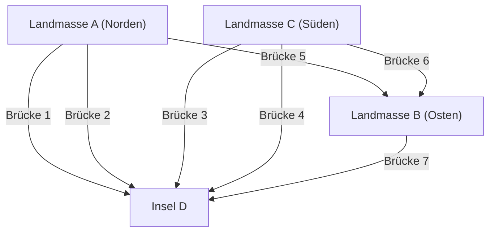

## 1. Prolog: Ein unlösbares Puzzle und die alte preußische Hauptstadt

Im 18. Jahrhundert floss ein großer Fluss namens Pregel durch die Stadt Königsberg, die im Königreich Preußen (dem heutigen Kaliningrad in Russland) lag. Im Fluss befand sich die Insel Kneiphof, und die Stadt war durch den Fluss in vier Landmassen unterteilt, die durch sieben Brücken miteinander verbunden waren.

Unter den Bewohnern von Königsberg war damals ein intellektuelles Spiel beliebt:
**"Ist es möglich, an einem beliebigen Ort in der Stadt zu starten, alle sieben Brücken genau einmal zu überqueren und wieder an den Ausgangspunkt zurückzukehren?"**

Jeder versuchte es bei Spaziergängen, aber niemand war erfolgreich. Doch niemand konnte logisch erklären, warum es unmöglich war. Dies wurde als das "Königsberger Brückenproblem" bekannt und galt lange Zeit als ungelöstes Puzzle.

Es war der außergewöhnlich geniale Mathematiker **Leonhard Euler**, der ein völlig neues mathematisches Licht auf dieses scheinbar einfache Stadtspielzeug warf. Seine Überlegungen gingen weit darüber hinaus, nur die Antwort auf das Rätsel zu finden, und begründeten die riesigen mathematischen Gebiete der "Graphentheorie" und der "Topologie".

Dieser Artikel verfolgt die epische Reise, beginnend mit der mathematischen Formulierung dieser historischen Entdeckung Eulers bis hin zur modernen Netzwerktheorie und den Routenplanungs-Algorithmen (Dijkstra-Algorithmus, A*-Suchalgorithmus), die wir täglich in unseren Navigationssystemen verwenden.

---

## 2. Eulers Abstraktion: Die Extraktion der Essenz

Als Euler sich diesem Problem widmete, war sein erster Ansatz, "unnötige Informationen wegzulassen". Beim Problem der Brückenüberquerung sind die Länge der Brücken, die Größe der Landmassen, ihre Form und die Richtung völlig irrelevant. Wichtig ist nur die topologische Eigenschaft (die Verbindungsinformation): **"Welche Landmasse ist mit welcher anderen Landmasse durch wie viele Brücken verbunden?"**

Er zeichnete das Problem neu, indem er die vier Landmassen als Punkte (Knoten: Node / Vertex) und die sieben Brücken als Linien (Kanten: Edge) darstellte.



Ein solches mathematisches Modell, das nur aus Punkten und Linien besteht, nennt man einen **Graphen (Graph)**. Indem Euler das Stadtbild von Königsberg in einen Graphen umwandelte, erhob er das Problem zu einer rein mathematischen Proposition.

---

## 3. Mathematische Bedingungen des Linienzugs: Eulerkreis und Eulerweg

In der Sprache der Graphentheorie lässt sich die Frage der Bewohner wie folgt umformulieren:
**"Gibt es in einem gegebenen Graphen einen Weg, der jede Kante genau einmal durchläuft und zum Ausgangsknoten zurückkehrt (einen Eulerkreis: Eulerian Circuit)?"**

Um dieses Problem zu lösen, führte Euler das äußerst einfache und mächtige Konzept des **"Knotengrades (Degree)"** ein. Der Grad eines Knotens ist die "Anzahl der Kanten, die mit diesem Knoten verbunden sind".

### 3.1 Beweis für die Existenz eines Eulerkreises

Angenommen, wir zeichnen einen Weg (Eulerkreis) auf dem Graphen in einem Zug und kehren zum Ausgangspunkt zurück.
Betrachten wir den Fall, dass wir auf unserem Weg durch einen bestimmten Knoten $v$ gehen. Um in den Knoten $v$ "hineinzugehen", verwenden wir eine Kante, und um den Knoten $v$ zu "verlassen", verwenden wir eine andere Kante. Das heißt, bei jedem Durchgang werden zwingend "zwei" mit diesem Knoten verbundene Kanten als Set verbraucht.

Das Gleiche gilt für den Knoten, der sowohl Start- als auch Endpunkt ist. Wenn wir zuerst starten, verwenden wir eine Kante, und wenn wir schließlich zurückkehren, verwenden wir eine andere Kante. Selbst wenn wir diesen Knoten mehrmals passieren, erfolgt das Betreten und Verlassen immer in Paaren.

Um also alle Kanten zu verbrauchen und ohne in eine Sackgasse zu geraten zum Ausgangsknoten zurückzukehren, **muss der Grad aller Knoten im Graphen eine gerade Zahl sein**.

* **Satz 1 (Eulerkreis)**: Eine notwendige und hinreichende Bedingung dafür, dass ein zusammenhängender Graph einen Eulerkreis besitzt, ist, dass der Grad aller Knoten gerade ist.

### 3.2 Die Beurteilung von Königsberg

Lassen Sie uns nun die Knotengrade des Königsberger Graphen überprüfen.
- Landmasse A (Norden): 3 (ungerade)
- Landmasse B (Osten): 3 (ungerade)
- Landmasse C (Süden): 3 (ungerade)
- Insel D: 5 (ungerade)

Überraschenderweise ist der Grad aller vier Knoten ungerade (ungerader Knoten). Da die Bedingung, dass alle Knoten gerade sein müssen (gerader Knoten), nicht erfüllt ist, bewies Euler mathematisch: **"Es ist unmöglich, alle sieben Brücken genau einmal zu überqueren und zurückzukehren."**

* Übrigens, im Fall eines Linienzugs (Eulerweg: Eulerian Path), bei dem Start- und Endpunkt unterschiedlich sein dürfen, ist dies möglich, wenn es "genau zwei ungerade Knoten" gibt (da einer der Startpunkt und der andere der Endpunkt ist). Da es in Königsberg jedoch vier ungerade Knoten gibt, ist nicht einmal ein Linienzug möglich, der nicht zum Ausgangspunkt zurückkehrt.

---

## 4. Die Evolution der Graphentheorie: Von der Topologie zur Informatik

Nach Eulers Entdeckung entwickelte sich die Graphentheorie zu einem wichtigen Teilgebiet der Mathematik. Viele schwierige Probleme, wie das Problem der Karteneinfärbung (Vier-Farben-Satz) und das Problem des Hamiltonkreises (ein Weg, der jeden Knoten genau einmal durchläuft), wurden auf der Bühne der Graphentheorie diskutiert.

Mit dem Aufkommen von Computern in der zweiten Hälfte des 20. Jahrhunderts ging die Graphentheorie jedoch über den Rahmen der reinen Mathematik hinaus und entwickelte sich zu einer mächtigen Waffe (Algorithmus) zur Lösung von Problemen der realen Welt. Das Routing in Kommunikationsnetzwerken, die Analyse von Freundschaftsbeziehungen in sozialen Netzwerken, die Optimierung von Stromnetzen und vieles mehr - ein Großteil der Infrastruktur der modernen Gesellschaft basiert auf der Graphentheorie.

Besonders eng mit unserem Leben verbunden ist das **Kürzeste-Wege-Problem (Shortest Path Problem)**.
Während Euler darüber nachdachte, ob man "alle Wege genau einmal gehen kann", lösen moderne Navigationssysteme und Google Maps das Problem: "Welche Route zum Ziel hat die geringsten Kosten (Entfernung oder Zeit)?"

---

## 5. Die Genealogie der Routenplanungs-Algorithmen

Algorithmen zur Lösung des Kürzeste-Wege-Problems wurden im Laufe der Geschichte der Informatik verfeinert. Hier erklären wir zwei repräsentative Algorithmen.

### 5.1 Dijkstra-Algorithmus (Dijkstra's Algorithm)

Dieser von Edsger W. Dijkstra 1956 entworfene Algorithmus ermittelt den kürzesten Abstand von einem bestimmten Startpunkt zu allen Knoten in einem Graphen, in dem Kanten Gewichte (Entfernungs- oder Zeitkosten) haben.

**[Grundprinzip]**
1. Setzen Sie die Entfernung des Startpunktes auf 0 und die vorläufige Entfernung aller anderen Knoten auf unendlich ($\infty$).
2. Wählen Sie unter den unbestimmten Knoten den Knoten $u$ mit der kürzesten vorläufigen Entfernung aus und betrachten Sie diese Entfernung als "bestimmt".
3. Für jeden an Knoten $u$ angrenzenden unbestimmten Knoten $v$ berechnen Sie die Entfernung bei einem Verlauf über $u$. Wenn diese kürzer ist als die aktuelle vorläufige Entfernung von $v$, aktualisieren Sie diese (diese Operation wird als Relaxation bezeichnet).
4. Wiederholen Sie die Schritte 2 und 3, bis alle Knoten bestimmt sind.

Der Dijkstra-Algorithmus breitet die Suche konzentrisch vom Startpunkt aus, ähnlich wie sich die Wellen ausbreiten, wenn man einen Stein ins Wasser wirft. Solange es keine negativen Gewichte gibt, kann er zuverlässig den kürzesten Weg finden. Ein Nachteil ist jedoch, dass die Berechnung bei großen Kartendaten einige Zeit in Anspruch nimmt, da sich die Suche auch in Richtungen ausbreitet, die dem Ziel entgegengesetzt sind.

### 5.2 A*-Suchalgorithmus (A-Star Search Algorithm)

Der A*-Suchalgorithmus wurde entwickelt, um unnötige Suchen im Dijkstra-Algorithmus zu reduzieren und das Ziel effizienter anzusteuern. Er wurde im Bereich der künstlichen Intelligenz entwickelt und wird häufig bei der Bewegung von Spielfiguren und in Navigationssystemen angewendet.

Das wichtigste Merkmal von A* ist die Einführung einer **"heuristischen Funktion (Heuristic Function)"**.

Während der Dijkstra-Algorithmus nur basierend auf der "tatsächlichen Entfernung vom Startpunkt $g(n)$" sucht, verwendet A* als Bewertungswert die Summe $f(n)$ aus der "tatsächlichen Entfernung vom Startpunkt $g(n)$" und der "geschätzten Entfernung zum Ziel (Heuristik) $h(n)$".

$$ f(n) = g(n) + h(n) $$

Bei einem Navigationssystem ist es üblich, die "Luftlinienentfernung zum Ziel" als geschätzte Entfernung $h(n)$ zu verwenden. Dadurch werden Routen, die sich dem Ziel nähern, bei der Suche priorisiert, was Suchen in irrelevante Richtungen drastisch reduziert und die Berechnungsgeschwindigkeit erheblich verbessert.

---

## 6. Graphverarbeitung und Routenplanung mit Python

In der modernen Datenwissenschaft und Algorithmusimplementierung ist **NetworkX** die Standardbibliothek in Python zur Behandlung der Graphentheorie.
Hier zeigen wir ein Code-Beispiel, bei dem wir mit NetworkX einen einfachen Graphen erstellen und Routen mithilfe des Dijkstra-Algorithmus und des A*-Algorithmus suchen.

```python
import networkx as nx
import matplotlib.pyplot as plt

# Graph erstellen
G = nx.Graph()

# Knoten (Städte) hinzufügen (Koordinaten für die A*-Heuristik festlegen)
nodes = {
    'Start': (0, 0),
    'A': (1, 2),
    'B': (2, -1),
    'C': (4, 2),
    'D': (3, 0),
    'Goal': (5, 0)
}
for node, pos in nodes.items():
    G.add_node(node, pos=pos)

# Kanten (Wege) und Gewichte (Entfernungen) hinzufügen
edges = [
    ('Start', 'A', 2.5), ('Start', 'B', 2.0),
    ('A', 'C', 2.0), ('A', 'D', 1.5),
    ('B', 'D', 2.5),
    ('C', 'Goal', 1.5), ('D', 'Goal', 2.0)
]
G.add_weighted_edges_from(edges)

# Heuristische Funktion zur Berechnung der Luftlinienentfernung (für A*)
def heuristic(u, v):
    pos_u = G.nodes[u]['pos']
    pos_v = G.nodes[v]['pos']
    return ((pos_u[0] - pos_v[0])**2 + (pos_u[1] - pos_v[1])**2)**0.5

# Kürzester Weg mit Dijkstra
path_dijkstra = nx.shortest_path(G, source='Start', target='Goal', weight='weight')
length_dijkstra = nx.shortest_path_length(G, source='Start', target='Goal', weight='weight')

# Kürzester Weg mit A*-Algorithmus
path_astar = nx.astar_path(G, source='Start', target='Goal', heuristic=heuristic, weight='weight')

print(f"Dijkstra Path: {path_dijkstra} (Cost: {length_dijkstra})")
print(f"A* Path:       {path_astar}")
```

Wenn Sie diesen Code ausführen, können Sie überprüfen, dass sowohl der Dijkstra-Algorithmus als auch der A*-Suchalgorithmus denselben kürzesten Weg finden. In großen realen Netzwerken entsteht jedoch ein überwältigender Unterschied in der Anzahl der untersuchten Knoten.

---

## 7. Epilog: Verbindungen formen die Welt

Das kleine Puzzle, das die Einwohner von Königsberg genossen, wurde durch die Augen des Genies Leonhard Euler zu einer neuen Linse, um die Welt als "Verbindung von Punkten und Linien" neu zu betrachten.

Dass wir heute Webseiten von weit entfernten Servern über das Internet in Sekundenbruchteilen laden können und dass uns das Navigationssystem in unbekannten Gebieten genau führt, ist alles das Ergebnis jener mathematischen Abstraktion, die bei den alten Brücken von Preußen begann.

Die Graphentheorie ist auch in diesem Moment aktiv an den vordersten Fronten der Wissenschaft und Technologie, bei der Identifizierung von Influencern in sozialen Medien, der Vorhersage von Infektionswegen von Viren und dem Entwurf neuer chemischer Verbindungen. Indem wir "Verbindungen" mathematisch entschlüsseln, können wir in einer scheinbar viel zu komplexen Welt eine schöne Ordnung und Lösungen finden.
