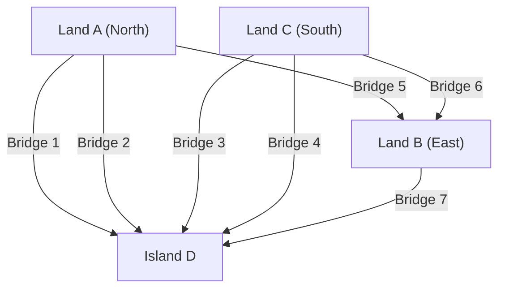

## 1. Prologue: An Unsolvable Puzzle and the Ancient City of Prussia

In the 18th century, the city of Königsberg in the Kingdom of Prussia (now Kaliningrad, Russia) had a large river called the Pregel River flowing through it. In this river was an island called Kneiphof, and the city was divided into four landmasses by the river, with seven bridges connecting them.

An intellectual game was popular among the residents of Königsberg at the time.
**"Is it possible to start anywhere in the city, cross all seven bridges exactly once, and return to the starting point?"**

Everyone tried their hand at it while taking a walk, but no one succeeded. However, no one could logically explain why it was impossible. This came to be known as the "Seven Bridges of Königsberg" problem and was treated as an unsolved puzzle for a long time.

The person who shed a completely new mathematical light on what seemed like a mere town puzzle was the rare genius mathematician **Leonhard Euler**. His consideration went beyond simply finding an answer to the puzzle; it founded the huge mathematical fields later known as "Graph Theory" and "Topology."

In this article, we will trace the grand trajectory starting from the mathematical formulation of Euler's historical discovery to modern network theory and the route search algorithms (Dijkstra's algorithm, A* search algorithm) that we use in our car navigation systems daily.

---

## 2. Euler's Abstraction: Extracting Only the Essence

When Euler tackled this problem, his first approach was to "strip away unnecessary information." In the problem of crossing bridges, the length of the bridges, the size, shape, and direction of the landmasses are completely irrelevant. The only important thing is the connection information (topological properties): **"Which landmass is connected to which landmass by how many bridges."**

He redrew the four landmasses as points (Nodes / Vertices) and the seven bridges as lines (Edges).



A mathematical model composed only of points and lines in this way is called a **Graph**. By converting the cityscape of Königsberg into a single graph, Euler sublimated the problem into a pure mathematical proposition.

---

## 3. Mathematical Conditions for Unicursal Drawing: Eulerian Circuits and Eulerian Paths

In the language of graph theory, the residents' question can be rephrased as follows:
**"In a given graph, is there a path (Eulerian Circuit) that traverses every edge exactly once and returns to the starting vertex?"**

For this problem, Euler introduced an extremely simple yet powerful concept called the **"Degree"** of a vertex. The degree of a vertex is "the number of edges connected to that vertex."

### 3.1 Proof of the Existence of an Eulerian Circuit

Suppose we draw a path (Eulerian circuit) that goes through the graph in one stroke and returns to the starting point.
Consider passing through a certain vertex $v$ in the middle of the path. To "enter" vertex $v$, we use one edge, and to "exit" vertex $v$, we use another edge. In other words, every time we pass through, we always consume "two" edges connected to that vertex as a set.

The same applies to the vertex that is both the starting point and the end point. We use one edge when we first leave, and we use another edge when we finally return. Even if we pass through that vertex several times, the entrances and exits will still be in pairs.

Therefore, in order to use all the edges and return to the original vertex without hitting a dead end, **the degree of all vertices in the graph must be even**.

* **Theorem 1 (Eulerian Circuit)**: A necessary and sufficient condition for a connected graph to have an Eulerian circuit is that the degree of every vertex is even.

### 3.2 Checking Königsberg

Now let's check the degrees of the Königsberg graph.
- Land A (North): 3 (Odd)
- Land B (East): 3 (Odd)
- Land C (South): 3 (Odd)
- Island D: 5 (Odd)

Surprisingly, the degrees of all four vertices are odd (odd vertices). Because it does not satisfy the condition that all vertices must be even (even vertices), Euler mathematically proved that **"It is impossible to cross all seven bridges exactly once and return."**

* By the way, in the case of a unicursal drawing where the start and end points can be different (Eulerian Path), it is possible if there are "exactly two odd vertices" (since one will be the start point and the other the end point). However, in the case of Königsberg, there are four odd vertices, so even a unicursal drawing that does not return to the original location is impossible.

---

## 4. Evolution of Graph Theory: From Topology to Computer Science

Since Euler's discovery, graph theory has developed as an important field of mathematics. Numerous difficult problems, such as the map coloring problem (Four Color Theorem) and the Hamiltonian circuit problem (a path that passes through every vertex exactly once), have been discussed on the stage of graph theory.

However, with the advent of computers in the late 20th century, graph theory went beyond the boundaries of mere mathematics and evolved into a powerful weapon (algorithm) for solving real-world problems. Much of modern social infrastructure, such as routing in communication networks, analyzing social networks in SNS, and optimizing power grids, is based on graph theory.

What is particularly close to our lives is the **Shortest Path Problem**.
Euler considered "Can we take every road exactly once?", but what modern car navigation systems and Google Maps are solving is the problem of "Which route to the destination has the lowest cost (distance or time)?"

---

## 5. Genealogy of Route Search Algorithms

Algorithms for solving the shortest path problem have been refined throughout the history of computer science. Here we will explain two representative algorithms.

### 5.1 Dijkstra's Algorithm

Invented by Edsger W. Dijkstra in 1956, this algorithm finds the shortest distance from a certain starting point to all vertices in a graph where edges have weights (distance or time costs).

**[Basic Mechanism]**
1. Set the distance of the starting point to 0 and the provisional distance of all other vertices to infinity ($\infty$).
2. Among the unconfirmed vertices, select the vertex $u$ with the shortest provisional distance, and make its distance "confirmed".
3. For an unconfirmed vertex $v$ adjacent to vertex $u$, calculate the distance if routed through $u$, and update it if it is shorter than the current provisional distance (this operation is called Relaxation).
4. Repeat steps 2 to 3 until all vertices are confirmed.

Dijkstra's algorithm proceeds its search concentrically from the starting point, like ripples spreading when a stone is thrown into water. Therefore, as long as there are no negative weights, it can reliably find the shortest path, but because it also expands the search in the opposite direction of the destination, it has the disadvantage of taking a long time to calculate for large-scale map data.

### 5.2 A* Search Algorithm (A-Star Search Algorithm)

The A* (A-star) search algorithm was invented to reduce the useless searches of Dijkstra's algorithm and aim for the destination more efficiently. It was developed in the field of artificial intelligence and is widely applied to character movement in games and car navigation.

The greatest feature of A* is the introduction of a **"Heuristic Function"**.

While Dijkstra's algorithm searches based only on the "actual distance from the starting point $g(n)$", A* uses the total value $f(n)$ of the "actual distance from the starting point $g(n)$" + the "estimated distance to the destination (heuristic) $h(n)$" as the evaluation value.

$$ f(n) = g(n) + h(n) $$

In the case of a car navigation system, it is common to use the "straight-line distance to the destination" as the estimated distance $h(n)$. By doing this, paths heading toward the destination are preferentially searched, drastically reducing searches in irrelevant directions and significantly improving calculation speed.

---

## 6. Graph Processing and Route Search Execution with Python

In modern data science and algorithm implementation, the standard library for handling graph theory is Python's **NetworkX**.
Here, we will introduce a code example that uses NetworkX to build a simple graph and performs route searching with Dijkstra's algorithm and the A* algorithm.

```python
import networkx as nx
import matplotlib.pyplot as plt

# Create graph
G = nx.Graph()

# Add nodes (cities) (setting coordinates to use for A* heuristic)
nodes = {
    'Start': (0, 0),
    'A': (1, 2),
    'B': (2, -1),
    'C': (4, 2),
    'D': (3, 0),
    'Goal': (5, 0)
}
for node, pos in nodes.items():
    G.add_node(node, pos=pos)

# Add edges (roads) and weights (distances)
edges = [
    ('Start', 'A', 2.5), ('Start', 'B', 2.0),
    ('A', 'C', 2.0), ('A', 'D', 1.5),
    ('B', 'D', 2.5),
    ('C', 'Goal', 1.5), ('D', 'Goal', 2.0)
]
G.add_weighted_edges_from(edges)

# Heuristic function calculating straight-line distance (for A*)
def heuristic(u, v):
    pos_u = G.nodes[u]['pos']
    pos_v = G.nodes[v]['pos']
    return ((pos_u[0] - pos_v[0])**2 + (pos_u[1] - pos_v[1])**2)**0.5

# Shortest path by Dijkstra's algorithm
path_dijkstra = nx.shortest_path(G, source='Start', target='Goal', weight='weight')
length_dijkstra = nx.shortest_path_length(G, source='Start', target='Goal', weight='weight')

# Shortest path by A* algorithm
path_astar = nx.astar_path(G, source='Start', target='Goal', heuristic=heuristic, weight='weight')

print(f"Dijkstra Path: {path_dijkstra} (Cost: {length_dijkstra})")
print(f"A* Path:       {path_astar}")
```

Running this code confirms that both Dijkstra's algorithm and the A* search algorithm find the same shortest path. In a real large-scale network, there will be an overwhelming difference in the number of nodes searched.

---

## 7. Epilogue: Connections Shape the World

The modest puzzle enjoyed by the residents of Königsberg, seen through the eyes of the genius Leonhard Euler, turned into a new lens for recapturing the world as "connections of points and lines."

Today, the fact that we can instantly load web pages from distant servers on the internet and that car navigation systems accurately guide us through unfamiliar lands are all thanks to the mathematical abstraction that started with that old bridge in Prussia.

Graph theory continues to be active at this very moment in cutting-edge science and technology, such as identifying influencers on social media, predicting the infection routes of viruses, and designing new chemical compounds. By mathematically decoding "connections," we can find beautiful order and solutions in a seemingly overly complex world.
