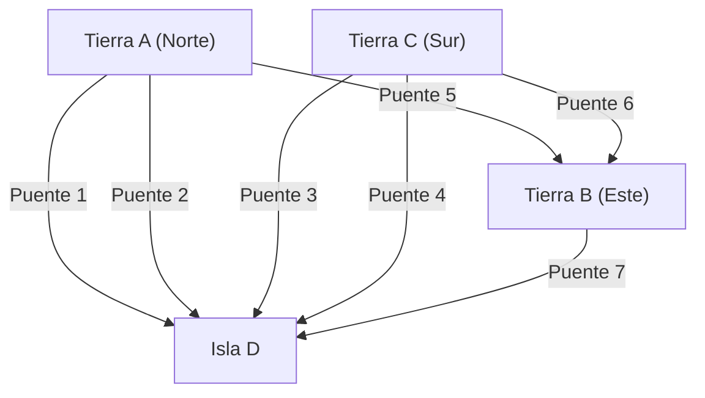

## 1. Prólogo: Un rompecabezas sin solución y la antigua ciudad prusiana

En el siglo XVIII, en la ciudad de Königsberg, situada en el Reino de Prusia (actualmente Kaliningrado, Rusia), fluía un gran río llamado Pregel. En este río se encontraba la isla de Kneiphof. La ciudad estaba dividida en cuatro masas de tierra por el río, y para conectarlas se habían construido siete puentes.

Entre los habitantes de Königsberg de la época, se popularizó un juego intelectual.
**"¿Es posible partir de algún lugar de la ciudad, cruzar cada uno de los siete puentes exactamente una vez y volver al punto de partida?"**

Todos intentaban resolverlo mientras paseaban, pero nadie lograba tener éxito. Sin embargo, tampoco había nadie capaz de explicar lógicamente por qué era imposible. Esto fue conocido como el "Problema de los puentes de Königsberg" y fue tratado durante mucho tiempo como un rompecabezas sin resolver.

Quien arrojó una luz matemática completamente nueva sobre lo que parecía ser un simple juego de la ciudad, fue el excepcional genio matemático **Leonhard Euler**. Sus reflexiones no se limitaron a encontrar la respuesta al rompecabezas, sino que fundaron áreas gigantescas de las matemáticas que luego serían conocidas como la "Teoría de grafos" y la "Topología".

En este artículo, trazaremos el magnífico recorrido que comienza con la formulación matemática de este descubrimiento histórico de Euler, pasando por la teoría de redes moderna, hasta llegar a los algoritmos de búsqueda de rutas (algoritmo de Dijkstra, algoritmo de búsqueda A*) que utilizamos a diario en nuestros navegadores GPS.

---

## 2. La abstracción de Euler: Extraer solo la esencia

Cuando Euler abordó este problema, su primer enfoque fue "eliminar la información innecesaria". En el problema de cruzar puentes, la longitud de los puentes, el tamaño de la tierra, su forma o dirección no importan en absoluto. Lo único importante es **"qué porción de tierra está conectada con qué otra, y por cuántos puentes"**, es decir, la información de conexión (propiedades topológicas).

Él redibujó las 4 masas de tierra como puntos (nodos/vértices: Node / Vertex) y los 7 puentes como líneas (aristas: Edge).



Un modelo matemático compuesto únicamente por puntos y líneas de esta manera se llama **Grafo (Graph)**. Al convertir el paisaje urbano de Königsberg en un grafo, Euler elevó el problema a una proposición puramente matemática.

---

## 3. Las condiciones matemáticas para el trazado continuo: Ciclo euleriano y camino euleriano

Usando el lenguaje de la teoría de grafos, la pregunta de los habitantes puede reformularse de la siguiente manera:
**"En un grafo dado, ¿existe una ruta que pase exactamente una vez por cada arista y regrese al vértice original (Ciclo euleriano: Eulerian Circuit)?"**

Para este problema, Euler introdujo un concepto extremadamente simple y poderoso: el **"Grado de un vértice (Degree)"**. El grado de un vértice es "el número de aristas conectadas a ese vértice".

### 3.1 Demostración de la existencia de un ciclo euleriano

Supongamos que trazamos un camino continuo en el grafo y dibujamos una ruta que regresa al punto de partida (ciclo euleriano).
Consideremos el caso de pasar por un vértice $v$ en el medio de la ruta. Para "entrar" al vértice $v$, utilizamos una arista, y para "salir" del vértice $v$, utilizamos otra arista. Es decir, cada vez que pasamos por él, consumimos un "par" de aristas conectadas a ese vértice.

Lo mismo ocurre con el vértice que es tanto el punto de partida como el de llegada. Usamos una arista al salir por primera vez y otra al regresar al final. Incluso si pasamos por ese vértice varias veces, las entradas y salidas siempre serán en pares.

Por lo tanto, para utilizar todas las aristas sin llegar a un callejón sin salida en el camino y regresar al vértice original, **el grado de todos los vértices en el grafo debe ser par**.

* **Teorema 1 (Ciclo euleriano)**: Una condición necesaria y suficiente para que un grafo conexo tenga un ciclo euleriano es que todos sus vértices tengan un grado par.

### 3.2 La evaluación de Königsberg

Verifiquemos entonces los grados del grafo de Königsberg.
- Tierra A (Norte): 3 (impar)
- Tierra B (Este): 3 (impar)
- Tierra C (Sur): 3 (impar)
- Isla D: 5 (impar)

Sorprendentemente, el grado de los 4 vértices es impar (vértices impares). Dado que no cumple la condición de que todos los vértices deben ser pares (vértices pares), Euler demostró matemáticamente que **"es imposible cruzar los siete puentes exactamente una vez y regresar"**.

※ Por cierto, en el caso de un trazado continuo donde el punto de partida y el destino pueden ser diferentes (Camino euleriano: Eulerian Path), es posible si "hay exactamente dos vértices impares" (uno será el punto de partida y el otro el de destino). Sin embargo, como en el caso de Königsberg hay 4 vértices impares, ni siquiera es posible un trazado continuo que no regrese al lugar original.

---

## 4. La evolución de la teoría de grafos: De la topología a la informática

Tras el descubrimiento de Euler, la teoría de grafos se desarrolló como una importante rama de las matemáticas. Muchos problemas difíciles, como el problema de coloración de mapas (teorema de los cuatro colores) o el problema del ciclo hamiltoniano (una ruta que pasa por todos los vértices exactamente una vez), se debatieron en el escenario de la teoría de grafos.

Sin embargo, con la llegada de las computadoras a finales del siglo XX, la teoría de grafos fue más allá de las meras matemáticas y evolucionó hasta convertirse en una poderosa herramienta (algoritmo) para resolver problemas del mundo real. Gran parte de la infraestructura de la sociedad moderna, como el enrutamiento en redes de comunicación, el análisis de relaciones en redes sociales y la optimización de redes eléctricas, se basa en la teoría de grafos.

Un problema particularmente cercano a nuestra vida diaria es el **Problema del camino más corto (Shortest Path Problem)**.
Mientras que Euler se preguntaba si "se puede pasar por todos los caminos exactamente una vez", el problema que resuelven los navegadores GPS modernos o Google Maps es "¿cuál es la ruta con el menor costo (distancia o tiempo) hacia el destino?".

---

## 5. Genealogía de los algoritmos de búsqueda de rutas

Los algoritmos para resolver el problema del camino más corto se han perfeccionado a lo largo de la historia de la informática. Aquí explicaremos dos algoritmos representativos.

### 5.1 Algoritmo de Dijkstra (Dijkstra's Algorithm)

Este algoritmo, ideado por Edsger Dijkstra en 1956, busca la distancia más corta desde un punto de partida hacia todos los vértices en un grafo donde las aristas tienen pesos (costos de distancia o tiempo).

**[Mecanismo básico]**
1. Se establece la distancia del punto de partida en 0 y la distancia provisional de todos los demás vértices en infinito ($\infty$).
2. De los vértices no determinados, se elige el vértice $u$ con la distancia provisional más corta y se "determina" su distancia.
3. Para cada vértice no determinado $v$ adyacente al vértice $u$, se calcula la distancia al pasar por $u$; si es menor que la distancia provisional actual, se actualiza (esta operación se llama relajación / Relaxation).
4. Se repiten los pasos 2 y 3 hasta que se determinen todos los vértices.

El algoritmo de Dijkstra avanza su búsqueda en círculos concéntricos desde el punto de partida, como las ondas que se propagan cuando se lanza una piedra al agua. Por lo tanto, puede encontrar de manera confiable la ruta más corta siempre que no haya pesos negativos, pero como también expande su búsqueda en la dirección opuesta al destino, tiene la desventaja de requerir mucho tiempo de cálculo en datos de mapas a gran escala.

### 5.2 Algoritmo de búsqueda A* (A-Star Search Algorithm)

Para reducir la búsqueda inútil del algoritmo de Dijkstra y apuntar al destino de manera más eficiente, se ideó el algoritmo de búsqueda A* (A-Star). Fue desarrollado en el campo de la inteligencia artificial y se aplica ampliamente en el movimiento de personajes de videojuegos y navegadores GPS.

La característica principal de A* es la introducción de una **"Función heurística (Heuristic Function)"**.

Mientras que el algoritmo de Dijkstra realiza la búsqueda basándose únicamente en la "distancia real desde el punto de partida $g(n)$", A* utiliza como valor de evaluación la suma de la "distancia real desde el punto de partida $g(n)$" + "la distancia estimada al destino (heurística) $h(n)$", denominada $f(n)$.

$$ f(n) = g(n) + h(n) $$

En el caso de los navegadores GPS, es común utilizar la "distancia en línea recta al destino" como distancia estimada $h(n)$. Esto hace que se exploren preferentemente las rutas en la dirección hacia el destino, reduciendo drásticamente la búsqueda en direcciones irrelevantes y mejorando significativamente la velocidad de cálculo.

---

## 6. Procesamiento de grafos y búsqueda de rutas en Python

En la ciencia de datos y la implementación de algoritmos modernos, la biblioteca estándar para manejar la teoría de grafos es **NetworkX** en Python.
Aquí presentaremos un ejemplo de código donde construimos un grafo simple usando NetworkX y realizamos una búsqueda de rutas utilizando el algoritmo de Dijkstra y el algoritmo A*.

```python
import networkx as nx
import matplotlib.pyplot as plt

# Creación del grafo
G = nx.Graph()

# Agregar nodos (ciudades) (se establecen coordenadas para usar en la heurística de A*)
nodes = {
    'Start': (0, 0),
    'A': (1, 2),
    'B': (2, -1),
    'C': (4, 2),
    'D': (3, 0),
    'Goal': (5, 0)
}
for node, pos in nodes.items():
    G.add_node(node, pos=pos)

# Agregar aristas (caminos) y pesos (distancia)
edges = [
    ('Start', 'A', 2.5), ('Start', 'B', 2.0),
    ('A', 'C', 2.0), ('A', 'D', 1.5),
    ('B', 'D', 2.5),
    ('C', 'Goal', 1.5), ('D', 'Goal', 2.0)
]
G.add_weighted_edges_from(edges)

# Función heurística que calcula la distancia en línea recta (para A*)
def heuristic(u, v):
    pos_u = G.nodes[u]['pos']
    pos_v = G.nodes[v]['pos']
    return ((pos_u[0] - pos_v[0])**2 + (pos_u[1] - pos_v[1])**2)**0.5

# Camino más corto con el algoritmo de Dijkstra
path_dijkstra = nx.shortest_path(G, source='Start', target='Goal', weight='weight')
length_dijkstra = nx.shortest_path_length(G, source='Start', target='Goal', weight='weight')

# Camino más corto con el algoritmo A*
path_astar = nx.astar_path(G, source='Start', target='Goal', heuristic=heuristic, weight='weight')

print(f"Ruta Dijkstra: {path_dijkstra} (Costo: {length_dijkstra})")
print(f"Ruta A*:       {path_astar}")
```

Al ejecutar este código, se puede confirmar que tanto el algoritmo de Dijkstra como el algoritmo de búsqueda A* encuentran la misma ruta más corta. En redes reales a gran escala, se produce una diferencia abrumadora en el número de nodos explorados.

---

## 7. Epílogo: Las conexiones dan forma al mundo

El modesto rompecabezas con el que se entretenían los habitantes de Königsberg, a través de los ojos de un genio llamado Leonhard Euler, se transformó en una nueva lente para reinterpretar el mundo como una "conexión de puntos y líneas".

Hoy en día, el hecho de que podamos cargar instantáneamente páginas web de servidores lejanos en Internet, o de que un navegador GPS nos guíe con precisión por tierras desconocidas, es fruto de aquella abstracción matemática que comenzó en los antiguos puentes prusianos.

En este mismo momento, la teoría de grafos sigue desempeñando un papel activo en la vanguardia de la ciencia y la tecnología: en la identificación de influencers en redes sociales, la predicción de rutas de infección de virus o el diseño de nuevos compuestos químicos. Al descifrar matemáticamente las "conexiones", podemos encontrar un orden hermoso y soluciones en un mundo que a primera vista parece demasiado complejo.
