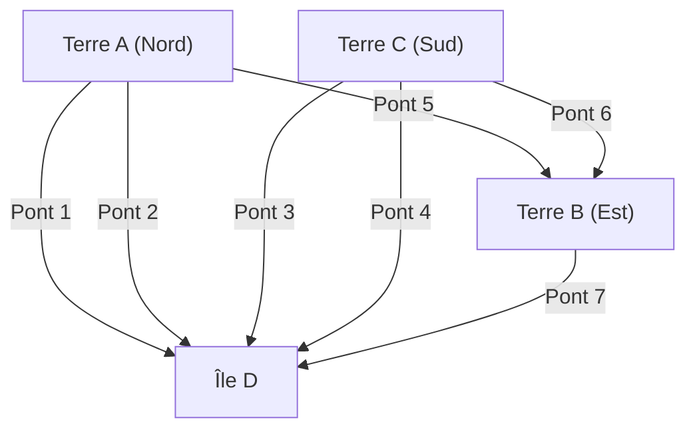

## 1. Prologue : Un puzzle insoluble et l'ancienne capitale prussienne

Au 18ème siècle, dans la ville de Königsberg, située dans le royaume de Prusse (aujourd'hui Kaliningrad, Russie), coulait un grand fleuve appelé le Pregel. Au milieu de ce fleuve se trouvait l'île de Kneiphof, divisant la ville en quatre masses terrestres reliées par sept ponts.

À cette époque, un jeu intellectuel était devenu populaire parmi les habitants de Königsberg.
**« Est-il possible de partir d'un point de la ville, de traverser chacun des sept ponts une et une seule fois, et de revenir à son point de départ ? »**

Tout le monde s'y essayait lors de promenades, mais personne ne réussissait. De plus, personne ne pouvait expliquer logiquement pourquoi c'était impossible. Connu sous le nom de "Problème des ponts de Königsberg", il a longtemps été considéré comme un puzzle non résolu.

C'est l'éminent mathématicien **[Leonhard Euler](/fr/p/euler/)** qui a jeté une lumière mathématique entièrement nouvelle sur ce qui semblait être un simple jeu de ville. Son approche ne s'est pas limitée à trouver la réponse au puzzle, mais a fondé de vastes domaines mathématiques que l'on appelle aujourd'hui la "[théorie des graphes](/fr/p/graph-theory-dijkstra-a-star/)" et la "topologie".

Cet article retrace le parcours fascinant depuis la formulation mathématique de la découverte historique d'Euler, jusqu'à la théorie moderne des réseaux et aux [algorithmes de recherche](/fr/p/search-algorithms-linear-binary-hash-table-principles/) d'itinéraire de navigation (algorithme de Dijkstra, algorithme de recherche A*) que nous utilisons quotidiennement.

---

## 2. L'abstraction d'Euler : Extraire uniquement l'essentiel

Lorsque Euler s'est attaqué à ce problème, sa première approche a été "d'éliminer les informations superflues". Pour traverser des ponts, la longueur des ponts, la taille des terres, leur forme ou leur orientation n'ont aucune importance. La seule information pertinente est **« quelle masse terrestre est reliée à quelle masse terrestre par combien de ponts »** (propriétés topologiques).

Il a représenté les quatre masses terrestres par des points (nœuds / sommets : Node / Vertex) et les sept ponts par des lignes (arêtes : Edge).



Un modèle mathématique ainsi composé uniquement de points et de lignes est appelé un **graphe (Graph)**. En convertissant la disposition de la ville de Königsberg en un graphe, Euler a élevé le problème au rang de proposition mathématique pure.

---

## 3. Les conditions mathématiques d'un tracé continu : Cycle eulérien et chemin eulérien

En termes de [théorie des graphes](/fr/p/graph-theory-dijkstra-a-star/), la question des habitants peut être reformulée ainsi :
**« Dans un graphe donné, existe-t-il un chemin qui traverse chaque arête exactement une fois et revient au sommet de départ (cycle eulérien : Eulerian Circuit) ? »**

Pour répondre à ce problème, Euler a introduit un concept extrêmement simple et puissant : **« le degré d'un sommet (Degree) »**. Le degré d'un sommet est "le nombre d'arêtes qui lui sont connectées".

### 3.1 Preuve de l'existence d'un cycle eulérien

Supposons que l'on trace un chemin sur un graphe d'un trait continu et que l'on revienne au point de départ (cycle eulérien).
Considérons le passage par un sommet $v$ au cours du chemin. Pour "entrer" dans le sommet $v$, on utilise une arête, et pour en "sortir", on utilise une autre arête. En d'autres termes, à chaque passage, on consomme toujours les arêtes connectées à ce sommet par « paires ».

Il en va de même pour le sommet qui est à la fois le point de départ et le point d'arrivée. Lors du départ initial, on utilise une arête, et lors du retour final, on utilise une autre arête. Même si l'on passe par ce sommet plusieurs fois, les entrées et sorties vont toujours par paires.

Par conséquent, pour utiliser toutes les arêtes sans se retrouver bloqué et revenir au sommet de départ, **le degré de tous les sommets du graphe doit être pair**.

* **Théorème 1 (Cycle eulérien)** : La condition nécessaire et suffisante pour qu'un graphe connexe possède un cycle eulérien est que le degré de tous ses sommets soit pair.

### 3.2 L'évaluation de Königsberg

Vérifions maintenant les degrés du graphe de Königsberg.
- Terre A (Nord) : 3 (impair)
- Terre B (Est) : 3 (impair)
- Terre C (Sud) : 3 (impair)
- Île D : 5 (impair)

Étonnamment, les degrés des quatre sommets sont impairs (sommets impairs). Comme la condition selon laquelle tous les sommets doivent être pairs (sommets pairs) n'est pas remplie, Euler a mathématiquement prouvé qu'**« il est impossible de traverser les sept ponts une et une seule fois et de revenir au point de départ »**.

*Note : Pour un tracé continu où le point de départ et d'arrivée peuvent être différents (chemin eulérien : Eulerian Path), c'est possible s'il y a "exactement deux sommets impairs" (l'un sera le point de départ et l'autre le point d'arrivée). Cependant, dans le cas de Königsberg, puisqu'il y a 4 sommets impairs, il n'est même pas possible de faire un tracé continu sans revenir au point de départ.

---

## 4. L'évolution de la théorie des graphes : De la topologie à l'informatique

Après la découverte d'Euler, la [théorie des graphes](/fr/p/graph-theory-dijkstra-a-star/) s'est développée pour devenir une branche majeure des mathématiques. De nombreux problèmes difficiles, tels que le problème de coloration de cartes ([théorème des quatre couleurs](/fr/p/four-color-theorem/)) et le problème du cycle hamiltonien (un chemin qui visite chaque sommet exactement une fois), ont été débattus sur la scène de la [théorie des graphes](/fr/p/graph-theory-dijkstra-a-star/).

Cependant, avec l'avènement des ordinateurs dans la seconde moitié du 20ème siècle, la [théorie des graphes](/fr/p/graph-theory-dijkstra-a-star/) a dépassé le simple cadre mathématique pour devenir une arme puissante (algorithmes) permettant de résoudre des problèmes du monde réel. Le routage des réseaux de communication, l'analyse des relations sur les réseaux sociaux, l'optimisation des réseaux électriques et bien d'autres infrastructures de la société moderne reposent sur la [théorie des graphes](/fr/p/graph-theory-dijkstra-a-star/).

Le problème qui nous touche particulièrement dans notre vie quotidienne est le **problème du plus court chemin (Shortest Path Problem)**.
Alors qu'Euler se demandait « s'il était possible d'emprunter tous les chemins une fois », ce que résolvent les GPS modernes ou Google Maps est la question : « quel est le parcours dont le coût (distance ou temps) jusqu'à la destination est le plus faible ? ».

---

## 5. La généalogie des algorithmes de recherche d'itinéraire

Les algorithmes pour résoudre le problème du plus court chemin ont été affinés au cours de l'histoire de l'informatique. Nous expliquons ici deux algorithmes représentatifs.

### 5.1 Algorithme de Dijkstra (Dijkstra's Algorithm)

Conçu par [Edsger Dijkstra](/fr/p/biography-edsger-dijkstra/) en 1956, cet algorithme trouve la distance la plus courte d'un point de départ à tous les autres sommets dans un graphe où les arêtes ont un poids (coût en distance ou en temps).

**【Principe de base】**
1. Fixer la distance du point de départ à 0, et la distance provisoire de tous les autres sommets à l'infini ($\infty$).
2. Parmi les sommets non fixés, choisir le sommet $u$ avec la distance provisoire la plus courte, et "fixer" cette distance.
3. Pour chaque sommet $v$ non fixé adjacent au sommet $u$, calculer la distance si l'on passe par $u$, et si elle est plus courte que la distance provisoire actuelle, la mettre à jour (cette opération s'appelle le relâchement / Relaxation).
4. Répéter les étapes 2 et 3 jusqu'à ce que tous les sommets soient fixés.

L'algorithme de Dijkstra fait progresser la recherche de manière concentrique à partir du point de départ, comme des ondulations qui s'élargissent lorsqu'on jette une pierre dans l'eau. Par conséquent, tant qu'il n'y a pas de poids négatifs, il trouvera à coup sûr le chemin le plus court. Toutefois, comme il étend également la recherche dans la direction opposée à la destination, il présente l'inconvénient de nécessiter beaucoup de temps de calcul pour les données cartographiques à grande échelle.

### 5.2 Algorithme de recherche A* (A-Star Search Algorithm)

Pour réduire les recherches inutiles de l'algorithme de Dijkstra et viser plus efficacement la destination, l'algorithme de recherche A* (A-star) a été conçu. Développé dans le domaine de l'intelligence artificielle, il est largement utilisé pour le déplacement de personnages dans les jeux vidéo et la navigation GPS.

La plus grande caractéristique de A* est l'introduction d'une **« fonction heuristique (Heuristic Function) »**.

Alors que l'algorithme de Dijkstra base sa recherche uniquement sur « la distance réelle depuis le point de départ $g(n)$ », A* utilise comme valeur d'évaluation la somme $f(n)$ de « la distance réelle depuis le point de départ $g(n)$ » + « la distance estimée jusqu'à la destination (heuristique) $h(n)$ ».

$$ f(n) = g(n) + h(n) $$

Dans le cas d'un GPS, il est courant d'utiliser « la distance en ligne droite jusqu'à la destination » comme distance estimée $h(n)$. Ainsi, les itinéraires se rapprochant de la destination sont explorés en priorité, ce qui réduit considérablement l'exploration dans des directions non pertinentes et améliore grandement la vitesse de calcul.

---

## 6. Traitement des graphes et recherche d'itinéraire en Python

Dans la science des données et l'implémentation d'algorithmes modernes, la bibliothèque standard pour manipuler la [théorie des graphes](/fr/p/graph-theory-dijkstra-a-star/) est **NetworkX** en Python.
Voici un exemple de code utilisant NetworkX pour construire un graphe simple et rechercher un itinéraire avec l'algorithme de Dijkstra et l'algorithme A*.

```python
import networkx as nx
import matplotlib.pyplot as plt

# Création du graphe
G = nx.Graph()

# Ajout des nœuds (villes) (définition des coordonnées à utiliser pour l'heuristique A*)
nodes = {
    'Start': (0, 0),
    'A': (1, 2),
    'B': (2, -1),
    'C': (4, 2),
    'D': (3, 0),
    'Goal': (5, 0)
}
for node, pos in nodes.items():
    G.add_node(node, pos=pos)

# Ajout des arêtes (chemins) et des poids (distances)
edges = [
    ('Start', 'A', 2.5), ('Start', 'B', 2.0),
    ('A', 'C', 2.0), ('A', 'D', 1.5),
    ('B', 'D', 2.5),
    ('C', 'Goal', 1.5), ('D', 'Goal', 2.0)
]
G.add_weighted_edges_from(edges)

# Fonction heuristique calculant la distance en ligne droite (pour A*)
def heuristic(u, v):
    pos_u = G.nodes[u]['pos']
    pos_v = G.nodes[v]['pos']
    return ((pos_u[0] - pos_v[0])**2 + (pos_u[1] - pos_v[1])**2)**0.5

# Chemin le plus court avec l'algorithme de Dijkstra
path_dijkstra = nx.shortest_path(G, source='Start', target='Goal', weight='weight')
length_dijkstra = nx.shortest_path_length(G, source='Start', target='Goal', weight='weight')

# Chemin le plus court avec l'algorithme A*
path_astar = nx.astar_path(G, source='Start', target='Goal', heuristic=heuristic, weight='weight')

print(f"Chemin Dijkstra : {path_dijkstra} (Coût : {length_dijkstra})")
print(f"Chemin A* :       {path_astar}")
```

En exécutant ce code, vous pouvez confirmer que l'algorithme de Dijkstra et l'algorithme de recherche A* trouvent tous deux le même chemin le plus court. Dans les réseaux à grande échelle du monde réel, il y a une différence écrasante dans le nombre de nœuds explorés.

---

## 7. Épilogue : Les connexions façonnent le monde

Le modeste puzzle auquel les habitants de Königsberg aimaient jouer, vu à travers les yeux du génie [Leonhard Euler](/fr/p/euler/), s'est transformé en une nouvelle lentille pour appréhender le monde comme « un réseau de points et de lignes ».

Aujourd'hui, si nous pouvons charger instantanément une page web depuis un serveur lointain via Internet, ou si un GPS peut nous guider avec précision dans une zone inconnue, tout cela est le fruit de cette abstraction mathématique qui a commencé avec les vieux ponts de Prusse.

À ce moment précis, la [théorie des graphes](/fr/p/graph-theory-dijkstra-a-star/) continue d'être activement utilisée à la pointe de la science et de la technologie, qu'il s'agisse d'identifier des influenceurs sur les réseaux sociaux, de prédire les voies d'infection d'un virus ou de concevoir de nouveaux composés chimiques. En déchiffrant mathématiquement les « connexions », nous pouvons trouver un ordre magnifique et des solutions au sein d'un monde qui semble trop complexe.
