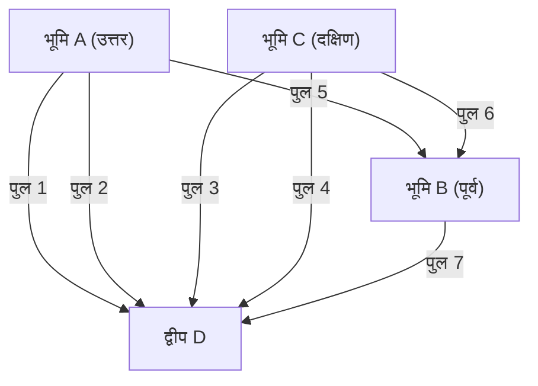

## 1. प्रस्तावना: न सुलझने वाली पहेली और प्रशिया का प्राचीन शहर

18वीं शताब्दी में, प्रशिया साम्राज्य (वर्तमान रूस के कलिनिनग्राद) में स्थित कोनिग्सबर्ग शहर से होकर प्रेगेल नाम की एक बड़ी नदी बहती थी। इस नदी के बीच में नाइपहोफ (Kneiphof) नामक एक द्वीप था, और शहर नदी द्वारा चार भूमि भागों में बंटा हुआ था, जिन्हें जोड़ने के लिए 7 पुल बनाए गए थे।

उस समय कोनिग्सबर्ग के निवासियों के बीच एक बौद्धिक खेल लोकप्रिय हो रहा था।
**"क्या शहर में कहीं से भी शुरू करके, सभी 7 पुलों को ठीक एक बार पार करते हुए, वापस उसी स्थान पर लौटना संभव है?"**

हर किसी ने टहलते हुए इसे आजमाया, लेकिन कोई भी सफल नहीं हुआ। हालांकि, कोई यह भी तार्किक रूप से नहीं समझा सका कि यह असंभव क्यों है। इसे "कोनिग्सबर्ग के पुलों की समस्या" कहा गया, और लंबे समय तक यह एक अनसुलझी पहेली बनी रही।

इस साधारण से लगने वाले खेल को पूरी तरह से एक नई गणितीय रोशनी देने वाले व्यक्ति थे, महान गणितज्ञ **लियोनहार्ड यूलर** (Leonhard Euler)। उनका विचार केवल पहेली का उत्तर देने तक सीमित नहीं रहा, बल्कि इसने "ग्राफ थ्योरी" और "टोपोलॉजी" (Topology) नामक गणित के विशाल क्षेत्रों की नींव रखी।

इस लेख में, हम यूलर की इस ऐतिहासिक खोज के गणितीय सूत्रीकरण से शुरू करके, आधुनिक नेटवर्क थ्योरी, और कार नेविगेशन में रोज़ाना इस्तेमाल होने वाले रूट सर्च एल्गोरिदम (डाइक्स्ट्रा का एल्गोरिदम, ए-स्टार सर्च एल्गोरिदम) तक की शानदार यात्रा करेंगे।

---

## 2. यूलर का अमूर्तीकरण: केवल सार निकालना

जब यूलर ने इस समस्या पर काम किया, तो उनका पहला दृष्टिकोण "अनावश्यक जानकारी को हटाना" था। पुल को पार करने की समस्या में, पुल की लंबाई, भूमि का आकार, आकृति, और दिशा से कोई फर्क नहीं पड़ता। महत्वपूर्ण बात केवल यह है कि **"कौन सी भूमि किस भूमि से, कितने पुलों द्वारा जुड़ी हुई है"** - यानी केवल जुड़ाव की जानकारी (टोपोलॉजिकल गुण)।

उन्होंने 4 भूमि भागों को बिंदु (Node / Vertex) माना, और 7 पुलों को रेखा (Edge) के रूप में फिर से खींचा।



इस तरह, केवल बिंदुओं और रेखाओं से बने गणितीय मॉडल को **ग्राफ (Graph)** कहा जाता है। यूलर ने कोनिग्सबर्ग के परिदृश्य को एक ग्राफ में बदलकर, इस समस्या को एक शुद्ध गणितीय प्रस्ताव में बदल दिया।

---

## 3. एक-स्ट्रोक ड्राइंग की गणितीय शर्तें: यूलर सर्किट और यूलर पाथ

ग्राफ थ्योरी की भाषा में, निवासियों के प्रश्न को इस तरह से फिर से कहा जा सकता है:
**"क्या दिए गए ग्राफ में ऐसा कोई रास्ता (यूलर सर्किट: Eulerian Circuit) मौजूद है जो सभी किनारों (edges) को ठीक एक बार पार करते हुए मूल बिंदु (vertex) पर वापस आ जाए?"**

इस समस्या के लिए, यूलर ने **"बिंदु की डिग्री (Degree of a vertex)"** नामक एक बहुत ही सरल और शक्तिशाली अवधारणा पेश की। बिंदु की डिग्री का अर्थ है "उस बिंदु से जुड़े हुए किनारों की संख्या।"

### 3.1 यूलर सर्किट के अस्तित्व का प्रमाण

मान लीजिए कि आप ग्राफ पर बिना पेन उठाए (एक-स्ट्रोक में) एक रास्ता (यूलर सर्किट) बनाते हैं और मूल स्थान पर लौट आते हैं।
कल्पना करें कि आप रास्ते में एक बिंदु $v$ से होकर गुजरते हैं। बिंदु $v$ में "प्रवेश" करने के लिए एक किनारे का उपयोग किया जाता है, और बिंदु $v$ से "बाहर" निकलने के लिए दूसरे किनारे का उपयोग किया जाता है। इसका मतलब है कि हर बार जब आप उस बिंदु से गुजरते हैं, तो आप अनिवार्य रूप से उससे जुड़े "दो" किनारों के सेट का उपभोग करते हैं।

यह उस बिंदु के लिए भी सच है जो शुरुआती बिंदु और अंतिम बिंदु दोनों है। जब आप पहली बार शुरू करते हैं तो एक किनारे का उपयोग किया जाता है, और जब आप अंत में वापस आते हैं तो एक और किनारे का उपयोग किया जाता है। भले ही आप उस बिंदु से कई बार गुजरें, प्रवेश और निकास हमेशा जोड़े में होंगे।

इसलिए, सभी किनारों का उपयोग करने और बीच में किसी मृत अंत (dead end) में फंसे बिना मूल बिंदु पर लौटने के लिए, **ग्राफ में सभी बिंदुओं की डिग्री सम (Even) होनी चाहिए**।

* **प्रमेय 1 (यूलर सर्किट)**: एक कनेक्टेड ग्राफ में यूलर सर्किट होने के लिए आवश्यक और पर्याप्त शर्त यह है कि सभी बिंदुओं की डिग्री सम हो।

### 3.2 कोनिग्सबर्ग का मूल्यांकन

अब, चलिए कोनिग्सबर्ग के ग्राफ की डिग्री की जांच करते हैं।
- भूमि A (उत्तर): 3 किनारे (विषम - Odd)
- भूमि B (पूर्व): 3 किनारे (विषम)
- भूमि C (दक्षिण): 3 किनारे (विषम)
- द्वीप D: 5 किनारे (विषम)

आश्चर्यजनक रूप से, सभी 4 बिंदुओं की डिग्री विषम (Odd node) है। चूँकि यह इस शर्त को पूरा नहीं करता है कि सभी बिंदु सम (Even node) होने चाहिए, यूलर ने गणितीय रूप से साबित कर दिया कि **"सभी 7 पुलों को ठीक एक बार पार करके वापस आना असंभव है।"**

※ वैसे, यदि एक-स्ट्रोक रास्ता ऐसा हो जहाँ शुरुआती बिंदु और अंतिम बिंदु अलग-अलग हो सकते हैं (यूलर पाथ: Eulerian Path), तो यह तभी संभव है जब "ठीक दो विषम बिंदु" हों (एक शुरुआती बिंदु बन जाता है, और दूसरा अंतिम बिंदु)। हालांकि, कोनिग्सबर्ग के मामले में 4 विषम बिंदु हैं, इसलिए मूल स्थान पर वापस न आने वाला एक-स्ट्रोक रास्ता भी असंभव है।

---

## 4. ग्राफ थ्योरी का विकास: टोपोलॉजी से कंप्यूटर विज्ञान तक

यूलर की खोज के बाद, ग्राफ थ्योरी गणित के एक महत्वपूर्ण क्षेत्र के रूप में विकसित हुई। कई कठिन समस्याओं, जैसे कि मानचित्र रंगने की समस्या (Four-color theorem) और हैमिल्टनियन सर्किट समस्या (सभी बिंदुओं को एक बार पार करने वाला रास्ता), पर ग्राफ थ्योरी के मंच पर चर्चा की गई।

हालाँकि, 20वीं सदी के उत्तरार्ध में कंप्यूटर के आगमन के साथ, ग्राफ थ्योरी गणित की सीमाओं को पार कर गई और वास्तविक दुनिया की समस्याओं को हल करने के लिए एक शक्तिशाली हथियार (एल्गोरिदम) के रूप में विकसित हुई। संचार नेटवर्क रूटिंग, सोशल मीडिया संबंध विश्लेषण, और पावर ग्रिड अनुकूलन जैसे आधुनिक समाज के कई बुनियादी ढांचे ग्राफ थ्योरी पर आधारित हैं।

विशेष रूप से हमारे जीवन से निकटता से जुड़ी हुई है **सबसे छोटा रास्ता समस्या (Shortest Path Problem)**।
यूलर ने सोचा कि "क्या हर सड़क को एक बार पार किया जा सकता है," लेकिन आधुनिक कार नेविगेशन और Google मैप्स जो समस्या हल कर रहे हैं वह यह है: "गंतव्य तक पहुंचने के लिए सबसे कम लागत (दूरी या समय) वाला मार्ग कौन सा है?"

---

## 5. मार्ग खोजने वाले एल्गोरिदम की वंशावली

सबसे छोटा रास्ता समस्या को हल करने वाले एल्गोरिदम कंप्यूटर विज्ञान के इतिहास में परिष्कृत किए गए हैं। यहां हम दो प्रतिनिधि एल्गोरिदम की व्याख्या करेंगे।

### 5.1 डाइक्स्ट्रा का एल्गोरिदम (Dijkstra's Algorithm)

1956 में एडगर डाइक्स्ट्रा द्वारा आविष्कार किया गया यह एल्गोरिदम, ऐसे ग्राफ में जहां किनारों का वजन (दूरी या समय की लागत) निर्धारित होता है, एक शुरुआती बिंदु से अन्य सभी बिंदुओं तक की सबसे छोटी दूरी खोजने का एल्गोरिदम है।

**【मूल तंत्र】**
1. शुरुआती बिंदु की दूरी 0 निर्धारित करें, और अन्य सभी बिंदुओं की अस्थायी दूरी अनंत ($\infty$) निर्धारित करें।
2. अनिर्धारित बिंदुओं में से, सबसे कम अस्थायी दूरी वाले बिंदु $u$ को चुनें, और इसकी दूरी को "निर्धारित" करें।
3. बिंदु $u$ से सटे हुए अनिर्धारित बिंदुओं $v$ के लिए, बिंदु $u$ के माध्यम से जाने वाली दूरी की गणना करें। यदि यह वर्तमान अस्थायी दूरी से कम है, तो इसे अपडेट करें (इस क्रिया को ढील / Relaxation कहा जाता है)।
4. चरण 2-3 को तब तक दोहराएं जब तक कि सभी बिंदु निर्धारित न हो जाएं।

डाइक्स्ट्रा का एल्गोरिदम शुरुआती बिंदु से बाहर की ओर एक संकेंद्रित चक्र में खोज करता है, बिल्कुल वैसे ही जैसे पानी में पत्थर फेंकने पर लहरें फैलती हैं। इसलिए, यह गारंटी देता है कि जब तक कोई नकारात्मक वजन नहीं है, तब तक सबसे छोटा रास्ता मिल जाएगा। हालांकि, क्योंकि यह गंतव्य की विपरीत दिशा में भी खोज का विस्तार करता है, बड़े पैमाने के मानचित्र डेटा में गणना करने में अधिक समय लग सकता है।

### 5.2 ए-स्टार सर्च एल्गोरिदम (A-Star Search Algorithm)

डाइक्स्ट्रा के एल्गोरिदम की अनावश्यक खोजों को कम करने और गंतव्य की ओर अधिक कुशलता से आगे बढ़ने के लिए ए* (A-Star) सर्च एल्गोरिदम का आविष्कार किया गया था। इसे आर्टिफिशियल इंटेलिजेंस के क्षेत्र में विकसित किया गया था और खेल के पात्रों की गतिशीलता और कार नेविगेशन सिस्टम में इसका व्यापक रूप से उपयोग किया जाता है।

ए* की सबसे बड़ी विशेषता **"ह्यूरिस्टिक फ़ंक्शन (Heuristic Function)"** का उपयोग है।

जबकि डाइक्स्ट्रा का एल्गोरिदम केवल "शुरुआती बिंदु से वास्तविक दूरी $g(n)$" के आधार पर खोजता है, ए* एक मूल्यांकन मूल्य $f(n)$ का उपयोग करता है, जो "शुरुआती बिंदु से वास्तविक दूरी $g(n)$" + "गंतव्य तक अनुमानित दूरी (ह्यूरिस्टिक) $h(n)$" का कुल योग है।

$$ f(n) = g(n) + h(n) $$

कार नेविगेशन के मामले में, गंतव्य तक सीधी-रेखा की दूरी का उपयोग अनुमानित दूरी $h(n)$ के रूप में करना आम है। इसके परिणामस्वरूप, गंतव्य की दिशा में रास्तों को प्राथमिकता दी जाती है, अप्रासंगिक दिशाओं में खोजों को काफी हद तक कम किया जाता है, और गणना की गति में भारी सुधार होता है।

---

## 6. पायथन (Python) के साथ ग्राफ प्रोसेसिंग और रूट सर्च निष्पादन

आधुनिक डेटा विज्ञान और एल्गोरिदम कार्यान्वयन में, ग्राफ थ्योरी को संभालने के लिए मानक पायथन लाइब्रेरी **NetworkX** है।
यहां, हम एक साधारण ग्राफ बनाने के लिए NetworkX का उपयोग करेंगे और डाइक्स्ट्रा के एल्गोरिदम और ए* एल्गोरिदम का उपयोग करके रूट सर्च करने का एक कोड उदाहरण दिखाएंगे।

```python
import networkx as nx
import matplotlib.pyplot as plt

# ग्राफ बनाना
G = nx.Graph()

# नोड्स (शहर) जोड़ना (कोऑर्डिनेट्स सेट करना ए* के ह्यूरिस्टिक में उपयोग के लिए)
nodes = {
    'Start': (0, 0),
    'A': (1, 2),
    'B': (2, -1),
    'C': (4, 2),
    'D': (3, 0),
    'Goal': (5, 0)
}
for node, pos in nodes.items():
    G.add_node(node, pos=pos)

# किनारे (सड़कें) और वजन (दूरी) जोड़ना
edges = [
    ('Start', 'A', 2.5), ('Start', 'B', 2.0),
    ('A', 'C', 2.0), ('A', 'D', 1.5),
    ('B', 'D', 2.5),
    ('C', 'Goal', 1.5), ('D', 'Goal', 2.0)
]
G.add_weighted_edges_from(edges)

# सीधी-रेखा की दूरी की गणना करने के लिए ह्यूरिस्टिक फ़ंक्शन (ए* के लिए)
def heuristic(u, v):
    pos_u = G.nodes[u]['pos']
    pos_v = G.nodes[v]['pos']
    return ((pos_u[0] - pos_v[0])**2 + (pos_u[1] - pos_v[1])**2)**0.5

# डाइक्स्ट्रा के एल्गोरिदम द्वारा सबसे छोटा रास्ता
path_dijkstra = nx.shortest_path(G, source='Start', target='Goal', weight='weight')
length_dijkstra = nx.shortest_path_length(G, source='Start', target='Goal', weight='weight')

# ए* एल्गोरिदम द्वारा सबसे छोटा रास्ता
path_astar = nx.astar_path(G, source='Start', target='Goal', heuristic=heuristic, weight='weight')

print(f"Dijkstra Path: {path_dijkstra} (Cost: {length_dijkstra})")
print(f"A* Path:       {path_astar}")
```

जब आप इस कोड को चलाते हैं, तो आप पुष्टि कर सकते हैं कि डाइक्स्ट्रा का एल्गोरिदम और ए* सर्च एल्गोरिदम दोनों एक ही सबसे छोटा रास्ता ढूंढते हैं। वास्तविक बड़े पैमाने के नेटवर्क में, खोजे गए नोड्स की संख्या में भारी अंतर होता है।

---

## 7. उपसंहार: जुड़ाव दुनिया को आकार देते हैं

लियोनहार्ड यूलर नाम के एक जीनियस की नजर से देखे जाने पर, कोनिग्सबर्ग के निवासियों द्वारा खेला जाने वाला वह छोटा सा पहेली खेल एक नए लेंस में बदल गया, जिसने दुनिया को "बिंदुओं और रेखाओं के जुड़ाव" के रूप में फिर से परिभाषित किया।

आज, जब हम इंटरनेट पर दूर के सर्वर से तुरंत वेब पेज लोड कर पाते हैं, या जब कार नेविगेशन सिस्टम हमें किसी अनजान जगह पर सही रास्ता दिखाता है, तो यह सब प्रशिया के उस पुराने पुल से शुरू हुए गणितीय अमूर्तीकरण का ही परिणाम है।

इस समय भी, ग्राफ थ्योरी सोशल मीडिया पर प्रभावशाली लोगों की पहचान करने, वायरस के संक्रमण मार्ग की भविष्यवाणी करने, और नए रासायनिक यौगिकों के डिजाइन जैसे अत्याधुनिक विज्ञान और प्रौद्योगिकी के क्षेत्रों में सक्रिय रूप से काम कर रही है। "जुड़ाव" को गणितीय रूप से समझकर, हम इस अत्यधिक जटिल लगने वाली दुनिया में सुंदर व्यवस्था और समाधान ढूंढ सकते हैं।
