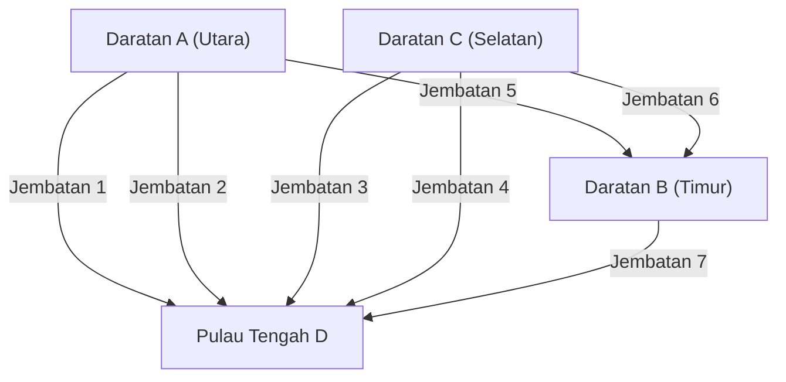

## 1. Prolog: Teka-teki yang Tak Terpecahkan dan Kota Kuno Prusia

Pada abad ke-18, di kota Königsberg yang terletak di Kerajaan Prusia (sekarang Kaliningrad, Rusia), mengalir sebuah sungai besar yang disebut Sungai Pregel. Di sungai ini terdapat Pulau Kneiphof sebagai pulau di tengah sungai, dan kota tersebut terbagi oleh sungai menjadi empat daratan, dengan tujuh jembatan yang dibangun untuk menghubungkannya.

Di antara penduduk Königsberg pada saat itu, ada sebuah permainan intelektual yang sedang populer.
**"Bisakah kita berangkat dari suatu tempat di kota, menyeberangi ketujuh jembatan masing-masing tepat satu kali, dan kembali ke tempat semula?"**

Setiap orang yang berjalan-jalan mencoba tantangan ini, tetapi tidak ada satu pun yang berhasil. Namun, tidak ada juga yang bisa menjelaskan secara logis mengapa hal itu tidak mungkin. Ini disebut "Masalah Jembatan Königsberg" dan telah lama dianggap sebagai teka-teki yang belum terpecahkan.

Teka-teki permainan kota yang tampaknya biasa ini diberikan pencerahan matematika yang sama sekali baru oleh matematikawan jenius yang langka, **Leonhard Euler**. Pemikirannya tidak hanya memberikan jawaban atas teka-teki tersebut, tetapi juga mendirikan bidang matematika besar yang kemudian dikenal sebagai "Teori Graf" dan "Topologi".

Artikel ini akan menelusuri lintasan epik yang dimulai dari perumusan matematika penemuan bersejarah Euler ini, menuju teori jaringan modern dan algoritma pencarian rute navigasi mobil (Algoritma Dijkstra, Algoritma Pencarian A*) yang kita gunakan sehari-hari.

---

## 2. Abstraksi Euler: Mengekstrak Hanya Intisari

Ketika Euler menangani masalah ini, pendekatan pertama yang dia ambil adalah "menghilangkan informasi yang tidak perlu". Dalam masalah menyeberangi jembatan, panjang jembatan, luas, bentuk, dan arah daratan sama sekali tidak relevan. Yang penting hanyalah **"daratan mana dan daratan mana yang dihubungkan oleh berapa banyak jembatan"**, yaitu hanya informasi koneksi (sifat topologis).

Dia menggambarkan ulang empat daratan sebagai titik (Simpul: Node / Vertex) dan tujuh jembatan sebagai garis (Sisi: Edge).



Model matematika yang hanya terdiri dari titik dan garis dengan cara ini disebut **Graf (Graph)**. Dengan mengubah tata kota Königsberg menjadi sebuah graf, Euler mengangkat masalah ini menjadi proposisi matematika murni.

---

## 3. Kondisi Matematis Menggambar Satu Garis: Sirkuit Euler dan Lintasan Euler

Menggunakan bahasa teori graf, pertanyaan penduduk dapat diutarakan ulang sebagai berikut.
**"Dalam graf yang diberikan, apakah ada rute yang melewati semua sisi tepat satu kali dan kembali ke simpul awal (Sirkuit Euler: Eulerian Circuit)?"**

Untuk masalah ini, Euler memperkenalkan konsep yang sangat sederhana dan kuat yang disebut **"Derajat Simpul (Degree)"**. Derajat simpul adalah "jumlah sisi yang terhubung ke simpul tersebut".

### 3.1 Bukti Keberadaan Sirkuit Euler

Misalkan kita menggambar rute yang melintasi graf dengan satu garis dan kembali ke tempat asal (Sirkuit Euler).
Di tengah rute, pertimbangkan kasus melewati suatu simpul $v$. Untuk "masuk" ke simpul $v$, satu sisi digunakan, dan untuk "keluar" dari simpul $v$, sisi lain digunakan. Artinya, setiap kali melewatinya, Anda harus mengkonsumsi sisi yang terhubung ke simpul tersebut dalam set "dua".

Hal yang sama berlaku untuk simpul yang merupakan titik awal sekaligus titik akhir. Satu sisi digunakan saat berangkat pertama kali, dan sisi lain digunakan saat kembali pada akhirnya. Bahkan jika Anda melewati simpul tersebut beberapa kali, keluar masuknya tetap berpasangan.

Oleh karena itu, untuk menghabiskan semua sisi dan kembali ke simpul asal tanpa menemui jalan buntu di tengah jalan, **derajat semua simpul dalam graf harus genap**.

* **Teorema 1 (Sirkuit Euler)**: Syarat perlu dan cukup agar graf terhubung memiliki sirkuit Euler adalah derajat semua simpulnya genap.

### 3.2 Penilaian Königsberg

Sekarang mari kita periksa derajat graf Königsberg.
- Daratan A (Utara): 3 buah (Ganjil)
- Daratan B (Timur): 3 buah (Ganjil)
- Daratan C (Selatan): 3 buah (Ganjil)
- Pulau Tengah D: 5 buah (Ganjil)

Yang mengejutkan, derajat keempat simpul semuanya ganjil (titik ganjil). Karena tidak memenuhi syarat bahwa semua simpul harus genap (titik genap), Euler membuktikan secara matematis bahwa **"tidak mungkin menyeberangi ketujuh jembatan masing-masing tepat satu kali dan kembali"**.

*Sebagai catatan, dalam kasus menggambar satu garis di mana titik awal dan titik akhir boleh berbeda (Lintasan Euler: Eulerian Path), itu mungkin jika "tepat ada 2 titik ganjil" (karena satu menjadi titik awal dan yang lainnya menjadi titik akhir). Namun, dalam kasus Königsberg, karena ada 4 titik ganjil, bahkan menggambar satu garis tanpa kembali ke tempat asal pun tidak mungkin.

---

## 4. Evolusi Teori Graf: Dari Topologi ke Ilmu Komputer

Sejak penemuan Euler, teori graf telah berkembang sebagai cabang penting matematika. Banyak masalah sulit telah dibahas di panggung teori graf, seperti masalah pewarnaan peta (Teorema Empat Warna) dan masalah sirkuit Hamilton (rute yang melewati semua simpul tepat satu kali).

Namun, dengan munculnya komputer pada paruh kedua abad ke-20, teori graf melampaui kerangka matematika sederhana dan berevolusi menjadi senjata yang ampuh (algoritma) untuk memecahkan masalah dunia nyata. Banyak infrastruktur masyarakat modern bergantung pada teori graf sebagai fondasinya, seperti perutean jaringan komunikasi, analisis hubungan pertemanan SNS, dan optimalisasi jaringan listrik.

Masalah yang sangat erat kaitannya dengan kehidupan kita adalah **Masalah Lintasan Terpendek (Shortest Path Problem)**.
Sementara Euler memikirkan "apakah kita dapat melewati semua jalan tepat satu kali", apa yang dipecahkan oleh sistem navigasi mobil modern dan Google Maps adalah masalah "rute mana ke tujuan yang memiliki biaya (jarak atau waktu) paling sedikit".

---

## 5. Silsilah Algoritma Pencarian Rute

Algoritma untuk memecahkan masalah lintasan terpendek telah disempurnakan sepanjang sejarah ilmu komputer. Di sini kami menjelaskan dua algoritma perwakilan.

### 5.1 Algoritma Dijkstra (Dijkstra's Algorithm)

Diciptakan oleh Edsger Dijkstra pada tahun 1956, algoritma ini adalah algoritma untuk menemukan jarak terpendek dari titik awal tertentu ke semua simpul dalam graf di mana sisi memiliki bobot (biaya jarak atau waktu).

**[Mekanisme Dasar]**
1. Atur jarak titik awal menjadi 0, dan jarak sementara semua simpul lainnya menjadi tak terhingga ($\infty$).
2. Di antara simpul-simpul yang belum dipastikan, pilih simpul $u$ dengan jarak sementara terpendek, dan tetapkan jarak tersebut sebagai "pasti".
3. Untuk simpul belum dipastikan $v$ yang berdekatan dengan simpul $u$, hitung jarak jika melewatinya, dan perbarui jika lebih pendek dari jarak sementara saat ini (operasi ini disebut Relaksasi / Relaxation).
4. Ulangi 2 hingga 3 sampai semua simpul dipastikan.

Algoritma Dijkstra melanjutkan pencarian dalam lingkaran konsentris dari titik awal, seperti riak yang menyebar saat sebuah batu dilemparkan ke permukaan air. Oleh karena itu, selama tidak ada bobot negatif, algoritma ini pasti dapat menemukan rute terpendek. Namun, ia memiliki kelemahan yaitu membutuhkan waktu komputasi yang lama untuk data peta skala besar, karena juga memperluas pencarian ke arah yang berlawanan dengan tujuan.

### 5.2 Algoritma Pencarian A* (A-Star Search Algorithm)

Algoritma pencarian A* (A-Star) dirancang untuk mengurangi pencarian sia-sia dari algoritma Dijkstra dan mengarah ke tujuan dengan lebih efisien. Ini dikembangkan di bidang kecerdasan buatan dan secara luas diterapkan pada pergerakan karakter game dan sistem navigasi mobil.

Fitur terbesar dari A* adalah pengenalan **"Fungsi Heuristik (Heuristic Function)"**.

Sementara algoritma Dijkstra mencari hanya berdasarkan "jarak sebenarnya dari titik awal $g(n)$", A* menggunakan jumlah total $f(n)$ dari "jarak sebenarnya dari titik awal $g(n)$" + "perkiraan jarak ke tujuan (heuristik) $h(n)$" sebagai nilai evaluasi.

$$ f(n) = g(n) + h(n) $$

Dalam kasus navigasi mobil, umumnya menggunakan "jarak garis lurus ke tujuan" sebagai perkiraan jarak $h(n)$. Dengan ini, rute ke arah yang mendekati tujuan dieksplorasi secara istimewa, sehingga pencarian ke arah yang tidak relevan berkurang drastis, dan kecepatan komputasi meningkat secara signifikan.

---

## 6. Pemrosesan Graf dan Eksekusi Pencarian Rute dengan Python

Dalam ilmu data dan implementasi algoritma modern, perpustakaan standar untuk menangani teori graf adalah **NetworkX** dari Python.
Di sini, kami memperkenalkan contoh kode yang menggunakan NetworkX untuk membangun graf sederhana dan melakukan pencarian rute menggunakan algoritma Dijkstra dan A*.

```python
import networkx as nx
import matplotlib.pyplot as plt

# Membuat graf
G = nx.Graph()

# Menambahkan node (kota) (mengatur koordinat untuk digunakan dalam heuristik A*)
nodes = {
    'Start': (0, 0),
    'A': (1, 2),
    'B': (2, -1),
    'C': (4, 2),
    'D': (3, 0),
    'Goal': (5, 0)
}
for node, pos in nodes.items():
    G.add_node(node, pos=pos)

# Menambahkan edge (jalan) dan bobot (jarak)
edges = [
    ('Start', 'A', 2.5), ('Start', 'B', 2.0),
    ('A', 'C', 2.0), ('A', 'D', 1.5),
    ('B', 'D', 2.5),
    ('C', 'Goal', 1.5), ('D', 'Goal', 2.0)
]
G.add_weighted_edges_from(edges)

# Fungsi heuristik untuk menghitung jarak garis lurus (untuk A*)
def heuristic(u, v):
    pos_u = G.nodes[u]['pos']
    pos_v = G.nodes[v]['pos']
    return ((pos_u[0] - pos_v[0])**2 + (pos_u[1] - pos_v[1])**2)**0.5

# Rute terpendek dengan algoritma Dijkstra
path_dijkstra = nx.shortest_path(G, source='Start', target='Goal', weight='weight')
length_dijkstra = nx.shortest_path_length(G, source='Start', target='Goal', weight='weight')

# Rute terpendek dengan algoritma A*
path_astar = nx.astar_path(G, source='Start', target='Goal', heuristic=heuristic, weight='weight')

print(f"Dijkstra Path: {path_dijkstra} (Cost: {length_dijkstra})")
print(f"A* Path:       {path_astar}")
```

Dengan menjalankan kode ini, Anda dapat mengonfirmasi bahwa algoritma Dijkstra dan algoritma pencarian A* menemukan lintasan terpendek yang sama. Dalam jaringan skala besar yang sebenarnya, ada perbedaan yang luar biasa dalam jumlah simpul yang dieksplorasi.

---

## 7. Epilog: Koneksi Membentuk Dunia

Teka-teki kecil yang dinikmati penduduk Königsberg, melalui mata seorang jenius bernama Leonhard Euler, berubah menjadi lensa baru untuk memahami kembali dunia sebagai "hubungan titik dan garis".

Saat ini, fakta bahwa kita dapat langsung memuat halaman web dari server yang jauh di internet, atau navigasi mobil yang secara akurat memandu kita di tanah yang tidak dikenal, semuanya adalah hasil dari abstraksi matematika yang dimulai dari jembatan tua Prusia tersebut.

Bahkan pada saat ini, teori graf terus berperan aktif di garis depan sains dan teknologi mutakhir, seperti mengidentifikasi influencer media sosial, memprediksi rute penularan virus, dan merancang senyawa kimia baru. Dengan menguraikan "koneksi" secara matematis, kita dapat menemukan keteraturan dan solusi yang indah di dunia yang tampaknya terlalu kompleks.
