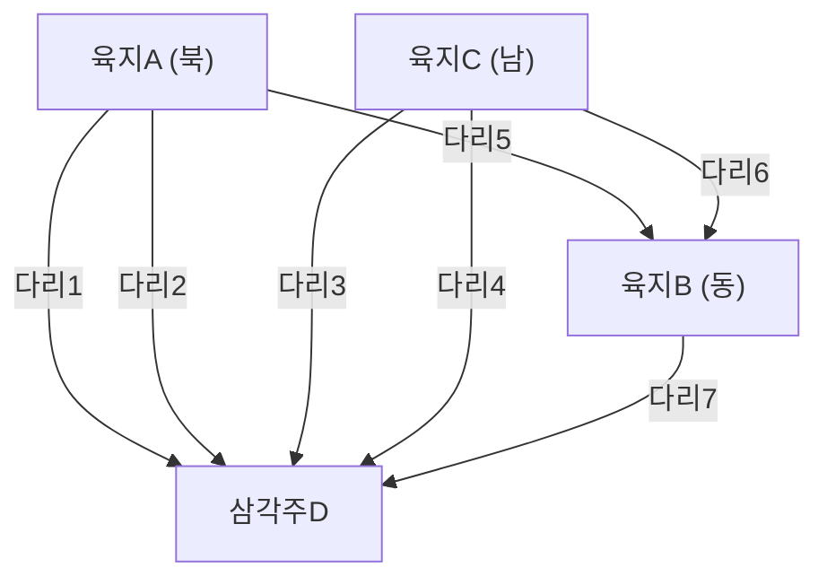

## 1. 프롤로그: 풀리지 않는 퍼즐과 프로이센의 고도

18세기, 프로이센 왕국(현재의 러시아 칼리닌그라드)에 위치한 도시 쾨니히스베르크에는 프레겔 강이라는 큰 강이 흐르고 있었습니다. 이 강에는 삼각주로 크나이프호프 섬이 있었고, 도시는 강에 의해 4개의 육지로 나뉘어 있었으며, 이들을 연결하도록 7개의 다리가 놓여 있었습니다.

당시 쾨니히스베르크 주민들 사이에서 어떤 지적인 놀이가 유행하고 있었습니다.
**"도시의 어딘가에서 출발하여 7개의 다리를 모두 한 번씩만 건너서 원래의 위치로 돌아올 수 있을까?"**

누구나 산책 삼아 도전했지만, 성공하는 사람은 단 한 명도 없었습니다. 하지만 왜 불가능한지 논리적으로 설명할 수 있는 사람도 없었습니다. 이것은 '쾨니히스베르크의 다리 문제'라고 불리며 오랫동안 미해결 퍼즐로 다루어져 왔습니다.

이 언뜻 보기에 단순한 동네 놀이 퍼즐에 완전히 새로운 수학적 빛을 비춘 사람이 희대의 천재 수학자 **레온하르트 오일러**(Leonhard Euler)입니다. 그의 고찰은 단순히 퍼즐의 답을 내는 것에 그치지 않고, 훗날 '그래프 이론'이나 '위상수학(Topology)'이라고 불리는 거대한 수학 분야를 창시하게 됩니다.

본 기사에서는 이 오일러의 역사적 발견의 수학적 공식화부터 시작하여 현대의 네트워크 이론과 우리가 일상적으로 이용하는 내비게이션의 경로 탐색 알고리즘(다익스트라 알고리즘, A* 탐색 알고리즘)에 이르기까지의 장대한 궤적을 따라가 봅니다.

---

## 2. 오일러의 추상화: 본질만을 추출하다

오일러가 이 문제에 접근했을 때, 그가 취한 첫 번째 접근법은 '불필요한 정보를 덜어내는 것'이었습니다. 다리를 건너는 문제에 있어서 다리의 길이나 육지의 넓이, 모양, 방향 등은 전혀 관계가 없습니다. 중요한 것은 **"어떤 육지와 어떤 육지가 몇 개의 다리로 연결되어 있는가"**라는 연결 정보(위상적 성질)뿐입니다.

그는 4개의 육지를 점(정점: Node / Vertex)으로, 7개의 다리를 선(간선: Edge)으로 다시 그렸습니다.



이와 같이 점과 선으로만 구성된 수학적 모델을 **그래프 (Graph)**라고 부릅니다. 오일러는 쾨니히스베르크의 거리를 하나의 그래프로 변환함으로써 문제를 순수한 수학적 명제로 승화시킨 것입니다.

---

## 3. 한붓그리기의 수학적 조건: 오일러 회로와 오일러 경로

그래프 이론의 용어를 사용하면 주민들의 질문은 다음과 같이 바꾸어 말할 수 있습니다.
**"주어진 그래프에서 모든 간선을 정확히 한 번씩만 지나서 원래의 정점으로 돌아오는 경로(오일러 회로: Eulerian Circuit)가 존재하는가?"**

오일러는 이 문제에 대해 **"정점의 차수(Degree)"**라는 매우 간단하고도 강력한 개념을 도입했습니다. 정점의 차수란 "그 정점에 연결된 간선의 수"를 의미합니다.

### 3.1 오일러 회로가 존재하기 위한 증명

그래프 위를 한붓그리기로 진행하여 원래의 위치로 돌아오는 경로(오일러 회로)를 그린다고 가정해 봅시다.
경로 도중에 어떤 정점 $v$를 통과하는 경우를 생각해 봅니다. 정점 $v$로 '들어오기' 위해서는 1개의 간선을 사용하고, 정점 $v$에서 '나가기' 위해서 또 다른 1개의 간선을 사용합니다. 즉, 통과할 때마다 그 정점에 연결된 간선을 반드시 '2개' 세트로 소비하게 됩니다.

출발점이자 종점인 정점의 경우에도 마찬가지입니다. 처음에 출발할 때 1개의 간선을 사용하고, 마지막에 돌아올 때 또 다른 1개의 간선을 사용합니다. 여러 번 그 정점을 경유한다고 해도 역시 출입은 쌍이 됩니다.

따라서 모든 간선을 다 사용하고, 도중에 막다른 길에 다다르지 않고 원래의 정점으로 돌아오기 위해서는 **그래프 내의 모든 정점의 차수가 짝수**여야만 하는 것입니다.

* **정리1 (오일러 회로)**: 연결 그래프가 오일러 회로를 갖기 위한 필요충분조건은 모든 정점의 차수가 짝수인 것이다.

### 3.2 쾨니히스베르크의 판정

그러면 쾨니히스베르크 그래프의 차수를 확인해 보겠습니다.
- 육지A (북): 3개 (홀수)
- 육지B (동): 3개 (홀수)
- 육지C (남): 3개 (홀수)
- 삼각주D: 5개 (홀수)

놀랍게도 4개의 정점 모두 차수가 홀수(홀수점)입니다. 모든 정점이 짝수(짝수점)여야 한다는 조건을 만족하지 않기 때문에, 오일러는 **"7개의 다리를 모두 한 번씩만 건너서 돌아오는 것은 불가능하다"**고 수학적으로 증명했습니다.

※ 참고로 출발점과 종점이 달라도 되는 한붓그리기(오일러 경로: Eulerian Path)의 경우는 "홀수점이 정확히 2개"이면 가능합니다(1개가 출발점, 다른 1개가 종점이 되기 때문). 하지만 쾨니히스베르크의 경우는 홀수점이 4개이기 때문에 원래 위치로 돌아오지 않는 한붓그리기조차 불가능합니다.

---

## 4. 그래프 이론의 진화: 위상수학에서 컴퓨터 과학으로

오일러의 발견 이후 그래프 이론은 수학의 중요한 한 분야로 발전했습니다. 지도 색칠 문제(4색 정리)나 해밀턴 회로 문제(모든 정점을 한 번씩 지나는 경로) 등 수많은 난제들이 그래프 이론의 무대에서 논의되었습니다.

그러나 20세기 후반 컴퓨터의 등장으로 그래프 이론은 단순한 수학의 틀을 넘어 현실 세계의 문제를 해결하기 위한 강력한 무기(알고리즘)로 진화합니다. 통신 네트워크의 라우팅, SNS의 교우 관계 분석, 전력망의 최적화 등 현대 사회 인프라의 많은 부분이 그래프 이론을 기반으로 하고 있습니다.

특히 우리의 생활과 밀접하게 맞닿아 있는 것이 **최단 경로 문제 (Shortest Path Problem)**입니다.
오일러는 '모든 길을 한 번씩 지날 수 있는가'를 생각했지만, 현대의 내비게이션이나 구글 지도에서 풀고 있는 것은 '목적지까지 가장 비용(거리나 시간)이 적게 드는 경로는 무엇인가'라는 문제입니다.

---

## 5. 경로 탐색 알고리즘의 계보

최단 경로 문제를 풀기 위한 알고리즘은 컴퓨터 과학의 역사 속에서 세련되어 왔습니다. 여기서는 대표적인 알고리즘 2가지를 해설합니다.

### 5.1 다익스트라 알고리즘 (Dijkstra's Algorithm)

에츠허르 다익스트라가 1956년에 고안한 이 알고리즘은 간선에 가중치(거리나 시간 비용)가 설정된 그래프에서 특정 출발점으로부터 모든 정점까지의 최단 거리를 구하는 알고리즘입니다.

**【기본적인 구조】**
1. 출발점의 거리를 0, 다른 모든 정점의 잠정 거리를 무한대($\infty$)로 설정한다.
2. 미확정 정점 중에서 가장 잠정 거리가 짧은 정점 $u$를 선택하고, 그 거리를 '확정'으로 한다.
3. 정점 $u$에 인접한 미확정 정점 $v$에 대해, 경유했을 경우의 거리를 계산하여 현재의 잠정 거리보다 짧으면 갱신한다 (이 조작을 완화 / Relaxation 이라고 부른다).
4. 모든 정점이 확정될 때까지 2~3을 반복한다.

다익스트라 알고리즘은 수면에 돌을 던졌을 때 파문이 퍼지듯 출발점에서 등심원 모양으로 탐색을 진행해 나갑니다. 그렇기 때문에 음의 가중치가 없는 한 확실하게 최단 경로를 찾을 수 있지만, 목적지와 반대 방향으로도 탐색을 넓혀 버리기 때문에 대규모 지도 데이터 등에서는 계산 시간이 걸린다는 단점이 있습니다.

### 5.2 A* 탐색 알고리즘 (A-Star Search Algorithm)

다익스트라 알고리즘의 헛된 탐색을 줄이고 보다 효율적으로 목적지를 향하기 위해 고안된 것이 A*(에이스타) 탐색 알고리즘입니다. 인공지능 분야에서 개발되어 게임 캐릭터의 이동이나 내비게이션에 널리 응용되고 있습니다.

A*의 가장 큰 특징은 **"휴리스틱 함수 (Heuristic Function)"**의 도입입니다.

다익스트라 알고리즘이 '출발점으로부터의 실제 거리 $g(n)$'만을 기준으로 탐색하는 반면, A*는 '출발점으로부터의 실제 거리 $g(n)$' + '목적지까지의 추정 거리(휴리스틱) $h(n)$'의 합계값 $f(n)$을 평가값으로 합니다.

$$ f(n) = g(n) + h(n) $$

내비게이션의 경우, 추정 거리 $h(n)$으로 '목적지까지의 직선 거리'를 사용하는 것이 일반적입니다. 이를 통해 목적지에 가까워지는 방향의 경로가 우선적으로 탐색되기 때문에 무관한 방향으로의 탐색이 극적으로 줄어들어 계산 속도가 크게 향상됩니다.

---

## 6. Python을 이용한 그래프 처리와 경로 탐색 실행

현대의 데이터 과학이나 알고리즘 구현에서 그래프 이론을 다루는 대표적인 라이브러리가 Python의 **NetworkX**입니다.
여기서는 NetworkX를 사용하여 간단한 그래프를 구축하고, 다익스트라 알고리즘과 A* 알고리즘으로 경로 탐색을 수행하는 코드 예시를 소개합니다.

```python
import networkx as nx
import matplotlib.pyplot as plt

# 그래프 생성
G = nx.Graph()

# 노드(도시) 추가 (좌표를 설정하여 A*의 휴리스틱에 이용)
nodes = {
    'Start': (0, 0),
    'A': (1, 2),
    'B': (2, -1),
    'C': (4, 2),
    'D': (3, 0),
    'Goal': (5, 0)
}
for node, pos in nodes.items():
    G.add_node(node, pos=pos)

# 에지(길)와 가중치(거리) 추가
edges = [
    ('Start', 'A', 2.5), ('Start', 'B', 2.0),
    ('A', 'C', 2.0), ('A', 'D', 1.5),
    ('B', 'D', 2.5),
    ('C', 'Goal', 1.5), ('D', 'Goal', 2.0)
]
G.add_weighted_edges_from(edges)

# 직선 거리를 계산하는 휴리스틱 함수 (A*용)
def heuristic(u, v):
    pos_u = G.nodes[u]['pos']
    pos_v = G.nodes[v]['pos']
    return ((pos_u[0] - pos_v[0])**2 + (pos_u[1] - pos_v[1])**2)**0.5

# Dijkstra법을 이용한 최단 경로
path_dijkstra = nx.shortest_path(G, source='Start', target='Goal', weight='weight')
length_dijkstra = nx.shortest_path_length(G, source='Start', target='Goal', weight='weight')

# A* 알고리즘을 이용한 최단 경로
path_astar = nx.astar_path(G, source='Start', target='Goal', heuristic=heuristic, weight='weight')

print(f"Dijkstra Path: {path_dijkstra} (Cost: {length_dijkstra})")
print(f"A* Path:       {path_astar}")
```

이 코드를 실행하면 다익스트라 알고리즘과 A* 탐색 알고리즘 모두 같은 최단 경로를 찾아내는 것을 확인할 수 있습니다. 실제 대규모 네트워크에서는 탐색하는 노드 수에 압도적인 차이가 발생합니다.

---

## 7. 에필로그: 연결이 세상을 형성한다

쾨니히스베르크의 주민들이 즐기던 소박한 퍼즐은 레온하르트 오일러라는 천재의 눈을 거치며 세상을 '점과 선의 연결'로 다시 바라보는 새로운 렌즈로 변했습니다.

오늘날 우리가 인터넷에서 멀리 떨어진 서버로부터 순식간에 웹페이지를 불러올 수 있는 것도, 내비게이션이 낯선 땅에서 정확하게 길을 안내해 주는 것도 모두 그 프로이센의 오래된 다리에서 시작된 수학적 추상화의 결실입니다.

그래프 이론은 지금 이 순간에도 SNS 인플루언서의 특정, 바이러스의 감염 경로 예측, 새로운 화합물의 설계 등 최첨단 과학 기술의 현장에서 계속 활약하고 있습니다. '연결'을 수학적으로 해석함으로써, 우리는 언뜻 너무나 복잡해 보이는 세상 속에서 아름다운 질서와 해결책을 찾아낼 수 있는 것입니다.
