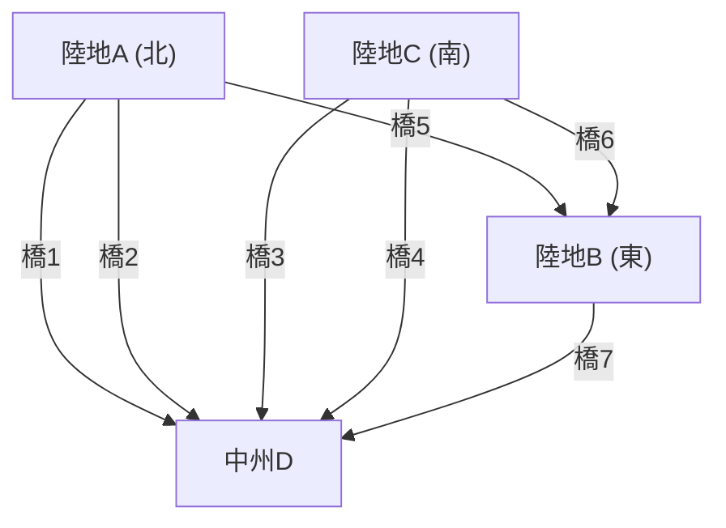

## 1. プロローグ：解けないパズルとプロイセンの古都

18世紀、プロイセン王国（現在のロシア・カリーニングラード）に位置する都市ケーニヒスベルクには、プレーゲル川という大きな川が流れていました。この川には中州としてクナイプホーフ島があり、都市は川によって4つの陸地に分断され、それらを結ぶように7つの橋が架けられていました。

当時のケーニヒスベルクの住民たちの間で、ある知的な遊びが流行していました。
**「街のどこかを出発し、7つの橋をすべて1度ずつ渡って、元の場所に戻ってくることはできるだろうか？」**

誰もが散歩がてらに挑戦しましたが、成功する者は一人としていませんでした。しかし、なぜ不可能なのかを論理的に説明できる者もいませんでした。これは「ケーニヒスベルクの橋の問題」と呼ばれ、長らく未解決のパズルとして扱われてきました。

この一見ただの町遊びのパズルに、全く新しい数学の光を当てたのが、稀代の天才数学者**レオンハルト・オイラー**（Leonhard Euler）です。彼の考察は単にパズルの答えを出すだけにとどまらず、後の「グラフ理論」や「トポロジー（位相幾何学）」と呼ばれる巨大な数学の分野を創始することになります。

本記事では、このオイラーの歴史的発見の数学的定式化から始まり、現代のネットワーク理論や、私たちが日常的に利用しているカーナビの経路探索アルゴリズム（ダイクストラ法、A*探索アルゴリズム）へと至るまでの壮大な軌跡を辿ります。

---

## 2. オイラーの抽象化：本質だけを抽出する

オイラーがこの問題に取り組んだ際、彼がとった最初のアプローチは「余計な情報を削ぎ落とすこと」でした。橋を渡るという問題において、橋の長さや陸地の広さ、形、方角などは一切関係がありません。重要なのは**「どの陸地とどの陸地が、いくつの橋で結ばれているか」**というつながりの情報（位相的性質）だけです。

彼は、4つの陸地を点（頂点：Node / Vertex）とし、7つの橋を線（辺：Edge）として描き直しました。



このように、点と線だけで構成された数学的なモデルを**グラフ (Graph)**と呼びます。オイラーはケーニヒスベルクの街並みを一つのグラフに変換することで、問題を純粋な数学的命題へと昇華させたのです。

---

## 3. 一筆書きの数学的条件：オイラー閉路とオイラー路

グラフ理論の言葉を使えば、住民たちの問いは次のように言い換えられます。
**「与えられたグラフにおいて、すべての辺をちょうど1回ずつ通って元の頂点に戻る経路（オイラー閉路：Eulerian Circuit）は存在するか？」**

オイラーはこの問題に対して、**「頂点の次数（Degree）」**という極めてシンプルかつ強力な概念を導入しました。頂点の次数とは、「その頂点に接続している辺の数」のことです。

### 3.1 オイラー閉路が存在するための証明

グラフ上を一筆書きで進み、元の場所に戻る経路（オイラー閉路）を描くとします。
経路の途中で、ある頂点 $v$ を通過する場合を考えます。頂点 $v$ に「入る」ためには1つの辺を使い、頂点 $v$ から「出る」ためにもう1つの辺を使います。つまり、通過するたびにその頂点に接続する辺を必ず「2つ」セットで消費することになります。

出発点であり終点でもある頂点についても同様です。最初に出発する際に1つの辺を使い、最後に帰ってくる際にもう1つの辺を使います。何度かその頂点を経由したとしても、やはり出入りはペアになります。

したがって、すべての辺を使い切り、かつ途中で行き止まりにならずに元の頂点に戻るためには、**グラフ内のすべての頂点の次数が偶数**でなければならないのです。

* **定理1（オイラー閉路）**：連結グラフがオイラー閉路を持つための必要十分条件は、すべての頂点の次数が偶数であることである。

### 3.2 ケーニヒスベルクの判定

それでは、ケーニヒスベルクのグラフの次数を確認してみましょう。
- 陸地A（北）：3本（奇数）
- 陸地B（東）：3本（奇数）
- 陸地C（南）：3本（奇数）
- 中州D：5本（奇数）

驚くべきことに、4つの頂点すべての次数が奇数（奇点）です。すべての頂点が偶数（偶点）でなければならないという条件を満たさないため、オイラーは**「7つの橋をすべて1度ずつ渡って戻ることは不可能である」**と数学的に証明しました。

※ちなみに、出発点と終点が異なっても良い一筆書き（オイラー路：Eulerian Path）の場合は、「奇点がちょうど2つ」であれば可能です（1つが出発点、もう1つが終点となるため）。しかしケーニヒスベルクの場合は奇点が4つあるため、元の場所に戻らない一筆書きすら不可能です。

---

## 4. グラフ理論の進化：トポロジーから計算機科学へ

オイラーの発見以降、グラフ理論は数学の重要な一分野として発展しました。地図の塗り分け問題（四色定理）や、ハミルトン閉路問題（すべての頂点を1度ずつ通る経路）など、数々の難問がグラフ理論の舞台で論じられました。

しかし、20世紀後半のコンピュータの登場により、グラフ理論は単なる数学の枠を超え、実世界の問題を解決するための強力な武器（アルゴリズム）へと進化します。通信ネットワークのルーティング、SNSの交友関係分析、電力網の最適化など、現代社会のインフラの多くがグラフ理論を基盤としています。

特に私たちの生活に密着しているのが、**最短経路問題 (Shortest Path Problem)** です。
オイラーは「すべての道を1回ずつ通れるか」を考えましたが、現代のカーナビやGoogleマップが解いているのは「目的地まで最もコスト（距離や時間）が少ないルートはどれか」という問題です。

---

## 5. 経路探索アルゴリズムの系譜

最短経路問題を解くためのアルゴリズムは、計算機科学の歴史の中で洗練されてきました。ここでは代表的なアルゴリズムを2つ解説します。

### 5.1 ダイクストラ法 (Dijkstra's Algorithm)

エドガー・ダイクストラが1956年に考案したこのアルゴリズムは、辺に重み（距離や時間コスト）が設定されたグラフにおいて、ある出発点からすべての頂点への最短距離を求めるアルゴリズムです。

**【基本的な仕組み】**
1. 出発点の距離を0、他のすべての頂点の暫定距離を無限大（$\infty$）に設定する。
2. 未確定の頂点の中で、最も暫定距離が短い頂点 $u$ を選び、その距離を「確定」とする。
3. 頂点 $u$ に隣接する未確定の頂点 $v$ について、経由した場合の距離を計算し、現在の暫定距離よりも短ければ更新する（この操作を緩和 / Relaxation と呼ぶ）。
4. すべての頂点が確定するまで 2〜3 を繰り返す。

ダイクストラ法は、水面に石を投げ入れたときの波紋が広がるように、出発点から等心円状に探索を進めていきます。そのため、負の重みがない限り確実に最短経路を見つけることができますが、目的地とは逆方向にも探索を広げてしまうため、大規模な地図データなどでは計算時間がかかるという欠点があります。

### 5.2 A*探索アルゴリズム (A-Star Search Algorithm)

ダイクストラ法の無駄な探索を減らし、より効率的に目的地を目指すために考案されたのが A*（エースター）探索アルゴリズムです。人工知能の分野で開発され、ゲームのキャラクターの移動やカーナビに広く応用されています。

A* の最大の特徴は**「ヒューリスティック関数 (Heuristic Function)」**の導入です。

ダイクストラ法が「出発点からの実際の距離 $g(n)$」だけを基準に探索するのに対し、A* は「出発点からの実際の距離 $g(n)$」＋「目的地までの推定距離（ヒューリスティック）$h(n)$」の合計値 $f(n)$ を評価値とします。

$$ f(n) = g(n) + h(n) $$

カーナビの場合、推定距離 $h(n)$ として「目的地までの直線距離」を用いるのが一般的です。これにより、目的地に近づく方向の経路が優先的に探索されるため、無関係な方向への探索が劇的に削減され、計算速度が大幅に向上します。

---

## 6. Pythonによるグラフ処理と経路探索の実行

現代のデータサイエンスやアルゴリズム実装において、グラフ理論を扱う定番ライブラリが Python の **NetworkX** です。
ここでは、NetworkX を使って簡単なグラフを構築し、ダイクストラ法や A* アルゴリズムで経路探索を行うコード例を紹介します。

```python
import networkx as nx
import matplotlib.pyplot as plt

# グラフの作成
G = nx.Graph()

# ノード（都市）の追加（座標を設定してA*のヒューリスティックに利用）
nodes = {
    'Start': (0, 0),
    'A': (1, 2),
    'B': (2, -1),
    'C': (4, 2),
    'D': (3, 0),
    'Goal': (5, 0)
}
for node, pos in nodes.items():
    G.add_node(node, pos=pos)

# エッジ（道）と重み（距離）の追加
edges = [
    ('Start', 'A', 2.5), ('Start', 'B', 2.0),
    ('A', 'C', 2.0), ('A', 'D', 1.5),
    ('B', 'D', 2.5),
    ('C', 'Goal', 1.5), ('D', 'Goal', 2.0)
]
G.add_weighted_edges_from(edges)

# 直線距離を計算するヒューリスティック関数 (A*用)
def heuristic(u, v):
    pos_u = G.nodes[u]['pos']
    pos_v = G.nodes[v]['pos']
    return ((pos_u[0] - pos_v[0])**2 + (pos_u[1] - pos_v[1])**2)**0.5

# Dijkstra法による最短経路
path_dijkstra = nx.shortest_path(G, source='Start', target='Goal', weight='weight')
length_dijkstra = nx.shortest_path_length(G, source='Start', target='Goal', weight='weight')

# A*アルゴリズムによる最短経路
path_astar = nx.astar_path(G, source='Start', target='Goal', heuristic=heuristic, weight='weight')

print(f"Dijkstra Path: {path_dijkstra} (Cost: {length_dijkstra})")
print(f"A* Path:       {path_astar}")
```

このコードを実行すると、ダイクストラ法と A* 探索アルゴリズムの両方が同じ最短経路を見つけ出すことが確認できます。実際の大規模ネットワークでは、探索するノード数に圧倒的な差が生じます。

---

## 7. エピローグ：つながりが世界を形作る

ケーニヒスベルクの住民たちが楽しんでいたささやかなパズルは、レオンハルト・オイラーという天才の目を通すことで、世界を「点と線のつながり」として捉え直す新しいレンズへと変わりました。

今日、私たちがインターネットで遠くのサーバーから瞬時にウェブページを読み込めるのも、カーナビが見知らぬ土地で正確に道を案内してくれるのも、すべてはあのプロイセンの古い橋から始まった数学的抽象化の賜物です。

グラフ理論は今この瞬間も、SNSのインフルエンサーの特定、ウイルスの感染経路の予測、新しい化合物の設計など、最先端の科学技術の現場で活躍し続けています。「つながり」を数学的に読み解くことで、私たちは一見複雑すぎる世界の中に、美しい秩序と解決策を見出すことができるのです。
