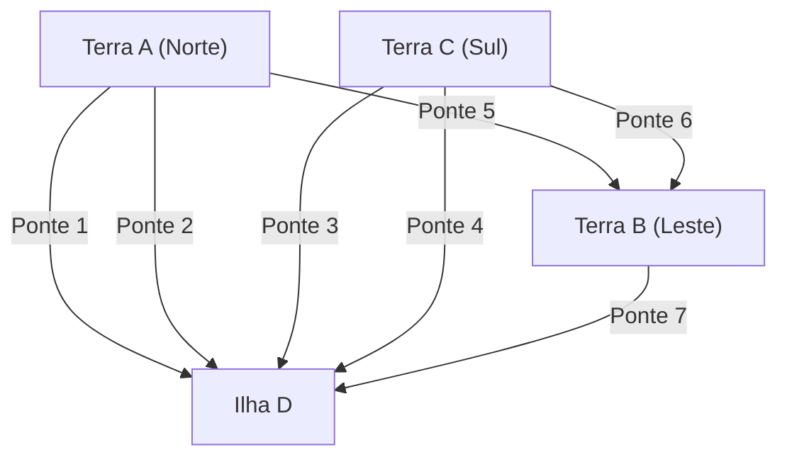

## 1. Prólogo: Um Quebra-cabeça Insolúvel e a Antiga Cidade Prussiana

No século XVIII, a cidade de Königsberg, localizada no Reino da Prússia (atual Kaliningrado, Rússia), era atravessada pelo grande rio Pregel. No meio do rio ficava a ilha de Kneiphof, e a cidade era dividida em quatro massas de terra pelo rio, conectadas por sete pontes.

Naquela época, um passatempo intelectual tornou-se popular entre os habitantes de Königsberg:
**"É possível começar em qualquer lugar da cidade, atravessar cada uma das sete pontes exatamente uma vez e retornar ao local original?"**

Todos tentaram durante seus passeios, mas ninguém conseguiu. No entanto, ninguém conseguiu explicar logicamente por que era impossível. Isso ficou conhecido como o "Problema das Pontes de Königsberg" e foi tratado como um quebra-cabeça não resolvido por muito tempo.

Foi o brilhante matemático **[Leonhard Euler](/pt/p/euler/)** quem lançou uma luz matemática totalmente nova sobre esse quebra-cabeça de cidade aparentemente simples. Sua análise não apenas forneceu uma resposta ao quebra-cabeça, mas também fundou o enorme campo da matemática mais tarde conhecido como "[Teoria dos Grafos](/pt/p/graph-theory-dijkstra-a-star/)" e "Topologia".

Neste artigo, traçaremos a jornada épica desde a formulação matemática da descoberta histórica de Euler até a teoria de redes moderna e os [algoritmos de busca](/pt/p/search-algorithms-linear-binary-hash-table-principles/) de rotas (algoritmo de Dijkstra, algoritmo de busca A*) que usamos diariamente em sistemas de navegação automotiva.

---

## 2. A Abstração de Euler: Extraindo Apenas a Essência

Quando Euler abordou este problema, sua primeira abordagem foi "eliminar informações desnecessárias". No problema de cruzar pontes, o comprimento das pontes, o tamanho da terra, sua forma ou direção são completamente irrelevantes. A única coisa que importa é a informação de conexão (propriedades topológicas): **"qual massa de terra está conectada a qual massa de terra e por quantas pontes"**.

Ele redesenhou as quatro massas de terra como pontos (Nós / Vértices) e as sete pontes como linhas (Arestas).



Um modelo matemático composto apenas de pontos e linhas como este é chamado de **Grafo (Graph)**. Ao converter o layout da cidade de Königsberg em um único grafo, Euler elevou o problema a uma proposição puramente matemática.

---

## 3. As Condições Matemáticas para um Traço Único: Circuito Euleriano e Caminho Euleriano

Usando a linguagem da [teoria dos grafos](/pt/p/graph-theory-dijkstra-a-star/), a questão dos habitantes pode ser reformulada da seguinte forma:
**"Em um determinado grafo, existe um caminho (Circuito Euleriano) que passa por cada aresta exatamente uma vez e retorna ao vértice original?"**

Para esse problema, Euler introduziu o conceito extremamente simples e poderoso de **"Grau do vértice (Degree)"**. O grau de um vértice é "o número de arestas conectadas a esse vértice".

### 3.1 A Prova para a Existência de um Circuito Euleriano

Suponha que desenhamos um caminho contínuo em um grafo e retornamos ao local original (um circuito euleriano).
Considere o caso em que passamos por um certo vértice $v$ durante o percurso. Para "entrar" no vértice $v$, usamos uma aresta, e para "sair" do vértice $v$, usamos outra aresta. Em outras palavras, cada vez que você passa, você invariavelmente consome um "conjunto de 2" arestas conectadas àquele vértice.

O mesmo se aplica ao vértice que é o ponto de partida e o ponto final. Você usa uma aresta quando parte inicialmente e outra aresta quando finalmente retorna. Mesmo se você passar por esse vértice várias vezes, as entradas e saídas sempre estarão em pares.

Portanto, para usar todas as arestas e retornar ao vértice original sem chegar a um beco sem saída no caminho, **os graus de todos os vértices no grafo devem ser pares**.

* **Teorema 1 (Circuito Euleriano)**: Uma condição necessária e suficiente para um grafo conexo ter um circuito euleriano é que o grau de cada vértice seja par.

### 3.2 A Avaliação de Königsberg

Agora vamos verificar os graus do grafo de Königsberg.
- Terra A (Norte): 3 (Ímpar)
- Terra B (Leste): 3 (Ímpar)
- Terra C (Sul): 3 (Ímpar)
- Ilha D: 5 (Ímpar)

Surpreendentemente, os graus de todos os quatro vértices são ímpares (vértices ímpares). Uma vez que não satisfaz a condição de que todos os vértices devem ser pares (vértices pares), Euler provou matematicamente que **"é impossível cruzar todas as sete pontes exatamente uma vez e retornar"**.

*A propósito, se for um traço contínuo onde os pontos de partida e chegada podem ser diferentes (Caminho Euleriano), é possível se houver "exatamente dois vértices ímpares" (porque um será o ponto de partida e o outro o ponto de chegada). No entanto, no caso de Königsberg, como existem quatro vértices ímpares, até mesmo um traço contínuo que não retorna ao local original é impossível.

---

## 4. A Evolução da Teoria dos Grafos: Da Topologia à Ciência da Computação

Desde a descoberta de Euler, a [teoria dos grafos](/pt/p/graph-theory-dijkstra-a-star/) se desenvolveu como um ramo importante da matemática. Vários problemas difíceis, como o problema de coloração de mapas ([Teorema das Quatro Cores](/pt/p/four-color-theorem/)) e o problema do ciclo hamiltoniano (um caminho que visita cada vértice exatamente uma vez), foram discutidos no palco da [teoria dos grafos](/pt/p/graph-theory-dijkstra-a-star/).

No entanto, com o advento dos computadores na segunda metade do século XX, a [teoria dos grafos](/pt/p/graph-theory-dijkstra-a-star/) transcendeu os limites da mera matemática e evoluiu para uma arma poderosa (algoritmos) para resolver problemas do mundo real. Muitas das infraestruturas da sociedade moderna, como roteamento em redes de comunicação, análise de amizades em redes sociais e otimização de redes elétricas, são baseadas na [teoria dos grafos](/pt/p/graph-theory-dijkstra-a-star/).

Um que está particularmente próximo de nossas vidas diárias é o **Problema do Caminho Mais Curto (Shortest Path Problem)**.
Enquanto Euler ponderou "podemos percorrer cada caminho uma vez?", a questão que os sistemas modernos de navegação automotiva e o Google Maps resolvem é "qual é a rota com o menor custo (distância ou tempo) para o destino?".

---

## 5. A Genealogia dos Algoritmos de Busca de Rotas

Algoritmos para resolver o problema do caminho mais curto foram refinados ao longo da história da ciência da computação. Aqui explicaremos dois algoritmos representativos.

### 5.1 Algoritmo de Dijkstra

Criado por [Edsger Dijkstra](/pt/p/biography-edsger-dijkstra/) em 1956, esse algoritmo encontra a menor distância de um ponto de partida a todos os vértices em um grafo onde as arestas têm pesos (distância ou custo de tempo).

**[Mecanismo Básico]**
1. Defina a distância do ponto de partida como 0 e a distância provisória de todos os outros vértices como infinito ($\infty$).
2. Entre os vértices não determinados, selecione o vértice $u$ com a menor distância provisória e marque sua distância como "determinada".
3. Para vértices não determinados $v$ adjacentes ao vértice $u$, calcule a distância ao passar por $u$, e se for menor que a distância provisória atual, atualize-a (esta operação é chamada de Relaxamento).
4. Repita 2 a 3 até que todos os vértices sejam determinados.

O Algoritmo de Dijkstra prossegue com sua busca concentricamente a partir do ponto de partida, assim como as ondulações se espalham quando uma pedra é atirada na água. Portanto, desde que não haja pesos negativos, ele pode encontrar de forma confiável o caminho mais curto, mas tem a desvantagem de demorar muito para calcular dados de mapas em grande escala, porque também expande a busca na direção oposta ao destino.

### 5.2 Algoritmo de Busca A* (A-Star)

O algoritmo de busca A* (A-star) foi inventado para reduzir buscas desnecessárias no algoritmo de Dijkstra e visar ao destino de forma mais eficiente. Foi desenvolvido no campo da inteligência artificial e é amplamente aplicado no movimento de personagens em jogos e em sistemas de navegação.

A maior característica do A* é a introdução de uma **"Função Heurística (Heuristic Function)"**.

Enquanto o algoritmo de Dijkstra busca baseado apenas na "distância real $g(n)$ do ponto de partida", o A* usa a soma $f(n)$ da "distância real $g(n)$ do ponto de partida" + a "distância estimada ao destino (heurística) $h(n)$" como valor de avaliação.

$$ f(n) = g(n) + h(n) $$

No caso de sistemas de navegação automotiva, é comum usar a "distância em linha reta até o destino" como a distância estimada $h(n)$. Isso prioriza a exploração de caminhos na direção de aproximação ao destino, o que reduz drasticamente as buscas em direções irrelevantes e melhora muito a velocidade de cálculo.

---

## 6. Processamento de Grafos e Execução de Busca de Rotas com Python

Na ciência de dados moderna e implementações de algoritmos, a biblioteca padrão para lidar com a [teoria dos grafos](/pt/p/graph-theory-dijkstra-a-star/) é o **NetworkX** do Python.
Aqui, introduziremos um exemplo de código que constrói um grafo simples usando o NetworkX e realiza buscas de rotas usando o algoritmo de Dijkstra e o algoritmo A*.

```python
import networkx as nx
import matplotlib.pyplot as plt

# Criação do grafo
G = nx.Graph()

# Adicionando nós (cidades) (Definindo coordenadas para uso na heurística do A*)
nodes = {
    'Start': (0, 0),
    'A': (1, 2),
    'B': (2, -1),
    'C': (4, 2),
    'D': (3, 0),
    'Goal': (5, 0)
}
for node, pos in nodes.items():
    G.add_node(node, pos=pos)

# Adicionando arestas (caminhos) e pesos (distâncias)
edges = [
    ('Start', 'A', 2.5), ('Start', 'B', 2.0),
    ('A', 'C', 2.0), ('A', 'D', 1.5),
    ('B', 'D', 2.5),
    ('C', 'Goal', 1.5), ('D', 'Goal', 2.0)
]
G.add_weighted_edges_from(edges)

# Função heurística para calcular a distância em linha reta (para A*)
def heuristic(u, v):
    pos_u = G.nodes[u]['pos']
    pos_v = G.nodes[v]['pos']
    return ((pos_u[0] - pos_v[0])**2 + (pos_u[1] - pos_v[1])**2)**0.5

# Caminho mais curto pelo algoritmo de Dijkstra
path_dijkstra = nx.shortest_path(G, source='Start', target='Goal', weight='weight')
length_dijkstra = nx.shortest_path_length(G, source='Start', target='Goal', weight='weight')

# Caminho mais curto pelo algoritmo A*
path_astar = nx.astar_path(G, source='Start', target='Goal', heuristic=heuristic, weight='weight')

print(f"Dijkstra Path: {path_dijkstra} (Cost: {length_dijkstra})")
print(f"A* Path:       {path_astar}")
```

Ao executar este código, você pode confirmar que tanto o algoritmo de Dijkstra quanto o algoritmo de busca A* encontram o mesmo caminho mais curto. Em redes de grande escala reais, haverá uma diferença esmagadora no número de nós explorados.

---

## 7. Epílogo: As Conexões Moldam o Mundo

O pequeno quebra-cabeça que os residentes de Königsberg gostavam tornou-se uma nova lente através da qual reimaginar o mundo como "conexões de pontos e linhas", visto através dos olhos do gênio [Leonhard Euler](/pt/p/euler/).

Hoje, o fato de podermos carregar páginas da web instantaneamente de servidores distantes na internet e os sistemas de navegação automotiva nos guiarem com precisão por terras desconhecidas são todos o resultado da abstração matemática que começou com aquelas antigas pontes prussianas.

Neste exato momento, a [teoria dos grafos](/pt/p/graph-theory-dijkstra-a-star/) continua a ser usada na vanguarda da ciência e tecnologia, como na identificação de influenciadores em redes sociais, previsão de rotas de infecção por vírus e projeto de novos compostos químicos. Ao decifrar matematicamente as "conexões", podemos encontrar ordem e soluções bonitas em um mundo que parece ser excessivamente complexo.
