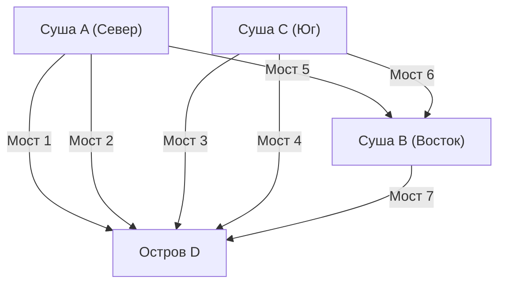

## 1. Пролог: Неразрешимая головоломка и древняя столица Пруссии

В 18 веке в городе Кёнигсберг, расположенном в королевстве Пруссия (ныне Калининград, Россия), протекала большая река Преголя. Посреди этой реки находился остров Кнайпхоф, и река разделяла город на четыре участка суши, соединенных семью мостами.

Среди жителей Кёнигсберга того времени была популярна одна интеллектуальная забава.
**«Можно ли выйти из какой-нибудь точки города, пройти по всем семи мостам ровно по одному разу и вернуться в исходное место?»**

Каждый пытался решить эту задачу во время прогулок, но ни одному человеку это не удавалось. Однако никто не мог логически объяснить, почему это невозможно. Это стало известно как «задача о кёнигсбергских мостах» и долгое время считалось неразрешимой головоломкой.

Именно выдающийся математик-гений **[Леонард Эйлер](/ru/p/euler/)** пролил совершенно новый математический свет на эту, казалось бы, обычную городскую забаву. Его размышления не только дали ответ на головоломку, но и положили начало огромным разделам математики, известным как «[теория графов](/ru/p/graph-theory-dijkstra-a-star/)» и «топология».

В этой статье мы проследим грандиозный путь от математической формализации исторического открытия Эйлера до современной теории сетей и алгоритмов поиска маршрутов (алгоритм Дейкстры, алгоритм A*), которые мы повседневно используем в автомобильных навигаторах.

---

## 2. Абстракция Эйлера: извлечение только сути

Когда Эйлер взялся за эту проблему, его первый подход заключался в «отсечении лишней информации». В задаче о переходе через мосты длина мостов, площадь суши, форма, направления и прочее не имеют никакого значения. Важна только информация о связях (топологические свойства): **«какие участки суши соединены друг с другом и каким количеством мостов»**.

Он перерисовал четыре участка суши в виде точек (вершин: Node / Vertex), а семь мостов в виде линий (ребер: Edge).



Такая математическая модель, состоящая только из точек и линий, называется **графом (Graph)**. Превратив городской ландшафт Кёнигсберга в один граф, Эйлер возвысил проблему до чисто математического утверждения.

---

## 3. Математическое условие рисования одним росчерком: эйлеров цикл и эйлерова цепь

Говоря языком теории графов, вопрос жителей можно перефразировать следующим образом:
**«Существует ли в заданном графе маршрут, который проходит через каждое ребро ровно один раз и возвращается в исходную вершину (эйлеров цикл: Eulerian Circuit)?»**

Для решения этой задачи Эйлер ввел чрезвычайно простую, но мощную концепцию — **«степень вершины (Degree)»**. Степень вершины — это «количество ребер, соединенных с этой вершиной».

### 3.1 Доказательство существования эйлерова цикла

Представим, что мы рисуем путь по графу не отрывая руки и возвращаемся в исходную точку (эйлеров цикл).
Рассмотрим случай прохождения через некую вершину $v$ по пути. Чтобы «войти» в вершину $v$, используется одно ребро, а чтобы «выйти» из вершины $v$ — другое ребро. То есть при каждом прохождении через эту вершину всегда используется ровно «два» соединенных с ней ребра в комплекте.

То же самое касается вершины, которая является одновременно начальной и конечной точкой. При старте используется одно ребро, а при возвращении в конце — другое. Даже если мы проходим через эту вершину несколько раз, входы и выходы всегда образуют пары.

Следовательно, чтобы использовать все ребра и вернуться в исходную вершину, не попав в тупик по пути, **степень всех вершин в графе должна быть четной**.

* **Теорема 1 (Эйлеров цикл)**: Необходимое и достаточное условие наличия в связном графе эйлерова цикла состоит в том, чтобы степень всех вершин была четной.

### 3.2 Оценка Кёнигсберга

Теперь давайте проверим степени графа Кёнигсберга.
- Суша A (Север): 3 (нечетная)
- Суша B (Восток): 3 (нечетная)
- Суша C (Юг): 3 (нечетная)
- Остров D: 5 (нечетная)

Удивительно, но степени всех четырех вершин нечетные. Поскольку условие, что все вершины должны быть четными, не выполняется, Эйлер математически доказал, что **«невозможно пройти по всем семи мостам ровно по одному разу и вернуться обратно»**.

※ К слову, в случае рисования одним росчерком, где начальная и конечная точки могут различаться (эйлерова цепь: Eulerian Path), это возможно, если «нечетных вершин ровно две» (так как одна будет начальной точкой, а другая — конечной). Однако в случае Кёнигсберга нечетных вершин четыре, поэтому невозможно даже просто пройти всё одним росчерком без возврата в исходное место.

---

## 4. Эволюция теории графов: от топологии к информатике

После открытия Эйлера [теория графов](/ru/p/graph-theory-dijkstra-a-star/) развилась как важная область математики. На арене теории графов обсуждались многие сложные задачи, такие как проблема раскраски карты (теорема о четырех красках) и проблема гамильтонова цикла (маршрут, проходящий через все вершины ровно по одному разу).

Однако с появлением компьютеров во второй половине 20-го века [теория графов](/ru/p/graph-theory-dijkstra-a-star/) вышла за рамки чистой математики и превратилась в мощное оружие (алгоритмы) для решения проблем реального мира. Многие элементы современной инфраструктуры, такие как маршрутизация в коммуникационных сетях, анализ социальных связей в соцсетях и оптимизация электросетей, основаны на теории графов.

Особенно тесно с нашей жизнью связана **задача о кратчайшем пути (Shortest Path Problem)**.
Эйлер думал о том, «можно ли пройти по всем дорогам по одному разу», а современные автомобильные навигаторы и Google Карты решают задачу «какой маршрут до пункта назначения требует наименьших затрат (расстояния или времени)».

---

## 5. Генеалогия алгоритмов поиска маршрута

Алгоритмы решения задачи о кратчайшем пути совершенствовались на протяжении истории информатики. Здесь мы рассмотрим два наиболее известных алгоритма.

### 5.1 Алгоритм Дейкстры (Dijkstra's Algorithm)

Этот алгоритм, предложенный Эдсгером Дейкстрой в 1956 году, находит кратчайшее расстояние от одной начальной точки до всех остальных вершин в графе, где ребра имеют веса (затраты на расстояние или время).

**【Базовый механизм】**
1. Установить расстояние начальной точки равным 0, а временное расстояние всех остальных вершин — равным бесконечности ($\infty$).
2. Среди нерассмотренных вершин выбрать вершину $u$ с наименьшим временным расстоянием и зафиксировать ее расстояние как «окончательное».
3. Для каждой нерассмотренной смежной вершины $v$ рассчитать расстояние через вершину $u$, и если оно меньше текущего временного расстояния, обновить его (эта операция называется релаксацией / Relaxation).
4. Повторять шаги 2-3, пока расстояния для всех вершин не станут окончательными.

Алгоритм Дейкстры расширяет поиск концентрически от начальной точки, подобно ряби на поверхности воды от брошенного камня. Благодаря этому он гарантированно находит кратчайший путь (при отсутствии отрицательных весов), но поскольку поиск также распространяется в направлении, противоположном пункту назначения, он требует много времени на вычисления для крупномасштабных картографических данных.

### 5.2 Алгоритм поиска A* (A-Star Search Algorithm)

Алгоритм поиска A* был разработан для того, чтобы сократить бесполезный поиск алгоритма Дейкстры и более эффективно двигаться к пункту назначения. Он был создан в области искусственного интеллекта и широко применяется для перемещения персонажей в играх и в автомобильных навигаторах.

Главная особенность A* — введение **«эвристической функции (Heuristic Function)»**.

В то время как алгоритм Дейкстры выполняет поиск, основываясь только на «фактическом расстоянии от начальной точки $g(n)$», A* использует в качестве оценки сумму $f(n)$, состоящую из «фактического расстояния от начальной точки $g(n)$» + «оценочного расстояния до пункта назначения (эвристики) $h(n)$».

$$ f(n) = g(n) + h(n) $$

В случае автомобильного навигатора в качестве оценочного расстояния $h(n)$ обычно используется «расстояние по прямой до пункта назначения». Благодаря этому приоритет отдается маршрутам в направлении пункта назначения, что кардинально сокращает поиск в нерелевантных направлениях и значительно повышает скорость вычислений.

---

## 6. Обработка графов и поиск маршрутов на Python

Стандартной библиотекой для работы с теорией графов в современной науке о данных и реализации алгоритмов является **NetworkX** для Python.
Здесь мы покажем пример кода для построения простого графа с помощью NetworkX и поиска маршрута с использованием алгоритмов Дейкстры и A*.

```python
import networkx as nx
import matplotlib.pyplot as plt

# Создание графа
G = nx.Graph()

# Добавление узлов (городов) (установка координат для использования в эвристике A*)
nodes = {
    'Start': (0, 0),
    'A': (1, 2),
    'B': (2, -1),
    'C': (4, 2),
    'D': (3, 0),
    'Goal': (5, 0)
}
for node, pos in nodes.items():
    G.add_node(node, pos=pos)

# Добавление ребер (дорог) и весов (расстояний)
edges = [
    ('Start', 'A', 2.5), ('Start', 'B', 2.0),
    ('A', 'C', 2.0), ('A', 'D', 1.5),
    ('B', 'D', 2.5),
    ('C', 'Goal', 1.5), ('D', 'Goal', 2.0)
]
G.add_weighted_edges_from(edges)

# Эвристическая функция для вычисления расстояния по прямой (для A*)
def heuristic(u, v):
    pos_u = G.nodes[u]['pos']
    pos_v = G.nodes[v]['pos']
    return ((pos_u[0] - pos_v[0])**2 + (pos_u[1] - pos_v[1])**2)**0.5

# Кратчайший путь по алгоритму Дейкстры
path_dijkstra = nx.shortest_path(G, source='Start', target='Goal', weight='weight')
length_dijkstra = nx.shortest_path_length(G, source='Start', target='Goal', weight='weight')

# Кратчайший путь по алгоритму A*
path_astar = nx.astar_path(G, source='Start', target='Goal', heuristic=heuristic, weight='weight')

print(f"Dijkstra Path: {path_dijkstra} (Cost: {length_dijkstra})")
print(f"A* Path:       {path_astar}")
```

Выполнив этот код, вы можете убедиться, что как алгоритм Дейкстры, так и алгоритм поиска A* находят один и тот же кратчайший путь. В реальных крупномасштабных сетях будет колоссальная разница в количестве исследуемых узлов.

---

## 7. Эпилог: связи формируют мир

Скромная головоломка, которой забавлялись жители Кёнигсберга, через призму гения Леонарда Эйлера превратилась в новую линзу, позволяющую переосмыслить мир как «связи между точками и линиями».

Сегодня то, что мы можем мгновенно загружать веб-страницы с удаленных серверов через Интернет, и то, что навигаторы безошибочно ведут нас по незнакомым местам — все это плоды математической абстракции, начавшейся с тех старых прусских мостов.

В данный момент [теория графов](/ru/p/graph-theory-dijkstra-a-star/) продолжает активно применяться на переднем крае науки и техники: от выявления инфлюенсеров в соцсетях до прогнозирования путей распространения вирусов и проектирования новых химических соединений. Математически расшифровывая «связи», мы можем находить красивый порядок и решения в мире, который кажется слишком сложным.
