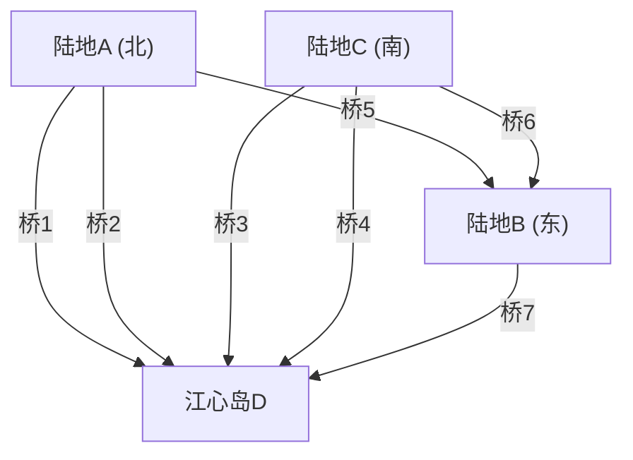

## 1. 序言：无解的谜题与普鲁士古都

18世纪，普鲁士王国（今俄罗斯加里宁格勒）的柯尼斯堡城中，有一条名为普列戈利亚河的大河穿城而过。河中有一个名为克奈普霍夫的岛屿，城市被河流分割成四块陆地，为了连接这些陆地，建有七座桥梁。

当时的柯尼斯堡居民中流行着一种智力游戏。
**“能否从城市某处出发，恰好走过这七座桥各一次，然后再回到原来的起点？”**

大家都在散步时尝试挑战，却无一人成功。然而，也没有人能从逻辑上解释为何不可能。这被称为“柯尼斯堡七桥问题”，长期以来作为一个未解之谜存在。

将这个看似普通的街头小游戏赋予全新数学光芒的，是罕见的天才数学家**[莱昂哈德·欧拉](/zh-cn/p/euler/)**（Leonhard Euler）。他的思考不仅限于给出谜题的答案，更创立了后来被称为“图论”和“拓扑学”的宏大数学领域。

本文将带领大家追溯这壮丽的轨迹：从欧拉这一历史性发现的数学公式化开始，一直到现代的网络理论，以及我们日常使用的车载导航路径规划算法（Dijkstra算法，A*[搜索算法](/zh-cn/p/search-algorithms-linear-binary-hash-table-principles/)）。

---

## 2. 欧拉的抽象化：只提取本质

欧拉在研究这个问题时，采取的第一个方法是“剔除多余信息”。在过桥的问题中，桥的长度、陆地的面积、形状、方向等都毫无关系。重要的是<strong>“哪块陆地和哪块陆地，由多少座桥连接”</strong>这种连接信息（拓扑性质）。

他将四块陆地画作点（顶点：Node / Vertex），将七座桥画作线（边：Edge）。



像这样，只由点和线构成的数学模型被称为**图 (Graph)**。欧拉通过将柯尼斯堡的城市风貌转化为一个图，将问题升华为了纯粹的数学命题。

---

## 3. 一笔画的数学条件：欧拉回路与欧拉路径

用图论的语言来说，居民们的问题可以改写如下。
**“在给定的图中，是否存在一条恰好经过所有边各一次并回到起点的路径（欧拉回路：Eulerian Circuit）？”**

对于这个问题，欧拉引入了一个极其简单且强大的概念——**“顶点的度（Degree）”**。顶点的度是指“连接该顶点的边的数量”。

### 3.1 欧拉回路存在的证明

假设我们在图上画一条一笔画并回到原点的路径（欧拉回路）。
考虑在路径中经过某个顶点 $v$ 的情况。为了“进入”顶点 $v$，必须使用一条边；为了从顶点 $v$“出去”，还要使用另一条边。也就是说，每经过一次该顶点，必然成“对”地消耗与其相连的两条边。

对于既是起点也是终点的顶点也是如此。最初出发时使用一条边，最后返回时使用另一条边。即使中间经过了几次该顶点，出入的边依然成对。

因此，为了用完所有的边，且在中途不走到死胡同并顺利返回起点，**图中所有顶点的度必须都是偶数**。

* **定理1（欧拉回路）**：连通图具有欧拉回路的充要条件是，所有顶点的度均为偶数。

### 3.2 柯尼斯堡的判定

那么，让我们来看看柯尼斯堡图的度数。
- 陆地A（北）：3条（奇数）
- 陆地B（东）：3条（奇数）
- 陆地C（南）：3条（奇数）
- 江心岛D：5条（奇数）

令人惊讶的是，全部四个顶点的度都是奇数（奇点）。由于不满足所有顶点必须是偶数（偶点）的条件，欧拉在数学上证明了<strong>“恰好走过七座桥各一次并回到原点是不可能的”</strong>。

※顺便提一下，如果是起点和终点不同的一笔画（欧拉路径：Eulerian Path），只要“奇点恰好有两个”即可实现（一个作为起点，另一个作为终点）。但在柯尼斯堡的情况下，有四个奇点，因此连不回到起点的一笔画也不可能。

---

## 4. 图论的演进：从拓扑学到计算机科学

自欧拉的发现以来，图论作为数学的一个重要分支得到了发展。地图着色问题（四色定理）、哈密顿回路问题（恰好经过所有顶点各一次的路径）等众多难题在图论的舞台上被探讨。

然而，随着20世纪后半叶计算机的出现，图论超越了纯数学的范畴，演变成了解决现实世界问题的强大武器（算法）。通信网络的路由、社交网络的交友分析、电网的优化等，现代社会的许多基础设施都以图论为基础。

其中与我们的生活最密切相关的，是**最短路径问题 (Shortest Path Problem)**。
欧拉考虑的是“能否恰好走过所有的路一次”，而现代车载导航和Google地图要解决的则是“到达目的地的成本（距离或时间）最小的路线是哪条”。

---

## 5. 路径规划算法的系谱

解决最短路径问题的算法在计算机科学的历史中被不断完善。这里讲解两种代表性的算法。

### 5.1 Dijkstra算法 (Dijkstra's Algorithm)

由[艾兹赫尔·戴克斯特拉](/zh-cn/p/biography-edsger-dijkstra/)（Edsger W. Dijkstra）于1956年提出的这一算法，是在边具有权重（距离或时间成本）的图中，求出从某一出发点到所有顶点的最短距离的算法。

**【基本原理】**
1. 将出发点的距离设为0，其他所有顶点的暂定距离设为无穷大（$\infty$）。
2. 在未确定的顶点中，选择暂定距离最短的顶点 $u$，将其距离设为“确定”。
3. 对于与顶点 $u$ 相邻的未确定顶点 $v$，计算经过 $u$ 时的距离，如果比当前的暂定距离更短则进行更新（这个操作称为松弛 / Relaxation）。
4. 重复步骤2和3，直到所有顶点都确定为止。

Dijkstra算法就像往水面投入石子激起的涟漪一样，从出发点开始呈同心圆状向外扩展搜索。因此，只要不存在负权重，它就一定能找到最短路径。但缺点是，它也会向与目的地相反的方向扩展搜索，在处理大规模地图数据时需要耗费较多计算时间。

### 5.2 A*搜索算法 (A-Star Search Algorithm)

为了减少Dijkstra算法中无效的搜索，更高效地朝着目的地推进，人们提出了A*（A-Star）[搜索算法](/zh-cn/p/search-algorithms-linear-binary-hash-table-principles/)。它在人工智能领域被开发出来，广泛应用于游戏角色的移动和车载导航。

A* 最大的特点是引入了<strong>“启发函数 (Heuristic Function)”</strong>。

Dijkstra算法仅以“距出发点的实际距离 $g(n)$”为基准进行搜索，而A* 则以“距出发点的实际距离 $g(n)$”＋“到目的地的估计距离（启发值）$h(n)$”的总和 $f(n)$ 作为评估值。

$$ f(n) = g(n) + h(n) $$

在车载导航中，通常使用“到目的地的直线距离”作为估计距离 $h(n)$。这样一来，向着目的地靠近的路径会被优先探索，无关方向的搜索将被急剧减少，从而大幅提高计算速度。

---

## 6. 使用Python进行图处理和路径规划

在现代数据科学和算法实现中，处理图论的经典库是Python的 **NetworkX**。
这里介绍使用NetworkX构建简单图，并通过Dijkstra算法或A*算法执行路径规划的代码示例。

```python
import networkx as nx
import matplotlib.pyplot as plt

# 创建图
G = nx.Graph()

# 添加节点（城市）（设置坐标供A*的启发函数使用）
nodes = {
    'Start': (0, 0),
    'A': (1, 2),
    'B': (2, -1),
    'C': (4, 2),
    'D': (3, 0),
    'Goal': (5, 0)
}
for node, pos in nodes.items():
    G.add_node(node, pos=pos)

# 添加边（道路）与权重（距离）
edges = [
    ('Start', 'A', 2.5), ('Start', 'B', 2.0),
    ('A', 'C', 2.0), ('A', 'D', 1.5),
    ('B', 'D', 2.5),
    ('C', 'Goal', 1.5), ('D', 'Goal', 2.0)
]
G.add_weighted_edges_from(edges)

# 计算直线距离的启发函数 (供A*使用)
def heuristic(u, v):
    pos_u = G.nodes[u]['pos']
    pos_v = G.nodes[v]['pos']
    return ((pos_u[0] - pos_v[0])**2 + (pos_u[1] - pos_v[1])**2)**0.5

# 使用Dijkstra算法的最短路径
path_dijkstra = nx.shortest_path(G, source='Start', target='Goal', weight='weight')
length_dijkstra = nx.shortest_path_length(G, source='Start', target='Goal', weight='weight')

# 使用A*算法的最短路径
path_astar = nx.astar_path(G, source='Start', target='Goal', heuristic=heuristic, weight='weight')

print(f"Dijkstra Path: {path_dijkstra} (Cost: {length_dijkstra})")
print(f"A* Path:       {path_astar}")
```

运行这段代码，可以确认Dijkstra算法和A*[搜索算法](/zh-cn/p/search-algorithms-linear-binary-hash-table-principles/)都找出了相同的最短路径。在实际的大规模网络中，需要搜索的节点数量将会有巨大的差异。

---

## 7. 尾声：连接塑造世界

柯尼斯堡居民们享受的这个小小的谜题，通过天才[莱昂哈德·欧拉](/zh-cn/p/euler/)的视角，变成了一副将世界重新理解为“点和线的连接”的新透镜。

今天，我们能够通过互联网瞬间从远方的服务器加载网页，车载导航能够在一无所知的土地上准确指引道路，这一切都归功于从普鲁士那座古老的桥开始的数学抽象化。

此时此刻，图论仍在最前沿的科技现场发挥着作用，例如识别社交网络的意见领袖、预测病毒的传播路径、设计新型化合物等。通过从数学角度解读“连接”，我们能够在这个看似过于复杂的世界中，找到美丽的秩序与解决方案。
