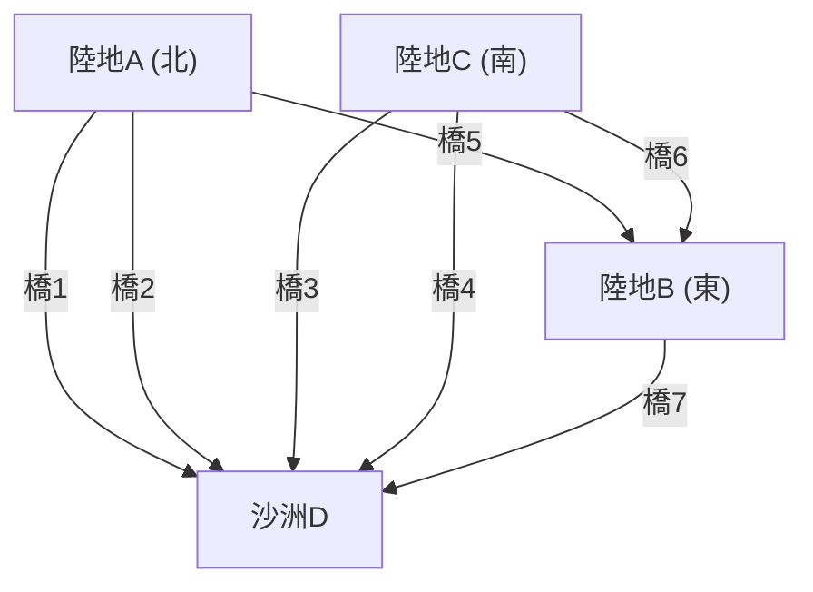

## 1. 序幕：未解之謎與普魯士古都

18世紀，位於普魯士王國（現今俄羅斯加里寧格勒）的柯尼斯堡市，有一條名為普列戈利亞河的大河流過。河中有一個名為克奈普霍夫島的沙洲，整座城市被河水分割成4塊陸地，為了連接這些陸地，共建造了7座橋樑。

當時在柯尼斯堡的居民之間，流行著一種益智遊戲：
**「是否能從城市的某處出發，將7座橋都剛好走過1次，然後回到原點？」**

大家都趁著散步時嘗試挑戰，但卻沒有任何人成功。然而，也沒有人能合乎邏輯地解釋為什麼這是不可能的。這被稱為「[柯尼斯堡七橋問題](/zh-tw/p/seven-bridges-of-konigsberg/)」，長期以來一直被視為未解的謎題。

將這個看似只是市井遊戲的謎題，照入全新數學曙光的人，正是舉世無雙的天才數學家**[李昂哈德·歐拉](/zh-tw/p/euler/)**（Leonhard Euler）。他的研究並非僅止於給出謎題的答案，更開創了後來被稱為「圖論」與「拓樸學（相位幾何學）」的龐大數學領域。

本文將從歐拉這項歷史性發現的數學公式化開始，追溯到現代的網路理論，以及我們日常使用的車載導航路徑探索演算法（戴克斯特拉演算法、A*[搜尋演算法](/zh-tw/p/search-algorithms-linear-binary-hash-table-principles/)），帶您走過這段壯闊的軌跡。

---

## 2. 歐拉的抽象化：只萃取本質

歐拉在研究這個問題時，他採取的第一步是「去除多餘的資訊」。在過橋的問題中，橋的長度、陸地的面積、形狀與方向等都毫無關聯。真正重要的是<strong>「哪塊陸地與哪塊陸地，由幾座橋樑連接」</strong>這種連接資訊（拓樸性質）。

他將4塊陸地當作點（頂點：Node / Vertex），將7座橋當作線（邊：Edge）重新繪製。



像這樣，僅由點與線所構成的數學模型被稱為**圖 (Graph)**。歐拉藉由將柯尼斯堡的街道轉換成一個圖形，將問題昇華為純粹的數學命題。

---

## 3. 一筆畫的數學條件：歐拉迴路與歐拉路徑

用圖論的術語來說，居民們的問題可以改寫如下：
**「在給定的圖中，是否存在一條剛好通過所有邊各1次，並回到原起點頂點的路徑（歐拉迴路：Eulerian Circuit）？」**

針對這個問題，歐拉導入了一個極為簡單卻強大的概念——**「頂點的次數（Degree）」**。頂點的次數指的是「連接在該頂點上的邊的數量」。

### 3.1 歐拉迴路存在的證明

假設我們要在圖上以一筆畫前進，並畫出回到原點的路徑（歐拉迴路）。
考慮在路徑途中，通過某個頂點 $v$ 的情況。為了「進入」頂點 $v$，我們會使用1條邊；為了從頂點 $v$「出去」，我們會使用另1條邊。換句話說，每次通過時，必定會成對地消耗「2條」連接在該頂點上的邊。

作為起點兼終點的頂點也是相同的。最初出發時會使用1條邊，最後回來時也會使用另1條邊。即使中途經過該頂點幾次，進出仍然會成對出現。

因此，為了解決所有邊且在中途不會遇到死胡同並回到原頂點，**圖中所有頂點的次數必須是偶數**。

* **定理1（歐拉迴路）**：連通圖存在歐拉迴路的充要條件是，所有頂點的次數皆為偶數。

### 3.2 柯尼斯堡的判定

那麼，就讓我們來確認一下柯尼斯堡圖的次數吧。
- 陸地A（北）：3條（奇數）
- 陸地B（東）：3條（奇數）
- 陸地C（南）：3條（奇數）
- 沙洲D：5條（奇數）

令人驚訝的是，這4個頂點的次數全都是奇數（奇點）。由於不滿足所有頂點必須是偶數（偶點）的條件，歐拉在數學上證明了<strong>「要將7座橋都剛好走過1次並回到原點是不可能的」</strong>。

※順帶一提，如果是起點與終點可以不同的一筆畫（歐拉路徑：Eulerian Path），只要「奇點剛好有2個」就有可能達成（因為1個會成為起點，另1個會成為終點）。然而在柯尼斯堡的例子中，由於有4個奇點，所以連不回到原點的一筆畫也是不可能的。

---

## 4. 圖論的進化：從拓樸學到計算機科學

在歐拉的發現之後，圖論發展成為數學的一個重要領域。如地圖著色問題（[四色定理](/zh-tw/p/four-color-theorem/)）、漢米爾頓迴路問題（通過所有頂點各1次的路徑）等眾多難題，都在圖論的舞台上被廣泛討論。

然而，隨著20世紀後半葉電腦的出現，圖論跨越了單純數學的框架，進化成為解決現實世界問題的強大武器（演算法）。通訊網路的路由、社群媒體的人際關係分析、電力網的最佳化等，現代社會的許多基礎建設都以圖論為基礎。

其中與我們生活最息息相關的，便是**最短路徑問題 (Shortest Path Problem)**。
歐拉思考的是「能否將所有的路都走過1次」，而現代的車載導航與Google地圖所解決的，則是「到達目的地成本（距離或時間）最低的路徑是哪一條」的問題。

---

## 5. 路徑探索演算法的系譜

解決最短路徑問題的演算法，在計算機科學的歷史中不斷被精進。在此我們將解說兩種具代表性的演算法。

### 5.1 戴克斯特拉演算法 (Dijkstra's Algorithm)

這是由[艾茲赫爾·戴克斯特拉](/zh-tw/p/biography-edsger-dijkstra/)於1956年發明的演算法，用於在設定了邊權重（距離或時間成本）的圖中，求出從某個起點到所有頂點的最短距離。

**【基本運作機制】**
1. 將起點的距離設為0，其他所有頂點的暫定距離設為無限大（$\infty$）。
2. 在未確定的頂點中，選擇暫定距離最短的頂點 $u$，並將其距離標示為「確定」。
3. 對於與頂點 $u$ 相鄰且未確定的頂點 $v$，計算經過 $u$ 的距離，若比目前的暫定距離短則進行更新（此操作稱為鬆弛 / Relaxation）。
4. 重複步驟2與3，直到所有頂點都確定為止。

戴克斯特拉演算法會像石頭投入水面泛起的漣漪一樣，從起點以同心圓的方式向外進行探索。因此，只要沒有負的權重，必定能找出最短路徑，但由於它也會朝與目的地相反的方向擴展探索，所以在面對大規模地圖資料時，會有計算時間較長的缺點。

### 5.2 A*搜尋演算法 (A-Star Search Algorithm)

為了減少戴克斯特拉演算法的無效探索，更有效率地朝目的地邁進而發明的，就是A*（A-Star）[搜尋演算法](/zh-tw/p/search-algorithms-linear-binary-hash-table-principles/)。它是在人工智慧領域開發出來的，被廣泛應用於遊戲角色的移動以及車載導航中。

A*演算法最大的特徵，在於導入了<strong>「啟發函數 (Heuristic Function)」</strong>。

戴克斯特拉演算法只以「從起點出發的實際距離 $g(n)$」為基準進行探索，而A*則是以「從起點出發的實際距離 $g(n)$」＋「到目的地的估計距離（啟發值）$h(n)$」的總和 $f(n)$ 作為評估值。

$$ f(n) = g(n) + h(n) $$

在車載導航的情況下，一般會使用「到目的地的直線距離」作為估計距離 $h(n)$。如此一來，朝向目的地靠近的路徑會被優先探索，使得往無關方向的探索大幅減少，進而大幅提升計算速度。

---

## 6. 使用Python進行圖處理與路徑探索

在現代的資料科學與演算法實作中，處理圖論的經典函式庫是 Python 的 **NetworkX**。
在這裡，我們將介紹如何使用 NetworkX 建立簡單的圖，並透過戴克斯特拉演算法及 A* 演算法進行路徑探索的程式碼範例。

```python
import networkx as nx
import matplotlib.pyplot as plt

# 建立圖形
G = nx.Graph()

# 新增節點（城市）（設定座標以用於A*的啟發函數）
nodes = {
    'Start': (0, 0),
    'A': (1, 2),
    'B': (2, -1),
    'C': (4, 2),
    'D': (3, 0),
    'Goal': (5, 0)
}
for node, pos in nodes.items():
    G.add_node(node, pos=pos)

# 新增邊（道路）與權重（距離）
edges = [
    ('Start', 'A', 2.5), ('Start', 'B', 2.0),
    ('A', 'C', 2.0), ('A', 'D', 1.5),
    ('B', 'D', 2.5),
    ('C', 'Goal', 1.5), ('D', 'Goal', 2.0)
]
G.add_weighted_edges_from(edges)

# 計算直線距離的啟發函數 (供A*使用)
def heuristic(u, v):
    pos_u = G.nodes[u]['pos']
    pos_v = G.nodes[v]['pos']
    return ((pos_u[0] - pos_v[0])**2 + (pos_u[1] - pos_v[1])**2)**0.5

# 透過Dijkstra演算法求最短路徑
path_dijkstra = nx.shortest_path(G, source='Start', target='Goal', weight='weight')
length_dijkstra = nx.shortest_path_length(G, source='Start', target='Goal', weight='weight')

# 透過A*演算法求最短路徑
path_astar = nx.astar_path(G, source='Start', target='Goal', heuristic=heuristic, weight='weight')

print(f"Dijkstra Path: {path_dijkstra} (Cost: {length_dijkstra})")
print(f"A* Path:       {path_astar}")
```

執行這段程式碼後，就可以確認戴克斯特拉演算法與 A* [搜尋演算法](/zh-tw/p/search-algorithms-linear-binary-hash-table-principles/)雙方都能找出相同的最短路徑。在實際的大規模網路中，兩者探索的節點數量將會產生壓倒性的差距。

---

## 7. 結語：連結形塑了世界

柯尼斯堡居民們所樂在其中的小小謎題，透過天才[李昂哈德·歐拉](/zh-tw/p/euler/)的雙眼，化為了將世界重新認知為「點與線的連結」的全新透鏡。

今日，我們能透過網際網路從遙遠的伺服器瞬間載入網頁，或是車載導航能在陌生的地方準確地為我們指引道路，這一切都是源自於那座普魯士古橋的數學抽象化所賜。

即使在當下，圖論依然活躍在最先進的科技領域，例如辨識社群媒體的影響力人物、預測病毒的傳染路徑、設計新型化合物等等。透過以數學的方式解讀「連結」，我們就能在這個看似過於複雜的世界中，找出美麗的秩序與解決方案。
