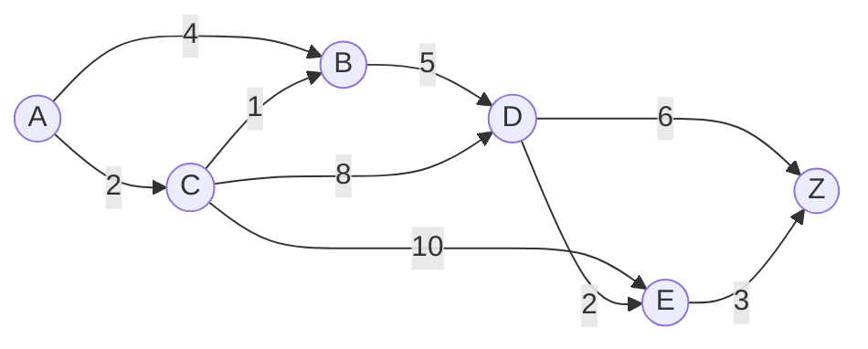
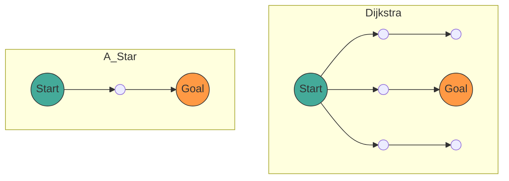

## 1. مقدمة

في علوم الحاسوب الحديثة، توفر **نظرية الرسوم البيانية** ([Graph](https://kenji.blog/ar/p/tree-graph-data-structures-search-dfs-bfs-dijkstra/) Theory) إطارًا رياضيًا قويًا لنمذجة هياكل الشبكات. في حياتنا اليومية، تُستخدم تقنية حساب "المسار الأقصر" في مواقف مختلفة مثل الملاحة في السيارات، وتوجيهات نقل السكك الحديدية، وتوجيه الإنترنت، وحتى البحث عن المسار في الذكاء الاصطناعي للألعاب.

في هذه المقالة، بدءًا من التعريف الرياضي لنظرية الرسوم البيانية التي تشكل أساس البحث عن المسار، سنشرح بشكل شامل آلية خوارزمية البحث التمثيلية **خوارزمية ديكسترا** ([Dijkstra](https://kenji.blog/ar/p/tree-graph-data-structures-search-dfs-bfs-dijkstra/)'s Algorithm)، وتطورها الإضافي **خوارزمية A*** (A-Star Algorithm)، والبراهين الرياضية الخاصة بها، وطرق التنفيذ العملية باستخدام بايثون.

## 2. أساسيات نظرية الرسوم البيانية

قبل الدخول في شرح الخوارزميات، سنقوم أولاً بتعريف الرسم البياني رياضياً، وهو هيكل البيانات المستهدف.

### 2.1 التعريف الرياضي للرسم البياني

يتم تعريف الرسم البياني $ G $ بواسطة زوج من مجموعة الرؤوس (العقد) $ V $ ومجموعة الحواف $ E $.

$$
G = (V, E)
$$

هنا، العنصر $ e $ في مجموعة الحواف $ E $ يربط بين رأسين $ u, v \in V $، ويُعبر عنه بـ $ e = (u, v) $.

- **الرسم البياني غير الموجه** (Undirected Graph): رسم بياني ليس لحوافه اتجاه. إذا كان $ (u, v) \in E $ فإن $ (v, u) \in E $.
- **الرسم البياني الموجه** (Directed Graph): رسم بياني لحوافه اتجاه. يتم التمييز بين $ (u, v) $ و $ (v, u) $.

### 2.2 الرسم البياني الموزون (Weighted Graph)

في البحث عن المسار الفعلي، من الضروري مراعاة المسافة والوقت والتكلفة وما إلى ذلك. لذلك، نعتبر **رسمًا بيانيًا موزونًا** حيث يتم تعيين "وزن" (Weight) لكل حافة. بتقديم دالة الوزن $ w: E \rightarrow \mathbb{R} $، يتم تعريف الرسم البياني كـ $ G = (V, E, w) $.

$$
w(u, v) \ge 0
$$

في كثير من الحالات، وبما أن المسافة والوقت لا يمكن أن يكونا سالبين، نفترض أن أوزان الحواف غير سالبة.



يُعد الشكل أعلاه مثالاً على رسم بياني موجه وموزون من الرأس $ A $ إلى $ Z $. تمثل الأرقام الموجودة على الحواف التكلفة (الوزن).

### 2.3 صياغة مشكلة المسار الأقصر

لنفترض أن المسار (Path) $ P $ من نقطة البداية (Source) $ s \in V $ إلى نقطة النهاية (Target) $ t \in V $ هو تسلسل من الرؤوس $ (v_0, v_1, \dots, v_k) $ (حيث $ v_0 = s, v_k = t $)، ولكل $ i $ لدينا $ (v_i, v_{i+1}) \in E $.
إجمالي التكلفة $ W(P) $ لهذا المسار $ P $ يُعبر عنه بمجموع أوزان الحواف على المسار.

$$
W(P) = \sum_{i=0}^{k-1} w(v_i, v_{i+1})
$$

**مشكلة المسار الأقصر** (Shortest Path Problem) هي مشكلة إيجاد المسار $ P^* $ الذي يقلل $ W(P) $ من بين جميع المسارات الممكنة $ P $.

---

## 3. خوارزمية ديكسترا ([Dijkstra](https://kenji.blog/ar/p/tree-graph-data-structures-search-dfs-bfs-dijkstra/)'s Algorithm)

ابتكر إدجسر ديكسترا **خوارزمية ديكسترا**، وهي خوارزمية لإيجاد المسار الأقصر من نقطة بداية واحدة إلى جميع الرؤوس في رسم بياني ذي أوزان غير سالبة.

### 3.1 الفهم البديهي للخوارزمية

تعتمد خوارزمية ديكسترا على خوارزمية جشعة (Greedy Algorithm) تقوم على "تحديد الرؤوس غير المحددة الأقرب إلى نقطة البداية بشكل متسلسل".

1. قم بإعداد مصفوفة للاحتفاظ بالمسافة المؤقتة من نقطة البداية، وقم بتهيئة نقطة البداية بـ `0`، والباقي بـ `اللانهاية` ( $ \infty $ ).
2. من بين الرؤوس غير المحددة، اختر الرأس $ u $ ذو المسافة المؤقتة الأصغر واجعله "محددًا".
3. لجميع الرؤوس $ v $ المجاورة للرأس $ u $، إذا كانت المسافة المؤقتة أقصر عبر $ u $، فقم بتحديث المسافة (تسمى هذه العملية **الاسترخاء** (Relaxation)).
4. كرر الخطوتين 2 و 3 حتى يتم تحديد جميع الرؤوس أو تحديد الرأس الهدف.

### 3.2 التعبير الرياضي للاسترخاء (Relaxation)

يتم التعبير عن عملية استرخاء الحافة من الرأس $ u $ إلى $ v $ بالمعادلة التالية. هنا، يمثل $ d[v] $ أقصر مسافة مؤقتة حالية من نقطة البداية إلى $ v $.

$$
\text{إذا كان } d[u] + w(u, v) < d[v]: \\
d[v] = d[u] + w(u, v)
$$

### 3.3 تنفيذ خوارزمية ديكسترا باستخدام بايثون

للتنفيذ الفعال، نستخدم طابور الأولوية (Priority Queue) كهيكل بيانات للحصول على الحد الأدنى للقيمة. في بايثون، يمكنك استخدام وحدة `heapq`.

```python
import heapq

def dijkstra(graph, start):
    """
    graph: نوع القاموس. بصيغة graph[u] = {v1: weight1, v2: weight2, ...}
    start: عقدة البداية
    """
    # قاموس لتخزين المسافة. القيمة الابتدائية هي اللانهاية
    distances = {node: float('inf') for node in graph}
    distances[start] = 0
    
    # طابور الأولوية [(المسافة, العقدة)]
    pq = [(0, start)]
    
    # قاموس لاستعادة المسار
    previous_nodes = {node: None for node in graph}

    while pq:
        current_distance, current_node = heapq.heappop(pq)

        # تخطي إذا تمت المعالجة بالفعل (تم العثور على مسار أقصر)
        if current_distance > distances[current_node]:
            continue

        # استكشاف العقد المجاورة
        for neighbor, weight in graph[current_node].items():
            distance = current_distance + weight

            # عملية الاسترخاء (Relaxation)
            if distance < distances[neighbor]:
                distances[neighbor] = distance
                previous_nodes[neighbor] = current_node
                heapq.heappush(pq, (distance, neighbor))

    return distances, previous_nodes
```

### 3.4 حول التعقيد الحسابي

عند استخدام الكومة الثنائية (Binary [Heap](https://kenji.blog/ar/p/c-language-pointers-memory-management-stack-heap/)) كطابور أولوية، يتم استخراج كل رأس من الطابور مرة واحدة، ويتم استرخاء كل حافة مرة واحدة.
لذلك، يكون التعقيد الزمني هو $ O((|V| + |E|) \log |V|) $. باستخدام كومة فيبوناتشي، يمكن تحسينه نظريًا إلى $ O(|E| + |V| \log |V|) $، ولكن في التطبيق العملي، غالبًا ما يتم استخدام الكومة الثنائية.

---

## 4. خوارزمية A* (A-Star Algorithm)

خوارزمية ديكسترا موثوقة، ولكن نظرًا لأنها توسع البحث في جميع الاتجاهات دون مراعاة اتجاه الوجهة، فقد يكون هناك الكثير من عمليات البحث غير الضرورية. ما يحل هذه المشكلة هو **خوارزمية A***.

### 4.1 إدخال الدالة الإرشادية (Heuristic Function)

تستخدم خوارزمية A* "المسافة المقدرة" من العقدة الحالية إلى الهدف لإعطاء الأولوية للبحث نحو الهدف. تسمى الدالة التي ترجع هذه المسافة المقدرة **الدالة الإرشادية** (Heuristic Function) $ h(n) $.

في A*، نحدد الدالة $ f(n) $ لتقييم العقدة $ n $ على النحو التالي.

$$
f(n) = g(n) + h(n)
$$

هنا،
- $ g(n) $: التكلفة الفعلية من نقطة البداية إلى العقدة $ n $ (نفس المسافة في خوارزمية ديكسترا)
- $ h(n) $: التكلفة المقدرة من العقدة $ n $ إلى نقطة النهاية (إرشادية)
- $ f(n) $: التكلفة الإجمالية المقدرة للمسار من نقطة البداية عبر $ n $ إلى نقطة النهاية

### 4.2 شروط الدالة الإرشادية

لكي تجد خوارزمية A* دائمًا **المسار الأقصر (المثالية)**، يجب أن تستوفي الدالة الإرشادية $ h(n) $ الشروط التالية.

1. **مقبولة** (Admissible):
   يجب ألا تتجاوز التكلفة المقدرة أبدًا التكلفة الفعلية.
   $$
   h(n) \le h^*(n)
   $$
   (حيث $ h^*(n) $ هي التكلفة الحقيقية الأقصر من $ n $ إلى نقطة النهاية)

2. **متسقة** (Consistent / Monotonic):
   لأي عقدتين متجاورتين $ m, n $، يجب أن تلبي متباينة المثلث.
   $$
   h(m) \le c(m, n) + h(n)
   $$
   هنا $ c(m, n) $ هي تكلفة الحافة من $ m $ إلى $ n $. الدالة الإرشادية المتسقة تكون تلقائيًا مقبولة.

### 4.3 دوال إرشادية تمثيلية

في البحث عن المسار على شبكة، غالبًا ما تُستخدم دوال المسافة التالية.

- **مسافة مانهاتن** (Manhattan Distance): عندما يكون التحرك ممكنًا فقط لأعلى ولأسفل ولليسار ولليمين
  $$
  h(n) = |x_n - x_{goal}| + |y_n - y_{goal}|
  $$
- **المسافة الإقليدية** (Euclidean Distance): عندما يكون التحرك في خط مستقيم ممكنًا في أي اتجاه
  $$
  h(n) = \sqrt{(x_n - x_{goal})^2 + (y_n - y_{goal})^2}
  $$

### 4.4 تنفيذ خوارزمية A* باستخدام بايثون

يشبه تنفيذ A* تنفيذ خوارزمية ديكسترا بشكل كبير، ولكن الاختلاف يكمن في أن مفتاح طابور الأولوية يصبح $ f(n) $.

```python
import heapq

def a_star(graph, start, goal, heuristic_func):
    """
    graph: قاموس يحتوي على التكلفة بين العقد
    start: نقطة البداية
    goal: نقطة النهاية
    heuristic_func: الدالة الإرشادية h(node, goal)
    """
    open_set = []
    heapq.heappush(open_set, (0, start))
    
    # التكلفة الفعلية من نقطة البداية g(n)
    g_score = {node: float('inf') for node in graph}
    g_score[start] = 0
    
    # f(n) = g(n) + h(n)
    f_score = {node: float('inf') for node in graph}
    f_score[start] = heuristic_func(start, goal)
    
    came_from = {}

    while open_set:
        # الحصول على العقدة ذات أصغر f(n)
        current_f, current_node = heapq.heappop(open_set)

        if current_node == goal:
            return reconstruct_path(came_from, current_node)

        for neighbor, weight in graph[current_node].items():
            tentative_g_score = g_score[current_node] + weight

            if tentative_g_score < g_score[neighbor]:
                # تم العثور على مسار أفضل
                came_from[neighbor] = current_node
                g_score[neighbor] = tentative_g_score
                f_score[neighbor] = tentative_g_score + heuristic_func(neighbor, goal)
                
                # إضافة إلى open_set
                heapq.heappush(open_set, (f_score[neighbor], neighbor))

    return None # في حالة عدم العثور على مسار

def reconstruct_path(came_from, current):
    path = [current]
    while current in came_from:
        current = came_from[current]
        path.append(current)
    path.reverse()
    return path
```

### 4.5 مقارنة بين خوارزمية ديكسترا و A*

يوضح مخطط Mermaid أدناه صورة مقارنة لنطاق البحث بين خوارزمية ديكسترا وA*. في حين توسع خوارزمية ديكسترا البحث في دوائر متراكزة، تقدم A* البحث في شكل بيضاوي ممتد نحو الهدف.



---

## 5. تطبيقات البحث عن المسار والآفاق المستقبلية

على الرغم من أن خوارزمية ديكسترا وA* هما تقنيات أساسية، إلا أنهما تشكلان الأساس للعديد من التطبيقات التقنية.

1. **البحث ثنائي الاتجاه** (Bidirectional Search):
   تقنية تقلل بشكل كبير من مساحة البحث من خلال التقدم في البحث في وقت واحد من كل من نقطة البداية والنهاية، والالتقاء في المنتصف.
2. **خوارزمية D*** (Dynamic A*):
   تقنية لإعادة حساب المسار بكفاءة في البيئات التي تظهر فيها عوائق غير معروفة ديناميكيًا (مثل القيادة الآلية للروبوتات).
3. **JPS** (Jump Point Search):
   تقنية لتسريع بحث A* بشكل أكبر على خرائط الشبكة المنتظمة. تستخدم التماثل لتخطي العقد غير الضرورية.

خوارزميات البحث عن المسار هي مجال تندمج فيه ببراعة الجماليات الرياضية لنظرية الرسوم البيانية والكفاءة الخوارزمية لعلوم الحاسوب.

## 6. الخلاصة

في هذه المقالة، بدءًا من التعريفات الأساسية لنظرية الرسوم البيانية، شرحنا الخلفية الرياضية لخوارزمية ديكسترا وA*، وآلياتها المحددة، وأمثلة التنفيذ باستخدام بايثون.

- **خوارزمية ديكسترا** تقيم جميع العقد بالتساوي وتضمن مسارًا أقصر أكيدًا.
- **خوارزمية A*** تحقق بحثًا فعالًا نحو الهدف من خلال إدخال الدالة الإرشادية $ h(n) $.

هذه المعرفة لا تتوقف عند مجرد فهم الخوارزميات، بل ستصبح أداة تفكير قوية لاختزال مشاكل العالم الحقيقي المعقدة إلى نموذج رياضي يُعرف بـ "الرسم البياني" واستنباط الحل الأمثل. نرجو منك تشغيل الكود الفعلي وتجربة قوته.
