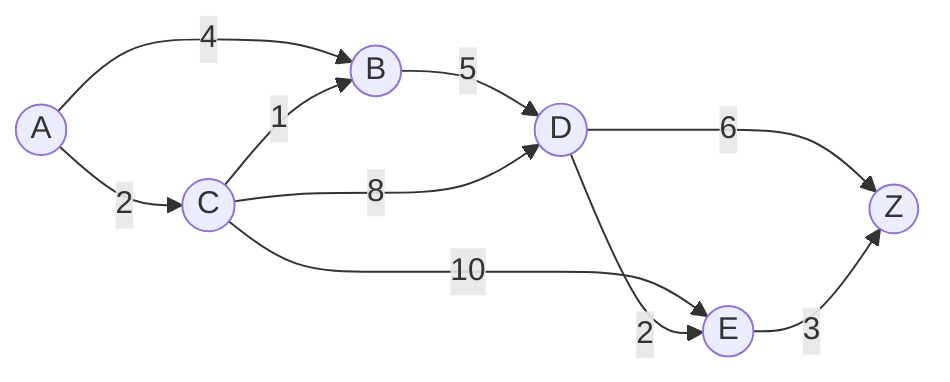
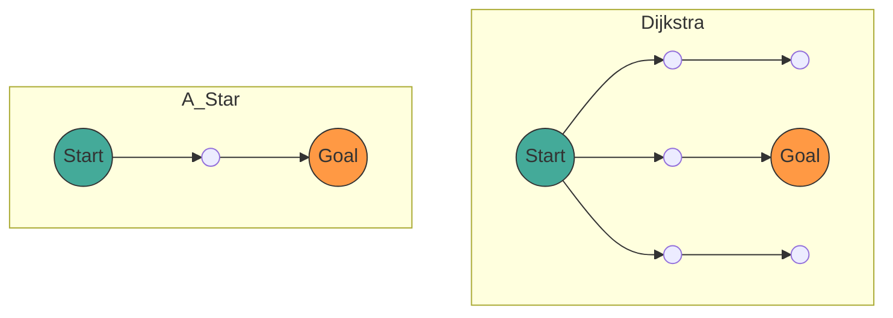

## 1. Einleitung

In der modernen Informatik bietet die **Graphentheorie** ([Graph](https://kenji.blog/de/p/tree-graph-data-structures-search-dfs-bfs-dijkstra/) Theory) einen mächtigen mathematischen Rahmen zur Modellierung von Netzwerkstrukturen. In unserem Alltag wird die Technologie zur Berechnung des „kürzesten Weges“ in verschiedenen Situationen eingesetzt, etwa bei der Autonavigation, der Umsteigeauskunft bei der Bahn, dem Internet-Routing und sogar bei der Pfadfindung in der Spiel-KI.

In diesem Artikel erklären wir umfassend die mathematische Definition der Graphentheorie, die die Grundlage dieser Pfadfindung bildet, sowie die Mechanismen, mathematischen Beweise und praktischen Implementierungsmethoden in Python für den **[Dijkstra](https://kenji.blog/de/p/tree-graph-data-structures-search-dfs-bfs-dijkstra/)-Algorithmus** (Dijkstra's Algorithm), einen repräsentativen Suchalgorithmus, und den weiterentwickelten **A*-Algorithmus** (A-Star Algorithm).

## 2. Grundlagen der Graphentheorie

Bevor wir zu den Algorithmen kommen, definieren wir zunächst mathematisch den Graphen, der die Zieldatenstruktur darstellt.

### 2.1 Mathematische Definition eines Graphen

Ein Graph $ G $ wird durch ein Paar aus einer Menge von Knoten (Vertex/Node) $ V $ und einer Menge von Kanten (Edge) $ E $ definiert.

$$
G = (V, E)
$$

Hierbei verbindet ein Element $ e $ der Kantenmenge $ E $ zwei Knoten $ u, v \in V $ und wird als $ e = (u, v) $ ausgedrückt.

- **Ungerichteter Graph** (Undirected Graph): Ein Graph ohne Kantenrichtung. Wenn $ (u, v) \in E $, dann gilt auch $ (v, u) \in E $.
- **Gerichteter Graph** (Directed Graph): Ein Graph mit Kantenrichtung. $ (u, v) $ und $ (v, u) $ werden unterschieden.

### 2.2 Gewichteter Graph (Weighted Graph)

Bei der tatsächlichen Pfadfindung müssen Entfernung, Zeit, Kosten usw. berücksichtigt werden. Daher betrachten wir einen **gewichteten Graphen**, bei dem jeder Kante ein „Gewicht“ (Weight) zugewiesen wird. Wenn wir die Gewichtsfunktion $ w: E \rightarrow \mathbb{R} $ einführen, wird der Graph als $ G = (V, E, w) $ definiert.

$$
w(u, v) \ge 0
$$

Da Entfernungen und Zeiten in vielen Fällen nicht negativ werden können, nehmen wir an, dass die Kantengewichte nicht-negativ sind.



Das obige Diagramm ist ein Beispiel für einen gewichteten gerichteten Graphen von Knoten $ A $ bis $ Z $. Die Zahlen auf den Kanten stellen die Kosten (Gewicht) dar.

### 2.3 Formulierung des Kürzeste-Wege-Problems

Ein Pfad (Path) $ P $ von einem Startknoten (Source) $ s \in V $ zu einem Zielknoten (Target) $ t \in V $ sei eine Folge von Knoten $ (v_0, v_1, \dots, v_k) $ (wobei $ v_0 = s, v_k = t $), und für jedes $ i $ gilt $ (v_i, v_{i+1}) \in E $.
Die Gesamtkosten $ W(P) $ dieses Pfades $ P $ werden durch die Summe der Kantengewichte auf dem Pfad dargestellt.

$$
W(P) = \sum_{i=0}^{k-1} w(v_i, v_{i+1})
$$

Das **Kürzeste-Wege-Problem** (Shortest Path Problem) ist das Problem, unter allen möglichen Pfaden $ P $ den Pfad $ P^* $ zu finden, der $ W(P) $ minimiert.

---

## 3. [Dijkstra](https://kenji.blog/de/p/tree-graph-data-structures-search-dfs-bfs-dijkstra/)-Algorithmus (Dijkstra's Algorithm)

Der von Edsger W. Dijkstra erdachte **Dijkstra-Algorithmus** ist ein Algorithmus, um in Graphen mit nicht-negativen Gewichten den kürzesten Weg von einem einzelnen Startknoten zu allen anderen Knoten zu finden.

### 3.1 Intuitives Verständnis des Algorithmus

Der Dijkstra-Algorithmus basiert auf einem Greedy-Algorithmus (Greedy Algorithm), der „nacheinander die am nächsten liegenden, noch nicht fixierten Knoten vom Startpunkt aus fixiert“.

1. Bereite ein Array vor, das die vorläufigen Entfernungen vom Startpunkt speichert, und initialisiere den Startpunkt mit `0` und alle anderen mit `Unendlich` ( $ \infty $ ).
2. Wähle unter den noch nicht fixierten Knoten den Knoten $ u $ mit der minimalen vorläufigen Entfernung und markiere ihn als „fixiert“.
3. Für alle Knoten $ v $, die benachbart zu Knoten $ u $ sind, aktualisiere die Entfernung, falls der Weg über $ u $ eine kürzere vorläufige Entfernung ergibt (diese Operation wird als **Relaxation** (Relaxation) bezeichnet).
4. Wiederhole die Schritte 2 bis 3, bis alle Knoten fixiert sind oder der Zielknoten fixiert ist.

### 3.2 Mathematische Darstellung der Relaxation (Relaxation)

Die Operation zur Relaxation der Kante von Knoten $ u $ nach $ v $ wird mathematisch wie folgt ausgedrückt. Hierbei gibt $ d[v] $ die aktuelle vorläufige kürzeste Entfernung vom Startpunkt zu $ v $ an.

$$
\text{wenn } d[u] + w(u, v) < d[v]: \\\\
d[v] = d[u] + w(u, v)
$$

### 3.3 Implementierung des [Dijkstra](https://kenji.blog/de/p/tree-graph-data-structures-search-dfs-bfs-dijkstra/)-Algorithmus in Python

Für eine effiziente Implementierung verwenden wir eine Prioritätswarteschlange (Priority Queue) als Datenstruktur, um den minimalen Wert abzurufen. In Python kann das Modul `heapq` verwendet werden.

```python
import heapq

def dijkstra(graph, start):
    """
    graph: Wörterbuch (dict). Format: graph[u] = {v1: weight1, v2: weight2, ...}
    start: Startknoten
    """
    # Wörterbuch zur Speicherung von Entfernungen. Initialwert ist unendlich
    distances = {node: float('inf') for node in graph}
    distances[start] = 0
    
    # Prioritätswarteschlange [(Entfernung, Knoten)]
    pq = [(0, start)]
    
    # Wörterbuch zur Wiederherstellung des Pfades
    previous_nodes = {node: None for node in graph}

    while pq:
        current_distance, current_node = heapq.heappop(pq)

        # Überspringen, wenn bereits verarbeitet (ein kürzerer Weg wurde gefunden)
        if current_distance > distances[current_node]:
            continue

        # Benachbarte Knoten durchsuchen
        for neighbor, weight in graph[current_node].items():
            distance = current_distance + weight

            # Relaxationsoperation (Relaxation)
            if distance < distances[neighbor]:
                distances[neighbor] = distance
                previous_nodes[neighbor] = current_node
                heapq.heappush(pq, (distance, neighbor))

    return distances, previous_nodes
```

### 3.4 Über die Zeitkomplexität

Wenn wir einen binären [Heap](https://kenji.blog/de/p/c-language-pointers-memory-management-stack-heap/) (Binary Heap) als Prioritätswarteschlange verwenden, wird jeder Knoten einmal aus der Warteschlange entnommen und jede Kante wird einmal relaxiert.
Daher beträgt die Zeitkomplexität $ O((|V| + |E|) \log |V|) $. Wenn ein Fibonacci-Heap verwendet wird, kann dies theoretisch auf $ O(|E| + |V| \log |V|) $ verbessert werden, aber in der Praxis wird oft ein binärer Heap verwendet.

---

## 4. A*-Algorithmus (A-Star Algorithm)

Der [Dijkstra](https://kenji.blog/de/p/tree-graph-data-structures-search-dfs-bfs-dijkstra/)-Algorithmus ist zuverlässig, aber da er die Suche in alle Richtungen ausdehnt, ohne die Richtung des Ziels zu berücksichtigen, kann es zu vielen unnötigen Suchvorgängen kommen. Dies wird durch den **A*-Algorithmus** gelöst.

### 4.1 Einführung der Heuristikfunktion

Der A*-Algorithmus priorisiert die Suche in Richtung des Ziels, indem er die „geschätzte Entfernung“ vom aktuellen Knoten zum Ziel verwendet. Eine Funktion, die diese geschätzte Entfernung zurückgibt, wird als **Heuristikfunktion** (Heuristic Function) $ h(n) $ bezeichnet.

In A* definieren wir die Funktion $ f(n) $ zur Bewertung des Knotens $ n $ wie folgt:

$$
f(n) = g(n) + h(n)
$$

Hierbei gilt:
- $ g(n) $: Tatsächliche Kosten vom Startpunkt zum Knoten $ n $ (wie die Entfernung beim Dijkstra-Algorithmus)
- $ h(n) $: Geschätzte Kosten vom Knoten $ n $ zum Ziel (Heuristik)
- $ f(n) $: Geschätzte Gesamtkosten des Pfades vom Startpunkt über $ n $ zum Ziel

### 4.2 Bedingungen für die Heuristik

Damit A* immer den **kürzesten Weg findet (Optimalität)**, muss die Heuristikfunktion $ h(n) $ die folgenden Bedingungen erfüllen.

1. **Zulässig** (Admissible):
   Die geschätzten Kosten dürfen niemals die tatsächlichen Kosten übersteigen.
   $$
   h(n) \le h^*(n)
   $$
   (wobei $ h^*(n) $ die wahren kürzesten Kosten von $ n $ zum Ziel sind)

2. **Konsistent** (Consistent / Monotonic):
   Für beliebige benachbarte Knoten $ m, n $ muss die Dreiecksungleichung erfüllt sein.
   $$
   h(m) \le c(m, n) + h(n)
   $$
   Hierbei sind $ c(m, n) $ die Kosten der Kante von $ m $ nach $ n $. Eine konsistente Heuristik ist automatisch zulässig.

### 4.3 Repräsentative Heuristikfunktionen

Für die Pfadfindung in einem Gitter werden häufig die folgenden Distanzfunktionen verwendet:

- **Manhattan-Distanz** (Manhattan Distance): Wenn Bewegungen nur nach oben, unten, links und rechts möglich sind
  $$
  h(n) = |x_n - x_{goal}| + |y_n - y_{goal}|
  $$
- **Euklidische Distanz** (Euclidean Distance): Wenn eine geradlinige Bewegung in beliebige Richtungen möglich ist
  $$
  h(n) = \sqrt{(x_n - x_{goal})^2 + (y_n - y_{goal})^2}
  $$

### 4.4 Python-Implementierung des A*-Algorithmus

Die Implementierung von A* ist der des Dijkstra-Algorithmus sehr ähnlich, außer dass der Schlüssel für die Prioritätswarteschlange $ f(n) $ ist.

```python
import heapq

def a_star(graph, start, goal, heuristic_func):
    """
    graph: Wörterbuch mit Kosten zwischen Knoten
    start: Startpunkt
    goal: Zielpunkt
    heuristic_func: Heuristikfunktion h(node, goal)
    """
    open_set = []
    heapq.heappush(open_set, (0, start))
    
    # Tatsächliche Kosten vom Startpunkt g(n)
    g_score = {node: float('inf') for node in graph}
    g_score[start] = 0
    
    # f(n) = g(n) + h(n)
    f_score = {node: float('inf') for node in graph}
    f_score[start] = heuristic_func(start, goal)
    
    came_from = {}

    while open_set:
        # Knoten mit minimalem f(n) abrufen
        current_f, current_node = heapq.heappop(open_set)

        if current_node == goal:
            return reconstruct_path(came_from, current_node)

        for neighbor, weight in graph[current_node].items():
            tentative_g_score = g_score[current_node] + weight

            if tentative_g_score < g_score[neighbor]:
                # Besseren Pfad gefunden
                came_from[neighbor] = current_node
                g_score[neighbor] = tentative_g_score
                f_score[neighbor] = tentative_g_score + heuristic_func(neighbor, goal)
                
                # Zu open_set hinzufügen
                heapq.heappush(open_set, (f_score[neighbor], neighbor))

    return None # Wenn kein Pfad gefunden wurde

def reconstruct_path(came_from, current):
    path = [current]
    while current in came_from:
        current = came_from[current]
        path.append(current)
    path.reverse()
    return path
```

### 4.5 Vergleich zwischen [Dijkstra](https://kenji.blog/de/p/tree-graph-data-structures-search-dfs-bfs-dijkstra/)-Algorithmus und A*

Das folgende Mermaid-Diagramm ist ein visueller Vergleich der Suchbereiche zwischen Dijkstra und A*. Während der Dijkstra-Algorithmus die Suche konzentrisch ausdehnt, erweitert A* die Suche in einer elliptischen Form, die in Richtung des Ziels gestreckt ist.



---

## 5. Anwendungen der Pfadfindung und zukünftige Perspektiven

Obwohl der [Dijkstra](https://kenji.blog/de/p/tree-graph-data-structures-search-dfs-bfs-dijkstra/)-Algorithmus und der A*-Algorithmus grundlegende Methoden sind, bilden sie die Basis für viele angewandte Technologien.

1. **Bidirektionale Suche** (Bidirectional Search):
   Eine Methode, die die Suche gleichzeitig von Start- und Zielpunkt aus durchführt und in der Mitte zusammentrifft, wodurch der Suchraum drastisch reduziert wird.
2. **D*-Algorithmus** (Dynamic A*):
   Eine Methode zur effizienten Neuberechnung von Pfaden in Umgebungen, in denen unbekannte Hindernisse dynamisch auftreten (z. B. autonomes Fahren von Robotern).
3. **JPS** (Jump Point Search):
   Eine Methode zur weiteren Beschleunigung der A*-Suche auf gleichmäßigen Gitterkarten. Sie nutzt Symmetrien aus, um unnötige Knoten zu überspringen.

Pfadfindungsalgorithmen sind ein Bereich, in dem die mathematische Schönheit der Graphentheorie und die algorithmische Effizienz der Informatik brillant verschmelzen.

## 6. Fazit

In diesem Artikel haben wir von den grundlegenden Definitionen der Graphentheorie über die mathematischen Hintergründe und spezifischen Mechanismen des Dijkstra-Algorithmus und des A*-Algorithmus bis hin zu Beispielen ihrer Implementierung in Python alles erklärt.

- Der **Dijkstra-Algorithmus** bewertet alle Knoten gleichmäßig und garantiert zuverlässig den kürzesten Weg.
- Der **A*-Algorithmus** erreicht durch die Einführung einer Heuristikfunktion $ h(n) $ eine effiziente Suche in Richtung des Ziels.

Dieses Wissen beschränkt sich nicht nur auf das Verständnis von Algorithmen, sondern wird auch zu einem mächtigen Denkwerkzeug, um komplexe reale Probleme in mathematische Modelle von „Graphen“ zu übersetzen und optimale Lösungen abzuleiten. Bitte lassen Sie den tatsächlichen Code laufen und erleben Sie seine Leistungsfähigkeit selbst.
