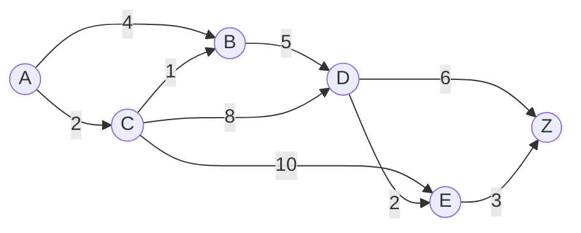
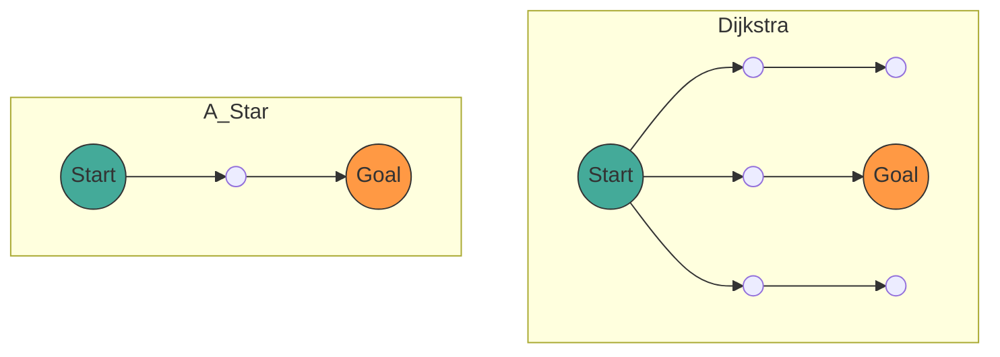

## 1. Introduction

In modern computer science, **graph theory** provides a powerful mathematical framework for modeling network structures. In our daily lives, technologies for calculating the "shortest path" are used in various scenarios, such as car navigation, railway transfer guidance, internet routing, and even pathfinding in game AI.

This article comprehensively explains the mathematical definitions of graph theory, which form the foundation of pathfinding, followed by the mechanisms, mathematical proofs, and practical implementation methods using Python for the representative search algorithm, **[Dijkstra](https://kenji.blog/en/p/tree-graph-data-structures-search-dfs-bfs-dijkstra/)'s Algorithm**, and its further developed form, the **A* Algorithm** (A-Star Algorithm).

## 2. Basics of [Graph](https://kenji.blog/en/p/tree-graph-data-structures-search-dfs-bfs-dijkstra/) Theory

Before diving into the algorithms, let's first mathematically define the target data structure, which is the graph.

### 2.1 Mathematical Definition of a Graph

A graph $ G $ is defined by a pair consisting of a set of vertices (Nodes) $ V $ and a set of edges $ E $.

$$
G = (V, E)
$$

Here, an element $ e $ of the edge set $ E $ connects two vertices $ u, v \in V $, and is represented as $ e = (u, v) $.

- **Undirected Graph**: A graph where edges have no direction. If $ (u, v) \in E $, then $ (v, u) \in E $.
- **Directed Graph**: A graph where edges have a direction. $ (u, v) $ and $ (v, u) $ are distinguished.

### 2.2 Weighted Graph

In practical pathfinding, it is necessary to consider distance, time, cost, etc. Therefore, we consider a **weighted graph** where a "weight" is assigned to each edge. By introducing a weight function $ w: E \rightarrow \mathbb{R} $, the graph is defined as $ G = (V, E, w) $.

$$
w(u, v) \ge 0
$$

In many cases, since distance and time are not negative, we assume that the edge weights are non-negative.



The diagram above is an example of a weighted directed graph from vertex $ A $ to $ Z $. The numbers on the edges represent the costs (weights).

### 2.3 Formulation of the Shortest Path Problem

Let a path $ P $ from a source $ s \in V $ to a target $ t \in V $ be a sequence of vertices $ (v_0, v_1, \dots, v_k) $ (where $ v_0 = s, v_k = t $), and assume that $ (v_i, v_{i+1}) \in E $ for each $ i $.
The total cost $ W(P) $ of this path $ P $ is expressed by the sum of the edge weights along the path.

$$
W(P) = \sum_{i=0}^{k-1} w(v_i, v_{i+1})
$$

The **Shortest Path Problem** is the problem of finding a path $ P^* $ that minimizes $ W(P) $ among all possible paths $ P $.

---

## 3. [Dijkstra](https://kenji.blog/en/p/tree-graph-data-structures-search-dfs-bfs-dijkstra/)'s Algorithm

Conceived by Edsger W. Dijkstra, **Dijkstra's Algorithm** is an algorithm for finding the shortest paths from a single source vertex to all other vertices in a graph with non-negative weights.

### 3.1 Intuitive Understanding of the Algorithm

Dijkstra's algorithm is based on a greedy algorithm approach: "sequentially determining the closest unvisited vertex from the source."

1. Prepare an array to hold the provisional distances from the source, initializing the source to `0` and the others to `infinity` ( $ \infty $ ).
2. Among the undetermined vertices, select the vertex $ u $ with the smallest provisional distance and mark it as "determined".
3. For all vertices $ v $ adjacent to vertex $ u $, if the provisional distance is shorter by going through $ u $, update the distance (this operation is called **Relaxation**).
4. Repeat steps 2-3 until all vertices are determined, or the target vertex is determined.

### 3.2 Mathematical Expression of Relaxation

The operation of relaxing the edge from vertex $ u $ to $ v $ is expressed by the following mathematical formula. Here, $ d[v] $ indicates the current provisional shortest distance from the source to $ v $.

$$
\text{if } d[u] + w(u, v) < d[v]: \\\\
d[v] = d[u] + w(u, v)
$$

### 3.3 Implementation of [Dijkstra](https://kenji.blog/en/p/tree-graph-data-structures-search-dfs-bfs-dijkstra/)'s Algorithm in Python

For an efficient implementation, we use a priority queue as the data structure to retrieve the minimum value. In Python, the `heapq` module can be used.

```python
import heapq

def dijkstra(graph, start):
    """
    graph: Dictionary type. Format is graph[u] = {v1: weight1, v2: weight2, ...}
    start: The starting node
    """
    # Dictionary to store distances. Initial value is infinity
    distances = {node: float('inf') for node in graph}
    distances[start] = 0
    
    # Priority queue [(distance, node)]
    pq = [(0, start)]
    
    # Dictionary for path reconstruction
    previous_nodes = {node: None for node in graph}

    while pq:
        current_distance, current_node = heapq.heappop(pq)

        # Skip if already processed (a shorter path has been found)
        if current_distance > distances[current_node]:
            continue

        # Explore adjacent nodes
        for neighbor, weight in graph[current_node].items():
            distance = current_distance + weight

            # Relaxation operation
            if distance < distances[neighbor]:
                distances[neighbor] = distance
                previous_nodes[neighbor] = current_node
                heapq.heappush(pq, (distance, neighbor))

    return distances, previous_nodes
```

### 3.4 Regarding Time Complexity

When using a binary heap as the priority queue, each vertex is extracted from the queue once, and each edge is relaxed once.
Therefore, the time complexity is $ O((|V| + |E|) \log |V|) $. If a Fibonacci heap is used, it can theoretically be improved to $ O(|E| + |V| \log |V|) $, but in practice, binary heaps are commonly used.

---

## 4. A* Algorithm (A-Star Algorithm)

While [Dijkstra](https://kenji.blog/en/p/tree-graph-data-structures-search-dfs-bfs-dijkstra/)'s algorithm is reliable, it often results in unnecessary exploration because it expands the search in all directions without considering the direction of the destination. The **A* algorithm** solves this issue.

### 4.1 Introduction of the Heuristic Function

The A* algorithm prioritizes the search towards the goal by using an "estimated distance" from the current node to the goal. The function that returns this estimated distance is called the **Heuristic Function** $ h(n) $.

In A*, the function $ f(n) $ for evaluating node $ n $ is defined as follows.

$$
f(n) = g(n) + h(n)
$$

Here,
- $ g(n) $: The actual cost from the source to node $ n $ (same as the distance in Dijkstra's algorithm)
- $ h(n) $: The estimated cost from node $ n $ to the target (heuristic)
- $ f(n) $: The estimated total cost of the path from the source, through $ n $, to the target

### 4.2 Conditions for the Heuristic

For A* to always **find the shortest path (optimality)**, the heuristic function $ h(n) $ must satisfy the following conditions.

1. **Admissible**:
   The estimated cost must never overestimate the actual cost.
   $$
   h(n) \le h^*(n)
   $$
   ( $ h^*(n) $ is the true shortest cost from $ n $ to the target)

2. **Consistent / Monotonic**:
   For any adjacent nodes $ m, n $, it must satisfy the triangle inequality.
   $$
   h(m) \le c(m, n) + h(n)
   $$
   Here, $ c(m, n) $ is the cost of the edge from $ m $ to $ n $. A consistent heuristic is automatically admissible.

### 4.3 Typical Heuristic Functions

In pathfinding on a grid, the following distance functions are often used.

- **Manhattan Distance**: When movement is only possible up, down, left, and right
  $$
  h(n) = |x_n - x_{goal}| + |y_n - y_{goal}|
  $$
- **Euclidean Distance**: When straight-line movement is possible in any direction
  $$
  h(n) = \sqrt{(x_n - x_{goal})^2 + (y_n - y_{goal})^2}
  $$

### 4.4 Python Implementation of the A* Algorithm

The implementation of A* is very similar to Dijkstra's algorithm, with the difference that the key for the priority queue is $ f(n) $.

```python
import heapq

def a_star(graph, start, goal, heuristic_func):
    """
    graph: Dictionary containing costs between nodes
    start: The starting node
    goal: The ending node
    heuristic_func: Heuristic function h(node, goal)
    """
    open_set = []
    heapq.heappush(open_set, (0, start))
    
    # Actual cost from the start g(n)
    g_score = {node: float('inf') for node in graph}
    g_score[start] = 0
    
    # f(n) = g(n) + h(n)
    f_score = {node: float('inf') for node in graph}
    f_score[start] = heuristic_func(start, goal)
    
    came_from = {}

    while open_set:
        # Get the node with the minimum f(n)
        current_f, current_node = heapq.heappop(open_set)

        if current_node == goal:
            return reconstruct_path(came_from, current_node)

        for neighbor, weight in graph[current_node].items():
            tentative_g_score = g_score[current_node] + weight

            if tentative_g_score < g_score[neighbor]:
                # Found a better path
                came_from[neighbor] = current_node
                g_score[neighbor] = tentative_g_score
                f_score[neighbor] = tentative_g_score + heuristic_func(neighbor, goal)
                
                # Add to open_set
                heapq.heappush(open_set, (f_score[neighbor], neighbor))

    return None # If no path is found

def reconstruct_path(came_from, current):
    path = [current]
    while current in came_from:
        current = came_from[current]
        path.append(current)
    path.reverse()
    return path
```

### 4.5 Comparison between [Dijkstra](https://kenji.blog/en/p/tree-graph-data-structures-search-dfs-bfs-dijkstra/)'s and A*

The Mermaid diagram below is a visual comparison of the search areas for Dijkstra's algorithm and A*. While Dijkstra's algorithm expands its search in concentric circles, A* proceeds with the search in an elliptical shape stretched towards the goal.



---

## 5. Applications of Pathfinding and Future Prospects

While [Dijkstra](https://kenji.blog/en/p/tree-graph-data-structures-search-dfs-bfs-dijkstra/)'s and the A* algorithms are fundamental techniques, they serve as the base for many applied technologies.

1. **Bidirectional Search**:
   A method that dramatically reduces the search space by simultaneously progressing the search from both the start and the end, meeting in the middle.
2. **D* Algorithm (Dynamic A*)**:
   A method for efficiently recalculating paths in environments where unknown obstacles dynamically appear (such as autonomous driving for robots).
3. **JPS (Jump Point Search)**:
   A method for further speeding up the A* search on uniform grid maps. It utilizes symmetry to skip unnecessary nodes.

Pathfinding algorithms are a field where the mathematical beauty of graph theory and the algorithmic efficiency of computer science beautifully merge.

## 6. Conclusion

In this article, starting from the basic definitions of graph theory, we explained the mathematical backgrounds, specific mechanisms, and implementation examples using Python for Dijkstra's algorithm and the A* algorithm.

- **Dijkstra's Algorithm** evaluates all nodes equally and guarantees finding a reliable shortest path.
- The **A* Algorithm** realizes an efficient search toward the goal by introducing the heuristic function $ h(n) $.

This knowledge will not just stop at understanding the algorithms but will also become a powerful thinking tool for breaking down complex real-world problems into a mathematical model called a "graph" to derive optimal solutions. By all means, try running the actual code and experience its power.
