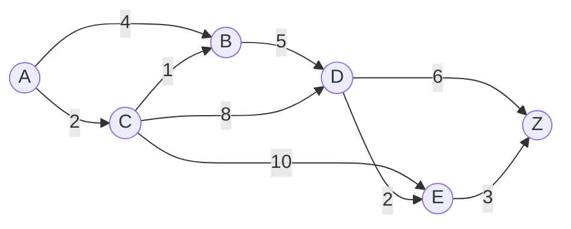
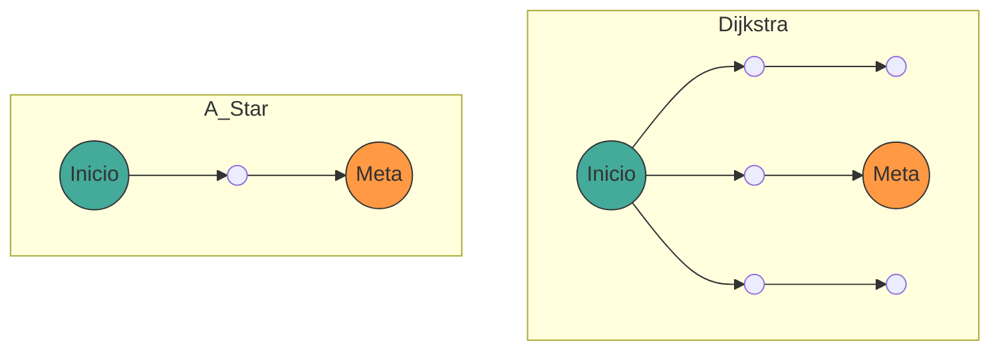

## 1. Introducción

En la informática moderna, la **teoría de grafos** ([Graph](https://kenji.blog/es/p/tree-graph-data-structures-search-dfs-bfs-dijkstra/) Theory) proporciona un potente marco matemático para modelar estructuras de redes. En nuestra vida diaria, la tecnología para calcular la "ruta más corta" se utiliza en diversas situaciones, como la navegación de automóviles, la información de transbordos de trenes, el enrutamiento de Internet e incluso la búsqueda de rutas en inteligencia artificial para videojuegos.

En este artículo, comenzando desde la definición matemática de la teoría de grafos, que es la base de la búsqueda de rutas, cubrimos de manera integral el funcionamiento, las demostraciones matemáticas y los métodos de implementación práctica en Python del **algoritmo de [Dijkstra](https://kenji.blog/es/p/tree-graph-data-structures-search-dfs-bfs-dijkstra/)** (Dijkstra's Algorithm), un algoritmo de búsqueda representativo, y el **algoritmo A*** (A-Star Algorithm), que es una evolución del mismo.

## 2. Fundamentos de la Teoría de Grafos

Antes de explicar los algoritmos, primero definiremos matemáticamente la estructura de datos que será nuestro objetivo, el grafo.

### 2.1 Definición Matemática de un Grafo

Un grafo $ G $ se define mediante un par de un conjunto de vértices (Vertex/Node) $ V $ y un conjunto de aristas (Edge) $ E $.

$$
G = (V, E)
$$

Aquí, el elemento $ e $ del conjunto de aristas $ E $ conecta dos vértices $ u, v \in V $, y se representa como $ e = (u, v) $.

- **Grafo no dirigido** (Undirected Graph): Un grafo en el que las aristas no tienen dirección. Si $ (u, v) \in E $, entonces $ (v, u) \in E $.
- **Grafo dirigido** (Directed Graph): Un grafo en el que las aristas tienen dirección. $ (u, v) $ y $ (v, u) $ se diferencian.

### 2.2 Grafo Ponderado (Weighted Graph)

En la búsqueda real de rutas, es necesario considerar la distancia, el tiempo, el costo, etc. Por lo tanto, consideraremos un **grafo ponderado** en el que se asigna un "peso" (Weight) a cada arista. Si introducimos una función de peso $ w: E \rightarrow \mathbb{R} $, el grafo se define como $ G = (V, E, w) $.

$$
w(u, v) \ge 0
$$

En muchos casos, como la distancia y el tiempo no pueden ser negativos, asumimos que el peso de la arista es no negativo.



La figura anterior es un ejemplo de un grafo dirigido ponderado desde el vértice $ A $ hasta $ Z $. Los números en las aristas representan el costo (peso).

### 2.3 Formulación del Problema de la Ruta Más Corta

Sea la ruta (Path) $ P $ desde un punto de inicio (Source) $ s \in V $ hasta un punto de destino (Target) $ t \in V $, definida como la secuencia de vértices $ (v_0, v_1, \dots, v_k) $ (donde $ v_0 = s, v_k = t $), y suponemos que para cada $ i $, $ (v_i, v_{i+1}) \in E $.
El costo total $ W(P) $ de esta ruta $ P $ se expresa como la suma de los pesos de las aristas en la ruta.

$$
W(P) = \sum_{i=0}^{k-1} w(v_i, v_{i+1})
$$

El **problema de la ruta más corta** (Shortest Path Problem) es el problema de encontrar la ruta $ P^* $ que minimice $ W(P) $ de entre todas las rutas posibles $ P $.

---

## 3. Algoritmo de [Dijkstra](https://kenji.blog/es/p/tree-graph-data-structures-search-dfs-bfs-dijkstra/) (Dijkstra's Algorithm)

El **algoritmo de Dijkstra**, ideado por Edsger Dijkstra, es un algoritmo para encontrar las rutas más cortas desde un solo punto de inicio hasta todos los vértices en un grafo con pesos no negativos.

### 3.1 Comprensión Intuitiva del Algoritmo

El algoritmo de Dijkstra se basa en un algoritmo codicioso (Greedy Algorithm) en el que "los vértices no determinados más cercanos al punto de inicio se van determinando de forma secuencial".

1. Prepare una matriz para almacenar las distancias provisionales desde el punto de inicio e inicialice el punto de inicio con `0` y los demás con `infinito` ( $ \infty $ ).
2. Entre los vértices no determinados, elija el vértice $ u $ con la distancia provisional mínima y márquelo como "determinado".
3. Para todos los vértices adyacentes $ v $ del vértice $ u $, si la distancia provisional se acorta pasando por $ u $, actualice la distancia (esta operación se denomina **relajación** (Relaxation)).
4. Repita los pasos 2 y 3 hasta que todos los vértices estén determinados o hasta que el vértice de destino esté determinado.

### 3.2 Expresión Matemática de la Relajación (Relaxation)

La operación de relajar una arista del vértice $ u $ a $ v $ se expresa matemáticamente de la siguiente manera. Aquí, $ d[v] $ indica la distancia provisional más corta actual desde el punto de inicio hasta $ v $.

$$
\text{si } d[u] + w(u, v) < d[v]: \\\\
d[v] = d[u] + w(u, v)
$$

### 3.3 Implementación del Algoritmo de [Dijkstra](https://kenji.blog/es/p/tree-graph-data-structures-search-dfs-bfs-dijkstra/) en Python

Para una implementación eficiente, utilizamos una cola de prioridad (Priority Queue) como estructura de datos para obtener el valor mínimo. En Python, podemos usar el módulo `heapq`.

```python
import heapq

def dijkstra(graph, start):
    """
    graph: Tipo diccionario. Formato graph[u] = {v1: weight1, v2: weight2, ...}
    start: Nodo de inicio
    """
    # Diccionario para guardar las distancias. El valor inicial es infinito
    distances = {node: float('inf') for node in graph}
    distances[start] = 0
    
    # Cola de prioridad [(distancia, nodo)]
    pq = [(0, start)]
    
    # Diccionario para restaurar la ruta
    previous_nodes = {node: None for node in graph}

    while pq:
        current_distance, current_node = heapq.heappop(pq)

        # Si ya ha sido procesado (se ha encontrado una ruta más corta), se omite
        if current_distance > distances[current_node]:
            continue

        # Exploración de nodos adyacentes
        for neighbor, weight in graph[current_node].items():
            distance = current_distance + weight

            # Operación de relajación (Relaxation)
            if distance < distances[neighbor]:
                distances[neighbor] = distance
                previous_nodes[neighbor] = current_node
                heapq.heappush(pq, (distance, neighbor))

    return distances, previous_nodes
```

### 3.4 Sobre la Complejidad Computacional

Si utilizamos un montículo binario (Binary [Heap](https://kenji.blog/es/p/c-language-pointers-memory-management-stack-heap/)) como cola de prioridad, cada vértice se extrae de la cola una vez, y cada arista se relaja una vez.
Por lo tanto, la complejidad de tiempo es $ O((|V| + |E|) \log |V|) $. Si utilizamos un montículo de Fibonacci (Fibonacci Heap), en teoría se puede mejorar hasta $ O(|E| + |V| \log |V|) $, pero en la práctica se suele utilizar mucho el montículo binario.

---

## 4. Algoritmo A* (A-Star Algorithm)

El algoritmo de [Dijkstra](https://kenji.blog/es/p/tree-graph-data-structures-search-dfs-bfs-dijkstra/) es seguro, pero como expande la búsqueda en todas las direcciones sin considerar la dirección del destino, puede haber muchas búsquedas inútiles. El **algoritmo A*** resuelve esto.

### 4.1 Introducción de la Función Heurística

El algoritmo A* da prioridad a la búsqueda hacia el objetivo utilizando una "distancia estimada" desde el nodo actual hasta el objetivo. La función que devuelve esta distancia estimada se llama **función heurística** (Heuristic Function) $ h(n) $.

En A*, la función $ f(n) $ para evaluar un nodo $ n $ se define de la siguiente manera:

$$
f(n) = g(n) + h(n)
$$

Aquí:
- $ g(n) $: Costo real desde el punto de inicio hasta el nodo $ n $ (igual a la distancia en el algoritmo de Dijkstra)
- $ h(n) $: Costo estimado desde el nodo $ n $ hasta el destino (heurística)
- $ f(n) $: Costo total estimado de la ruta desde el punto de inicio pasando por $ n $ hacia el destino

### 4.2 Condiciones de la Heurística

Para que A* siempre **encuentre la ruta más corta (optimidad)**, la función heurística $ h(n) $ debe cumplir las siguientes condiciones:

1. **Admisible** (Admissible):
   El costo estimado nunca debe exceder el costo real.
   $$
   h(n) \le h^*(n)
   $$
   ($ h^*(n) $ es el verdadero costo más corto desde $ n $ hasta el destino)

2. **Consistente** (Consistent / Monotonic):
   Para cualquier par de nodos adyacentes $ m, n $, debe satisfacerse la desigualdad triangular.
   $$
   h(m) \le c(m, n) + h(n)
   $$
   Donde $ c(m, n) $ es el costo de la arista desde $ m $ hasta $ n $. Una heurística consistente es automáticamente admisible.

### 4.3 Funciones Heurísticas Típicas

En la búsqueda de rutas en una cuadrícula, se utilizan a menudo las siguientes funciones de distancia:

- **Distancia de Manhattan** (Manhattan Distance): Cuando solo es posible el movimiento hacia arriba, abajo, izquierda y derecha
  $$
  h(n) = |x_n - x_{goal}| + |y_n - y_{goal}|
  $$
- **Distancia Euclidiana** (Euclidean Distance): Cuando es posible el movimiento en línea recta en cualquier dirección
  $$
  h(n) = \sqrt{(x_n - x_{goal})^2 + (y_n - y_{goal})^2}
  $$

### 4.4 Implementación del Algoritmo A* en Python

La implementación de A* es muy similar a la del algoritmo de Dijkstra, con la diferencia de que la clave de la cola de prioridad es $ f(n) $.

```python
import heapq

def a_star(graph, start, goal, heuristic_func):
    """
    graph: Diccionario con los costos entre nodos
    start: Punto de inicio
    goal: Punto de destino
    heuristic_func: Función heurística h(node, goal)
    """
    open_set = []
    heapq.heappush(open_set, (0, start))
    
    # Costo real g(n) desde el punto de inicio
    g_score = {node: float('inf') for node in graph}
    g_score[start] = 0
    
    # f(n) = g(n) + h(n)
    f_score = {node: float('inf') for node in graph}
    f_score[start] = heuristic_func(start, goal)
    
    came_from = {}

    while open_set:
        # Obtener el nodo con el f(n) mínimo
        current_f, current_node = heapq.heappop(open_set)

        if current_node == goal:
            return reconstruct_path(came_from, current_node)

        for neighbor, weight in graph[current_node].items():
            tentative_g_score = g_score[current_node] + weight

            if tentative_g_score < g_score[neighbor]:
                # Se encontró una ruta mejor
                came_from[neighbor] = current_node
                g_score[neighbor] = tentative_g_score
                f_score[neighbor] = tentative_g_score + heuristic_func(neighbor, goal)
                
                # Agregar a open_set
                heapq.heappush(open_set, (f_score[neighbor], neighbor))

    return None # Si no se encontró ninguna ruta

def reconstruct_path(came_from, current):
    path = [current]
    while current in came_from:
        current = came_from[current]
        path.append(current)
    path.reverse()
    return path
```

### 4.5 Comparación entre el Algoritmo de [Dijkstra](https://kenji.blog/es/p/tree-graph-data-structures-search-dfs-bfs-dijkstra/) y A*

El siguiente diagrama Mermaid es una comparación visual del área de búsqueda del algoritmo de Dijkstra y A*. Mientras que el algoritmo de Dijkstra expande la búsqueda de forma concéntrica, A* avanza la búsqueda en forma elíptica estirada hacia la dirección del objetivo.



---

## 5. Aplicaciones de la Búsqueda de Rutas y Perspectivas Futuras

El algoritmo de [Dijkstra](https://kenji.blog/es/p/tree-graph-data-structures-search-dfs-bfs-dijkstra/) y el algoritmo A* son métodos fundamentales, pero sirven de base para muchas tecnologías aplicadas.

1. **Búsqueda Bidireccional** (Bidirectional Search):
   Un método que reduce drásticamente el espacio de búsqueda avanzando la exploración desde el inicio y el destino simultáneamente, uniéndose en el medio.
2. **Algoritmo D*** (Dynamic A*):
   Un método para recalcular rutas eficientemente en entornos donde aparecen obstáculos dinámicamente desconocidos (como en la conducción autónoma de robots).
3. **JPS** (Jump Point Search):
   Un método para acelerar aún más la búsqueda de A* en mapas de cuadrícula uniformes. Omite nodos innecesarios aprovechando la simetría.

Los algoritmos de búsqueda de rutas son un campo que combina brillantemente la belleza matemática de la teoría de grafos y la eficiencia algorítmica de la informática.

## 6. Conclusión

En este artículo, partiendo de las definiciones básicas de la teoría de grafos, explicamos el contexto matemático del algoritmo de Dijkstra y el algoritmo A*, su funcionamiento específico y ejemplos de implementación utilizando Python.

- **El algoritmo de Dijkstra** evalúa todos los nodos por igual y garantiza encontrar la ruta más corta con certeza.
- **El algoritmo A*** logra una búsqueda eficiente hacia el objetivo mediante la introducción de la función heurística $ h(n) $.

Este conocimiento no se limita a la simple comprensión de algoritmos, sino que se convertirá en una poderosa herramienta de pensamiento para abstraer problemas complejos del mundo real en modelos matemáticos llamados "grafos" y derivar soluciones óptimas. Por todos los medios, ejecute el código real y experimente su potencia.
