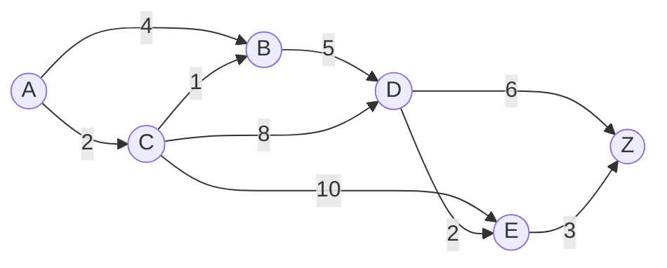
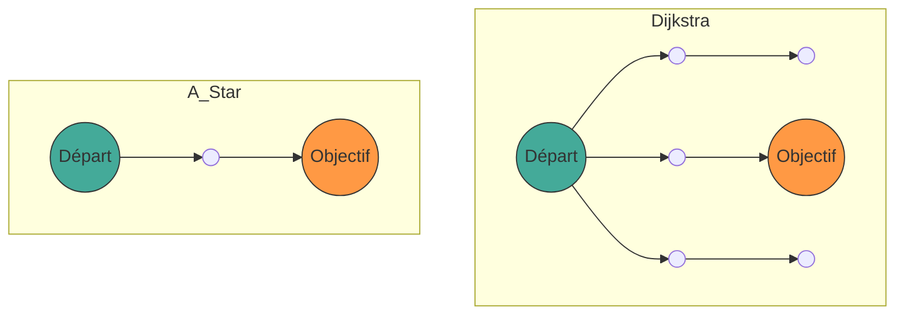

## 1. Introduction

Dans l'informatique moderne, la **théorie des graphes** ([Graph](https://kenji.blog/fr/p/tree-graph-data-structures-search-dfs-bfs-dijkstra/) Theory) fournit un cadre mathématique puissant pour modéliser les structures de réseaux. Dans notre vie quotidienne, les technologies de calcul du « plus court chemin » sont utilisées dans de nombreuses situations, comme la navigation automobile, les applications de guidage pour les correspondances ferroviaires, le routage sur Internet, ou encore la recherche de chemin par les IA dans les jeux vidéo.

Dans cet article, nous expliquerons de manière exhaustive les bases de la théorie des graphes qui sous-tend la recherche de chemin, depuis sa définition mathématique, en passant par le célèbre **algorithme de [Dijkstra](https://kenji.blog/fr/p/tree-graph-data-structures-search-dfs-bfs-dijkstra/)** (Dijkstra's Algorithm) et son évolution, l'**algorithme A*** (A-Star Algorithm), jusqu'à leurs mécanismes, leurs preuves mathématiques et leurs méthodes d'implémentation pratiques en Python.

## 2. Bases de la théorie des graphes

Avant d'entrer dans les détails algorithmiques, nous allons d'abord définir mathématiquement le graphe, qui est la structure de données cible.

### 2.1 Définition mathématique d'un graphe

Un graphe $ G $ est défini par la paire d'un ensemble de sommets (Vertex/Node) $ V $ et d'un ensemble d'arêtes (Edge) $ E $.

$$
G = (V, E)
$$

Ici, un élément $ e $ de l'ensemble des arêtes $ E $ relie deux sommets $ u, v \in V $, et s'écrit $ e = (u, v) $.

- **Graphe non orienté** (Undirected Graph) : Un graphe où les arêtes n'ont pas de direction. Si $ (u, v) \in E $, alors $ (v, u) \in E $.
- **Graphe orienté** (Directed Graph) : Un graphe où les arêtes ont une direction. $ (u, v) $ et $ (v, u) $ sont distingués.

### 2.2 Graphe pondéré (Weighted Graph)

Dans la recherche pratique de chemins, il est nécessaire de prendre en compte la distance, le temps ou le coût. C'est pourquoi nous considérons un **graphe pondéré** où un « poids » (Weight) est attribué à chaque arête. En introduisant une fonction de poids $ w: E \rightarrow \mathbb{R} $, le graphe est défini comme $ G = (V, E, w) $.

$$
w(u, v) \ge 0
$$

Dans de nombreux cas, comme la distance ou le temps ne peuvent pas être négatifs, nous supposons que les poids des arêtes sont non négatifs.



La figure ci-dessus est un exemple de graphe orienté pondéré du sommet $ A $ jusqu'à $ Z $. Les nombres sur les arêtes représentent le coût (poids).

### 2.3 Formulation du problème du plus court chemin

Soit un chemin (Path) $ P $ allant d'un point de départ (Source) $ s \in V $ à un point d'arrivée (Target) $ t \in V $, représenté par une séquence de sommets $ (v_0, v_1, \dots, v_k) $ (avec $ v_0 = s, v_k = t $), tel que pour chaque $ i $, $ (v_i, v_{i+1}) \in E $.
Le coût total $ W(P) $ de ce chemin $ P $ est la somme des poids des arêtes sur le chemin.

$$
W(P) = \sum_{i=0}^{k-1} w(v_i, v_{i+1})
$$

Le **problème du plus court chemin** (Shortest Path Problem) est le problème de trouver le chemin $ P^* $ qui minimise $ W(P) $ parmi tous les chemins possibles $ P $.

---

## 3. Algorithme de [Dijkstra](https://kenji.blog/fr/p/tree-graph-data-structures-search-dfs-bfs-dijkstra/) (Dijkstra's Algorithm)

Inventé par Edsger W. Dijkstra, l'**algorithme de Dijkstra** permet de trouver le plus court chemin depuis un seul sommet source vers tous les autres sommets dans un graphe avec des poids non négatifs.

### 3.1 Compréhension intuitive de l'algorithme

L'algorithme de Dijkstra repose sur une approche gloutonne (Greedy Algorithm) qui consiste à « valider progressivement le sommet non confirmé le plus proche du point de départ ».

1. Préparez un tableau pour conserver la distance provisoire depuis le point de départ, initialisez le point de départ à `0` et les autres à l'`infini` ( $ \infty $ ).
2. Parmi les sommets non confirmés, choisissez le sommet $ u $ ayant la plus petite distance provisoire et marquez-le comme « confirmé ».
3. Pour tous les sommets $ v $ adjacents au sommet $ u $, si la distance provisoire est plus courte en passant par $ u $, mettez à jour la distance (cette opération est appelée **relâchement** (Relaxation)).
4. Répétez les étapes 2 à 3 jusqu'à ce que tous les sommets soient confirmés ou que le sommet cible soit confirmé.

### 3.2 Expression mathématique du relâchement (Relaxation)

L'opération de relâchement de l'arête du sommet $ u $ à $ v $ est exprimée mathématiquement comme suit. Ici, $ d[v] $ indique la distance provisoire la plus courte actuelle du point de départ à $ v $.

$$
\text{si } d[u] + w(u, v) < d[v]: \\\\
d[v] = d[u] + w(u, v)
$$

### 3.3 Implémentation de l'algorithme de [Dijkstra](https://kenji.blog/fr/p/tree-graph-data-structures-search-dfs-bfs-dijkstra/) en Python

Pour une implémentation efficace, nous utilisons une file de priorité (Priority Queue) comme structure de données pour obtenir la valeur minimale. En Python, le module `heapq` peut être utilisé.

```python
import heapq

def dijkstra(graph, start):
    """
    graph : Dictionnaire. Format : graph[u] = {v1: poids1, v2: poids2, ...}
    start : Nœud de départ
    """
    # Dictionnaire pour enregistrer les distances. La valeur initiale est l'infini
    distances = {node: float('inf') for node in graph}
    distances[start] = 0
    
    # File de priorité [(distance, nœud)]
    pq = [(0, start)]
    
    # Dictionnaire pour reconstruire le chemin
    previous_nodes = {node: None for node in graph}

    while pq:
        current_distance, current_node = heapq.heappop(pq)

        # Ignorer s'il a déjà été traité (un chemin plus court a déjà été trouvé)
        if current_distance > distances[current_node]:
            continue

        # Exploration des nœuds adjacents
        for neighbor, weight in graph[current_node].items():
            distance = current_distance + weight

            # Opération de relâchement (Relaxation)
            if distance < distances[neighbor]:
                distances[neighbor] = distance
                previous_nodes[neighbor] = current_node
                heapq.heappush(pq, (distance, neighbor))

    return distances, previous_nodes
```

### 3.4 À propos de la complexité temporelle

Si nous utilisons un tas binaire (Binary [Heap](https://kenji.blog/fr/p/c-language-pointers-memory-management-stack-heap/)) comme file de priorité, chaque sommet est extrait de la file une fois, et chaque arête est relâchée une fois.
Par conséquent, la complexité temporelle est de $ O((|V| + |E|) \log |V|) $. Si l'on utilise un tas de Fibonacci, on peut théoriquement l'améliorer jusqu'à $ O(|E| + |V| \log |V|) $, mais en pratique, le tas binaire est souvent utilisé.

---

## 4. Algorithme A* (A-Star Algorithm)

Bien que l'algorithme de [Dijkstra](https://kenji.blog/fr/p/tree-graph-data-structures-search-dfs-bfs-dijkstra/) soit fiable, il étend sa recherche dans toutes les directions sans tenir compte de la direction de la destination, ce qui peut entraîner de nombreuses recherches inutiles. L'**algorithme A*** résout ce problème.

### 4.1 Introduction de la fonction heuristique

L'algorithme A* donne la priorité à la recherche vers la destination en utilisant la « distance estimée » du nœud actuel à la destination. La fonction qui renvoie cette distance estimée est appelée **fonction heuristique** (Heuristic Function) $ h(n) $.

Dans A*, la fonction $ f(n) $ utilisée pour évaluer un nœud $ n $ est définie comme suit :

$$
f(n) = g(n) + h(n)
$$

Ici,
- $ g(n) $ : Coût réel du point de départ au nœud $ n $ (identique à la distance dans l'algorithme de Dijkstra)
- $ h(n) $ : Coût estimé du nœud $ n $ au point d'arrivée (heuristique)
- $ f(n) $ : Coût total estimé du chemin allant du point de départ au point d'arrivée en passant par $ n $

### 4.2 Conditions de l'heuristique

Pour que A* trouve toujours le **plus court chemin (optimalité)**, la fonction heuristique $ h(n) $ doit remplir les conditions suivantes.

1. **Admissible** (Admissible) :
   Le coût estimé ne doit jamais dépasser le coût réel.
   $$
   h(n) \le h^*(n)
   $$
   (où $ h^*(n) $ est le véritable coût minimal de $ n $ à l'arrivée)

2. **Cohérente** (Consistent / Monotonic) :
   Pour tous nœuds adjacents $ m, n $, l'inégalité triangulaire doit être respectée.
   $$
   h(m) \le c(m, n) + h(n)
   $$
   Ici $ c(m, n) $ est le coût de l'arête de $ m $ à $ n $. Une heuristique cohérente est automatiquement admissible.

### 4.3 Fonctions heuristiques courantes

Pour la recherche de chemin sur une grille, les fonctions de distance suivantes sont souvent utilisées.

- **Distance de Manhattan** (Manhattan Distance) : Lorsqu'on ne peut se déplacer qu'en haut, en bas, à gauche ou à droite.
  $$
  h(n) = |x_n - x_{goal}| + |y_n - y_{goal}|
  $$
- **Distance euclidienne** (Euclidean Distance) : Lorsqu'on peut se déplacer en ligne droite dans n'importe quelle direction.
  $$
  h(n) = \sqrt{(x_n - x_{goal})^2 + (y_n - y_{goal})^2}
  $$

### 4.4 Implémentation de l'algorithme A* en Python

L'implémentation de A* est très similaire à celle de l'algorithme de Dijkstra, à la différence que la clé de la file de priorité devient $ f(n) $.

```python
import heapq

def a_star(graph, start, goal, heuristic_func):
    """
    graph : Dictionnaire contenant les coûts entre les nœuds
    start : Point de départ
    goal : Point d'arrivée
    heuristic_func : Fonction heuristique h(node, goal)
    """
    open_set = []
    heapq.heappush(open_set, (0, start))
    
    # Coût réel depuis le départ g(n)
    g_score = {node: float('inf') for node in graph}
    g_score[start] = 0
    
    # f(n) = g(n) + h(n)
    f_score = {node: float('inf') for node in graph}
    f_score[start] = heuristic_func(start, goal)
    
    came_from = {}

    while open_set:
        # Récupère le nœud avec le plus petit f(n)
        current_f, current_node = heapq.heappop(open_set)

        if current_node == goal:
            return reconstruct_path(came_from, current_node)

        for neighbor, weight in graph[current_node].items():
            tentative_g_score = g_score[current_node] + weight

            if tentative_g_score < g_score[neighbor]:
                # Découverte d'un meilleur chemin
                came_from[neighbor] = current_node
                g_score[neighbor] = tentative_g_score
                f_score[neighbor] = tentative_g_score + heuristic_func(neighbor, goal)
                
                # Ajout à open_set
                heapq.heappush(open_set, (f_score[neighbor], neighbor))

    return None # Si aucun chemin n'est trouvé

def reconstruct_path(came_from, current):
    path = [current]
    while current in came_from:
        current = came_from[current]
        path.append(current)
    path.reverse()
    return path
```

### 4.5 Comparaison entre l'algorithme de [Dijkstra](https://kenji.blog/fr/p/tree-graph-data-structures-search-dfs-bfs-dijkstra/) et A*

Le diagramme Mermaid ci-dessous est une comparaison visuelle de l'étendue de la recherche entre l'algorithme de Dijkstra et A*. Alors que l'algorithme de Dijkstra étend sa recherche de manière concentrique, A* procède sous la forme d'une ellipse étirée en direction de l'objectif.



---

## 5. Applications de la recherche de chemin et perspectives d'avenir

L'algorithme de [Dijkstra](https://kenji.blog/fr/p/tree-graph-data-structures-search-dfs-bfs-dijkstra/) et l'algorithme A* sont des méthodes fondamentales qui servent de base à de nombreuses technologies appliquées.

1. **Recherche bidirectionnelle** (Bidirectional Search) :
   Une méthode qui permet de réduire considérablement l'espace de recherche en effectuant des recherches simultanées depuis le départ et l'arrivée, puis en se rejoignant au milieu.
2. **Algorithme D*** (Dynamic A*) :
   Une méthode permettant de recalculer efficacement les itinéraires dans des environnements où des obstacles inconnus apparaissent de manière dynamique (par exemple, conduite autonome de robots).
3. **JPS** (Jump Point Search) :
   Une méthode pour accélérer encore davantage la recherche A* sur des cartes en grille uniformes. Elle exploite la symétrie pour ignorer les nœuds inutiles.

Les algorithmes de recherche de chemin constituent un domaine où la beauté mathématique de la théorie des graphes et l'efficacité algorithmique de l'informatique fusionnent à merveille.

## 6. Conclusion

Dans cet article, nous sommes partis des définitions fondamentales de la théorie des graphes pour expliquer le contexte mathématique, les mécanismes spécifiques et des exemples d'implémentation en Python de l'algorithme de Dijkstra et de l'algorithme A*.

- L'**algorithme de Dijkstra** évalue tous les nœuds uniformément et garantit avec certitude le chemin le plus court.
- L'**algorithme A*** réalise une recherche efficace en direction de l'objectif en introduisant une fonction heuristique $ h(n) $.

Ces connaissances ne se limitent pas à la simple compréhension d'algorithmes ; elles deviendront un outil de réflexion puissant pour transposer des problèmes complexes du monde réel dans un modèle mathématique appelé « graphe » afin d'en tirer la solution optimale. N'hésitez pas à faire tourner le code réel pour en expérimenter la puissance.
