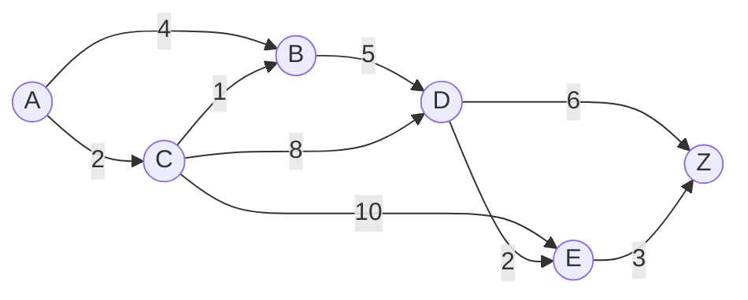
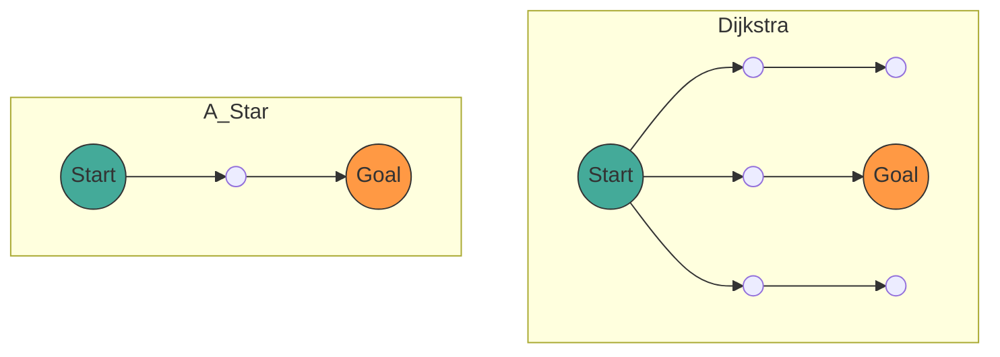

## 1. परिचय

आधुनिक कंप्यूटर विज्ञान में, **ग्राफ़ सिद्धांत** ([Graph](https://kenji.blog/hi/p/tree-graph-data-structures-search-dfs-bfs-dijkstra/) Theory) नेटवर्क संरचनाओं को मॉडल करने के लिए एक शक्तिशाली गणितीय ढांचा प्रदान करता है। हमारे दैनिक जीवन में, कार नेविगेशन, रेलवे स्थानांतरण मार्गदर्शन, इंटरनेट रूटिंग, और यहां तक कि गेम एआई (AI) के पथ खोजने में, "सबसे छोटा पथ" (shortest path) की गणना करने वाली तकनीक का उपयोग विभिन्न स्थितियों में किया जाता है।

इस लेख में, हम इस पथ खोजने के आधार, ग्राफ़ सिद्धांत की गणितीय परिभाषा से शुरू करेंगे, और फिर प्रतिनिधि खोज एल्गोरिदम **डिजक्स्ट्रा एल्गोरिथम** ([Dijkstra](https://kenji.blog/hi/p/tree-graph-data-structures-search-dfs-bfs-dijkstra/)'s Algorithm) और इसके अधिक उन्नत रूप **A* एल्गोरिथम** (A-Star Algorithm) के तंत्र, गणितीय प्रमाण, और पायथन का उपयोग करके व्यावहारिक कार्यान्वयन के तरीकों की व्यापक व्याख्या करेंगे।

## 2. ग्राफ़ सिद्धांत की मूल बातें

एल्गोरिदम की व्याख्या में जाने से पहले, आइए लक्षित डेटा संरचना, ग्राफ़ को गणितीय रूप से परिभाषित करें।

### 2.1 ग्राफ़ की गणितीय परिभाषा

एक ग्राफ़ $ G $, शीर्षों (Vertex/Node) के सेट $ V $ और किनारों (Edge) के सेट $ E $ के युग्म द्वारा परिभाषित किया जाता है।

$$
G = (V, E)
$$

यहां, किनारों के सेट $ E $ का तत्व $ e $, दो शीर्षों $ u, v \in V $ को जोड़ता है, और इसे $ e = (u, v) $ के रूप में दर्शाया जाता है।

- **अनिर्दिष्ट ग्राफ़** (Undirected Graph): वह ग्राफ़ जिसमें किनारों की कोई दिशा नहीं होती। यदि $ (u, v) \in E $ है, तो $ (v, u) \in E $ होगा।
- **निर्देशित ग्राफ़** (Directed Graph): वह ग्राफ़ जिसमें किनारों की दिशा होती है। $ (u, v) $ और $ (v, u) $ को अलग-अलग माना जाता है।

### 2.2 भारित ग्राफ़ (Weighted Graph)

वास्तविक पथ खोजने में, दूरी, समय, लागत आदि पर विचार करना आवश्यक है। इसलिए, हम एक **भारित ग्राफ़** (Weighted Graph) पर विचार करते हैं जिसमें प्रत्येक किनारे को एक "भार" (Weight) दिया गया है। यदि हम भार फलन $ w: E \rightarrow \mathbb{R} $ लागू करते हैं, तो ग्राफ़ को $ G = (V, E, w) $ के रूप में परिभाषित किया जाता है।

$$
w(u, v) \ge 0
$$

कई मामलों में, दूरी और समय नकारात्मक नहीं हो सकते हैं, इसलिए यह माना जाता है कि किनारे का भार गैर-नकारात्मक है।



ऊपर दिया गया चित्र शीर्ष $ A $ से $ Z $ तक एक भारित निर्देशित ग्राफ़ का उदाहरण है। किनारों पर संख्याएं लागत (भार) का प्रतिनिधित्व करती हैं।

### 2.3 सबसे छोटे पथ की समस्या का सूत्रीकरण

मान लीजिए कि आरंभिक बिंदु (Source) $ s \in V $ से अंतिम बिंदु (Target) $ t \in V $ तक एक पथ (Path) $ P $, शीर्षों का क्रम $ (v_0, v_1, \dots, v_k) $ है (जहां $ v_0 = s, v_k = t $), और प्रत्येक $ i $ के लिए, $ (v_i, v_{i+1}) \in E $ है।
इस पथ $ P $ की कुल लागत $ W(P) $, पथ पर किनारों के भार के कुल योग द्वारा दर्शायी जाती है।

$$
W(P) = \sum_{i=0}^{k-1} w(v_i, v_{i+1})
$$

**सबसे छोटे पथ की समस्या** (Shortest Path Problem), सभी संभावित पथों $ P $ में से उस पथ $ P^* $ को खोजने की समस्या है जो $ W(P) $ को न्यूनतम करता है।

---

## 3. डिजक्स्ट्रा एल्गोरिथम ([Dijkstra](https://kenji.blog/hi/p/tree-graph-data-structures-search-dfs-bfs-dijkstra/)'s Algorithm)

एडगर डिजक्स्ट्रा (Edsger Dijkstra) द्वारा तैयार किया गया **डिजक्स्ट्रा एल्गोरिथम**, गैर-नकारात्मक भार वाले ग्राफ़ में एकल आरंभिक बिंदु से सभी शीर्षों तक का सबसे छोटा पथ खोजने के लिए एक एल्गोरिथम है।

### 3.1 एल्गोरिथम की सहज समझ

डिजक्स्ट्रा एल्गोरिथम एक लालची दृष्टिकोण (Greedy Algorithm) पर आधारित है, जो "आरंभिक बिंदु के सबसे करीब अनिर्धारित शीर्षों को क्रमिक रूप से निर्धारित करने" का कार्य करता है।

1. आरंभिक बिंदु से अनंतिम (tentative) दूरी रखने के लिए एक सरणी तैयार करें, और आरंभिक बिंदु को `0` तथा अन्य को `अनंत` ( $ \infty $ ) से प्रारंभ करें।
2. अनिर्धारित शीर्षों में से, न्यूनतम अनंतिम दूरी वाले शीर्ष $ u $ को चुनें, और इसे "निर्धारित" (determined) के रूप में चिह्नित करें।
3. शीर्ष $ u $ से सटे सभी शीर्षों $ v $ के लिए, यदि $ u $ के माध्यम से जाने पर अनंतिम दूरी कम हो जाती है, तो दूरी को अपडेट करें (इस क्रिया को **छूट** (Relaxation) कहा जाता है)।
4. चरण 2-3 को तब तक दोहराएं जब तक कि सभी शीर्ष निर्धारित न हो जाएं, या लक्ष्य शीर्ष निर्धारित न हो जाए।

### 3.2 छूट (Relaxation) की गणितीय अभिव्यक्ति

शीर्ष $ u $ से $ v $ तक किनारे को छूट (relax) देने की क्रिया को गणितीय रूप से निम्न प्रकार व्यक्त किया जाता है। यहाँ, $ d[v] $ आरंभिक बिंदु से $ v $ तक वर्तमान अनंतिम सबसे छोटी दूरी को दर्शाता है।

$$
\text{यदि } d[u] + w(u, v) < d[v]: \\\\
d[v] = d[u] + w(u, v)
$$

### 3.3 पायथन का उपयोग करके डिजक्स्ट्रा एल्गोरिथम का कार्यान्वयन

कुशल कार्यान्वयन के लिए, न्यूनतम मान प्राप्त करने के लिए प्राथमिकता कतार (Priority Queue) का उपयोग डेटा संरचना के रूप में किया जाता है। पायथन में, `heapq` मॉड्यूल का उपयोग किया जा सकता है।

```python
import heapq

def dijkstra(graph, start):
    """
    graph: डिक्शनरी प्रकार। graph[u] = {v1: weight1, v2: weight2, ...} का प्रारूप
    start: आरंभिक बिंदु का नोड
    """
    # दूरियों को सहेजने के लिए डिक्शनरी। प्रारंभिक मान अनंत है
    distances = {node: float('inf') for node in graph}
    distances[start] = 0
    
    # प्राथमिकता कतार [(दूरी, नोड)]
    pq = [(0, start)]
    
    # पथ की पुनर्प्राप्ति के लिए डिक्शनरी
    previous_nodes = {node: None for node in graph}

    while pq:
        current_distance, current_node = heapq.heappop(pq)

        # यदि पहले से ही संसाधित (एक छोटा पथ मिल चुका है), तो छोड़ें
        if current_distance > distances[current_node]:
            continue

        # आसन्न नोड्स की खोज
        for neighbor, weight in graph[current_node].items():
            distance = current_distance + weight

            # छूट क्रिया (Relaxation)
            if distance < distances[neighbor]:
                distances[neighbor] = distance
                previous_nodes[neighbor] = current_node
                heapq.heappush(pq, (distance, neighbor))

    return distances, previous_nodes
```

### 3.4 समय जटिलता के बारे में

यदि बाइनरी हीप (Binary [Heap](https://kenji.blog/hi/p/c-language-pointers-memory-management-stack-heap/)) का उपयोग प्राथमिकता कतार के रूप में किया जाता है, तो प्रत्येक शीर्ष को एक बार कतार से निकाला जाता है, और प्रत्येक किनारे को एक बार छूट दी जाती है।
इसलिए, समय जटिलता $ O((|V| + |E|) \log |V|) $ होगी। फाइबोनैचि हीप का उपयोग करके इसे सैद्धांतिक रूप से $ O(|E| + |V| \log |V|) $ तक सुधारा जा सकता है, लेकिन व्यवहार में बाइनरी हीप का अक्सर उपयोग किया जाता है।

---

## 4. A* एल्गोरिथम (A-Star Algorithm)

डिजक्स्ट्रा एल्गोरिथम विश्वसनीय है, लेकिन गंतव्य की दिशा पर विचार किए बिना सभी दिशाओं में खोज का विस्तार करता है, जिससे कई अनावश्यक खोजें हो सकती हैं। **A* एल्गोरिथम** इसे हल करता है।

### 4.1 ह्यूरिस्टिक (Heuristic) फ़ंक्शन का परिचय

A* एल्गोरिथम वर्तमान नोड से लक्ष्य तक "अनुमानित दूरी" का उपयोग करके लक्ष्य की ओर प्राथमिकता के साथ खोज करता है। इस अनुमानित दूरी को वापस करने वाले फ़ंक्शन को **ह्यूरिस्टिक फ़ंक्शन** (Heuristic Function) $ h(n) $ कहा जाता है।

A* में, नोड $ n $ का मूल्यांकन करने के लिए फ़ंक्शन $ f(n) $ को निम्नानुसार परिभाषित किया गया है:

$$
f(n) = g(n) + h(n)
$$

यहाँ,
- $ g(n) $: आरंभिक बिंदु से नोड $ n $ तक की वास्तविक लागत (डिजक्स्ट्रा एल्गोरिथम में दूरी के समान)
- $ h(n) $: नोड $ n $ से अंतिम बिंदु तक की अनुमानित लागत (ह्यूरिस्टिक)
- $ f(n) $: $ n $ के माध्यम से आरंभिक बिंदु से अंतिम बिंदु तक पथ की अनुमानित कुल लागत

### 4.2 ह्यूरिस्टिक की शर्तें

A* को हमेशा **सबसे छोटा पथ खोजने (अनुकूलता/Optimality)** के लिए, ह्यूरिस्टिक फ़ंक्शन $ h(n) $ को निम्नलिखित शर्तों को पूरा करना होगा।

1. **स्वीकार्य** (Admissible):
   अनुमानित लागत कभी भी वास्तविक लागत से अधिक नहीं होनी चाहिए।
   $$
   h(n) \le h^*(n)
   $$
   ($ h^*(n) $, $ n $ से अंतिम बिंदु तक की वास्तविक न्यूनतम लागत है)

2. **सुसंगत** (Consistent / Monotonic):
   किसी भी आसन्न नोड्स $ m, n $ के लिए, त्रिकोण असमानता (triangle inequality) को संतुष्ट करना।
   $$
   h(m) \le c(m, n) + h(n)
   $$
   यहाँ $ c(m, n) $, $ m $ से $ n $ तक किनारे की लागत है। एक सुसंगत ह्यूरिस्टिक स्वचालित रूप से स्वीकार्य हो जाता है।

### 4.3 विशिष्ट ह्यूरिस्टिक फ़ंक्शंस

ग्रिड पर पथ खोजने के लिए, अक्सर निम्नलिखित दूरी फ़ंक्शंस का उपयोग किया जाता है:

- **मैनहट्टन दूरी** (Manhattan Distance): जब केवल ऊपर, नीचे, बाएँ, और दाएँ चलना संभव हो
  $$
  h(n) = |x_n - x_{goal}| + |y_n - y_{goal}|
  $$
- **यूक्लिडियन दूरी** (Euclidean Distance): जब किसी भी दिशा में सीधी रेखा में चलना संभव हो
  $$
  h(n) = \sqrt{(x_n - x_{goal})^2 + (y_n - y_{goal})^2}
  $$

### 4.4 A* एल्गोरिथम का पायथन कार्यान्वयन

A* का कार्यान्वयन डिजक्स्ट्रा एल्गोरिथम के समान है, सिवाय इसके कि प्राथमिकता कतार की कुंजी (key) $ f(n) $ है।

```python
import heapq

def a_star(graph, start, goal, heuristic_func):
    """
    graph: नोड्स के बीच लागत के साथ डिक्शनरी
    start: आरंभिक बिंदु
    goal: अंतिम बिंदु
    heuristic_func: ह्यूरिस्टिक फ़ंक्शन h(node, goal)
    """
    open_set = []
    heapq.heappush(open_set, (0, start))
    
    # आरंभिक बिंदु से वास्तविक लागत g(n)
    g_score = {node: float('inf') for node in graph}
    g_score[start] = 0
    
    # f(n) = g(n) + h(n)
    f_score = {node: float('inf') for node in graph}
    f_score[start] = heuristic_func(start, goal)
    
    came_from = {}

    while open_set:
        # नोड प्राप्त करें जिसका f(n) न्यूनतम है
        current_f, current_node = heapq.heappop(open_set)

        if current_node == goal:
            return reconstruct_path(came_from, current_node)

        for neighbor, weight in graph[current_node].items():
            tentative_g_score = g_score[current_node] + weight

            if tentative_g_score < g_score[neighbor]:
                # एक बेहतर पथ मिला
                came_from[neighbor] = current_node
                g_score[neighbor] = tentative_g_score
                f_score[neighbor] = tentative_g_score + heuristic_func(neighbor, goal)
                
                # open_set में जोड़ें
                heapq.heappush(open_set, (f_score[neighbor], neighbor))

    return None # यदि कोई पथ नहीं मिलता है

def reconstruct_path(came_from, current):
    path = [current]
    while current in came_from:
        current = came_from[current]
        path.append(current)
    path.reverse()
    return path
```

### 4.5 डिजक्स्ट्रा एल्गोरिथम और A* की तुलना

निम्नलिखित मर्मेड (Mermaid) आरेख डिजक्स्ट्रा एल्गोरिथम और A* की खोज सीमा की एक दृश्य तुलना है। डिजक्स्ट्रा एल्गोरिथम गाढ़ा वृत्ताकार रूप से खोज का विस्तार करता है, जबकि A* लक्ष्य की ओर खींचे गए अंडाकार आकार में खोज करता है।



---

## 5. पथ खोजने के अनुप्रयोग और भविष्य की संभावनाएं

डिजक्स्ट्रा एल्गोरिथम और A* एल्गोरिथम बुनियादी तरीके हैं, फिर भी ये कई व्यावहारिक तकनीकों का आधार बनाते हैं।

1. **द्विदिश खोज** (Bidirectional Search):
   एक ऐसी विधि जिसमें खोज एक साथ आरंभिक बिंदु और अंतिम बिंदु दोनों से की जाती है, और वे बीच में मिलते हैं, जिससे खोज के स्थान में काफी कमी आती है।
2. **D* एल्गोरिथम** (Dynamic A*):
   एक विधि जो गतिशील रूप से प्रकट होने वाली अज्ञात बाधाओं (जैसे कि स्वायत्त रोबोट में) वाले वातावरण में पथ की कुशलतापूर्वक पुनर्गणना करती है।
3. **JPS** (Jump Point Search):
   एक समान ग्रिड मानचित्र पर A* की खोज को और अधिक तेज़ करने की एक विधि। यह समरूपता का उपयोग करके अनावश्यक नोड्स को छोड़ देता है।

पथ खोजने वाले एल्गोरिदम एक ऐसा क्षेत्र हैं जहां ग्राफ़ सिद्धांत की गणितीय सुंदरता और कंप्यूटर विज्ञान की एल्गोरिथम दक्षता का शानदार ढंग से विलय होता है।

## 6. निष्कर्ष

इस लेख में, हमने ग्राफ़ सिद्धांत की बुनियादी परिभाषाओं से शुरू करते हुए डिजक्स्ट्रा एल्गोरिथम और A* एल्गोरिथम की गणितीय पृष्ठभूमि, विशिष्ट तंत्र और पायथन का उपयोग करके कार्यान्वयन के उदाहरणों की व्याख्या की।

- **डिजक्स्ट्रा एल्गोरिथम** सभी नोड्स का समान रूप से मूल्यांकन करता है और एक विश्वसनीय सबसे छोटे पथ की गारंटी देता है।
- **A* एल्गोरिथम** ह्यूरिस्टिक फ़ंक्शन $ h(n) $ का परिचय देकर लक्ष्य की ओर एक कुशल खोज प्राप्त करता है।

यह ज्ञान केवल एल्गोरिदम को समझने तक ही सीमित नहीं है, बल्कि जटिल वास्तविक दुनिया की समस्याओं को "ग्राफ़" नामक गणितीय मॉडल में अनुवादित करने और इष्टतम समाधान प्राप्त करने के लिए एक शक्तिशाली वैचारिक उपकरण बन जाएगा। हर तरह से, वास्तविक कोड को चलाकर देखें और इसकी शक्ति का अनुभव करें।
