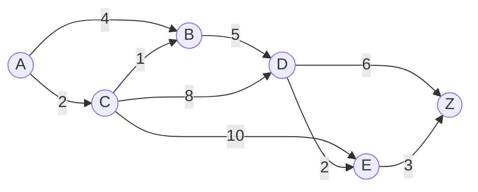
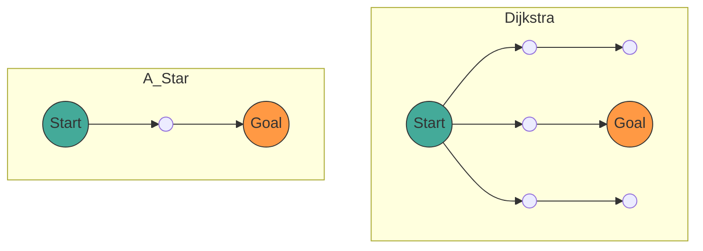

## 1. 시작하며

현대 컴퓨터 과학에서 **그래프 이론** (Graph Theory) 은 네트워크 구조를 모델링하기 위한 강력한 수학적 프레임워크를 제공합니다. 우리의 일상생활에서 자동차 내비게이션이나 철도 환승 안내, 인터넷 라우팅, 나아가 게임 AI의 경로 탐색 등 다양한 상황에서 '최단 경로'를 계산하는 기술이 사용되고 있습니다.

본 기사에서는 이 경로 탐색의 기초가 되는 그래프 이론의 수학적 정의부터 시작하여 대표적인 탐색 알고리즘인 **다익스트라법** (Dijkstra's Algorithm) 과 이를 더욱 발전시킨 **A* 알고리즘** (A-Star Algorithm) 의 원리, 수학적 증명, 그리고 Python을 사용한 실천적인 구현 방법까지 포괄적으로 해설합니다.

## 2. 그래프 이론의 기초

알고리즘 해설에 들어가기 전에, 먼저 대상이 되는 데이터 구조인 그래프에 대해 수학적으로 정의합니다.

### 2.1 그래프의 수학적 정의

그래프 $ G $ 는 정점 (Vertex/Node) 의 집합 $ V $ 와 간선 (Edge) 의 집합 $ E $ 의 쌍으로 정의됩니다.

$$
G = (V, E)
$$

여기서 간선의 집합 $ E $ 의 요소 $ e $ 는 두 정점 $ u, v \in V $ 를 연결하는 것이며, $ e = (u, v) $ 로 표현됩니다.

- **무방향 그래프** (Undirected Graph): 간선에 방향이 없는 그래프. $ (u, v) \in E $ 이면 $ (v, u) \in E $ 가 됩니다.
- **방향 그래프** (Directed Graph): 간선에 방향이 있는 그래프. $ (u, v) $ 와 $ (v, u) $ 는 구별됩니다.

### 2.2 가중치 그래프 (Weighted Graph)

실제 경로 탐색에서는 거리나 시간, 비용 등을 고려해야 합니다. 그래서 각 간선에 '가중치' (Weight) 를 할당한 **가중치 그래프** 를 생각합니다. 가중치 함수 $ w: E \rightarrow \mathbb{R} $ 를 도입하면, 그래프는 $ G = (V, E, w) $ 로 정의됩니다.

$$
w(u, v) \ge 0
$$

대부분의 경우 거리나 시간은 음수가 되지 않으므로, 간선의 가중치는 음이 아니라고 가정합니다.



위의 그림은 정점 $ A $ 에서 $ Z $ 까지의 가중치 방향 그래프의 예입니다. 간선 위의 숫자가 비용(가중치)을 나타냅니다.

### 2.3 최단 경로 문제의 정식화

시점 (Source) $ s \in V $ 에서 종점 (Target) $ t \in V $ 까지의 경로 (Path) $ P $ 를 정점의 열 $ (v_0, v_1, \dots, v_k) $ (단 $ v_0 = s, v_k = t $ )로 하고, 각 $ i $ 에 대해 $ (v_i, v_{i+1}) \in E $ 라고 합니다.
이 경로 $ P $ 의 총비용 $ W(P) $ 는 경로 상의 간선 가중치의 총합으로 나타냅니다.

$$
W(P) = \sum_{i=0}^{k-1} w(v_i, v_{i+1})
$$

**최단 경로 문제** (Shortest Path Problem) 란 가능한 모든 경로 $ P $ 중에서 $ W(P) $ 를 최소로 만드는 경로 $ P^* $ 를 찾는 문제입니다.

---

## 3. 다익스트라법 (Dijkstra's Algorithm)

에츠허르 다익스트라가 고안한 **다익스트라법** 은 음이 아닌 가중치를 가진 그래프에서 단일 시점으로부터 모든 정점까지의 최단 경로를 구하기 위한 알고리즘입니다.

### 3.1 알고리즘의 직관적인 이해

다익스트라법은 '시점에서 가장 가까운 미확정 정점을 순차적으로 확정해 나가는' 탐욕법 (Greedy Algorithm) 에 기반을 두고 있습니다.

1. 시점으로부터의 잠정적인 거리를 유지하는 배열을 준비하고, 시점을 `0`, 그 외를 `무한대` ( $ \infty $ ) 로 초기화합니다.
2. 미확정 정점 중에서 잠정 거리가 최소인 정점 $ u $ 를 선택하여 '확정됨'으로 합니다.
3. 정점 $ u $ 에 인접한 모든 정점 $ v $ 에 대해, $ u $ 를 경유하는 것이 잠정 거리가 짧아지는 경우 거리를 갱신합니다 (이 조작을 **완화** (Relaxation) 라고 부릅니다).
4. 모든 정점이 확정되거나 목적지 정점이 확정될 때까지 2~3을 반복합니다.

### 3.2 완화 (Relaxation) 의 수학적 표현

정점 $ u $ 에서 $ v $ 로의 간선을 완화하는 조작은 수식으로 다음과 같이 표현됩니다. 여기서 $ d[v] $ 는 시점에서 $ v $ 까지의 현재 잠정 최단 거리를 나타냅니다.

$$
\text{만약 } d[u] + w(u, v) < d[v]: \\\\
d[v] = d[u] + w(u, v)
$$

### 3.3 Python을 이용한 다익스트라법 구현

효율적인 구현을 위해 최솟값을 가져오는 데이터 구조로 우선순위 큐 (Priority Queue) 를 사용합니다. Python에서는 `heapq` 모듈을 이용할 수 있습니다.

```python
import heapq

def dijkstra(graph, start):
    """
    graph: 딕셔너리형. graph[u] = {v1: weight1, v2: weight2, ...} 형식
    start: 시점의 노드
    """
    # 거리를 저장하는 딕셔너리. 초기값은 무한대
    distances = {node: float('inf') for node in graph}
    distances[start] = 0
    
    # 우선순위 큐 [(거리, 노드)]
    pq = [(0, start)]
    
    # 경로 복원용 딕셔너리
    previous_nodes = {node: None for node in graph}

    while pq:
        current_distance, current_node = heapq.heappop(pq)

        # 이미 처리된 (더 짧은 경로를 찾은) 경우는 스킵
        if current_distance > distances[current_node]:
            continue

        # 인접 노드 탐색
        for neighbor, weight in graph[current_node].items():
            distance = current_distance + weight

            # 완화 조작 (Relaxation)
            if distance < distances[neighbor]:
                distances[neighbor] = distance
                previous_nodes[neighbor] = current_node
                heapq.heappush(pq, (distance, neighbor))

    return distances, previous_nodes
```

### 3.4 시간 복잡도에 대해

우선순위 큐로 이진 힙 (Binary Heap) 을 사용한 경우, 각 정점은 큐에서 1번 꺼내어지고, 각 간선은 1번 완화됩니다.
따라서 시간 복잡도는 $ O((|V| + |E|) \log |V|) $ 가 됩니다. 피보나치 힙을 사용하면 이론상 $ O(|E| + |V| \log |V|) $ 까지 개선되지만, 실무에서는 이진 힙이 많이 사용됩니다.

---

## 4. A* 알고리즘 (A-Star Algorithm)

다익스트라법은 확실하지만, 목적지의 방향을 고려하지 않고 전 방향으로 탐색을 넓히기 때문에 불필요한 탐색이 많아질 수 있습니다. 이를 해결하는 것이 **A* 알고리즘** 입니다.

### 4.1 휴리스틱 함수의 도입

A* 알고리즘은 현재 노드에서 목표까지의 '추정 거리'를 사용하여 목표를 향해 우선적으로 탐색을 진행합니다. 이 추정 거리를 반환하는 함수를 **휴리스틱 함수** (Heuristic Function) $ h(n) $ 라고 부릅니다.

A*에서는 노드 $ n $ 을 평가하기 위한 함수 $ f(n) $ 을 다음과 같이 정의합니다.

$$
f(n) = g(n) + h(n)
$$

여기서,
- $ g(n) $: 시점에서 노드 $ n $ 까지의 실제 비용 (다익스트라법에서의 거리와 동일)
- $ h(n) $: 노드 $ n $ 에서 종점까지의 추정 비용 (휴리스틱)
- $ f(n) $: 시점에서 $ n $ 을 경유하여 종점으로 향하는 경로의 추정 총비용

### 4.2 휴리스틱의 조건

A*가 항상 **최단 경로를 찾기 (최적성)** 위해서는 휴리스틱 함수 $ h(n) $ 이 다음 조건을 만족해야 합니다.

1. **허용적** (Admissible):
   추정 비용이 결코 실제 비용을 초과하지 않을 것.
   $$
   h(n) \le h^*(n)
   $$
   ( $ h^*(n) $ 은 $ n $ 에서 종점까지의 진짜 최단 비용)

2. **일관성** (Consistent / Monotonic):
   임의의 인접 노드 $ m, n $ 에 대해 삼각 부등식을 만족할 것.
   $$
   h(m) \le c(m, n) + h(n)
   $$
   여기서 $ c(m, n) $ 은 $ m $ 에서 $ n $ 으로 가는 간선의 비용입니다. 일관된 휴리스틱은 자동으로 허용적이 됩니다.

### 4.3 대표적인 휴리스틱 함수

그리드 상의 경로 탐색에서는 다음과 같은 거리 함수가 자주 사용됩니다.

- **맨해튼 거리** (Manhattan Distance): 상하좌우로만 이동 가능한 경우
  $$
  h(n) = |x_n - x_{goal}| + |y_n - y_{goal}|
  $$
- **유클리드 거리** (Euclidean Distance): 임의의 방향으로 직선 이동이 가능한 경우
  $$
  h(n) = \sqrt{(x_n - x_{goal})^2 + (y_n - y_{goal})^2}
  $$

### 4.4 A* 알고리즘의 Python 구현

A*의 구현은 다익스트라법과 매우 비슷하지만, 우선순위 큐의 키가 $ f(n) $ 이 된다는 점이 다릅니다.

```python
import heapq

def a_star(graph, start, goal, heuristic_func):
    """
    graph: 노드 간의 비용을 가지는 딕셔너리
    start: 시점
    goal: 종점
    heuristic_func: 휴리스틱 함수 h(node, goal)
    """
    open_set = []
    heapq.heappush(open_set, (0, start))
    
    # 시점으로부터의 실제 비용 g(n)
    g_score = {node: float('inf') for node in graph}
    g_score[start] = 0
    
    # f(n) = g(n) + h(n)
    f_score = {node: float('inf') for node in graph}
    f_score[start] = heuristic_func(start, goal)
    
    came_from = {}

    while open_set:
        # f(n) 이 최소인 노드를 획득
        current_f, current_node = heapq.heappop(open_set)

        if current_node == goal:
            return reconstruct_path(came_from, current_node)

        for neighbor, weight in graph[current_node].items():
            tentative_g_score = g_score[current_node] + weight

            if tentative_g_score < g_score[neighbor]:
                # 더 나은 경로를 발견
                came_from[neighbor] = current_node
                g_score[neighbor] = tentative_g_score
                f_score[neighbor] = tentative_g_score + heuristic_func(neighbor, goal)
                
                # open_set 에 추가
                heapq.heappush(open_set, (f_score[neighbor], neighbor))

    return None # 경로를 찾지 못한 경우

def reconstruct_path(came_from, current):
    path = [current]
    while current in came_from:
        current = came_from[current]
        path.append(current)
    path.reverse()
    return path
```

### 4.5 다익스트라법과 A* 의 비교

다음의 Mermaid 그림은 다익스트라법과 A*의 탐색 범위에 대한 이미지 비교입니다. 다익스트라법이 동심원 모양으로 탐색을 넓히는 반면, A*는 목표 방향으로 늘어난 타원 모양으로 탐색을 진행합니다.



---

## 5. 경로 탐색의 응용과 향후 전망

다익스트라법과 A* 알고리즘은 기초적인 기법이면서도 많은 응용 기술의 기반이 되고 있습니다.

1. **양방향 탐색** (Bidirectional Search):
   시점과 종점 양쪽에서 동시에 탐색을 진행하여 중간에서 합류함으로써 탐색 공간을 극적으로 줄이는 기법.
2. **D* 알고리즘** (Dynamic A*):
   미지의 장애물이 동적으로 나타나는 환경(로봇의 자율 주행 등)에서 경로를 효율적으로 재계산하는 기법.
3. **JPS** (Jump Point Search):
   균일한 그리드 맵 위에서 A*의 탐색을 더욱 고속화하기 위한 기법. 대칭성을 이용하여 불필요한 노드를 스킵합니다.

경로 탐색 알고리즘은 그래프 이론의 수학적인 아름다움과 컴퓨터 과학의 알고리즘적 효율성이 훌륭하게 융합된 분야입니다.

## 6. 정리

본 기사에서는 그래프 이론의 기초적인 정의에서 출발하여 다익스트라법과 A* 알고리즘의 수학적 배경, 구체적인 원리, 그리고 Python을 이용한 구현 예에 대해 해설했습니다.

- **다익스트라법** 은 모든 노드를 균등하게 평가하고 확실한 최단 경로를 보장합니다.
- **A* 알고리즘** 은 휴리스틱 함수 $ h(n) $ 을 도입함으로써 목표를 향한 효율적인 탐색을 실현합니다.

이러한 지식은 단순한 알고리즘의 이해에 머무르지 않고, 복잡한 현실 세계의 문제를 '그래프'라는 수학적 모델로 변환하여 최적해를 도출하기 위한 강력한 사고 도구가 될 것입니다. 부디 실제 코드를 실행하여 그 강력함을 체험해 보시기 바랍니다.
